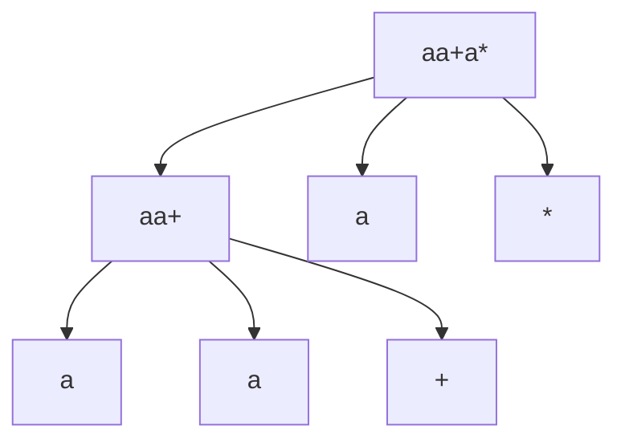

##### Exercise 2.2.1

$$
S = S \ S \ + \ | \ \ S \ S \ * \ | \ \bold{a}
$$

###### a)

$$
S \to S (aa+) \ S (a) \ * \\
S \to S(a) \ S(a) \ +
$$

###### b)



###### c)

It looks like a post-fix arithmatic expression (where a is a number or something like that)

##### Exercise 2.2.2

###### a)

$$
S \to 0 \ S \ 1 \ | \ 0 \ 1
$$

$$
L = \{ 0^n 1 ^n \ | \ n \ge 0 \}
$$

###### b)

prefix arithematic expression

###### c)

matched parentheses (arbitrarily deep)

###### d)

string that has same amount of a and b

###### e)

regular expression

##### Exercise 2.2.3

```
F
F
T, ()()
T, abab
T, aaa
```

##### Exercise 2.2.4

###### a)

$$
S \to S \ S \ \bold{op} \ |  \ \bold{a}
$$

###### b)

$$
S \to S \ , \ \bold{id} \ | \ \bold {id}
$$

###### c)
$$
S \to \bold{id} \ , \ S \ | \ \bold{id}
$$

###### d)

```pseudocode
expr -> expr + prod | expr - prod | prod
prod -> prod * term | prod / term | term
term -> id | number | (expr)
```

###### e)

```pseudocode
expr -> expr + prod | expr - prod | prod
prod -> prod * mono | prod / mono | mono
mono -> + mono | - mono | term
term -> id | number | (expr)
```

##### Exercise 2.2.5

###### a)

```pseudocode
num -> 
| 11      --> 11                  % 3 == 0
| 1001    --> 1001                % 3 == 0
| num 0   --> (3k * 2)            % 3 == 0
| num num --> ((3k1 * 2^n) + 3k2) % 3 == 0
Q.E.D (num % 3 == 0)
```

###### b

>**Proof**:
>
>Every number divisible by 3 can be written in the form `3k`. We will consider `k > 0` (though it would be valid to consider `k` to be an arbitrary integer).
>
>Note that every part of num(11, 1001 and 0) is divisible  by 3, if the grammar could generate all the numbers divisible by 3, we  can get a production for binary k from num's production:
>
>```
>3k = num   -> 11 | 1001 | num 0 | num num
> k = num/3 -> 01 | 0011 | k 0   | k k
> k         -> 01 | 0011 | k 0   | k k
>```
>
>​    
>
>It is obvious that any value of `k` that has more than 2 consecutive bits set to 1 can never be produced.  This can be confirmed by the example given in the beginning:
>
>10101 is 3*7, hence, k = 7 = 111 in binary. Because 111 has more than 2 consecutive 1's in binary, the grammar will never produce 21.

##### Exercise 2.2.6

```pseudocode
roman -> 
| thousands hundreds? tens? units?
| hundreds tens? units?
| tens units?
| units

units -> I | II | III | IV | V | VI | VII | VIII | IX
tens  -> X | XX | XXX | XL | L | LX | LXX | LXXX | XC
hundreds -> C | CC | CCC | CD | D | DC | DCC | DCCC | CM
thousands hundreds? -> hundreds | epsilon '0'
tens? -> tens | epsilon '0'
units? -> units | epsilon '0'-> M | MM | MMM
hundreds? -> hundreds | epsilon
tens? -> tens | epsilon
units? -> units | epsilon
```

##### Exercise 2.3.1

```pseudocode
expr -> 
| '+' expr + term
| '-' expr - term
|     term

term -> 
| '*' term * factor
| '/' term / factor
|     factor

factor ->  
| '$digit' digit 
|          (expr)
```

##### Exercise 2.3.2

```pseudocode
expr -> 
| expr '+' expr + 
| expr '-' expr -
| expr '*' expr *
| expr '/' expr / 
| digit '$digit'
```

##### Exercise 2.3.3

```pseudocode
int -> thousands` | hundreds` | tens` | units`
thousands` -> 
(3 'MMM' | 2 'MM' | 1 'M') hundreds
hundreds -> 
(9 'CM' | 8 'DCCC' | 7 'DCC' | 6 'DC' | 5 'D' | 4 'CD' | 3 'CCC' | 2 'CC' | 1 'C' | 0 '') tens 
hundreds` ->
(9 'CM' | 8 'DCCC' | 7 'DCC' | 6 'DC' | 5 'D' | 4 'CD' | 3 'CCC' | 2 'CC' | 1 'C') tens
tens -> 
(9 'XC' | 8 'LXXX' | 7 'LXX' | 6 'LX' | 5 'L' | 4 'LX' | 3 'XXX' | 2 'XX' | 1 'X' | 0 '') units
tens` ->
(9 'XC' | 8 'LXXX' | 7 'LXX' | 6 'LX' | 5 'L' | 4 'LX' | 3 'XXX' | 2 'XX' | 1 'X') units
units -> 
(9 'IX' | 8 'VIII' | 7 'VII' | 6 'VI' | 5 'V' | 4 'IV' | 3 'III' | 2 'II' | 1 'I' | 0 '')
units` ->
(9 'IX' | 8 'VIII' | 7 'VII' | 6 'VI' | 5 'V' | 4 'IV' | 3 'III' | 2 'II' | 1 'I')
```

##### Exercise 2.3.4

```pseudocode
roman -> 
| MM '2000'
| thousands hundreds? tens? units?
| hundreds tens? units?
| tens units?
| units

units -> I '1' | II '2' | III '3' | IV '4' | V '5' | VI '6' | VII '7' | VIII '8' | IX '9'
tens  -> X '1' | XX '2' | XXX '3' | XL '4' | L '5' | LX '6' | LXX '7' | LXXX '8' | XC '9'
hundreds -> C '1' | CC '2' | CCC '3' | CD '4' | D '5' | DC '6' | DCC '7' | DCCC '8' | CM '9'
hundreds? -> hundreds | epsilon '0'
tens? -> tens | epsilon '0'
units? -> units | epsilon '0'
thousands -> M '1'
```

##### Exercise 2.3.5

```pseudocode
expr -> 
| '+' expr expr + 
| '-' expr expr -
| '*' expr expr *
| '/' expr expr / 
| digit '$digit'
```

##### Exercise 2.8.1

```typescript
class For {
   	constructor(init : Expr, cond : Expr, iter : Expr, body : Stmt) {
        this.init = init;
        this.cond = cond;
        this.iter = iter;
        this.body = body;
    }
    gen() {
        init.gen();
        emit(`start: `)
        emit(`ifFalse ${cond.rvalue().toString()} goto end`);
        body.gen();
        iter.gen();
        emit(`goto start`)
        emit(`end: `);
    }
}
```

##### Exercise 2.8.2

```javascript
// C uses following
ifFalsy x goto L
ifTrusy x goto L
```


