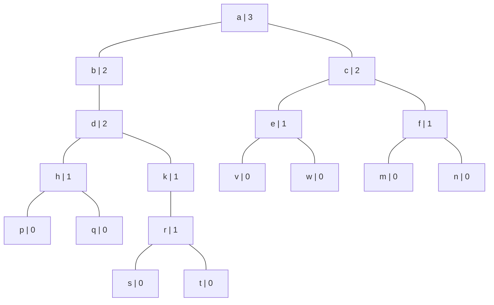
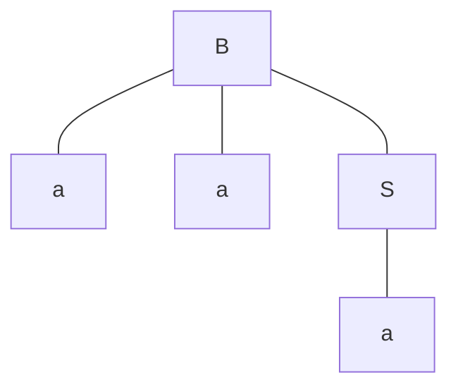
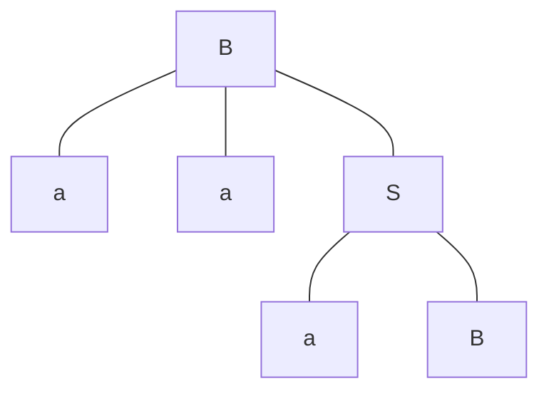

# Study Problems Tree

## Problem 1

### a

### b

The highest rank: $h$ from a complete, full binary tree. 

The lowest rank: $0$ from a tree with only one leaf. (i. e. the internal nodes only have one child).

### c

>Claim: a tree with rank $q$ has at least $2^q$ leaves.
>
>Proof: by induction on both rank $q$ and chain length $c$. 
>
>
>
>Define: Start the path from the root. 
>
>if the current node has children with same rank, stop path.
>
>Else if the current node has zero child, stop path.
>
>Else if current node has one child, move to that child.
>
>Else if the current node has two child with different rank, move to child with higher rank.
>
>The chain length is the length of above path.
>
>
>
>Base Case ($q$): the claim holds for $q = 0$. When the rank $q = 0$, there will always be at least one leaf in the tree, which means $1 \geq 2^0$. The claim holds when $q = 0$.
>
>Inductive Hypothesis: 
>
>(1) If claim holds for $q = k$. $k \in \N$, then it hold for any $q = k + 1$, $c = 0$.
>
>(2) If claim holds for $q = k$ and $c = m$. $k, m \in \N$, then it holds for $q = k$, $c = m + 1$. 
>
>Induction:
>
>(1) For any tree with $c = 0$ and $q = k + 1$. The root must have two children with same rank $k$. In this case, there are two subtrees each using one of two children with rank $k$ as their root. According to inductive hypothesis, the number of leaves on each of these subtrees is at least $2^k$. So the total least number of leaves for the tree is $2 \cdot 2^k = 2^{k+1}$, which is needed to show.
>
>(2) For any three with $q = k$ and $c = m + 1$, there are few cases:
>
>Case 1: The root is connected to a single child. Then that child must have rank $k$, Considering a subtree with that child as root, that tree has $q = k$ and $c = m$, so it has at least $2^{k+1}$ leaves, as well as the original tree.
>
>Case 2: The root is connected to two children with different ranks. Then one child with higher rank must have rank $k$.  Considering a subtree with that child as root.  , that tree has $q = k$ and $c = m$, so it has at least $2^{k+1}$ leaves, as well as the original tree.
>
>
>
>So, the claim is proved.
>
>Q. E. D.

Claim: a tree with rank $q$ has at least $2^q$ leaves.

Proof: by induction on height $h$.

Base: If tree has height $h = 0$, the it have rank $q = 0$, and it has $1 \geq 2^{0}$ leaf. The claim holds for $h = 0$.

Inductive hypothesis: If claim holds when tree has height $h = k$, the claims also holds for $h = k+1$.

Induction: There are two cases:

Case 1: The tree has one subtree.

Then the subtree has rank $q$, and so the tree. It also has at least $2^q$ leaves (By inductive hypothesis), and so the tree. So the claims holds.

Case 2: The has two subtree.

If two subtree has same rank $q$, then both of them has at least $2^q$ leaves.(By inductive hypothesis). So, the tree itself has rank $q + 1$ and at least $2 \cdot 2^{q} = 2^{q + 1}$. So the claim also holds.

If two subtree has different rank, then the one that has larger rank $q$ will have at least $2^q$ leaves. (By inductive hypothesis). Then the tree itself has rank $q$ and $2^q$ leaves. So, the claim holds.

Q. E. D.

## Problem 2

Define a grammar $G'$that only differ in start symbols with $G$. It's start symbol is $B$.

Claim: there is a tree generated by $G'$ has a terminal string of the form $a^n$, and that $n$ is congruent to $0 \text{ (mod 3)}$.

Proof by inductive on the height of the tree

 Base: when the $n = 2$, the minimum for such tree, the tree looks like this:

The terminal string is has $n = 3$, which is congruent to $0 \text{ (mod 3)}$

Inductive hypothesis: If the claim holds true for all the tree generated by $G'$ with $2 \leq n \leq k$, $k \in N$, the claim also holds true for $n = k+1$. 

Induction: there are two cases.

Case 1:

In this case, the subtree with bottom $B$ on the bottom has the height of $k - 1$.

M
