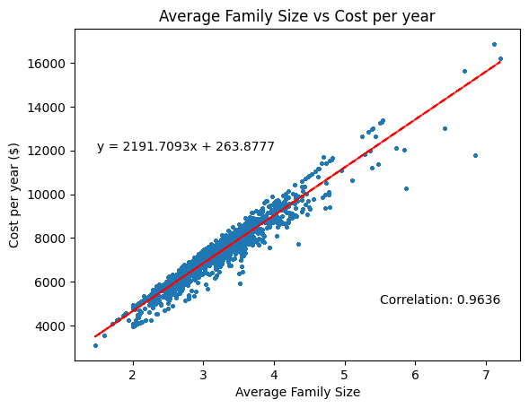

#### Question to answer

> What do the properties of the summary statistic parameters represent visually?

Location parameters represent the *center* of the dataset, scale parameter represent the *spread* of a dataset.


> Why do we need to standardize a data set?

It makes it easier to identify the similar properties that occurs in different dataset. It will better reveal the correlation of two dataset if we want to draw the scatterplot. Later on we will learn few test (p-test, etc.), using standardize dataset make it easier to perform these tests.


> Why is correlation coefficient always within [-1,1]?

The book gives a proof, calculating correlation coefficient could be thought doing a calculating a dot product between two unit vectors, and therefore the value is within [-1, 1]


> Describe the main use of correlation and its differences from causation.

The correlation could reveal whether two dataset correlates, but it does not mean causation. There might be hidden variables that cause the correlation in the datasets.


#### Problem

>Explain in your own words to teammates the concept of different location parameters and scale parameters.

There are two location parameters: median and mean. They measure the *center* of a dataset. Mean is the average of the dataset, while Median is the (1) center element (2) average of the two centered elements in the sorted dataset. They are both linear. Mean is more suspectable than Median. There are two scale parameters, standard deviation and interquartile range, standard deviation is the square root of the mean of squared distance of each data to the mean, the interquartile range is the distance between the 25% percentile and 75% percentile. They are both shift invariant and linear. They measure the *spread* of a dataset (bigger means data spread in a large range, vice versa).

>Find one effective way to remember the definition of standard deviation.

We could think the standard deviation as the average deviation from the center (the mean) of the dataset. Certainly there is more subtlety than that. To be more precise, we could think of it as the *square root of the average squared distance from the mean*.

> Try to explore the following dataset with correlation or whatever you learned so far, report what you did and the discovery if any.

I found that there is a strong positive correlation between the average family size and the food cost per year ($), which is expected since more people require more food, and therefore more cost on food.



The code:

```python
# read from the excel file food_afford_cdp_co_region_ca4-14-13-ada.xls

# make sure to install xlrd package
import pandas as pd
import numpy as np
import matplotlib.pyplot as plt

# read the data
df = pd.read_excel('food_afford_cdp_co_region_ca4-14-13-ada.xls', sheet_name='Food_afford_cdp_co_region_ca')

# calculate the correlation between ave_fam_size and cost_yr column
correlation = df['ave_fam_size'].corr(df['cost_yr'])

# Exclude the NaN value from the data
df = df.dropna(subset=['ave_fam_size', 'cost_yr'])

# draw the scatter plot, make the dot size smaller
plt.scatter(df['ave_fam_size'], df['cost_yr'], s=4)
plt.xlabel('Average Family Size')
plt.ylabel('Cost per year ($)')
plt.title('Average Family Size vs Cost per year')


z = np.polyfit(df['ave_fam_size'], df['cost_yr'], 1)
p = np.poly1d(z)
plt.plot(df['ave_fam_size'], p(df['ave_fam_size']), "r--")

# put the equation on the plot (top left corner)
plt.text(1.5, 12000, 'y = ' + str(z[0].round(4)) + 'x + ' + str(z[1].round(4)))


# put the correlation value on the plot (top right corner)
plt.text(5.5, 5000, 'Correlation: ' + str(correlation.round(4)))
plt.show()
print('Correlation between average family size and cost per year:', correlation)
```

#### Design

>Design a problem that tests students' ability in understanding the  linearity of location parameters, the relationship and difference  between different summary statistics.

Given a dataset of `x = [0, 0, 0, 1, 2, 3, 4, 5, 6, 6, 6, 6, 6]`. 

##### (a)

Calculate its mean, median, standard deviation, and interquartile range.

**(b)**

Now double every data in the dataset, what is the mean, median, standard deviation, and interquartile now? Triple the dataset, what is the statistic now? Multiply it by 11, could you answer the same question without calculating again?  Multiply the dataset by $k$, could you find a general trend for each statistic?

##### (c)

Now add 5 to every data in the dataset, what is the mean, median, standard deviation, and interquartile now? Add -2 the dataset, what is the statistic now? Add 16.249 to the dataset, could you answer the same question without calculating again?  Add the dataset by $k$, could you find a general trend for each statistic?

##### (d)

Now add $1000000000$ to the dataset, how mean, median, standard deviation and interquartile changes? how does this compare to just add $3$ to the dataset? Is mean and median changing differently? Is standard deviation and interquartile changes differently?