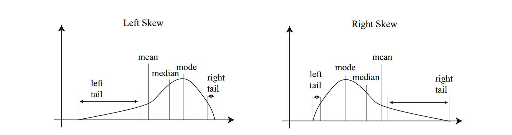

$$
{\def\fac#1/#2;{\frac{#1}{#2}}}
{\def\hx{{\hat{x}}}}
{\def\(#1);{\left( {#1} \right)}}
{\def\sets#1{  \left\{  #1  \right\}   }}
{\def\mean#1{\text{mean} \( \sets{#1} ); }}
{\def\std#1{\text{std}   \( {\sets{#1}} ); }}
{\def\align[[#1]]{\begin{align*}#1\end{align*}}}
{\def\inv#1{\frac{1}{#1}}}
{\def\iv#1;{\frac{1}{#1}}}
{\def\note#1!{\fbox{$#1$}}}
{\def\|#1|;{\left| #1 \right|}}
{\def\median#1{\text{median}  \( \sets {#1} ); }}
$$

#### Problem 1

Lets assume these 5 students have score of
$$
(a, b, 9, c, d)
$$
**sorted in order**, also since they won't get penalty (negative scores) for the questions answered wrong, the minimum possible score for students is $0$. Since the median is 9 points, we know that the 3rd students must have score of 9 points.

So they have the constraints of
$$
0 \le a \le b \le 9 \le c \le d
$$
Since they have a mean of 10, therefore total score of five students is $5 \cdot 10 = 50$, that is
$$
a + b + 9 + c + d = 50  \to a + b + c + d = 41
$$
Since we have no partial score, and each problem worth one points. The possible points must be an integer.

##### (a)

Since we want the top score to be as small as possible, that means we need to make other score as high as possible (since we have the constraint that they add up to 50).

Since $a \le b \le 9$, $\max a = \max b = 9$, therefore we get $9 + 9 + c + d = 41$, therefore $c + d = 23$. Since $c \le d$, the max we could make for $c$ is $11$, therefore, the $d$ is $\note 12 !$. 

##### (b)

Since we want the top score to be as big as possible, that means we need to make other score as small as possible, since $0 \le a \le b$ and $9 \le c$, we could make $\min a = \min b = 0$ and that $\min c = 9$, therefore $0 + 0 + 9 + d = 41$, $d$ is $\note 32!$

##### (c)

Since we want to minimize the standard deviation, that means we want the data to be close to 10 (the mean) so that the standard deviation could be reduced according to the formula. We want $a$ and $b$ be closed to $10$, and since $a \le b \le 9$, so $a = b = 9$. So we left with $c + d = 23$, and we now want to minimize $f(c, d)=(c - 10)^2 +(d - 10)^2$, we could solve this directly, or since there are only finite number of possible values, we could just try all possible combinations. Since $9 \le c \le d$, the possible combinations is $(c, d) = (9, 14) \text{ or } (10, 13) \text { or } (11, 12)$. which it turns out to be 
$$
(9 - 10)^2 +(14 - 10)^2 = 1+ 16 = 17 \\
(10 - 10)^2 +(13 - 10)^2 = 0 + 9 = 9 \\
(11 - 10)^2 + (12 - 10)^2 = 1 + 4 = 5
$$
so that we should choose $c = 11, d = 12$ and therefore
$$
\std {9, 9, 9, 11, 12} = \sqrt{\fac 3(9 - 10)^2 + (11 - 10)^2 + (12 - 10)^2 /5;} = 
\sqrt {\fac 8/5;} \approx 1.265
$$

##### (d)

since we want to maximize the standard deviation, that means we want the data to be as far as from 10 so that the standard deviation could be increased according to the formula. since $0\le a \le b$, so let $a= b = 0$. So we left with $c + d = 41$, and we now want to maximize the $f(c, d) = (c - 10)^2 + (d - 10)^2$, substitute $d$ with $c $ we get $f(c) = (c - 10)^2 + (c - 31)^2 = 2c^2 - 82c + 1061$. It's graph looks like


since $9 \le c \le d$, so $9 \le c \le 20$, we see that we need to let $c= 9, d = 32$ to obtain the maximum standard deviation.
$$
\std {0, 0, 9, 9, 32} = \sqrt{\fac 2(0 - 10)^2 + 2(9 - 10)^2 + (32 - 10)^2 /5;} = 
\sqrt {\fac 686/5;} \approx 11.713
$$


#### Question 2

##### (a)

From the **definition 1.8** we get
$$
\hx_i = \fac x_i - \mean x / \std {x};
$$

We could then shows the proposition is true.
$$
\align[[
\mean{\hx_i} 
&= \mean {\fac x_i - \mean s / \std x;} & \\
&= \iv \std x; \mean {x_i - \mean x}    & \text{(Facts 1.1, scaling) } \\
&= \iv \std x; (\mean {x_i} - \mean x)  & \text{(Facts 1.1, constant shifting)} \ \\
&= \iv \std x; \cdot 0                  & \\
&= \note 0!
]]
$$

$$
\align[[
\std {\hx_i} 
&= \std {\fac x_i - \mean x / \std {x};} \\
&= \|\iv \std x;|; \cdot \std {x_i - \mean x}    & \text{(Facts 1.2, scaling)} \\
&= \|\iv \std x;|; \cdot \std {x_i}              & \text{(Facts 1.2, constant shifting)}\\
&= \iv \std x; \cdot \std {x_i}                  & \text{($\std {x} \ge 0$ always)}\\
&= \note 1!
]]
$$

$\std x$ above is always bigger than 0. Since if that's not the case, the **standardized data set** would be undefined. Since we are guaranteed to have a valid **standardized data set**, that means we could be sure that $\std x > 0$, and we could write $\inv {\std x}$ without worrying it's undefined.

##### (b)

Page 17 - 18 (pdf 36 - 37) describes the skewness.

>

We know that for standardized data set, the $\mean \hx$ is 0. That means $\median \hx =- 0.5 < \mean \hx$

Textbook gives an explanation that

>One way to check for skewness is to look at the histogram; another is to compare mean and median (though this is not foolproof). For the first citation histogram, the mean is 24.7 and the median is 7.5; for the second, the mean is 24.4, and the median is 11. In each case, the mean is a lot bigger than the median. Recall the definition of the median (form a ranked list of the data points, and find the point halfway along the list). For much data, the result is larger than about half of the data set and smaller than about half the dataset. **So if the median is quite small compared to the mean, then there are many small data items and a small number of data items that are large—the right tail is longer, so the histogram is skewed to the right.**

and according to the graphs on top, this dataset is $\note \text{right skewed}!$.


#### Question 3

##### (a)


Using the python to draw the boxplot, there doesn't seem to have any outliers for `Cost`, `Power`, `Cost/Power`

##### (b)

Using python to calculate, we get
$$
\align[[
\mean{\text{cost}} &\approx 461.56 &\text{ (in \$100k)} \\
\std{\text{cost}} &\approx 167.44     &\text{ (in \$100k)}
]]
$$
The precise data is `mean = 461.5603125, std = 167.4414364689259` , it's trimmed to have the same decimal places as the original data.

##### (c)

Using python to calculate, we get
$$
\align[[
\mean{\text{cost/power}} &\approx 0.5697 &\text{ (in \$100k/MWh)} \\
\std{\text{cost/power}} &\approx 0.1842     &\text{ (in \$100k/MWh)}
]]
$$
The precise data is `mean = 0.569735439641486, std = 0.18417727831856512` , it's trimmed to 4 decimal places.

##### (d)


We see that the mean and the median is very close to each other, and the histogram is roughly symmetric (the left and right tails seems to have similar length).


#### Question 4


##### Sodium

We see that Poultry seems have more sodium than Meat and Beef. Its mean is around 450 mg, while other two seems to be around 400 mg.

We also see that Poultry seems to have less difference in sodium content across different brands, i.e. its standard deviation is smaller. This could be seen from the histogram that poultry only spread across left half of the graph, while beef and meat seems to spread this entire range.


##### Calories

We see that Poultry has less calories than Meat and Beef. Its mean is around 120 kCal, while other two seems to be around 150 kCal.

Poultry spreads across 90 - 160 kCal, while Meat and Beef spreads across mainly 130 - 190 kCal. The data seems to have similar standard deviation by observation. We do see that for Poultry, it seems that it's bimodal, so maybe there are two different brands / Manufacturing method of Poultry hotdogs.


#### Question 5


##### (a)

We see that

* Mean: Group 1 has the highest median (17.0), then Group 3 (12.0), and lastly Group 2 (6.5).
* Spread: Group 3 has smallest IQR (4.75), then Group 2 (17.0), and lastly Group 1 (22.25). Group 3 does have 4 outliers. 

An intuition is that the Ads feed to different group of people will adjust their reading difficulty according to the education of the group. We see that Group 1 has more words with 3 or more syllables than other two groups, which might indicates that people in Group 1 has, or at least expected by the advertiser to have, higher education level. 

For the outlier, if we look back to the original data, we see that most of the outliers comes from Magazine #9, this magazine uses significantly more words with 3 or more syllables than others for Group 3. It might worth investigate the advertising strategy this magazine uses. We might also want to draw box plot for each different group-magazine combination (like the textbook do for the pizza example)

##### (b)

We see that

* Mean: Group 1 has the highest median (12.5), then Group 3 (12.0), and lastly Group 2 (10.5), though the difference between the median of these three groups are tiny and not very significant.
* Spread: Group 3 has smallest IQR (3.0), then Group 1 (7.0), and lastly Group 2 (8.0). The group 3 again has 4 outliers. (It seems to have 3, but if you look into the data, there are two outliers with same value of 6). 

We see that the number of sentences that ads have seems to be roughly the same across group with different education level, though the IQR in all the groups is too large for this to be significant.


#### Question 6

There is a simple solution adapted from https://math.stackexchange.com/questions/113270/the-median-minimizes-the-sum-of-absolute-deviations-the-ell-1-norm

we want 
$$
\text{argmin}_{d} \sum_{i= 1}^{N}|x_i - d|
$$
we notice that $\fac \text{d} |x|/\text{d} x; = \text{sign}(x)$, so the derivative of the sum yields $ \sum_{i= 1}^{N} \text{sign}(x_i - d)$, which is only minimized (equal to zero) when the $d$ is median, therefore the median minimized this function


#### Code

##### Q3 (a)

```python
# draw box plots for cost, power, show outliers

import matplotlib.pyplot as plt
import numpy as np

cost = [x[0] for x in power_plant_data]
power = [x[1] for x in power_plant_data]

plt.boxplot(cost, labels=['Cost ($100k)'], whis=1.5, sym='ro')
plt.show()

plt.boxplot(power, labels=['Power (MWh)'], whis=1.5, sym='ro')
plt.show()

# calculate cost per power and draw box plot, (cost is x[0], power is x[1])

ratio = [x[0]/x[1] for x in power_plant_data]

plt.boxplot(ratio, labels=['Cost/Power ($100k/MWh)'], whis=1.5, sym='ro')
plt.show()
```

##### Q3 (d)

```python
# draw a histogram of the cost/power ratio, add some spaces between bars
# show the mean and median as vertical lines, also add a legend

plt.axvline(ratio_mean, color='r', linestyle='solid', linewidth=2)
plt.text(ratio_mean - .02, 4.6, 'mean', rotation=90, va='bottom', ha='center', color = 'r')
plt.axvline(ratio_median, color='g', linestyle='dashed', linewidth=2, label='median')
plt.text(ratio_median + .02, 4.5, 'median', rotation=90, va='bottom', ha='center', color = 'g')

# make bar have outline
plt.hist(ratio, bins=20, range=(0, 1), edgecolor='black')

# add title and axis labels
plt.title('Cost/Power Ratio')
plt.xlabel('Cost/Power ($100k/MWh)')
plt.ylabel('Frequency')

plt.show()
```

##### Q4

```python
# draw a class-conditioned histogram of the sodium & calories, 3 classes

beef_sodium = [x[2] for x in food_data if x[0] == 'Beef']
beef_calories = [x[1] for x in food_data if x[0] == 'Beef']
meat_sodium = [x[2] for x in food_data if x[0] == 'Meat']
meat_calories = [x[1] for x in food_data if x[0] == 'Meat']
poultry_sodium = [x[2] for x in food_data if x[0] == 'Poultry']
poultry_calories = [x[1] for x in food_data if x[0] == 'Poultry']

# put *_sodium in one histograma
plt.hist([beef_sodium, meat_sodium, poultry_sodium])
# add title and axis labels
plt.title('Sodium content in hotdogs')
plt.xlabel('Sodium (mg)')
plt.ylabel('Frequency')
# add legend
plt.legend(['Beef', 'Meat', 'Poultry'])
plt.show()

# put *_calories in one histogram
plt.hist([beef_calories, meat_calories, poultry_calories])
# add title and axis labels
plt.title('Calories in hotdogs')
plt.xlabel('Calories (kCal)')
plt.ylabel('Frequency')
# add legend
plt.legend(['Beef', 'Meat', 'Poultry'])
plt.show()
```

##### Q5 (a) and (b)

```python
syl3_grp1 = [x[2] for x in magazine_data if x[4] == 1]
syl3_grp2 = [x[2] for x in magazine_data if x[4] == 2]
syl3_grp3 = [x[2] for x in magazine_data if x[4] == 3]
sen_grp1 = [x[1] for x in magazine_data if x[4] == 1]
sen_grp2 = [x[1] for x in magazine_data if x[4] == 2]
sen_grp3 = [x[1] for x in magazine_data if x[4] == 3]

# draw box plots for 3SYL, show outliers

plt.boxplot([syl3_grp1, syl3_grp2, syl3_grp3], labels=['Group 1', 'Group 2', 'Group 3'], whis=1.5, sym='ro')
# add title and axis labels
plt.title('Ads with words has >= 3 syllables across education groups')
plt.xlabel('Group')
plt.ylabel('Words with >= 3 syllables')
plt.show()

# draw box plots for SEN, show outliers
plt.boxplot([sen_grp1, sen_grp2, sen_grp3], labels=['Group 1', 'Group 2', 'Group 3'], whis=1.5, sym='ro')
# add title and axis labels
plt.title('# of sentence in Ads across education groups')
plt.xlabel('Group')
plt.ylabel('# of sentence')
plt.show()
```

##### Data import

```python
power_plant_data = [
    # (cost/100k, power/MW, date/yr)
    (345.39,514,67.92),
    (460.05,687,68.58),
    (452.99,1065,67.33),
    (443.22,1065,67.33),
    (652.32,1065,68.00),
    (642.23,1065,68.00),
    (272.37,822,68.17),
    (317.21,457,68.42),
    (457.12,822,68.42),
    (690.19,792,68.33),
    (350.63,560,68.58),
    (402.59,790,68.75),
    (412.18,530,68.42),
    (495.58,1050,68.92),
    (394.36,850,68.92),
    (423.32,778,68.42),
    (712.27,845,69.50),
    (289.66,530,68.42),
    (881.24,1090,69.17),
    (490.88,1050,68.92),
    (567.79,913,68.75),
    (665.99,828,70.92),
    (621.45,786,69.67),
    (608.80,821,70.08),
    (473.64,538,70.42),
    (697.14,1130,71.08),
    (207.51,745,67.25),
    (288.48,821,67.17),
    (284.88,886,67.83),
    (280.36,886,67.83),
    (217.38,745,67.25),
    (270.71,886,67.83)
]

food_data = [
    # (foods, calories, sodium)
    ("Beef", 186, 495),
    ("Beef", 181, 477),
    ("Beef", 176, 425),
    ("Beef", 149, 322),
    ("Beef", 184, 482),
    ("Beef", 190, 587),
    ("Beef", 158, 370),
    ("Beef", 139, 322),
    ("Beef", 175, 479),
    ("Beef", 148, 375),
    ("Beef", 152, 330),
    ("Beef", 111, 300),
    ("Beef", 141, 386),
    ("Beef", 153, 401),
    ("Beef", 190, 645),
    ("Beef", 157, 440),
    ("Beef", 131, 317),
    ("Beef", 149, 319),
    ("Beef", 135, 298),
    ("Beef", 132, 253),
    ("Meat", 173, 458),
    ("Meat", 191, 506),
    ("Meat", 182, 473),
    ("Meat", 190, 545),
    ("Meat", 172, 496),
    ("Meat", 147, 360),
    ("Meat", 146, 387),
    ("Meat", 139, 386),
    ("Meat", 175, 507),
    ("Meat", 136, 393),
    ("Meat", 179, 405),
    ("Meat", 153, 372),
    ("Meat", 107, 144),
    ("Meat", 195, 511),
    ("Meat", 135, 405),
    ("Meat", 140, 428),
    ("Meat", 138, 339),
    ("Poultry", 129, 430),
    ("Poultry", 132, 375),
    ("Poultry", 102, 396),
    ("Poultry", 106, 383),
    ("Poultry", 94, 387),
    ("Poultry", 102, 542),
    ("Poultry", 87, 359),
    ("Poultry", 99, 357),
    ("Poultry", 107, 528),
    ("Poultry", 113, 513),
    ("Poultry", 135, 426),
    ("Poultry", 142, 513),
    ("Poultry", 86, 358),
    ("Poultry", 143, 581),
    ("Poultry", 152, 588),
    ("Poultry", 146, 522),
    ("Poultry", 144, 545)
]

magazine_data = [
    # (WDS, SEN, 3SYL, MAG, GROUP)
    (205,9,34,1,1),
    (203,20,21,1,1),
    (229,18,37,1,1),
    (208,16,31,1,1),
    (146,9,10,1,1),
    (230,16,24,1,1),
    (215,16,39,2,1),
    (153,9,10,2,1),
    (205,11,17,2,1),
    (80,13,18,2,1),
    (208,22,32,2,1),
    (89,16,17,2,1),
    (49,5,3,3,1),
    (93,18,10,3,1),
    (46,6,6,3,1),
    (34,6,5,3,1),
    (39,5,6,3,1),
    (88,12,6,3,1),
    (39,5,0,5,2),
    (94,11,4,5,2),
    (206,18,29,5,2),
    (197,18,26,5,2),
    (68,9,5,6,2),
    (44,9,5,6,2),
    (203,17,24,6,2),
    (139,13,15,6,2),
    (72,11,3,6,2),
    (67,7,8,6,2),
    (88,10,3,5,2),
    (105,10,5,4,2),
    (109,9,2,4,2),
    (82,10,9,5,2),
    (205,23,25,4,2),
    (57,7,3,4,2),
    (191,25,13,4,2),
    (219,17,22,4,2),
    (162,14,16,7,3),
    (31,6,9,7,3),
    (85,11,10,7,3),
    (111,12,3,7,3),
    (88,11,12,7,3),
    (60,15,10,7,3),
    (97,6,10,8,3),
    (169,12,11,8,3),
    (195,17,32,9,3),
    (111,11,24,9,3),
    (208,18,43,9,3),
    (81,12,13,9,3),
    (83,12,14,9,3),
    (32,4,1,8,3),
    (50,9,9,8,3),
    (78,14,12,8,3),
    (68,11,13,8,3),
    (208,20,15,9,3)
]
```

