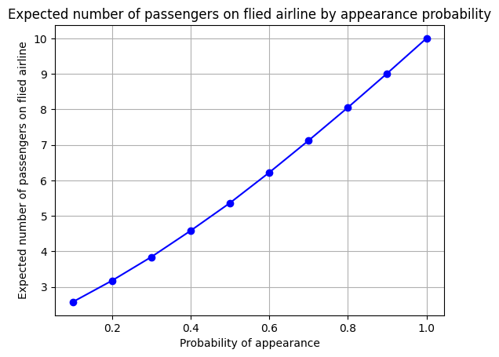

$$
{\def\fac#1/#2;{\frac{#1}{#2}}}
{\def\dfac#1/#2;{\dfrac{#1}{#2}}}
{\def\hx{{\hat{x}}}}
{\def\(#1);{\left( {#1} \right)}}
{\def\sets#1{  \left\{  \matrix{#1}  \right\}   }}
{\def\mean#1{\text{mean} \( \sets{#1} ); }}
{\def\std#1{\text{std}   \( {\sets{#1}} ); }}
{\def\var#1{\text{var}   \( {\sets{#1}} ); }}
{\def\stdsq#1{\text{std}^{2} \( {\sets{#1}} ); }}
{\def\align[[#1]]{   {\begin{align*}#1\end{align*}}   }  }
{\def\alignbr[[[#1]]]{\left\{ \ \begin{align*}#1\end{align*} \right. }}
{\def\inv#1{\frac{1}{#1}}}
{\def\iv#1;{\frac{1}{#1}}}
{\def\note#1!{\fbox{$#1$}}}
{\def\|#1|;{\left| #1 \right|}}
{\def\median#1{\text{median}  \( \sets {#1} ); }}
{\def\half{\frac{1}{2}}}
{\def\quarter{\frac{1}{4}}}
{\def\sqt#1]{\sqrt{#1}}}
{\def\tsub#1;{_{\text{#1}}}}
{\def\tsup#1;{^{\text{#1}}}}
{\def\comb#1in#2;{
\left(\matrix{#2\\#1}\right)
}}
{\def\rfac#1//#2;;{\frac{#1}{#2}}}
{\def\rdfac#1//#2;;{\dfrac{#1}{#2}}}
{\def\rrfac#1///#2;;;{\frac{#1}{#2}}}
{\def\rrdfac#1///#2;;;{\dfrac{#1}{#2}}}
$$

#### Problem 1

##### (a)

We see that if we pick an ace or a two, we get $X \le 2$, so $P(\set{X \le 2}) = 2/13$

##### (b)

We see that if we pick knave, queen, king or ten, we get $X \ge 10$, so $P(\set{X \ge 10}) = 4/13$

##### (c)

We see that $Y$ could only be $Y = X - 1$ or $Y = X + 1$. So if $X \ge Y$, that means $Y = X - 1$, which will happen if the card is red, so $P(\sets{X \ge Y}) = 1/2$

##### (d)

We see that there are only two possible value for this distribution to have:

* $1 = Y - X$, this is when the card is black.
* $-1 = Y-X$, this is when the card is red.

so we see that $P(\sets{Y - X = 1}) = P(\sets{Y - X = -1}) = 1/2$. (A distribution is two distinct value and each of its value has a probability of $1/2$)

##### (e)

Then we see that it could be that $Y = X - 1 \ge 12$ or $Y = X + 1 \ge 12$, and we get $X \ge 13$ or $X \ge 11$. It's impossible for $X \ge 13$, if we get $X \ge 11$, that means we draw a knave, queen or king and the card is black (since $Y = X + 1$ in this case). So $P(\sets{Y \ge 12}) = P{(\set{X \ge 11})}P(\text{black}) = 3/13 \cdot 1/2 = 3/26$


#### Problem 2

##### (a)

That means none of the player could pick any land card in their hand. So player one and player one both could only pick 7 cards from their nonland cards. (and pick 0 card from their land cards)
$$
P = \rfac \comb 0 in 10; \comb 7 in 30; // \comb 7 in 40; ;; \rfac \comb 0 in 20; \comb 7in 20; // \comb 7 in 40; ;; =  \rfac \comb 7 in 30; // \comb 7 in 40; ;; \rfac \comb 7in 20; // \comb 7 in 40; ;; 
$$

##### (b)

That means player one and player two have same number of land card in their hand, so
$$
P(\set{D = 0}) = \sum_{n = 0}^{7}\rfac \comb n in 10; \comb 7-n in 30; //\comb 7 in 40; ;; \rfac \comb n in 20; \comb 7-n in 20; //\comb 7 in 40; ;; 
$$

##### (c)

We see that the possible value for $L_1$ is from $0 \sim 7$, that means the player drawing $L_1 = n$ number of cards from one's land cards and $7-n$ number of cards from one's nonland cards.
$$
P(\sets{L_1  = n}) = \rfac \comb n in 10; \comb 7-n in 30; //\comb 7 in 40; ;; \qquad 0 \le n \le 7
$$

##### (d)

If $L_t = 10$, that means there are 10 number of land cards in the top of the player one's library. However, player one only has 10 land cards in total, that means player one has no land cards to put in the hand. So $L_1$ must be $0$. That means
$$
P(L_1 = n | L_t = 10) = \begin{cases}
1 \qquad n = 0 \\
0 \qquad n\neq 0
\end{cases}
$$

##### (e)

If $L_t = 5$, the number of cards player one could put to one's card deck is $0$, $1$, $2$, $3$, $4$ or $5$. So
$$
P({L_1 = n | L_t = 5}) = \rrfac \rfac \comb n in 5; \comb 7-n in 30; //\comb 7 in 40; ;; /// \sum_{k = 0}^5\rfac \comb k in 5; \comb 7-k in 30; //\comb 7 in 40; ;; ;;;   \qquad 0 \le n \le 5 \quad (\text{and 0 otherwise})
$$

#### Problem 3

|       | $x=1$ | $x=2$ | $x=3$ | $x=5$ |
| ----- | ----- | ----- | ----- | ----- |
| $y=1$ | 0.05  | 0.1   | 0.05  | 0.1   |
| $y=2$ | 0.05  | 0.09  | 0.01  | 0.05  |
| $y=4$ | 0.1   | 0.21  | 0.04  | 0.15  |

$$
\begin{align}
E[X] &= (0.05 + 0.05 + 0.1) \cdot 1 + (0.1 + 0.09 + 0.21) \cdot 2 + (0.05 + 0.01 + 0.04) \cdot 3 + (0.1 + 0.05 + 0.15) \cdot 5 \\
&= 0.2 \cdot 1 + 0.4 \cdot 2 + 0.1 \cdot 3 + 0.3 \cdot 5 \\
&= 0.2 + 0.8 + 0.3 + 1.5 \\
&= 2.8
\end{align}
$$

$$
\align[[
E[Y] &= (0.05 + 0.1 +0.05 + 0.1)\cdot 1 + (0.05 + 0.09 + 0.01 + 0.05) \cdot 2 + (0.1 + 0.21 + 0.04 + 0.15) \cdot 4\\
&= 0.3 \cdot 1 + 0.2 \cdot 2 + 0.5 \cdot 4 \\
&= 0.3 + 0.4 + 2.0 \\
&= 2.7
]]
$$

$$
\align[[
E[(3X - 2Y)^2] &=0.05\cdot (3 - 2)^2 + 0.05 \cdot (3- 4)^2 + 0.1\cdot (3 - 8)^2 + 
\\ &{\phantom{=\ }}0.1 \cdot (6 - 2)^2 + 0.09 \cdot (6 - 4)^2 + 0.21 \cdot (6 - 8)^2 + 
\\ &{\phantom{=\ }}0.05 \cdot (9 - 2)^2 + 0.01 \cdot (9 - 4)^2 + 0.04 \cdot (9 - 8)^2 + 
\\ &{\phantom{=\ }}0.1 \cdot (15 - 2)^2 + 0.05 \cdot (15 - 4)^2 + 0.15 \cdot (15 - 8)^2
\\ &= 38.44 
]]
$$


#### Problem 4

##### (a)

| Case (only success project) | Net return | Probability                                      |
| --------------------------- | ---------- | ------------------------------------------------ |
| $\emptyset$                 | $-\$300$   | $(1 - 0.2)\cdot (1-0.3) \cdot (1 - 0.6) = 0.224$ |
| $S_1$                       | $\$700$    | $0.2 \cdot (1-0.3) \cdot (1-0.6) = 0.056$        |
| $S_2$                       | $\$200$    | $(1-0.2) \cdot 0.3 \cdot (1-0.6) = 0.096$        |
| $S_3$                       | $-\$200$   | $(1-0.2) \cdot (1-0.3) \cdot 0.6 = 0.336$        |
| $S_1, S_2$                  | $\$1200$   | $0.2 \cdot 0.3 \cdot (1-0.6) = 0.024$            |
| $S_1, S_3$                  | $\$800$    | $0.2 \cdot (1 - 0.3) \cdot 0.6 =0.084$           |
| $S_2, S_3$                  | $\$300$    | $(1-0.2) \cdot 0.3 \cdot 0.6 = 0.144$            |
| $S_1, S_2, S_3$             | $\$1300$   | $0.2 \cdot 0.3 \cdot 0.6 = 0.036$                |

##### (b)

$E(W) = E(S_1 + S_2 + S_3) - 300 = E(S_1) + E(S_2) + E(S_3) - 300 = 1000 \cdot 0.2 + 500 \cdot 0.3 + 100 \cdot 0.6  - 300 = 200 + 150 + 60 -300 = \$110$


#### Problem 5

##### (a)

let $N$ be the number of ticket that airline sold, let $X$ be the number of people that turn up. Let $P$ be 1 if a person show up, and 0 if a person not show up. Then, set $E(X) = E(NP) = NE(P) = 10$ so that
$$
N =  \fac 10/E(P); = \fac 10/p;
$$
The company need to ensure at least $10/p$ number of tickets has been sold.

##### (b)



```pseudocode
[2.56 3.18 3.85 4.59 5.37 6.22 7.11 8.06 9.02 10.00]
```


#### Problem 6

```
Var[X + Y] = E[(X + Y)^2] - E[X + Y]^2
= E[X^2] + E[Y^2] - 2E[X]E[Y] - E[X]^2 - E[Y]^2 - 2E[X]E[Y]
= E[X^2] - E[X]^2 + E[Y^2] - E[Y]^2
= Var[X] + Var[Y]
```


#### Appendix

```python
TRIAL = 100000
TICKET_SOLD = 10

import random

expected_number_of_passengers = [0] * 10

# from 0.1 to 1.0
for i in range(10):
    appear_prob = (i + 1) / 10

    expected_number_of_passengers[i] = 0
    flight_count = 0
    for j in range(TRIAL):
        appear_count = 0
        appear_woman_count = 0
        for k in range(TICKET_SOLD):
            if random.random() < appear_prob:
                appear_count += 1
                if random.random() < 0.5:
                    appear_woman_count += 1

        if appear_woman_count >= 2:
            flight_count += 1
            expected_number_of_passengers[i] += appear_count

    expected_number_of_passengers[i] /= flight_count

# plot the graph
import matplotlib.pyplot as plt
import numpy as np

x = np.arange(0.1, 1.1, 0.1)
y = expected_number_of_passengers
plt.plot(x, y)
plt.xlabel('Probability of appearance')
plt.ylabel('Expected number of passengers on flied airline')
plt.title('Expected number of passengers on flied airline by appearance probability')
plt.show()
```


