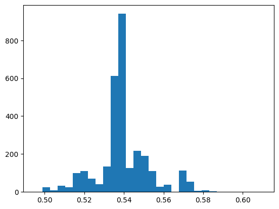
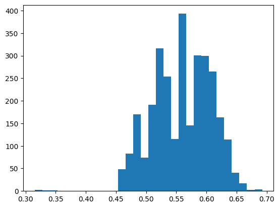

$$
{\def\fac#1/#2;{\frac{#1}{#2}}}
{\def\dfac#1/#2;{\dfrac{#1}{#2}}}
{\def\hx{{\hat{x}}}}
{\def\(#1);{\left( {#1} \right)}}
{\def\sets#1{  \left\{  \matrix{#1}  \right\}   }}
{\def\mean#1{\text{mean} \( \sets{#1} ); }}
{\def\std#1{\text{std}   \( {\sets{#1}} ); }}
{\def\var#1{\text{var}   \( {\sets{#1}} ); }}
{\def\stdsq#1{\text{std}^{2} \( {\sets{#1}} ); }}
{\def\align[[#1]]{   {\begin{align*}#1\end{align*}}   }  }
{\def\alignbr[[[#1]]]{\left\{ \ \begin{align*}#1\end{align*} \right. }}
{\def\inv#1{\frac{1}{#1}}}
{\def\iv#1;{\frac{1}{#1}}}
{\def\note#1!{\fbox{$#1$}}}
{\def\|#1|;{\left| #1 \right|}}
{\def\median#1{\text{median}  \( \sets {#1} ); }}
{\def\half{\frac{1}{2}}}
{\def\quarter{\frac{1}{4}}}
{\def\sqt#1]{\sqrt{#1}}}
{\def\tsub#1;{_{\text{#1}}}}
{\def\tsup#1;{^{\text{#1}}}}
{\def\comb#1in#2;{
\left(\matrix{#2\\#1}\right)
}}
{\def\rfac#1//#2;;{\frac{#1}{#2}}}
{\def\rdfac#1//#2;;{\dfrac{#1}{#2}}}
{\def\rrfac#1///#2;;;{\frac{#1}{#2}}}
{\def\rrdfac#1///#2;;;{\dfrac{#1}{#2}}}
{\def\intinf{\int_{-\infin}^{\infin}}}
{\def\intupinf{\int_{0}^{\infin}}}
{\def\intdwinf{\int_{-\infin}^{0}}}
{\def\it from#1to#2;{\int_{#1}^{#2}}}
{\def\eval#1 at #2;{\left.#1\right|_{#2}}}
{\def\eal#1 from #2 to #3;{\left.#1\right|_{#2}^{#3}}}
{\def\d{\text{d}}}
{\def\stderr{\text{stderr}}}
{\def\stdunbiased{\text{stdunbiased}}}
$$

#### Problem 1

##### (a)

88.85%



one bootstrap sample medians


##### (c)

88.8%



one bootstrap sample medians


##### (d)

We see that there isn't too much difference between (a) and (c) for different records count. This makes sense, as this validate that our bootstrap process get valid r% confidence interval, whose definition requires that r% population median lie inside the interval.


#### Problem 2

First calculate $T$
$$
T = \frac{200 - 169}{10/\sqrt{50}} \approx 21.92
$$
We want to calculate the adult that have average height greater than 200 cm, so (using normal distribution as $N$ is large)
$$
\int_{21.92}^{\infin} \fac1/\sqrt {2\pi}; \exp(-u^2 /2) \d u \approx 0
$$
It's almost impossible to get such a 50 adult males sample from South Africa that have average height greater than 200 cm.


#### Problem 3

##### (a)

First calculate $T$
$$
T = \fac 5 - 4/(0.7 / \sqrt{30}); \approx -26.30
$$
We want to calculate the fraction of sample consisting 30 adult male short-hair house cats that have average weight less than 4 kg, so (using normal distribution as $N$ is large)
$$
\int_{-\infin}^{-26.30} \fac1/\sqrt {2\pi}; \exp(-u^2 /2) \d u \approx 0
$$
It's almost impossible to get a sample consisting 30 adult male short-hair house cats that have average weight less than 4 kg. 


##### (b)

First calculate $T$
$$
T = \fac 5 - 4/(0.7 / \sqrt{300}); \approx -93.97
$$
We want to calculate the fraction of sample consisting 300 adult male short-hair house cats that have average weight less than 4 kg, so (using normal distribution as $N$ is large)
$$
\int_{-\infin}^{-93.97} \fac1/\sqrt {2\pi}; \exp(-u^2 /2) \d u \approx 0
$$
It's almost impossible to get a sample consisting 300 adult male short-hair house cats that have average weight less than 4 kg. 


##### (c)

This is because for different sample size, the standard deviation for the sample mean will change, and thus affect the probability.


#### Problem 4

So
$$
\stderr(\set x) = \fac \stdunbiased(\set x)/\sqrt N; = \fac 1/\sqrt {100}; = 0.1
$$
and
$$
T = \fac 10 - 7/0.1; = 30
$$
Compute a Two-sided p-value for a T-Test (Use Normal Distribution here as N is large). Therefore
$$
p = 1 - \int_{-T}^{T} N(0, 1)(u)\d u \approx 1 - 1 = 0 < 0.5
$$
The claim that the averatge length of Parktown prawn is 10cm is strongly rejected by evidence.


#### Problem 5

So the sample mean is $\std x = 983/2009 \approx 0.489$, and the stderr is
$$
\stderr(\set x) = \fac \stdunbiased(\set x)/\sqrt N; = \sqrt {\fac 1026 \cdot {(983/2009)}^2 + 983 \cdot {(1026/2009)}^2 /2009 \cdot 2008;} = 0.0111
$$
So
$$
T =\fac 0.5 - 0.489/0.0111; \approx 0.991
$$
Compute a Two-sided p-value for a T-Test (Use Normal Distribution here as N is large). Therefore
$$
p = 1 - \int_{-T}^{T} N(0, 1)(u)\d u \approx 1 - 0.678 = 0.322 > 0.05
$$
So the evidence is insufficient to reject that the boy is born with probability exactly 0.5. So the claim that a boy is born with probability exactly 0.5 could be true.


#### Problem 6

##### (a)

```
Contingency Table:
income  <=50K  >50K
sex                
Female  14423  1769
Male    22732  9918
Chi-square Statistic: 2248.847679013691
P-value: 0.0
Degrees of Freedom: 1
```

Income is dependent on sex

##### (b)

```txt
Contingency Table:
income        <=50K  >50K
education                
10th           1302    87
11th           1720    92
12th            609    48
1st-4th         239     8
5th-6th         482    27
7th-8th         893    62
9th             715    41
Assoc-acdm     1188   413
Assoc-voc      1539   522
Bachelors      4712  3313
Doctorate       163   431
HS-grad       13281  2503
Masters        1198  1459
Preschool        82     1
Prof-school     217   617
Some-college   8815  2063
Chi-square Statistic: 6537.972961360963
P-value: 0.0
Degrees of Freedom: 15
```

Income is dependent on education level


##### Code

```python
from ucimlrepo import fetch_ucirepo
import numpy as np

# fetch dataset
abalone = fetch_ucirepo(id=1)

# data (as pandas dataframes)
X = abalone.data.features
y = abalone.data.targets
# # metadata
# print(abalone.metadata)
# # variable information
# print(abalone.variables)

# get Length column
Length = X["Length"]

median = np.median(Length)

inside_90_count = 0
bs_median_means = np.zeros(2000)
bs_average_std_error = np.zeros(2000)

sample_size = 100

for i in range(2000):
    sample = np.random.choice(Length, size=sample_size, replace=False)

    # 3000 bootstrap replicates
    bs_replica = np.random.choice(sample, size=(3000, sample_size), replace=True)

    # calculate median of each bootstrap replicate
    bs_median = np.median(bs_replica, axis=1)

    # mean of bs_median
    bs_median_mean = np.mean(bs_median)
    bs_median_means[i] = bs_median_mean

    # std error of bs_median
    bs_median_std_error = np.std(bs_median, ddof=1)
    bs_average_std_error[i] = bs_median_std_error

    # calculate the 90% confidence interval
    bs_median_low, bs_median_high = bs_median_mean - 1.64485 * bs_median_std_error, bs_median_mean + 1.64485 * bs_median_std_error

    if bs_median_low <= median <= bs_median_high:
        inside_90_count += 1
        
    if i == 0:
        # plot the histogram of bs_median
        plt.hist(bs_median, bins=30)
        plt.show()


# plot histogram
import matplotlib.pyplot as plt
plt.hist(bs_median_means, bins=30)
plt.show()

print(inside_90_count / 2000)
print(median)
print(bs_average_std_error.mean())
```

```python
from ucimlrepo import fetch_ucirepo

# fetch dataset 
adult = fetch_ucirepo(id=2)

# data (as pandas dataframes)
X = adult.data.features
y = adult.data.targets

income = y["income"]
sex = X["sex"]
education = X["education"]
income = income.str.replace('\.$', '', regex=True)

# use chi-square test to test the independence of income with respect to gender

import pandas as pd
from scipy.stats import chi2_contingency

# Assuming 'income' and 'education' are pandas Series objects

# Create a contingency table
contingency_table = pd.crosstab(education, income)

# Apply the Chi-square test
chi2, p, dof, expected = chi2_contingency(contingency_table)

print("Contingency Table:")
print(contingency_table)
print(f"Chi-square Statistic: {chi2}")
print(f"P-value: {p}")
print(f"Degrees of Freedom: {dof}")

# Create a contingency table
contingency_table = pd.crosstab(sex, income)

# Apply the Chi-square test
chi2, p, dof, expected = chi2_contingency(contingency_table)

print("Contingency Table:")
print(contingency_table)
print(f"Chi-square Statistic: {chi2}")
print(f"P-value: {p}")
print(f"Degrees of Freedom: {dof}")
```


