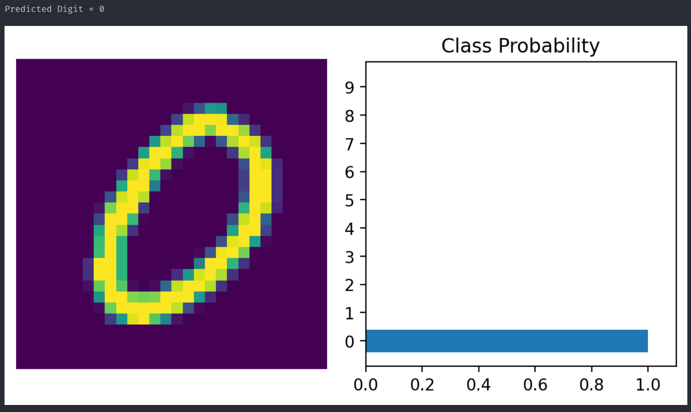

#### Exercise 4

##### (a)

Since it's just least square regression, the close form solution is just
$$
\boldsymbol \theta  = (A^{T} A)^{-1} A^T \boldsymbol y
$$
where $A$ is the matrix, each column of which represents a single data point $\boldsymbol{x_j}$. (dimension : (1000, 10)).

The experimental result running least square regression is:

```txt
[1.00004061 0.99922338 0.9950834  0.99414697 1.00830126 0.99477008
 1.00543833 0.99744536 1.00440736 1.00171426]
```

We see that it's indeed close to the true theta value, the difference is caused by the random error added when generating the data set.

##### (b)

Given the hint, we see that
$$
\align[[
\nabla Q(\boldsymbol \theta, j) 
&= \pderi {\left| \boldsymbol{x_j}^T \boldsymbol \theta -y_j \right|^\gamma}/{(\boldsymbol{x_j}^T \boldsymbol \theta -y_j)}; \cdot \boldsymbol{x_j} 
\\
&= 
\pderi {\left| \boldsymbol{x_j}^T \boldsymbol \theta -y_j \right|^\gamma}/{|\boldsymbol{x_j}^T \boldsymbol \theta -y_j|}; \operatorname{sgn}(\boldsymbol{x_j}^T \boldsymbol \theta -y_j) \cdot \boldsymbol{x_j}
\\
&= \gamma \left| \boldsymbol{x_j}^T \boldsymbol \theta -y_j \right|^{\gamma - 1}(\boldsymbol{x_j}^T \boldsymbol \theta -y_j) \cdot \boldsymbol{x_j}
]]
$$

##### (c)

With the default hyper-parameter $\gamma = 2$ and every default parameter mentioned in the file, I get

```
ADAM: [0.36366069 0.27178298 0.36617128 0.32107462 0.31768962 0.31397556 0.38779381 0.36463799 0.31373139 0.34376885]
SGD: [0.56573401 0.46841485 0.57850346 0.52190134 0.52824622 0.45103458 0.56847944 0.51541266 0.53340197 0.59151013]
```

which doesn't seem to converge to all 1's, the maximum iteration might not be big enough.

##### (d)


The number of replicate is still `10`, as for $\gamma = 2$, ADAM and SGD doesn't seem to overlap with each other. They are indeed learning as the loss is continuingly decreasing.

##### (e)

Below is the ADAM and SGD run for $\gamma = 0.4, 0.7, 1, 2, 3, 5$ with $30$ replicates (To distinguish their error bars). For each $\gamma$, there is a log of predicted $\theta$ found by ADAM and SGD after 1000 iterations. (First one is the one predicted by ADAM, second one is the one predicted by SGD).

We see that for $\gamma = 0.4, 0.7, 1$, ADAM converges faster than SGD, for $\gamma = 2, 3, 5$, SGD converges than ADAM. To explain this, first see the loss function:
$$
F(\boldsymbol \theta) = \iv k;\sum_{j = 1}^{k} Q(\boldsymbol \theta, j) \\
Q(\boldsymbol \theta, j) = \left| \boldsymbol{x_j}^T \boldsymbol \theta -y_j \right|^\gamma
$$
We see that for $\gamma \le 1$, the loss function is less steep for larger errors  (since raising to a power less than 1 makes the function flatter). This can make the loss surface smoother and less prone to steep ravines,  which are challenging for SGD due to its susceptibility to oscillations. ADAM, on the other hand, uses moment estimates to adaptively adjust the learning rate for each parameter, smoothing out the updates. This can  be particularly advantageous in a smoother loss landscape, leading to  faster convergence for ADAM compared to SGD.

For gamma greater than 1, the loss function becomes more sensitive to  larger errors (since raising to a power greater than 1 amplifies the  function's response to errors). This creates a loss surface with sharper curves and possibly steeper gradients, which can cause ADAM to take  overly conservative steps due to its first and second moment adjustments (especially the squared gradients in the denominator), thus slowing  down its convergence. SGD, without such adaptations, might simply follow the steepest descent direction, which can be more efficient on these  steeper loss surfaces, leading to faster convergence.

The plots:

###### $\gamma = 0.4$

```
[0.18920419 0.10507979 0.17278886 0.09277979 0.06882694 0.17405564 0.20966409 0.11443448 0.19563788 0.20391008]
[0.13490504 0.10068817 0.10345786 0.06000124 0.0768161  0.07483765 0.1398347  0.10256127 0.08244288 0.06632791]
```


###### $\gamma = 0.7$

```
[0.26034209 0.18519106 0.20133955 0.23449437 0.20467992 0.2073057 0.26990903 0.23853682 0.18534818 0.23403645]
[0.16141827 0.15817965 0.15535091 0.1315981  0.0918907  0.11075759 0.18006193 0.14983104 0.12217573 0.13682242]
```


###### $\gamma = 1$

```
[0.30634018 0.20608832 0.29992238 0.26621208 0.29198682 0.3060128 0.29823902 0.30541754 0.30960241 0.3433999 ]
[0.24362172 0.15466205 0.2002413  0.15552798 0.17302805 0.17850528 0.26793649 0.19469595 0.17385885 0.2060129 ]
```


###### $\gamma = 2$

```
[0.37820209 0.33269231 0.36096228 0.31113268 0.34833645 0.31792376 0.39310225 0.35257718 0.33322743 0.30562737]
[0.59354348 0.47539292 0.55484887 0.54402402 0.5692058  0.57575307 0.5805163  0.57221773 0.52337655 0.58207155]
```


###### $\gamma = 3$

```
[0.31077878 0.28144853 0.31141649 0.30596151 0.29808097 0.23781039 0.33111738 0.32481173 0.25610534 0.30244409]
[0.78559102 0.71204964 0.73424567 0.77759723 0.84477088 0.77911724 0.81746349 0.70083144 0.78587424 0.78518768]
```


###### $\gamma = 5$

```
[0.25081438 0.22213234 0.23686678 0.21998087 0.18748313 0.22808991 0.30389093 0.19229767 0.17883743 0.23804415]
[0.83168893 0.86001541 0.98908394 1.11639304 1.07227066 1.01633028 1.0919689  0.78193971 0.5184327  1.03674032]
```


#### Exercise 5

##### (a)

Since that SGD calculates gradient for each data point in the mini data batch, and then average them and use that as the gradient each iteration. Setting the size of the mini data batch to the size of entire MNIST dataset effectively make SGD calculates the gradient of entire dataset, which is exactly what GD algorithm do, and that's reason why it becomes GD algorithm if setting mini batch size to the size of MNIST dataset.

The accuracy is very low, it's `0.0963` in my case. 


I see this in the end, it seems that the model predict 1 to be 5, which is very wrong. (However it's not surprising as it's accuracy is around random guess (which is 10%)). The GD also gives class probability similar for all digits, which means it's confused about what digit is in the data.

Few ways to improve the model:

* Adjust the learning rate, if it's too low, the model might not converge in 15 epoch given in the code. If it's too high, it might overshoot the optimal solution. Or using a learning rate schedule that start the learning rate big, and gradually decreasing it. like $1/t$ as discussed previously.
* Increase the number of layers and number of neurons in each layer might help the model to better learn the dataset.
* Increase the epoch if the model could not converge within just 15 epoch.
* Use different activation functions might help
* Normalize the input dataset


##### (b)

The accuracy now is significantly higher, ` 0.9265` in my case. The number shown here is predicted correctly, and the SGD is very certain that it's a 5 with the class probability of 5 close to 1 and other class probability close to 0.


Few ways to improve the accuracy:

* Try different batch size
* Try different number of epoch
* Try different learning rate as mentioned previously


##### (c)

I see an even higher accuracy rate of `0.9729` in my case. The number shown here is predicted correctly, and ADAM is very certain that it's a 5 with the class probability of 5 close to 1 and other class probability is 0 (extremely close to 0 so that you could not see it on the plot)



ADAM accelerates convergence compared to SGD by computing adaptive learning rates for each parameter. It incorporates momentum by using moving averages of the gradient and its square, which helps in smoother optimization and overcomes the issues of noisy data or gradients. Additionally, ADAM applies bias correction to these moving averages to prevent any skew in the initial updates. This adaptive approach allows ADAM to take larger steps toward minima in flatter regions and smaller steps in steep areas (due to smaller $\hat v_t$), enabling faster and more stable convergence than SGD's uniform step size across all parameters. That's reason why ADAM converges faster.

