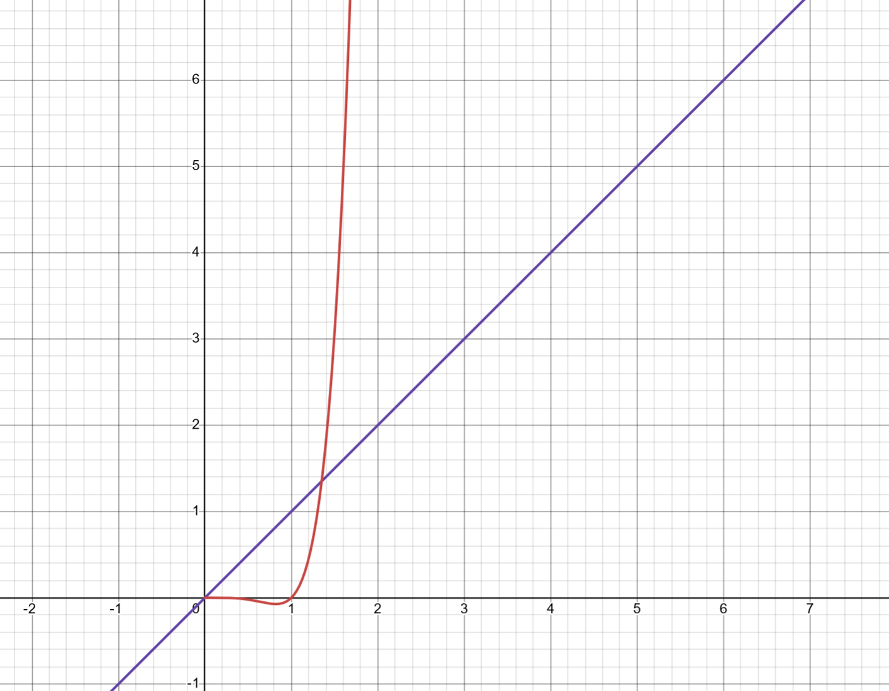

#### Exercise 1

We know that $g(\theta) = Q(\theta, i)$. so it's expected value is just the average of all $Q(\theta, i)$:
$$
E[g(\theta)] = E[Q(\theta, i)] = \iv k; \sum_{j = 1}^{k} Q(\theta, j) = f(\theta)
$$
which is just $f(\theta)$​ according to its definition.

Then we see that
$$
\grad f(\theta) = \iv k; \sum_{j = 1}^{k} \grad Q(\theta, j) = E[\grad Q(\theta, i)] = E[g(\theta)]
$$
by the linearity of gradient, and since the expected is just an average of all $\grad Q(\theta, i)$

Finally, we see that
$$
E(z) = E[Q(\theta, i)] - E[f(\theta)] = E[g(\theta)] - f(\theta) = f(\theta) -f(\theta) = 0
$$
since $f(\theta)$ is constant with respect to $i$ and that $E[g(\theta)] = f(\theta)$ as got earlier.

#### Exercise 2

$$
\begin{array}{|l|c|c|}
\hline
& \text{SGD} & \text{GD}
\\\hline
\text{Computational Cost per Update} & O(1) & O(k)
\\\hline
\text{Number of updates to reach } \epsilon & O\(\iv \epsilon;); & O\(\ln(\iv \epsilon;));
\\\hline
\text{Total Cost} & O\(\iv \epsilon;); & O\(k\ln(\iv \epsilon;));
\\\hline
\end{array}
$$

For GD, since iteration is $\theta_{t + 1} = \theta_t  -\eta_t \grad f(\theta_t)$, computing $\grad f(\theta_t)$ requires $kc$ time so the computational cost per update is $O(k)$

For SGD, since we know that $f$ is strongly convex, and is twice continuously differentiable, and $\grad f$ also has a unique root $\theta^*$, and that $\eta_t = \iv t; = O(t^{-1})$, therefore we could apply Theorem 1.1, and to achieve an approximation error $\epsilon = |E[f(\theta_t)] - f(\theta^*)|$ would require $O\(\iv \epsilon;);$ updates.

For GD, since we know that $\grad f$  has a unique root $\theta^*$, we could apply Theorem 1.3, and to achieve an approximation error $\epsilon = |E[f(\theta_t)] - f(\theta^*)|$ would require $O\(\ln(\iv \epsilon;));$

So, the total cost is just equal to the product of computational cost per update and the number of updates to reach $\epsilon$, so
$$
\begin{align}
\text{Cost}\tsub SGD; &= O(1) \cdot O\(1/\epsilon); = O\(1/\epsilon); \\
\text{Cost}\tsub GD; &= O(k) \cdot O\(\ln(1/\epsilon)); = O\(k \ln (1/\epsilon));
\end{align}
$$

#### Exercise 3

$$
\begin{array}{|l|c|c|}
\hline
& \text{SGD} & \text{GD}
\\\hline
\text{Computational Cost per Update} & O(1) & O(\rho^{-\iv \gamma;})
\\\hline
\text{Number of updates to reach } \rho & O\(\iv \rho;); & O\(\ln(\iv \rho;));
\\\hline
\text{Total Cost} & O\(\iv \rho;); & O\(\rho^{-\iv \gamma;}\ln(\iv \rho;));
\\\hline
\end{array}
$$

From previous table, we know computational cost per update for GD is $O(k)$, now we just need to express $k$ in terms of $\rho$ and $\gamma$, since we know the relation that $\rho = O(k^{-\gamma})$, so we know $\rho \le Mk^{-\gamma}$ for $k > k_0$ therefore
$$
\rho^{-\iv \gamma;} \ge (Mk^{-\gamma})^{-\iv \gamma;} = M^{-\iv \gamma;}k \\
k \le M^{\iv \gamma;} \rho ^{-\iv \gamma;}
$$
Pick $k_1 > k_0$, call $\rho_0 = Mk_1^{-\gamma}$. So we know that $\rho < \rho_0$, and $k \le M^{\iv \gamma;} \rho^{-\iv \gamma;}$ for $k_1 > k_0$. So, $k = O(\rho^{-\iv \gamma;})$ (the infinitesimal big O), and therefore $O(k) = O(\rho^{-\iv \gamma;})$

From previous table, we know that number of updates to reach $\epsilon$ for SGD is $O\(\iv \epsilon;);$, since we could express $\epsilon = c\cdot \rho$, so the number of updates to reach $\rho = \epsilon/c$ is just $O\(\iv \epsilon/c;); = O(\iv \rho;)$. Also we know that number of updates to reach $\epsilon$ for GD is $O\(\ln(\iv \epsilon;));$,  so the number of updates to reach $\rho = \epsilon/c$ is just $O\(\ln(\iv \epsilon/c;)); = O\(\ln(\iv \rho;));$

Therefore, the total cost is, again, multiplication between number of updates and cost per update:
$$
\begin{align}
\text{Cost}\tsub SGD; &= O(1) \cdot O\(1/\rho); = O\(1/\rho); \\
\text{Cost}\tsub GD; &= O(\rho^{-\iv \gamma;}) \cdot O\(\ln(1/\rho)); = O\(\rho^{-\iv \gamma;}\ln(1/\rho));
\end{align}
$$
We see that for a typical $\gamma = 0.2$, Then the complexity of GD become $O(\rho^{-5}\ln(1/\rho))$. This makes cost of GD increasing far quicker than SGD when $\rho \to 0$.

This is a graph of cost versus $1/\rho$, we see as $\rho \to 0$ (i.e. $1/\rho \to \infin$). The cost for GD (red line) is much much quicker than cost for SGD (purple line). Therefore it's unwise to choose GD over SGD, as the former has far worse time complexity.

