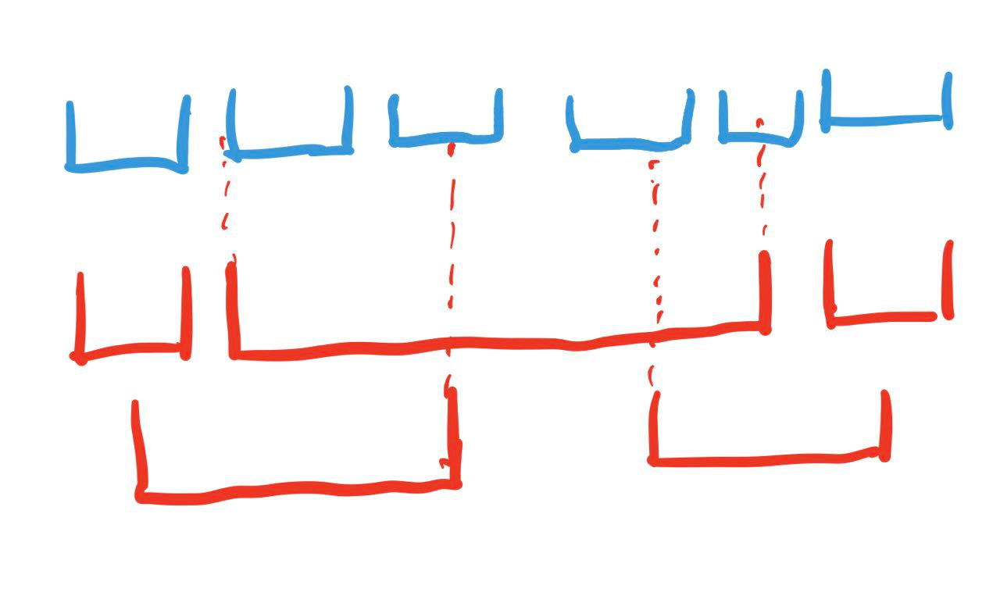

$$
\def\tsub#1;{_{\text{#1}}}
\def\tsup#1;{^{\text{#1}}}
$$

#### (a)

There is one counterexample:

> This is just a rough illustration, the top left red interval covers the first blue interval, the top middle red interval covers the second, third, fourth, and fifth blue intervals, the top right red interval covers the sixth blue interval. The bottom left red interval covers the first, second, third intervals. The bottom right red interval covers fourth, fifth, and sixth intervals. The exact number / coordinate doesn't matter here.

The wrong greedy algorithm will choose the top three red intervals. (Or the top middle, bottom left and bottom right. Or the top middle, bottom left, top right. Or the top middle, top left, bottom right. No matter which one it choses though, it always needed to choose 3 intervals.) However, the optimal solution is the two intervals in the bottom. The optimal solution is different from the greedy solution. (Greedy solution is worse).

#### (b)

Before we run the algorithm, we do:

* Sort the $R$ in the increasing order of each interval's $a(I)$, and sort the $B$ in the increasing order of each interval's $b(J)$. Initialize the solution $O$ as empty.

The greedy algorithm is below (It receives three parameters: the red intervals $R$, the blue intervals $B$, and the solution $O$). 

---

See if $B$ is empty.

* If it's not, get the first interval $J_0$ in the sorted $B$. Iterate the intervals $I_i$ in $R$ that has $a(I_i) \le b(J_0)$ and $b(I_i) \ge b(J_0)$ (this means they have overlap). $\fbox{$1$}$

  * If such intervals could not be found, immediately raise `Exception` to indicate that there isn't a solution. $\fbox{$5$}$

  * Otherwise, find the interval that has maximum $b(I_i)$ among these intervals $$\fbox{$2$}$$ (this could be done along with iterating the $I_i$). Record this interval as $I\tsub right;$ and add this interval to the solution $O$. Try to iterate to find the first interval that doesn't satisfy $a(I_i) \le b(J_0)$ the $I\tsub next start;$. $\fbox{$4$}$ (this $I\tsub next start;$ could be undefined, this will just cause the recursive call to raise `Exception` if the algorithm choose to call it).

    Start from start from $J_1$, iterate intervals $J_j$ in $B$ until either:

    * Find an interval $J\tsub next start;$ such that $a(J\tsub next start;) > b(I\tsub right;)$ $\fbox{$3$}$, then call the algorithm recursively with parameters:

      * red intervals equal to intervals starting $I\tsub next start;$ to the end of $R$, inclusive.
      * blue intervals equal to intervals starting from $J\tsub next start;$ to the end of $B$, inclusive.
      * solution just equal to the current solution $O$.

      and return the $O$ after the recursive call finishes.

    * Reach the end of the $B$, in this case just return solution $O$.

* Otherwise just immediately return.

---

Then we just call this greedy algorithm with the parameter:

* Red Intervals $= R$
* Blue Intervals $= B$
* Solution $= O$

and either the algorithm will raise an exception telling that solution doesn't exist. Or the solution will be store in the $O$.

---

We first analyze the time complexity of the algorithm. We see that the first two sort takes $O(n \log n)$ and $O(m \log m)$, respectively. Then, we first iterate through from $I_0$ to $I\tsub next start;$. Since we only just check the $a(I_i)$ and calculate an maximum of $b(I_i)$ for these intervals. Each iteration takes $O(1)$ to complete. Also, we iterate through $J_1$ to $J \tsub next start;$, since each iteration we only check $a(J_j)$. Each iteration takes $O(1)$ to complete. Further notice that although we call the algorithm recursively, we only iterate every interval at most once for the entire program. (This is because we only iterate forward, and we only pass the part of the $R$ and $B$ that is not iterated yet to the recursive call). That means the runtime for the algorithm besides the sorting takes $O(n + m)$. 

So, in the end, we see that the total runtime for the entire program takes $O(n\log n + m\log m)$. This is dominated by the sorting at the start of the program. This runtime is with in the require bound of $O((n + m) \log (n + m) )$.

---

We see that the only case when there is no solution is there is some blue intervals, but there is no red intervals that overlaps with it (the fact that it explore all the possible intervals that could be overlapping with the blue intervals is detailed in $(\star)$ (this is in later part)). This is detected exactly by $\fbox{5}$. So, our algorithm behaves properly when there is no solution.

Otherwise, we will prove the correctness by contradiction. Given the greedy solution $G$, We first notice few key properties

* If $I_i$ is selected as the solution. Then there exists a certain interval $J_j$, $I_i$ is the interval that has overlap with $I_i$. We call all the intervals that have the overlap with $J_j$ the set $I^j$, and $I_i$ has maximum $b(I_i)$ among $I^j$.

  This is true because we see that in the algorithm that the only way a $I_i$ could be added into the solution is when there exists a $J_j$ that overlaps with $I_i$, and $I_i$ has the maximum $b(I_i)$ (this is shown by $\fbox{$2$}$ ) among all the intervals considered at $\fbox{$1$}$. This proves the existence of such $J_j$, and the maximum $b(I_i)$. 

  Then, we need to show that $\fbox{$1$}$ actually considers all the intervals that overlaps with $J_j$. This is true because: (1) in the case where the algorithm is not called recursively, the algorithm will just iterate from the beginning of the $R$, so every possible intervals that overlaps with $I_i$ is considered. $(\star)$ **(2)** in the case where the algorithm is called recursively, although we only passed the from $I\tsup prev;\tsub next start;$ to the end of $R$ from the caller, this is sufficient, since we know that all the intervals $b(I\tsup prev;_i)$ before the $I\tsup prev;\tsub next start;$ is strictly less than than the $b(I_{i -1})$ according to $\fbox{$2$}$, and that we also know that $\fbox{$3$}$ guarantees that $a(J_j) = a(J\tsup prev;\tsub next start; ) > b(I_{i - 1})$, that means all the intervals before $I\tsup prev;\tsub next start;$ will have have $b(I\tsup prev;_i) < a(J_j)$ which means that they are not in overlap with $J_j$, so ignoring them will still make sure that that $\fbox{$1$}$ actually considers all the intervals that overlaps with $J_j$.

* We also see that suppose $I_a$ and $I_b$ is both selected as solution. Then we see could find the corresponding $J_c$ and $J_d$ according to the property above, respectively. We could also find the $I^c$ and $I^d$. Then, it's true that $I^c$ doesn't have one interval that overlaps the $J_d$ and $I^d$ doesn't have one interval that overlaps the $J_c$.

  we see that $I_a$ and $I_b$ must be inserted to the solution during different recursion call (since in each call, it's only possible to add one interval to solution). Without loss of generality, let's assume $I_a$ is added to the solution first. (That means, the $I_a$ along with $J_c$ is considered by the algorithm first, and this function call that considers $I_a$ and $J_c$ the initiates a recursive call which will consider the $I_b$ and $J_d$ eventually). 
  
  The interval associate with the $I_a$ is the $J_c$. Suppose there is one interval in the $I^d$ that overlaps $J_c$, then in  $\fbox{$1$}$, this interval will be already be considered and is thus put in $I^c$, and it will be thus already iterated $\fbox{$4$}$ and therefore won't be passed into the recursive call (and thus never appear in $I^d$). This leads to a contradiction. That means there is no interval in $I^d$ that overlaps $J_c$.
  
  In the same way, suppose there is one interval $I_i$ in the $I^c$ that overlaps $J_d$, then that means $b(I_i) \ge a(J_d)$ and $a(I_i) \le b(J_d)$. Since by property 1, we see that $b(I_a) \ge b(I_i)$, that means $b(I_a) \ge a(J_d)$. Since by the order we sort the $B$, since $J_d$ is considered later than $J_c$, that means $b(J_d) \ge b(J_c)$. However, since $I_c$ overlaps with $J_c$, that means $a(I_a) \le b(J_c)$. This results in $a(I_a) \le b(J_d)$ So, that means $I_a$ overlaps with $J_d$, according to $\fbox{$3$}$, that means such $J_d$ will be iterated and skipped. It won't be passed to the recursive function call. This means that later function call won't even consider the $J_d$ that associate with $I_b$. This contradicts with the assumption. Therefore, that means this is no interval in the $I^c$ that overlaps $J_d$.
  
  We therefore concludes that it's true that $I^c$ doesn't have one interval that overlaps the $J_d$ and $I^d$ doesn't have one interval that overlaps the $J_c$.

Now suppose that our greedy solution $G$ is worse than the optimal solution $O$, that is, we select $n$ intervals while the optimal solution select less than $n$ intervals. Then we could see that for the $n$ red intervals $I_0', I'_1 \cdots I'_n$  selected by the $G$, it corresponds to $n$ blue intervals $J_0', J'_1 \cdots J'_n$ defined by properties. Foreach $J_j'$, its overlapping set is the $I^j$. Then we see that the optimal must include one interval in the $I^j$ otherwise the $J'_j$ will not be covered. However, choosing anything in $I^j$ will not help you to cover any other $I^{j'}$ where $j' \neq j$ due to the property 2. This means that the optimal solution has to choose a interval from every $I^j$. Yet, this will result in choosing at least $n$ intervals, and this contradicts with our assumption. So, the greedy solution $G$ is at least equally better than the optimal solution $O$. That means it's one optimal solution.

Q. E. D.

