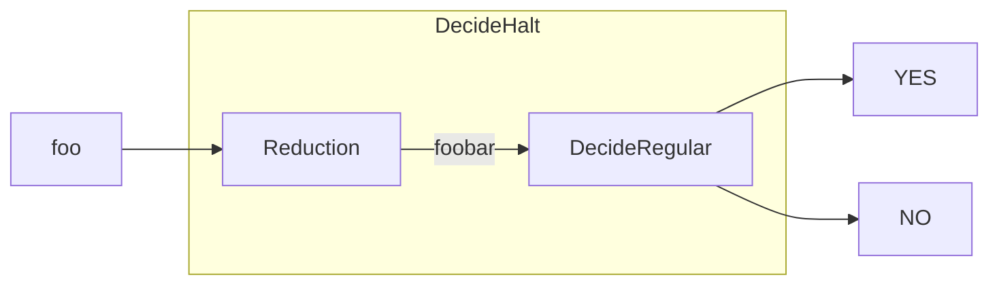
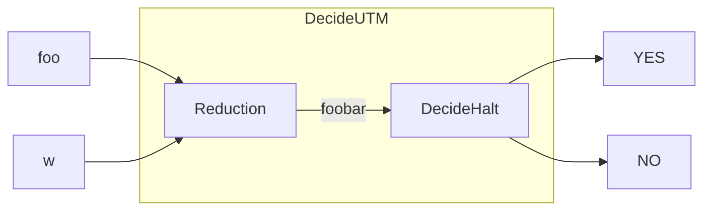

##### (a)



The reduction looks like above. We are trying to write a reduction so that $L\tsub HALT; \le L\tsub regular;$. The reduction is

* The reduction receives arbitrary program, call it `foo`.

* It produce a new program, call it `foobar`. This program look like below (it takes an string `w` and return a boolean to decide whether it's regular) :

  ```pseudocode
  foobar(w):
  	if w is palindrome:
  		return true;
  	else:
  		foo()
  		return true;
  ```

We see that if `foo` halts, then the language of `foobar` is $\Sigma^*$ (which is regular language). If `foo` doesn't halt, then the language of `foobar` is all the palindrome (which is not regular language). Follow the same logic, we could see that the reverse is true. Then we see that `foobar` in $L\tsub regular;$ if and only if `foo` in $L\tsub HALT;$. That means if $L\tsub regular;$ is decidable then $L\tsub HALT;$ is decidable. Since we know that $L\tsub HALT;$ is undecidable that means $L\tsub regular;$ is not decidable.

##### (b)



The reduction looks like above. We are trying to write a reduction so that $L_u \le L\tsub HALT;$. The reduction is

* The reduction receives arbitrary program, call it `foo`, and a string called `w`. The `foo` is a program (function) that will take an input string and output a boolean to indicates whether it's accepted or not.

* It produce a new program, call it `foobar`. This program look like below:

  ```pseudocode
  foobar():
  	if foo(w): 
  		return
  	else:
  		loop infinitely
  ```

We see that when `w` is accepted by `foo`, the `foobar` halts. Otherwise, `foobar` will never halt. Following the same logic, the reverse is also true. Then we see that `foobar` halts if and only if `w` is accepted by `foo`. That means `foobar` is in $L\tsub HALT;$ if and only if `(foo, w)` is in $L_u$ and our reduction if valid. Therefore, $L_u \le L\tsub HALT;$

##### (c)

Adapted from `https://stackoverflow.com/questions/46140969/how-is-turing-machine-which-accepts-nothing-is-not-recursively-enumerable`.

First we know that from Lecture slides:

>If $L$ and $\bar L$ are recursively enumerable, then $L$ is recursive. (1)

Then we know that

>$L\tsub emptylang; = \{ \langle M \rangle | L (M) = \empty \}$ is not recursive. (2)

This is due to Rice's theorem. The property "accept nothing" is true to some languages (consider a language with only one valid string which is the encoding of a program that `return "no"` always, this language has this "accept nothing" property, but for a language with only one valid string which is the encoding of a program that `return "yes"` always, this language doesn't have this "accept nothing" property), and it's a semantic property of the language itself. Therefore, the $L\tsub emptylang;$ is not decidable / recursive.

>$L\tsub somelang; = \{ \langle M \rangle | L (M) \neq  \empty \}$ is recursively enumerable. (3)

note that $L\tsub somelang;$ is the complement of $L\tsub emptylang;$. We know that for all possible input string $s \in \Sigma^*$, it is countable. So, for a given $M$ if we want to know if it accept something, the set of $(M, s_i)$ that iterates through all possible input string in $\Sigma^*$ is countable. Then, we could use our UTM to run the simulation of the all the input $(M, s_i)$ in parallel. (Just like what a single cpu core, which is equivalent to Turing machine, doing multiple things in parallel by switching between them) If one of the input $(M, s_i)$ finishes / halts in accepted state, the UTM halts with accepted states. Otherwise the UTM will continue to run. We see the language of this UTM is $L\tsub somelang;$

>$L\tsub emptylang; = \{ \langle M \rangle | L (M) = \empty \}$ is not recursively enumerable.

Suppose it's recursively enumerable. Then (3) said that it's complement is recursively enumerable, and that (1) indicates both language are recursive. However, (2) shows it's not recursive. This is a contradiction, that means our assumption is false, and that $L\tsub emptylang; = \{ \langle M \rangle | L (M) = \empty \}$ has to be not recursively enumerable.