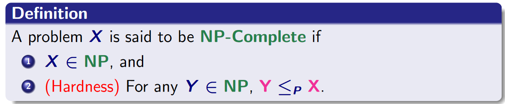

##### (a)

We see that there are two constraints for each vertex in the $V$ (if a perfect matching exists):

* One of all the edges that connects to it needs to be selected.
* Only one of all the edges that connects it could be selected.

Then we see that given a graph $G = (V, E)$, for $e \in E$, let boolean variable $x_e$ indicates that $e$ is included in the matching. Then following the constraint imposed on each node, we could iterate $i \in V$ (name all edge that connects to it $e^i_1$, $e^i_2$, ... $e^i_m$  in this case):

* Then we see one of the edge need to be selected and that means this
  $$
  \txt any;_i = \bigvee_{j = 1}^m e^i_j
  $$
  needs to be true (we call this $\txt any;_i$ for now)

* Then we see only one of the edge could be selected, which means it must be true one of edge $e^i_j$ is true and others are false. That means this
  $$
  \txt exclusive;_i = \bigvee_{j = 1}^{m} \( e_j^i \and \(\bigwedge_{k = 1 (\txt skip; \ k = j)}^{m} \neg e^i_k ););
  $$

* Then this must be true $\txt vertex;_i = \txt any;_i \and \txt exclusive;_i$

and it means that this
$$
f = \bigwedge_{i = 1}^{|V|}\txt vertex;_i
$$
must be true.

Then the perfect matching problem on $G$ just becomes the SAT problem on $f$. We see that these question is equivalent becomes it's evident that once there is a perfect matching in $G$, then the constraint on each vertex will be satisfied, and since our $f$ is written based on these constraints, it will become true. Following the same logic, the reverse is also true. So we see that these question is indeed equivalent and this reduction works.

This doesn't not mean that perfect matching is NP-complete. We see that we need to do this:

We now show that $\txt PerfectMatching; \le_P \txt SAT;$. But we need to actually show $\txt SAT; \le_P \txt ; \txt PerfectMatching;$ and also we need to show that $\txt PerfectMatching; \in \txt NP;$, in order to prove that is NP-complete. (Actually, Wikipedia said that

>Deciding whether a graph admits a perfect matching can be done in [polynomial time](https://en.wikipedia.org/wiki/Polynomial-time), using any algorithm for finding a [maximum cardinality matching](https://en.wikipedia.org/wiki/Maximum_cardinality_matching).

##### (b)

We first need to show that $\txt EIGHT; \in \txt NP;$. 

To do this, we need to find an efficient certifier $C$ that takes a certain instance $G$ and $k$. We could pick the certificates $t$ to be the subgraph $G'$ of size $2k - 1$. (with the edge that only necessary to the eight-cycle kept, others are removed. (because the certificates is supposed to be a **clear** possible answer to the problem) This will make it only left with $2k$ edges.) We see that all possible $t$ is bounded by $O(_n C _{2k - 1}\ _mC _{2k})$ ($n = |V|, m = |E|$). We see that $|t| = O(_n C _{2k - 1}\ _mC _{2k}) = O(n^{2k -1 } \cdot m^{2k})$, and that means $|t|$ is in fact polynomial proportional to the input size. Notice that $t$ is always connected because $G$ is connected as an eight-graph.

The certifier $C$ will do:

* Find the node with degree of 4, if not found, return `no`. Otherwise, call it $s$, remove $s$ from $G'$, see if there are two connected components $A$ and $B$ each with size $k - 1$. (this could be done with whatever-first search) If not, return `no`. Otherwise, proceed.
* See if the subgraph $G' \backslash B$ is connected and check if every node has degree of 2 in it. If not, return `no`, otherwise proceed.
* Do the same thing with $G' \backslash A$.
* If reach there, return `true`

Since only the edge that is necessary are kept, we see that that certain $G'$ could only be a correct solution if and only if above requirements is satisfied. 

Suppose $G'$ is a correct solution, then there is a node that is shared by both cycles, since only the edge that is necessary are kept, this node will only have degree of 4. Two of them connects to two vertex on one cycle, another two connects to two another vertices on another cycle. (Because it's the only shared one). It's also trivial to see that $A$ and $B$ is both connected and have size $k - 1$. Also, it's true that $G' \backslash B$ is just a cycle that includes every node and there is no extra edge that is not part of the cycle. (Since edge is not necessary are thrown away). It's evident that each node in the case has degree of 2. The same could be said for $G' \backslash A$. 

Conversely, if the above said is true, then that means $G' \backslash B$ will have a cycle (proof reference from https://math.dartmouth.edu/~nadia/math38/04_01_Problem_5.1.1.pdf). Same could be said for $G' \backslash A$. Then that means $A \cup \{s \}$ is a cycle, and $B \cup \{s \}$ is also a cycle, and both of them are connected and have size of $k$. Also, $A$ and $B$ is disjoint, and $s$ appears in both cycles. This makes that $G'$ is indeed a solution.

We see that $C$ runs in polynomial time because it only requires to iterate through vertices and edges, and it only uses a whatever-first-search. That means $C$ is efficient and thus $\txt EIGHT; \in \txt NP;$. 

Then we need to show that we could reduce one NP-complete problem to the $\txt EIGHT;$ problem. We choose the Hamiltonian cycle problem (determining if a Hamiltonian cycle in the graph exists). This is a NP-complete problem (indicated in lecture, you could also see it in Wikipedia). To do that, suppose we take the $G$ as input, we have the reduction $R$. Call $G' = R(G)$. Then $G'$ is:

* If $G$ is empty graph, then $G'$ is also empty graph.

* Otherwise choose a vertex $a$ from $G$. Create a copy of $G$ called $H$, we could find the corresponding $a'$ in $H$. Let's merge the $G$ and $H$ by merging the $a$ and $a'$, and call this new graph $G'$. By merging $a$ and $a'$, we mean that we make the $V_G' = V_G \cup V_H \backslash a$, and for $E_G'$, we have (let's choose iterate through all edge $e$ that is in $E_G$ and $E_H$).

  * If $e = \{ a, i \}$, add $e' = \{ a', i \}$ to $E_G'$.
  * Otherwise just add $e$ to $E'_G$

  This is just what you think intuitively of "merging" $a$ and $a'$.

Finding if Hamiltonian cycle is in the graph $G = (V, E)$ is equivalent of finding if there exists a subgraph which is an eight-graph on $2|V| - 1$ nodes in $G'$. (This is actually just the same as determining if $G'$ is eight-graph). To see that, let's first suppose there is a Hamiltonian cycle in $G$. Then it's evident to see that in $G'$, one cycle is the Hamiltonian cycle on the nodes in $V_G \backslash a \cup \{a'\}$, another cycle is on the nodes in $V_H$, both cycle has $n$ node and the the only share the exact one node $a'$. (This is true because it's $G'$ constructed in this way). Then let's consider the different direction, suppose $G'$ is eight graph, since only $a'$ connects the part in $V_G \backslash a$ and  $V_H \backslash a'$ and there are two cycles that is on $n$ nodes, that means the one cycle must be on the $V_G \backslash a \cup \{a'\}$ and the other on the $V_H$ (there is no other choices since the cycle has to be $n$ that big), and they share exactly one node, the $a'$. In this case we see that there is cycle on all the nodes of $V_H$ (using only edge in $E_H$), since $H$ is just a copy of $G$, we see this is also true in $G$. But, that just mean there is one Hamiltonian cycle in $G$! Therefore, since we proved both the forward direction and the back direction is true. That means two problems are equivalent to each other and the reduction is valid.

That means eight-graph is indeed NP-complete.