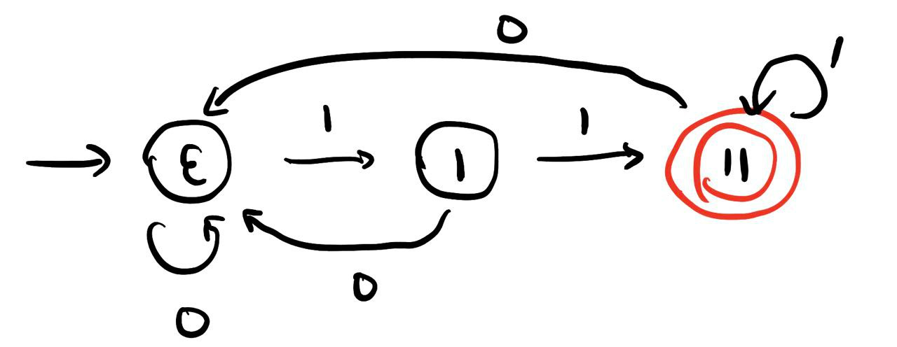
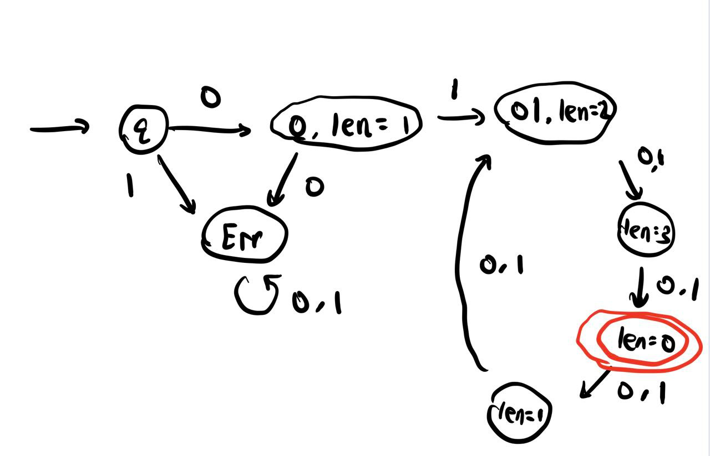
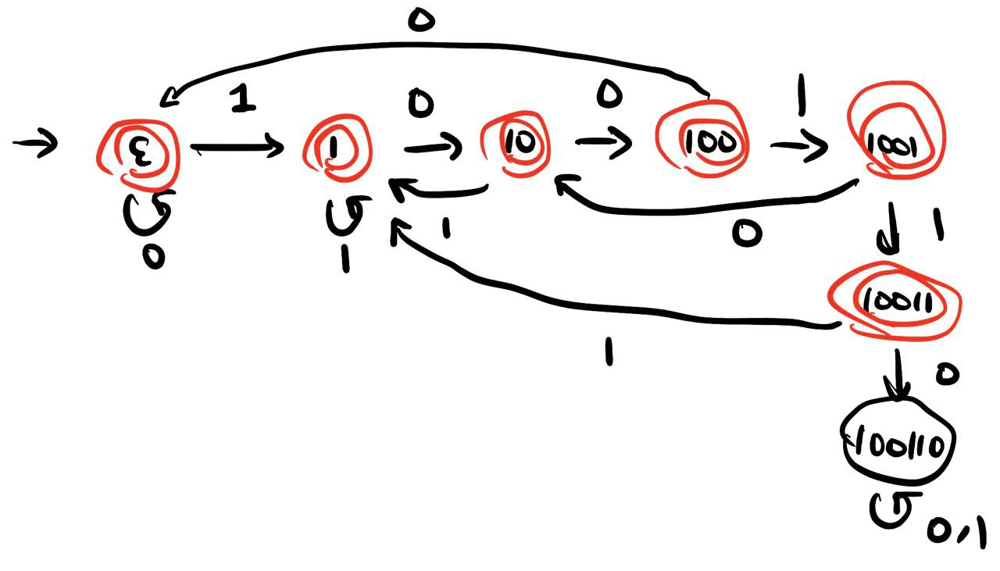

#### 2.

Accepted state is marked in red.

##### (a)

If the state is `11`, that means the `11` is the suffix of the string that the DFA has read so far. Otherwise, the state is the longest suffix of the string that passed into the DFA so far that is also a prefix of the `11`. 

##### (b)

The `Err` state means the DFA goes into a unaccepted state, and will always stay in this state. The `len` means $|s| \% 4$, where $s$ is the current string read so far by DFA, and $\%$ means the modulo operator. The, $\varepsilon$,  `0`, `01` means the current string read by DFA. 

##### (c)

If the state is `100110`, that means we have already read the substring `100110`. Otherwise, the state is the longest suffix of the string that passed into the DFA so far that is also a prefix of the `100110`. 

##### (d)

Define such DFA machine $M = (Q, \Sigma, \delta, \text{start}, A)$, where

* $\Sigma$ is the set of symbols that $s=a_1a_2...a_k$ defined in. 
* $Q = \{t \ |\ t\in \Sigma^*, |t| \le k \}$ (any string over $\Sigma$ that have length less than or equal to $k$)
* $\text{start}$ = $\varepsilon$
* $A = \{ s \}$
* $\delta(t, a)$
  * If $|t| < k$, $\delta(t, a) =ta$
  * If $|t| = k$
    * If $t = s$, $\delta(t, a) = t = s$
    * If $t \neq s$, write $t = bw$, $b \in \Sigma$. $\delta(t, a) = wa$

The DFA stores the suffix $t$ of the string $w$ it has read so far, the suffix $t$ has length $\min(|w|, k)$. If the such suffix $t = s$, that means we have already read the string $s$ (the string we want to see). 

Since the states have all the string that have length less than or equal to $k$. For length $l$, there are $|\Sigma|^l$ amount of states, and thus the total number of states is
$$
\sum_{i = 0}^k |\Sigma|^i = \frac {|\Sigma|^{k+1} - 1}{k - 1}
$$
(the $|\Sigma|^0, |\Sigma|^1, |\Sigma|^2...|\Sigma|^k$ is a geometric series).

##### (e)

$Q = \{(q_1, q_2, q_3, q_4) \ | \ q_1 \in Q_1, q_2 \in Q_2, q_3 \in Q_3, q_4 \in Q_4 \}$

$s = (s_1, s_2, s_3, s_4)$

$\delta(t, a)$: write $t = (t_1, t_2, t_3, t_4)$. $\delta(t, a) = (\delta_1(t_1, a), \delta_2(t_2, a), \delta_3(t_3, a), \delta_4(t_4, a))$  
$$
A = \{(a_1, a_2, a_3, a_4) \ | \ ((a_1 \in A_1) \text{ and } (a_2 \notin A_2) \text{ and } (a_3 \notin A_3) \text{ and } (a_4 \notin A_4)) \text { or } \\
((a_1 \notin A_1) \text{ and } (a_2 \in A_2) \text{ and } (a_3 \notin A_3) \text{ and } (a_4 \notin A_4)) \text { or } \\
((a_1 \notin A_1) \text{ and } (a_2 \notin A_2) \text{ and } (a_3 \in A_3) \text{ and } (a_4 \notin A_4)) \text { or } \\
((a_1 \notin A_1) \text{ and } (a_2 \notin A_2) \text{ and } (a_3 \notin A_3) \text{ and } (a_4 \in A_4))
\}
$$
(we could also write the condition part in $A$ as $((a_1 \in A_1) \text{ xor } (a_2 \notin A_2) \text{ xor } (a_3 \notin A_3) \text{ xor } (a_4 \notin A_4)) $)

