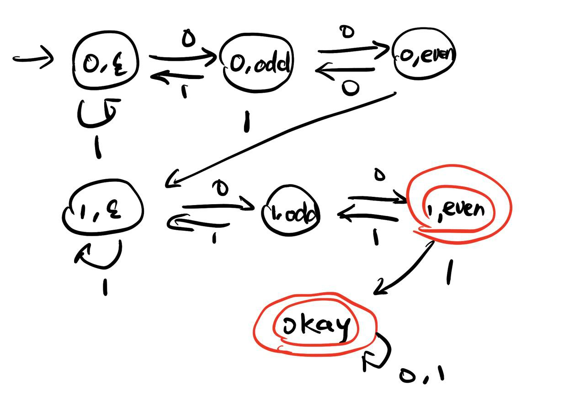
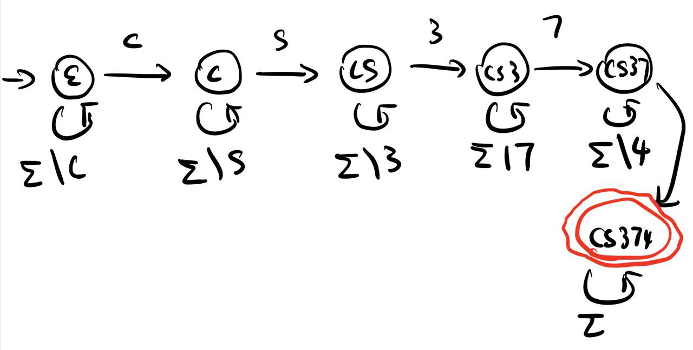

##### (a)

The first entry ($0, 1, 2$) in the state means the number of blocks 0s of even length the NFA have so far matched. The second entry indicates the property of currently matched blocks of 0s. The $\epsilon$ that there is no currently matched block of 0s, the odd / even means that the length of current matched blocks of 0s is odd /even, respectively.

##### (b)

The 'cs374' means the machine have already read the cs374 subsequence in the given string. Otherwise, the state is the subsequence that is the longest prefix of the cs374 that NFA have read so far.

##### (c)

$s = (s_1, s_2)$

$A = \{(a_1, a_2) \ | \ a_1 \in A_1, a_2 \in A_2 \}$

