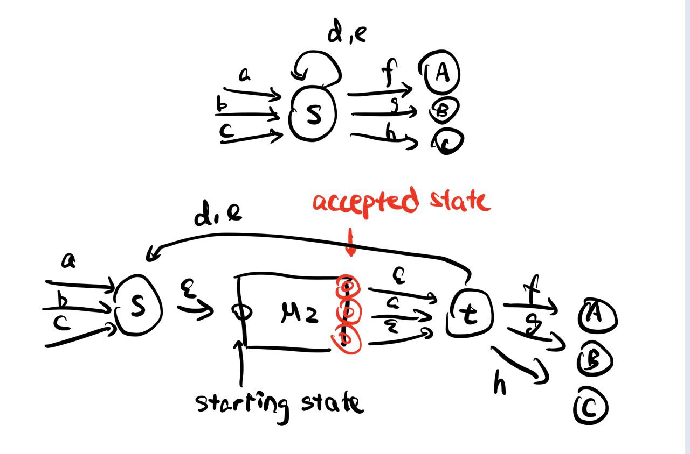
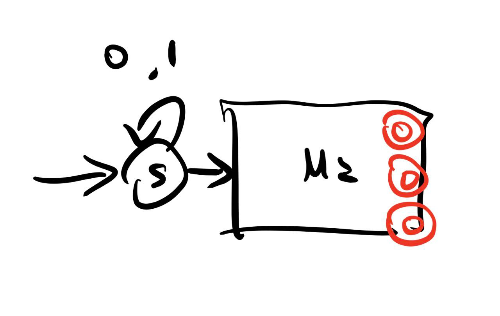

$$
\def\V{\text{V}}
\def\A{\text{A}}
\def\mA{\text{mA}}
\phantom {derivatives}
\newcommand\d{\text{d}}
\def\ffrac(#1/#2){\frac{#1}{#2}}
\def\hfrac #1(#2/#3){\ffrac (#1#2/#1#3)}
\def\deri#1/#2;{\hfrac \d(#1/#2)}
\def\dderi#1/#2;{\nderi #1/#2^2; }
\def\nderi#1/#2^#3;{\ffrac (\d^#3 #1/\d #2^#3)}
\def\derin #1;{\deri /#1;}
\def\pderi#1/#2;{\hfrac \part(#1/#2) }
\def\ppderi#1/#2;{\npderi #1/#2^2;}
\def\npderi#1/#2^#3;{\ffrac (\part^#3 #1/\part #2^#3)}
\def\pderin1/#1;{\ffrac (\part / \part #1)}
\def\fac #1/#2;{\frac{#1}{#2}}

\phantom {fraction}
\def\inv#1{\ffrac (1/#1)}
\newcommand\invsqrt[1]{\frac{1}{\sqrt{#1}}}
\newcommand\half{\frac{1}{2}}
\newcommand\tri{\frac{1}{3}}
\newcommand\quar{\frac{1}{4}}
\phantom {vectors}
\newcommand\vfunc[2]{}

\phantom {common vectors}
\def\vfn #1(#2){\vec #1(\vec #2)}
\def\v #1{\vec #1}
\newcommand\vf{\v f}
\newcommand\vx{\v x}
\newcommand\vy{\v y}
\newcommand\vz{\v z}
\newcommand\vr{\v r}
\newcommand\vv{\v v}
\newcommand\va{\v a}
\newcommand\vtheta{\v \theta}
\newcommand\vphi{\v \phi}
\newcommand\vs{\v s}

\phantom {randomstaff}
\def\tsub#1;{_{\text {#1}}}
\def\sub#1;{_{#1}}
\def\(#1);{\left(#1\right)}
\def\intl#1;{\int_{#1}}
\def\intlh#1;#2;{\int_{#1}^{#2}}
\def\sup#1;{^{#1}}
\def\tsup#1;{^{\text{#1}}}
\def\align[[#1]]{\begin{align*}#1\end{align*}}
\def\note#1!{\fbox{$#1$}}
\def\.#1|;{\left.#1\right|}
\def\ssqrt/#1/;{\sqrt{#1}}
\def\noteeq#1!#2!{\begin{equation} \label{eq:#2} \fbox{$#1$}\end{equation}}
\def\raf#1;{\ref{#1}}
\def\eqraf#1;{\eqref{#1}}
\def\dfac#1/#2;{\dfrac{#1}{#2}}
\def\sqt#1/;{\sqrt{#1}}
\def\sgrt#1/>{\sqrt{#1}}
\def\txt#1;{\text{#1}}
\def\const{\text{const}}
\def\eq#1!#2!{\begin{equation} \label{eq:#2} #1 \end{equation}}
\def\kg{\txt kg;}
\def\s{\txt s;}
\def\m{\txt m;}
\def\stwo{\txt s;^2}
\def\iv#1;{\inv{#1}}
\def\sumninfin{\sum\sub n=1;\sup\infin;}
\def\sumninfinz{\sum\sub n = 0;\sup\infin;}
\def\intinfin{\int\sub-\infin;\sup\infin;}
\def\cases[[#1]]{\begin{cases}#1\end{cases}}
$$

#### Problem 2

##### (a)

We could do product construction of two machine, we modify the $M_1$ in the following way:

that is, the every transition in the $M_1$ will be inserted with a $M_2$ so that the string in $M_2$ could be plugged into the machine. This, however, does not constrain the number of the string in $M_2$ that could appear. We design another machine that accept the string with the substring that in $M_2$ only appeared once. 

The illustration show above is a machine ($A$) that accept the string if any of its substring is in $M_2$. We could negate the machine to have a machine that doesn't accept any string if it has a substring in $M_2$. We could do contatenation with these two machine, then the machine will accept the string with the substring that in $M_2$ only appeared once. Do production construction of these two machines (the modified $M_1$ and this one) we will get the NFA we wanted.

##### (b)

>In this second part you will give a different proof. Let $r_1$ be a regular expression for $L_1$ and $r_2$ be a regular expression for $L_2$, that is $L_1 = L(r_1)$ and $L_2 = L(r_2)$. We will develop a recursive algorithm that given $r_1$ and $r_2$ constructs a regular expression $r'$ such that $L(r') = \text{insert}(L_1, L_2)$. No correctness proof is required but a brief explanation of the derivation would help you get partial credit in case of mistakes

###### (i)

>For each of base cases when $r_1 = \empty, \epsilon, a$ ($a \in \Sigma$), describe a regular expression for $\text{insert}(L(r_1), L(r_2))$ in terms of $r_2$ and the letters in $\Sigma$.

* If $r_1 = \epsilon$, that actually means $L(r_1) = \{ \epsilon \}$. So, $\text{insert}(L(r_1), L(r_2))$ means insert the string in $L_2$ into the $\epsilon$. Then the regular expression is just $\note r' = \epsilon r_2 \epsilon  = r_2!$.

* If $r_1 = a$, then to insert the string in $L_2$ into either before or after $a$. That is, the regular expression is
  $$
  \note  r' = \epsilon a r_2 + r_2 a \epsilon  = a r_2 + r_2 a !
  $$

* If $r_1 = \empty$, then $L(r_1) = \empty$. There is no string in language $L(r_1)$ and we thus couldn't insert any string in $L_2$ into $L_1$. Thus $\note r' = \empty !$

###### (ii)

>Suppose $r_1 = s + t$ where $s$ and $t$ are regular expressions. Moreover let $s'$ be a regular expression for $\text{insert}(L(s), L(r_2))$ and $t'$ be a regular expression for $\text{insert}(L(t) , L(r_2))$. Describe a regular expression for the language $\text{insert}(L(r_1), L(r_2))$ using $r_2$, $s$, $t$, $s'$, $t'$.

The $L(r_1)$ either satisfies the regular expression $s$ or $t$. In each cases, we already have the regular expression that tells us how to insert string of $L(r_2)$ into it (namely, $s'$ and $t'$). Therefore, $r' = s' + t'$. 

###### (iii)

>Same as previous part but now consider $r_1 = st$.

Using the assumption as **(ii)**, that is, define $s' = \text{insert}(L(t) , L(r_2))$ and $t' = \text{insert}(L(t) , L(r_2))$. $r_1 = st$ means a string that first satisfies regular expression $s$ and then $t$. We could either insert the string in $L_2$ into the $s$ part or $t$ part. (we could also insert the string into the "space" between $s$ and $t$ / or before $s$ / after $t$, these cases are already handled by $s'$ and $t'$, so we doesn't to consider them additionally). Therefore, the regular expression looks like
$$
\note r' = s't + st' !
$$
  which corresponding to insertion into either $s$ part or $t$ part.

###### (iv)

>Same as previous part but now consider $r_1 = (s)^*$.

Using the assumption as **(ii)**, that is, define $s' = \text{insert}(L(t) , L(r_2))$. We could rewrite the $r_1$ as $r_1 = \epsilon + s(s)^*$ (this explicitly distinguishes the $\epsilon$ case). We know that from part **(i)** that $r_{\epsilon} = \epsilon$ has $r'_{\epsilon} = r_2$. So we only need to consider the case of $r\tsub other; = s(s)^*$. This regular expression represents all the string that have $1$ or unlimited pattern of $s$. (namely $s+$). Then we could pick any one of $s$ from the $r\tsub other;$, and insert the string represented by $r_2$ into it. The resulted regular expression thus looks like $r\tsub other;' = (s)^*s'(s)^*$. Combine all cases, we get
$$
\note r' = r_2 + (s)^* s'(s)^*!
$$

###### (v)

We use some shorthand for clarity: for a regular expression $s$, define $L(s') = \text{insert}(L(s), L_2)$. We first calculate some pattern that will used later:
$$
0' = 0(101) + (101)0 \\
1' = 1(101) + (101)1 \\
\align[[
 (01)' &= 0'1 + 01' \\
 	   &= 0(101)1 + (101)01 + 01(101) + 0(101)1 \\
       &= 01011 + 10101 + 01101
]]
$$
and then
$$
(0^*)' = 0^* 0'0^* + 101 = 0^*(0101 + 1010)0^* + 101\\
(1^*)' = 1^* 1'1^* + 101 = 1^*(1101+ 1011)1^* + 101
$$
We consider the part $011^* 0$ first (it is complicated):
$$
(011^*0)' = (011^*)'0 + (011^*)0' =  ((01)'1^* + 01(1^*)')0 + (011^*)(0101 + 1010) \\
=(01011 + 10101 + 01101)1^*0 + 01(1^*(1101+ 1011)1^* + 101) + (011^*)(0101 + 1010)
$$
We then used the algorithm described above for $r_1$:
$$
(r_1)' = (0^* + (01)^* + 011^*0)' \\
= (0^*)' + ((01)^*)' + (011^*0)' \\
= 0^*(0101 + 1010) 0^* + (01)^*(01)'(01)^* + 101 +(011^*0)' \\
= 0^*(0101 + 1010) 0^* + (01)^*(01011 + 10101 + 01101)(01)^* + \\101+ (01011 + 10101 + 01101)1^*0 + 01(1^*(1101+ 1011)1^* + 101) + (011^*)(0101 + 1010)
$$
it's complicated.

