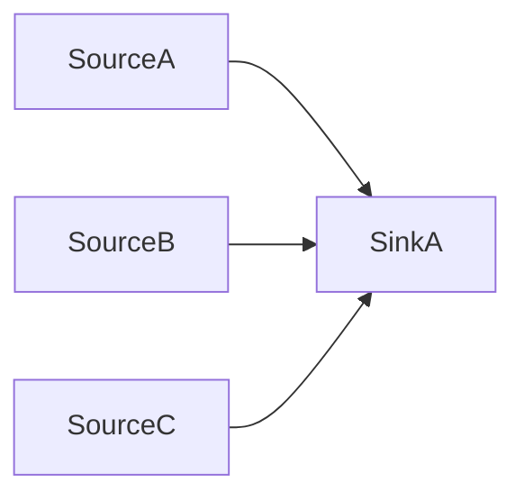
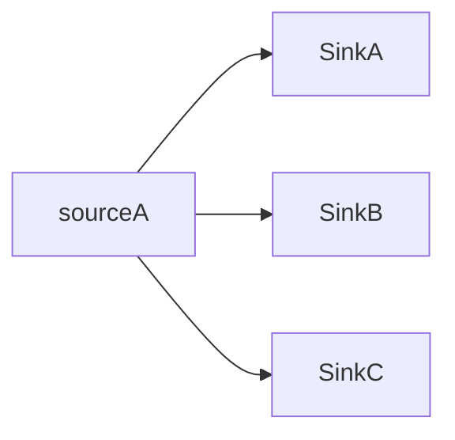

>`a <- b` means assign value `b` to `a` while `a = b` is a boolean expression that compares the value of `a` and `b`. (This is different from the common programming language)
>
>The `SCC(G)` is the algorithm mentioned in the page 13 of Chapter 6 of the textbook. It gives the strong component graphs.
>
>`Out(u)` means the number of out-going edge from the current node `u`. `In(u)` is the number of in-going edge to to the current code.
>
>`|Array|` means the size of the array.

##### (a)

```pseudocode
Solution(G, k):
	DAGs <- SCC(G)
	
	if DAGs has more than one component:
		return false
		
	foreach u in V(DAGs):
		if |Out(u)| = 0:
			do DFS(Reverse(DAGs)) starting from u, put reachable vertices in T.
			return |T| = V and Count(u) >= k
```

Note, the reason why we return false when `DAGs` has more than one component because in this case it means that original $G$ itself exists node that couldn't reach all nodes. (Think two components in $G$, there muse be some unhappy node). 

The `Count(u)` is the corresponding strong component in $G$ of the meta-node $u$ (i.e. the number of node in $G$ that get contracted into current node $u$). 

We see that initially we use `SCC(G)` which takes $O(V + E)$ times. For $Dags = (V', E')$, in the worst case $|V'| = |V|$ and $|E'| = |E|$.  and then  we see that the code inside the `if` block in the for loop only get executed exactly one time, and inside it we do a `DFS` algorithm on $Dags$ which uses $O(V+E)$ times, and the `if` condition check takes $O(V)$ since we iterate over each node in $Dags$. So, the total time complexity is $O(V+E)$

##### (b)

$$
\def\reach{\text{reach}}
$$

```pseudocode
Solution(G):
	DAGs <- SCC(G)
	
	sink <- 0
	source <- 0
	foreach u in V(DAGs):
		if |Out(u)| = 0:
			sink <- sink + 1
		if |In(u)| = 0:
			source <- source + 1
	
	if sink = 1 and source = 1:
		return true
	if sink = 1 and source = 2:
		return true
	if sink = 2 and source = 1:
		return true
	if sink = 2 and source = 2:
		return true
	
	return false
```

##### Time Complexity

The `SCC` take $O(V + E)$ as proved in the lecture. For $Dags = (V', E')$, in the worst case $|V'| = |V|$ and $|E'| = |E|$. Since we iterate over all vertices in $Dags$, it takes $O(V)$. Other operations only takes $O(1)$. Then the total time complexity is $O(V + E)$, a linear runtime as expected.

##### Proof of Correctness

Since `SCC` function already make $G$ into $Dags$ where original node that are strongly connected are encapsulated in a meta-node in $Dags$, the problem of making the node in the $G$ all strongly connected is equivalent to the problem of making the meta-node in $Dags$ all strongly connected. So we only to think about whether adding 1 or 2 edge(s) could make the meta-node $Dags$ all strongly connected.

There are only four cases where we could make $Dags$ strongly connected by adding only $1$ or $2$ edge(s). They are discussed below:

When there is only one sink $s$ and one source $r$, then $u \in \reach(r)$ and $s \in \reach(u)$ for all $u \in V(Dags)$. Connect $s$ and $r$. Then $v \in \reach(u)$ for every for all $u, v \in V(Dags)$ because we have $s \in \reach(u)$ and $r \in \reach(s)$ and $v \in \reach(r)$. 


When there is two sink $s_1$ and $s_2$ and one source $r$. Then for all $u \in V(Dags)$:

* $u \in \reach(r)$
* At least one of $s_1 \in \reach(u)$ or $s_2 \in \reach(u)$ is true 

Connect $s_1 \to r$ and $s_2 \to r$. Then $v \in \reach(u)$ for all $u, v \in V(Dags)$ since

* if we have $s_1 \in \reach(u)$, Then we know $r \in \reach(s_1)$ and $v \in \reach(r)$. Therefore $v \in \reach(u)$
* If we have $s_2 \in \reach(u)$, Then we know $r \in \reach(s_2)$ and $v\in \reach(r)$. Therefore $v \in \reach(u)$


When there is two source $r_1$ and $r_2$ and one sink $s$. Then for all $u \in V(Dags)$

* At least one of $u \in \reach(r_1)$ or $u \in \reach(r_2)$ is true
* $s \in \reach(u)$

Connect $s \to r_1$ and $s \to r_2$.  Then $v \in \reach(u)$ for all $u, v \in V(Dags)$ since

* If we have $u \in \reach(r_1)$, then we know that $s \in \reach(u)$ and $r_1 \in \reach(s)$, and if $v \in \reach(r_1)$ we are done. Otherwise it must be true that $v \in \reach(r_2)$ and since we know that $r_2 \in \reach(s)$ we are also done.
* If we have $u \in \reach(r_2)$, then we know that $s \in \reach(u)$ and $r_2 \in \reach(s)$, and if $v \in \reach(r_2)$ we are done. Otherwise it must be true that $v \in \reach(r_1)$ and since we know that $r_1 \in \reach(s)$ we are also done.


When there is two sink $s_1$ and $s_2$ and two sources $r_1$ and $r_2$. Then for all $u \in V(Dags)$

* At least one of $u \in \reach(r_1)$ or $u \in \reach(r_2)$ is true
* At least one of $s_1 \in \reach(u)$ or $s_2 \in \reach(u)$ is true

Without loss of generality, let's suppose $s_1 \in \reach(r_1)$ and $s_2 \in \reach(r_2)$. Then we connect $s_2 \to r_1$ and $s_1 \to r_2$. Then $v \in \reach(u)$ for all $u, v \in V(Dags)$ since

* If we have $s_1 \in \reach(u)$, Then we know that $r_2 \in \reach(s_1)$, and if $v \in \reach (r_2)$, we are done. Otherwise, we know that it must be true that $v \in \reach(r_1)$ and we know that $s_2 \in \reach (r_2)$ and that $r_1 \in \reach(s_2)$ and we are done.
* If we have $s_2 \in \reach(u)$, Then we know that $r_1 \in \reach(s_2)$, and if $v \in \reach (r_1)$, we are done. Otherwise, we know that it must be true that $v \in \reach(r_2)$ and we know that $s_1 \in \reach (r_1)$ and that $r_2 \in \reach(s_1)$ and we are done.

So we see that the above case works, we will show that all other cases won't work.

When there is one sink and three source, there are some cases we may not make $G$ strongly connected. Here is one



When there is three sink and one source, there are some cases that we may not make $G$ strongly connected by only adding two additional edges:



Similarly, when we have $n$ sink and $m$ source where at least $n$ or $m$ is bigger than 2, in this case we may not make $Sags$ strongly connected by only adding two additional edges.

* If $n = m$, then in there is one example $Dags$ where there are only $n + m$ nodes ($n$ sinks and $m$ sources) and $n$ edge these edge are:
  * $r_i \to s_i$  where $i \in [0, n]$ and $r_i$  is i-th source and $s_i$ is i-th sink

* If $n > m$, then in there is one example $Dags$ where there are only $n + m$ nodes ($n$ sinks and $m$ sources) and $n$ edge, these edge are
  * $r_i \to s_i$, where $i \in [0, m]$ and $r_i$ is i-th source and $s_i$ is i-th sink.
  * $r_m \to s_i$, where $i \in [m+1, n]$ and $r_m$ is the m-th source and $s_i$ is the i-th sink.
* If $n < m$, then in there is one example $Dags$ where there are only $n+ m$ nodes ($n$ sinks and $m$ sources) and $m$ edge, these edge are
  * $r_i \to s_i$, where $i \in [0, n]$ and $r_i$ is i-th source and $s_i$ is i-th sink.
  * $r_i \to s_n$, where $i \in [n+1, m]$ and $r_m$ is the m-th source and $s_i$ is the i-th sink.

Then we see that only when $n = 1, m = 1$ or $n = 2, m = 1$ or $n = 1, m = 2$, $n = 2, m = 2$.

