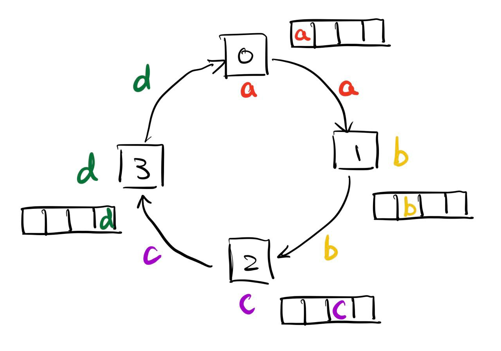
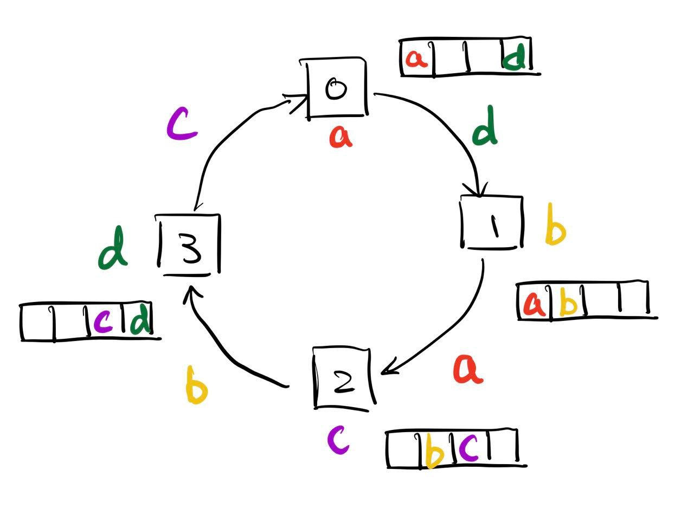
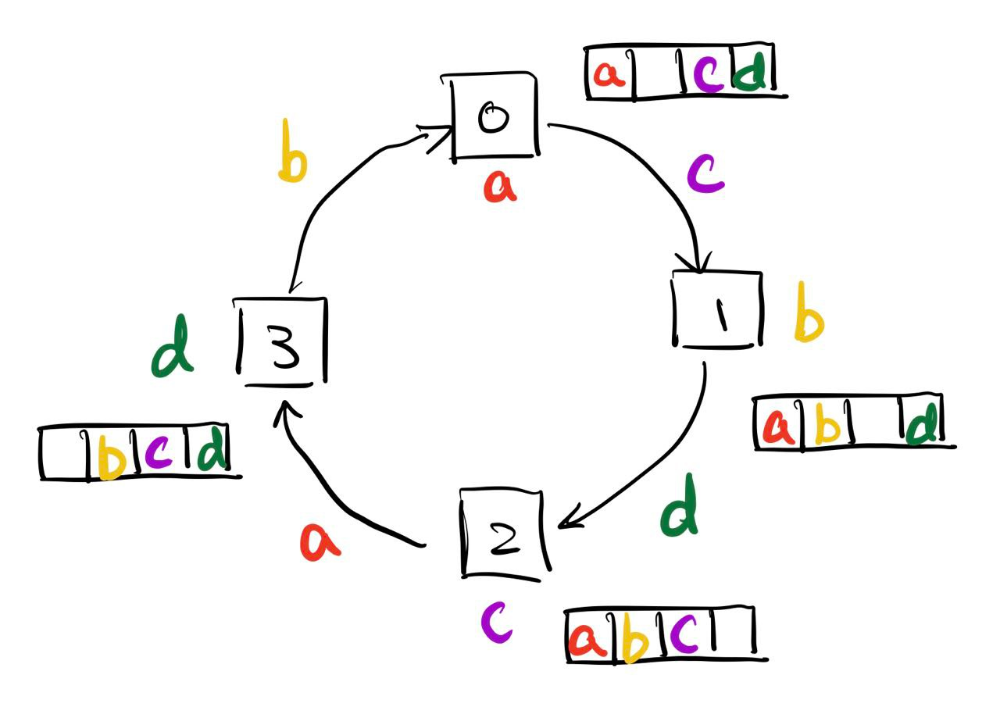
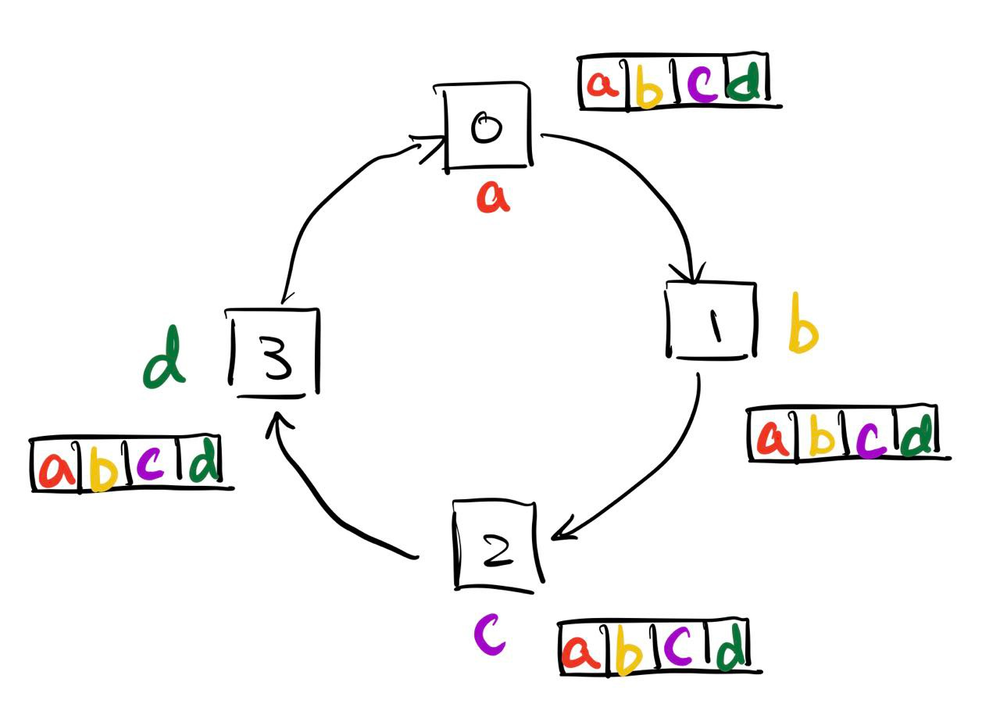

#### Explanation

##### Notice

First, since we could assume that `sendtype` and `recvtype` will only be `MPI_INT`, then the original function

```c
My_Allgather(
    const void* sendbuf, int sendcount, MPI_Datatype sendtype,
    void* recvbuf, int recvcount, MPI_Datatype recvtype,
    MPI_Comm comm
)
```

could actually just be reduced to

```c
My_Allgather_Int(
	const void* sendbuf, int sendcount,
    void* recvbuf, int recvcount,
    MPI_Comm comm
)
```

and they have no difference (the latter will be used through the homework).

##### Small Example

Suppose we have 4 processes, they store `a`, `b`, `c` and `d`, respectively. They first need to put their own data `sendbuf` into their own `recvbuf`. Then, they do following operation (the arrow indicates the data being sent):



and then:



and then:



and in the end:



We could see that for `Process 0`, it does the following:

* Iteration `0`: receive `d` from `Process 3`, and send `a` to `Process 1`
* Iteration `1`: receive `c` from `Process 3`, and send `d` to `Process 1`
* Iteration `2`: receive `b` from `Process 3`, and send `c` to `Process 1`

From this small example, we see that each process only communicates two neighbors. Given the current process `rank` and total number of processes `count`, it communicates to its `forward_neighbor` which has rank `(rank + 1) % size`, and `backward_neighbor` which has rank `(rank - 1 + size) % size`. We see that for this particular example, the for loop execute for `size - 2` iterations, and that in each iteration `i`, it sends `(rank - i + size) % size ` element, and receives the `(rank - i - 1 + size) % size`. Note that after each iteration, we must use `MPI_Barrier` to synchronize all processes, this ensures that the data that is going to send in next iteration is available.

##### Caveats

The core logic is explained above. However, notice that for the operation explained above, we couldn't just use `recvbuf` passed as parameter to store the data we receive from other processes, what if, say in the example above, all the processes has `sendcount = 4`, the `Process 1` only have `recvcount = 2` but `Process 2` have `recvcount = 3`. Then, the data that go to `Process 2`  via the transfer in `Process 1` will be limited to only have size `2` data, which is less than the size `3` data required by `Process 2`. In other words, we lost some data if we just use `recvbuf`.

Therefore, notice few implication in the function itself:

* For all processes, `max(recvcount) <= min(sendcount)`, you cannot call the function with `sendcount` less than `recvcount`. What does that mean if you want to more than you could possibly get ? (This will result in `undefined` behavior).
* `size(sendbuf) = sizeof(int) * sendcount`
* `size(recvbuf) = process_count * sizeof(int) * recvcount`

Using this, we see that we could first use a `recv_tmp_buf` to store the data we did in the ring communication, and then after all that finished, we could copy the data `recv_tmp_buf` according to the `recvbuf`. The size `size(recvbuf)` should equal to `process_count * sizeof(int) * max_recvcount`. Therefore, we need to first calculate `max_recvcount`, this could be done just by applying the ring communication again. That means we need to do the ring communication twice, first to calculate the `max_recvcount`, and second time to actually transfer the data.

#### Code

Note: this code use the macros

```c
#define max(a,b) ((a)>(b)?(a):(b))
```

and it uses

```c
#include <stdlib.h>
#include <string.h>
```

for `malloc`, `free`, and `memcpy`. The code is down below

```c
void My_Allgather_Int(
    const void* sendbuf, int sendcount, 
    void* recvbuf, int recvcount,
    MPI_Comm comm
) {
    int rank, size;
    MPI_Comm_rank(comm, &rank);
    MPI_Comm_size(comm, &size);

    // we want to know the max(recvcount) of all processes
    // use ring communication to gather the data
    // we will use MPI_Sendrecv to implement the ring communication
    // we will use MPI_Barrier to make sure the data is ready
    int* recv_count_array = (int*) malloc(sizeof(int) * size);

    // move the itself's recvcount to the right position
    recv_count_array[rank] = recvcount;

    for (int i = 0; i < size - 1; i++) {
        MPI_Sendrecv(
            recv_count_array + (rank - i + size) % size, 1, MPI_INT,
            (rank + 1) % size, 0,
            recv_count_array + (rank - i - 1 + size) % size, 1, MPI_INT,
            (rank - 1 + size) % size, 0,
            comm, MPI_STATUS_IGNORE
        );
        MPI_Barrier(comm);
    }

    // calculate the max(recvcount) of all processes
    int max_recv_count = 0;
    for (int i = 0; i < size; i++) {
        max_recv_count = max(max_recv_count, recv_count_array[i]);
    }

    // free the recv_count_array
    free(recv_count_array);

    // cast the sendbuf and recvbuf to int*
    int* sendbuf_int = (int*)sendbuf;
    int* recvbuf_int = (int*)recvbuf;
    int* recv_tmp_buf_int = (int*) malloc(sizeof(int) * max_recv_count * size);

    // move itself's data to the right position
    memcpy(recv_tmp_buf_int + rank * max_recv_count, sendbuf_int, sizeof(int) * max_recv_count);

    for (int i = 0; i < size - 1; i++) {
        MPI_Sendrecv(
            sendbuf_int + (rank - i + size) % size, max_recv_count, MPI_INT,
            (rank + 1) % size, 0,
            recv_tmp_buf_int + (rank - i - 1 + size) % size, max_recv_count, MPI_INT,
            (rank - 1 + size) % size, 0,
            comm, MPI_STATUS_IGNORE
        );
        MPI_Barrier(comm);
    }

    // copy the data from recv_tmp_buf_int to recvbuf
    for (int i = 0; i < size; i++) {
        memcpy(recvbuf_int + i * recvcount, recv_tmp_buf_int + i * max_recv_count, sizeof(int) * recvcount);
    }

    // free the recv_tmp_buf_int
    free(recv_tmp_buf_int);
}
```

