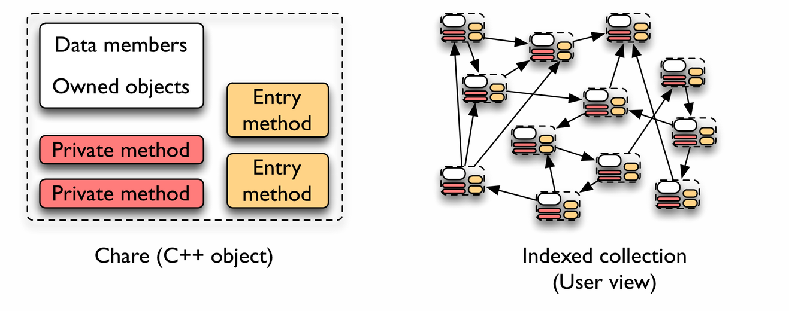
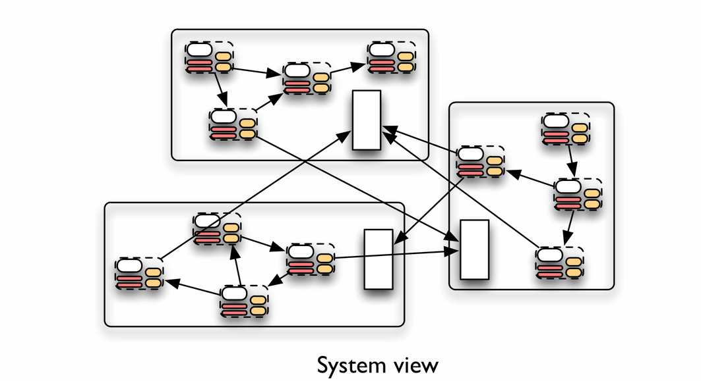

#### Matrix Problem

##### (a)

We want to traverse it row-wise. Since we know that the matrix does not fit in the cache, if we traverse it column-wise, by the time we reach the end row and go back to the first row, the cache for the first row will already be written by other data. In comparison, the row-wise traverse elements that maintains the spatial locality, and this will increase the hit ratio.

##### (b)

In the GPU, however, each thread should work on a particular column. So that

* Thread 0: 0, 4, 8, 12
* Thread 1: 1, 5, 9, 13
* Thread 2: 2, 6, 10, 14
* Thread 3: 3, 7, 11, 15

We see that each thread first access `0, 1, 2, 3`, then `4, 5, 6, 7`, and so on. This will trigger the memory coalescing, and according to https://developer.nvidia.com/blog/how-access-global-memory-efficiently-cuda-c-kernels/, it said,

>The device *coalesces* global memory loads and stores issued by threads of a warp into as few transactions as possible to minimize DRAM bandwidth

This could save some DRAM bandwidth. The row-wise access, however, could not trigger the memory coalescing because the data each thread access at one time is too far from each other. (`0, 4, 8, 12`, `1, 5, 9, 13` and so on). So, each thread should work on a particular column in this case.

#### Report

##### Charm++

**Charm++** is a object-oriented parallel programming framework. Instead of using process / thread as the basic computing unit, it provides an abstraction data structure called *chare*, which is a kind of C++ object (shown below).

In what we have learnt in the class, we dividing the work into different processes or threads using MPI or OpenMP and defining the communication between them. In the **Charm++**, the user divides ("abstracts") computation in each *chare*, and the communication between each *chare* could be done calling the asynchronous *entry method* in each chare. (see figure below), that is, the communication is done by the *messaging* between object in *OOP* paradigm. Then at runtime, the *Charm++ Runtime System (RTS)* will assign each *chare* to a *Processing Element (PE)*, which could either be a process or a thread. Each PE will store some metadata used for the messaging between chares, and the RTS will assign PEs to run on different CPUs and handle the communication between them. (figure below)



Below is an example of **Charm++** program that prints `Hello, Charm++`, each program start from a **Main** chare whose constructor entry method will be called by *PE* 0. The `CkMyPe()` returns the id of the *PE* the chare is currently running on. To exit the whole program, the `CkExit()` needs to be called.


```cpp
module hellocharm {
  mainchare Main {
    entry Main(CkArgMsg* msg);
    entry void sayHello();
  };

  // Main chare constructor
  mainchare Main {
    Main(CkArgMsg* msg) {
      if (CkMyPe() == 0) {
        sayHello();
      }
    }

    // Function to print "Hello, Charm++!"
    void sayHello() {
      CkPrintf("Hello, Charm++!\n");
      CkExit();
    }
  };
}
```

The `sayHello()` function in this case is defined in the `mainchare`, but it could also be defined in other *chares*. Furthermore, we could add some parameters to the `sayHello()` if we want, these parameter will be serialized, transferred, and deserialized to reach the other *chare*.

From this example, we see that in chare is essential to the abstraction provided in the **Charm++**. In **Charm++**, the chare is also *migratable*. This means that we could move a current running chare to another *PE*. The intelligent RTS that manages all the chares and PEs is also powerful feature in **Charm++**. Together, these enable a lot of functionality:

* Interleaved Execution for Independent Modules. Using traditional MPI or OpenMP, if we have written two programs, we couldn't interleave them without breaking the encapsulation. (Or we have to they will be executed with "space division" or "sequentialization"). But **Charm++** RTS and the *chare* abstraction make it possible to interleave different program (module) together.

* Automatic load balancing. There are different load balancer which are more intelligent than the `schedule()` in the OpenMP.
* Power / Energy Optimization. The RTS could migrate the chare from the CPUs that exceeds temperature threshold to reduce the extra cooling cost, and improve efficiency in many way.
* Portable Code. For different supercomputer architectures, the RTS is designed and tuned to run the code in most efficient way.

We see that the *RTS* system and the *chare* abstraction enable a lot of additional functionality in **Charm++** that makes it high-level and more advanced for large-scale system compare to the protocol we learnt in class. It's these features that make the **Charm++** important and stands out.

###### Reference

https://charmplusplus.org/ppt_pdfs/2_CharmConceptsAndBenefitsPDF.pdf

http://charmplusplus.org/

https://en.wikipedia.org/wiki/Charm%2B%2B

##### BLAS

**BLAS** (Basic Linear Algebra Subprograms) is originated from a Fortran library in 1979. It is designed in an attempt to standardize the commonly used low-level operation in linear algebra.

The **BLAS** has three levels:

* *Level 1*, vector-vector operations. Typically has time complexity of $O(n)$. These includes *dot product* (`xDOT`, `xDOTU`, `xDOTC`), *scalar multiplication* `xAXPY` and so on.
* *Level 2*, matrix-vector operations. Typically has time complexity of $O(n^2)$. These includes *vector-matrix multiplication* (`xGEMV`, `xGBMV`; `xTRSV` could multiply the vector with the inverse of the matrix).
* *Level 3*, matrix-matrix operations. Typically has time complexity of $O(n^3)$. These includes *matrix-matrix multiplication* (`xGEMM`, `xGBMM`, and so on).

It's organized according to the time each level comes out as well as the time complexity of the operations in each time.

The **BLAS** is important because it provides an *abstraction* of basic linear algebra operations. This technique is frequently used in the software engineering to create encapsulation. In the perspective of the developer who uses **BLAS**, their program / library written could be easily developed and ported to different architecture without worrying low-level details in specific computer architecture. Using same interface / protocol also make it easier to read and maintain the library. In the perspective of the maintainer of specific implementation of the **BLAS**, they could optimize their implementation on the specific computer architecture, and this abstraction enables them to change their implementation possibly in future if better computing method is found. 

Consider an extremely simple problem. There is a state of the system represented as an vector $v$, and the state transition matrix $A$, we want to calculate the next state of the system which is $b = Av$. If we implemented it, we need to consider whether the targeted system supports: (1) vector instruction like (AVX256 / AVX512). (2) multithreads (some embedded system might not have it). (3) GPU acceleration (4) possibly other specific accelerator. In the end, what we are going to write possibly looks like (pseudocode below), and we might use preprocessor in C to compile different code for different system, and the pseudocode for it looks like below

```c
#ifdef HAS_CUDA
// matrix multiplication using CUDA
#elseif HAS_AVX256_AND_MULTITHREAD
// possibly vectorized matrix multiplication using openmp and AVX256
#elseif HAS_AVX256
// vectorized matrix multiplication using AVX256
#else
// tiled matrix multiplication (tiling based on the system's cache parameters)
#endif
```

It's very complicated if the developer tries to optimized for different architecture, and the developer possibly couldn't pull better optimization than the chip manufacturer. In this case, if we write it using **BLAS** interface, it might just be (again, some pseudocode)

```pseudocode
xGEMV(0, A_rows, A_columns, 1, A, v, 1, NULL)
```

The `xGEMV` means the general multiplication between a matrix and a vector, and that's it, using **BLAS** is just as simple as that. Each system will have its own **BLAS** header and library file that is optimized for speed, so this code is guaranteed to use the architecture-optimized code. Since the **BLAS** library is usually provided by the specific chip manufacturer, for example, Intel has its *iMKL* that implements the BLAS interfaces and Nvidia has its *cuBLAS*, these manufacturer probably knows more low-level details and could optimize their BLAS library better than most of the developer. So, using **BLAS** is certainly better than to use more general parallel library / infrastructure we learnt in class.

###### Reference

https://netlib.org/blas/

https://en.wikipedia.org/wiki/Basic_Linear_Algebra_Subprograms