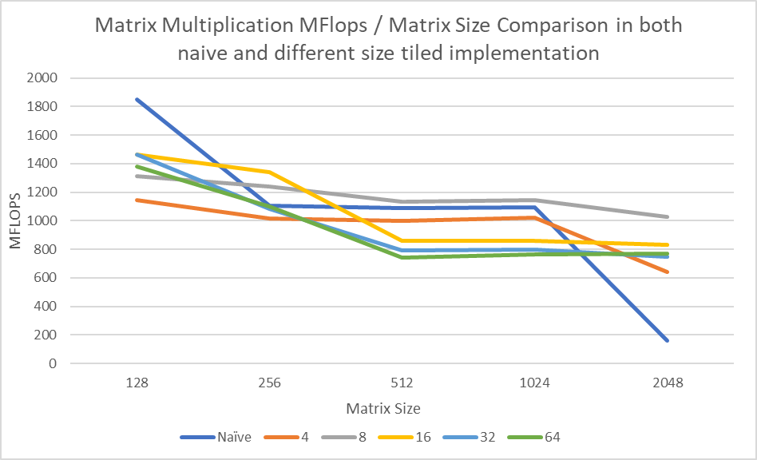

#### Short-Answer Questions

##### Question 1

we see that

```c
int memalign_result = posix_memalign(
        (void**)(&(target->data)),
        sysconf(_SC_LEVEL1_DCACHE_LINESIZE),
        sizeof(matrix_data_t)*row*col
);
```

If we look the `posix_memalign` function, we will find out that

>The function `posix_memalign() `allocates size bytes and places the address of the allocated memory in `*memptr`.  The address of the allocated memory will be a multiple of alignment, which must be a power of two and a multiple of `sizeof(void *)`.  This address can later be successfully passed to `free(3)`.  If size is `0`, then the value placed in `*memptr` is either `NULL ` or a unique pointer value.

We also see the `sysconf`. It get the cache line size of the `L1` cache. So, basically, the `posix_memalign` function align the matrix to the size `L1` cache. This make sure that when part of the matrix load into `L1` cache, the data is only stayed in one cache line (this makes sure the processor won't need to look two cache line just for this single data). The usage of cache line could increase the data lookup speed.

##### Question 2

The tiled version is faster because for the naïve version, you are always accessing one matrix in column major, and this will cause the cache line miss for big matrices for almost every data access. However, if we used tiled version, although we are still accessing one matrix in column major, we will get back to the second column before the cache line for first few rows get swapped / discarded for other data. This will increase our hit rate and look up speed. Therefore it's faster. This is, however, only significant on big matrix size (and for some better cpu with more cache line and larger cache size, the matrix need to be bigger to get noticed). For me, when the matrix reach size of `2048` I finally see a significant difference.

##### Question 3

I find out that tile size of `8` is the best. This corresponds to a cache line size of `8 * 8 = 64` bytes. I searched that a typical cache line size is `64` bytes. If we use tile size smaller or bigger than this, the performance will decrease as we move away from it.

##### Question 4

The code I use for this specific question is slightly different than the code in code section, it is:

```c
long matrixMultiply(matrix* m1, matrix* m2, matrix* result){
	// these are pointers, so use MATPTR_ELEMENT to access elements
  // set all elements of result to 0
  for (int i = 0; i < m1->row; i++) {
    for (int j = 0; j < m2->col; j++) {
      MATPTR_ELEMENT(result, i, j) = 0;
    }
  }

	for (int j = 0; j < m2->col; j++) {
	  for (int i = 0; i < m1->row; i++) {
		  for (int k = 0; k < m1->col; k++) {
				MATPTR_ELEMENT(result, i, j) += MATPTR_ELEMENT(m1, i, k) * MATPTR_ELEMENT(m2, k, j);
			}
		}
	}
	// calculate the ops, + * are considered 1 op, = is 0 ops
	return (long)m1->row * m1->col * m2->col * 2;
}

```

Changing the order of the `i` and `j` won't. But changing them with `k` indeed will. The original order `i` -> `j` -> `k` run about `600 MFLOPS`, but when the order change to something like `k` -> `j` -> `i`, the speed drops to `280 MFLOPS`. In this case, we are frequently accessing the result matrix with more line cache miss. This significantly reduce the speed.


#### Code

##### Naïve Implementation

```c
long matrixMultiply(matrix* m1, matrix* m2, matrix* result){
	// these are pointers, so use MATPTR_ELEMENT to access elements
	for (int i = 0; i < m1->row; i++) {
		for (int j = 0; j < m2->col; j++) {
			matrix_data_t sum = 0;
			for (int k = 0; k < m1->col; k++) {
				sum += MATPTR_ELEMENT(m1, i, k) * MATPTR_ELEMENT(m2, k, j);
			}
			MATPTR_ELEMENT(result, i, j) = sum;
		}
	}
	// calculate the ops, + * are considered 1 op, = is 0 ops
	return (long)m1->row * m1->col * m2->col * 2;
}
```

##### Tiled implementation

```c
long matrixTiledMultiply(matrix *m1, matrix *m2, matrix *result, int tileSize){
	int N1 = m1->row;
	int M1 = m1->col;
	int N2 = m2->row;
	int M2 = m2->col;

	// clear the result matrix
	for (int i = 0; i < N1; i++) {
		for (int j = 0; j < M2; j++) {
			MATPTR_ELEMENT(result, i, j) = 0;
		}
	}

	// assume the matrix is always the multiple of the tile size
	// so we don't need to check the last tile
	for (int i = 0; i < N1; i += tileSize) {
		for (int j = 0; j < M2; j += tileSize) {
			for (int k = 0; k < M1; k += tileSize) {
				for (int ii = i; ii < i + tileSize; ii++) {
					for (int jj = j; jj < j + tileSize; jj++) {
						for (int kk = k; kk < k + tileSize; kk++) {
							MATPTR_ELEMENT(result, ii, jj) += MATPTR_ELEMENT(m1, ii, kk) * MATPTR_ELEMENT(m2, kk, jj);
						}
					}
				}
			}
		}
	}

	return (long)m1->row * m1->col * m2->col * 2;
}
```

#### Plot



We could see, that in `2048` case, the tiled version finally works significantly better than the naive one. 