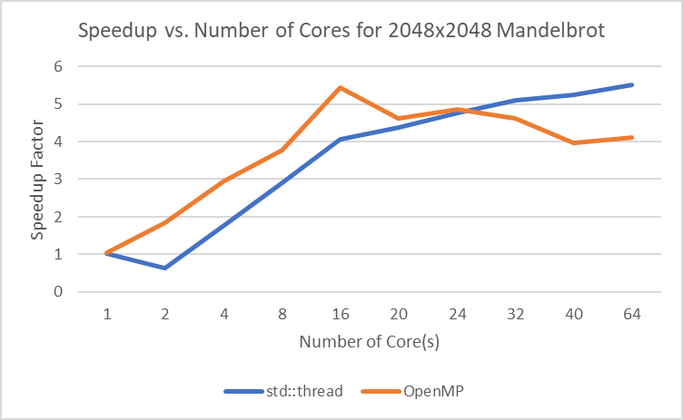
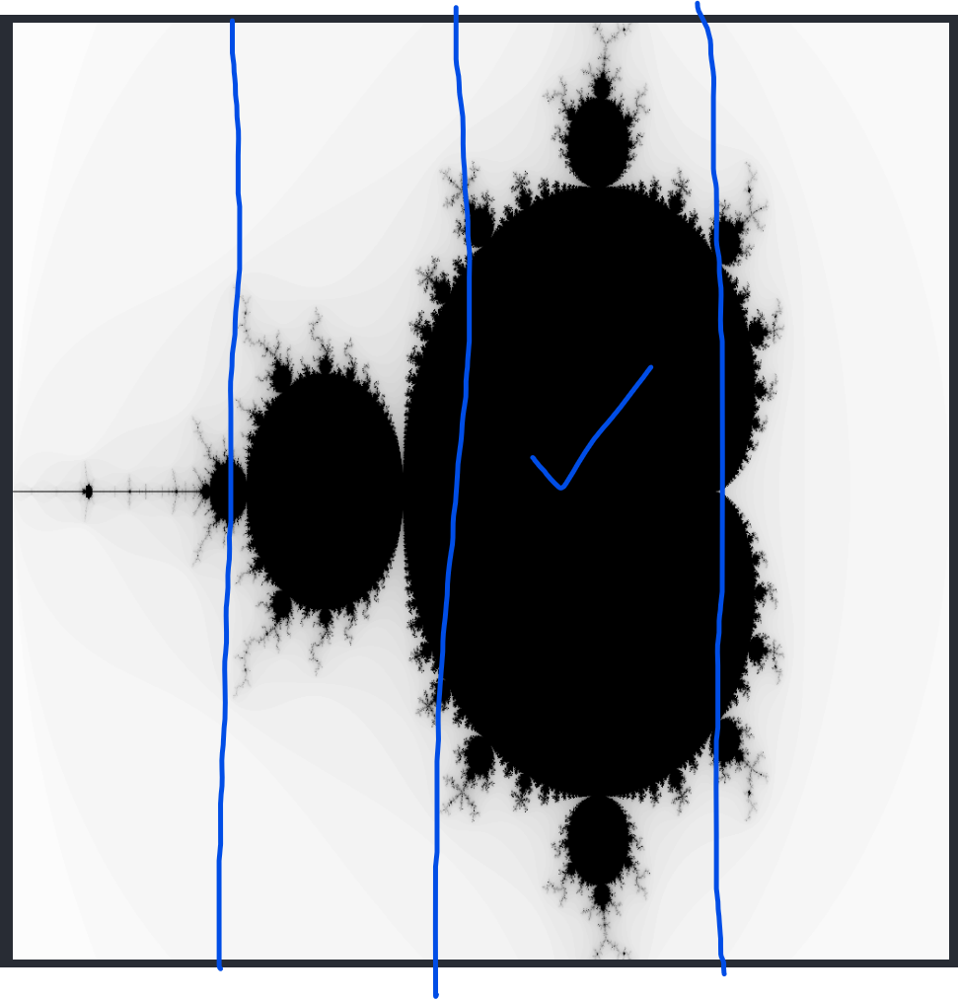

#### Question 1

```text
Generating mandelbrot with 4 core counts of size [256, 512, 1024, 2048, 4096]

The parallel version, with 4 core(s), ran for 0.0344197750092 s, a speedup of 1.457x.
The parallel version, with 4 core(s), ran for 0.1035400033 s, a speedup of 1.493x.
The parallel version, with 4 core(s), ran for 0.358206510544 s, a speedup of 1.620x.
The parallel version, with 4 core(s), ran for 1.37872773409 s, a speedup of 1.761x.
The parallel version, with 4 core(s), ran for 5.53766721487 s, a speedup of 1.930x.

The OpenMP version, with 4 core(s), ran for 0.0245840549469 s, a speedup of 2.040x.
The OpenMP version, with 4 core(s), ran for 0.0656417608261 s, a speedup of 2.356x.
The OpenMP version, with 4 core(s), ran for 0.217782497406 s, a speedup of 2.665x.
The OpenMP version, with 4 core(s), ran for 0.820213973522 s, a speedup of 2.960x.
The OpenMP version, with 4 core(s), ran for 3.59039503336 s, a speedup of 2.976x.
```

We see that increasing the data size increase the speedup factor for both parallel version and openMP version with 4 cores. 

The benchmark for data size 2048:

```text
Generating a 2048x2048 mandelbrot with core counts: [1, 2, 4, 8, 16, 20, 24, 32, 40, 64]
The serial version ran for 2.42755448818 s.

The parallel version, with 1 core(s), ran for 2.35598874092 s, a speedup of 1.030x.
The parallel version, with 2 core(s), ran for 3.80610799789 s, a speedup of 0.638x.
The parallel version, with 4 core(s), ran for 1.37872773409 s, a speedup of 1.761x.
The parallel version, with 8 core(s), ran for 0.833163201809 s, a speedup of 2.914x.
The parallel version, with 16 core(s), ran for 0.598658502102 s, a speedup of 4.055x.
The parallel version, with 20 core(s), ran for 0.555222272873 s, a speedup of 4.372x.
The parallel version, with 24 core(s), ran for 0.50867074728 s, a speedup of 4.772x.
The parallel version, with 32 core(s), ran for 0.476723015308 s, a speedup of 5.092x.
The parallel version, with 40 core(s), ran for 0.464000999928 s, a speedup of 5.232x.
The parallel version, with 64 core(s), ran for 0.441478967667 s, a speedup of 5.499x.

The OpenMP version, with 1 core(s), ran for 2.30726951361 s, a speedup of 1.052x.
The OpenMP version, with 2 core(s), ran for 1.3152872324 s, a speedup of 1.846x.
The OpenMP version, with 4 core(s), ran for 0.820213973522 s, a speedup of 2.960x.
The OpenMP version, with 8 core(s), ran for 0.644850254059 s, a speedup of 3.765x.
The OpenMP version, with 16 core(s), ran for 0.447225034237 s, a speedup of 5.428x.
The OpenMP version, with 20 core(s), ran for 0.525292992592 s, a speedup of 4.621x.
The OpenMP version, with 24 core(s), ran for 0.500332534313 s, a speedup of 4.852x.
The OpenMP version, with 32 core(s), ran for 0.526596009731 s, a speedup of 4.610x.
The OpenMP version, with 40 core(s), ran for 0.611480534077 s, a speedup of 3.970x.
The OpenMP version, with 64 core(s), ran for 0.591347277164 s, a speedup of 4.105x.
```

#### Question 2



#### Question 3

We see that when there is only `1` core, both the performance of `std::thread` and `OpenMP` version are almost identical with the serial version. This is expected since the difference in this case is only the overhead of creating new thread. 

As the `number_of_cores` increase, for both `std::thread` and `OpenMP` version, the general trend for their speedup factor is increasing. Their speed of increasing gradually goes down, this is consistent with `Amdahl's Law`. The performance with multiple thread is generally far better than single thread case (we could see it in graph).

However, the `std::thread` gradually increases and peaked at `64` cores, but the `OpenMp` version peaked at `16` cores and start decreasing slightly after that. One reason this is happening is that the `openMP` uses `guided` scheduler, which divide work depends on the amount of remaining work and number of threads. (General behavior is that the `guided` scheduler will first divide some part of the work into bigger chunks, and dispatch it to each thread, it later divide the remaining work depend of the load of each core to make the load as balance as possible). When the number of cores goes beyond `16`, the scheduler need to spend more time scheduling the work, and this overhead cause `openMP` version to become slower even if the number of cores increases.

If we examine the `mandelbrot` function we see that number of iteration for different `x` and `y` varies greatly. Most of time it is `1-3` iteration, but for some cases it will hit the cap of `80` iteration. This is due to the nature of the `mandelbrot`, on the edge when the behavior of the graph becomes more complicated, the number of iteration need to be increased to get more accurate result. 

Use this information, we could also understand why `std::thread` version increases gradually, but the speed of increasing goes down. In `std::thread` version, the entire graph that need to be computed is divided into few smaller columns. If we look the graph generated, the speedup factor mainly depends on one thread that have most heavy load. (In the example below, the heaviest load might be the third one)



As the number of cores increasing, it's likely that the load of the thread which have the heaviest load are going to decrease, and therefore the speedup factor is increasing. But, by intuition, we see that this effect will become weaker and weaker if the number of thread is already large (say, increasing from `40` to `64` cores).

We could also understand why at smaller number of `cores`, the `openMP` is better than `std::thread` version. When number of cores is small, the overhead for `guided` scheduler generally have less overhead, and in this case, the `guided` scheduler certain could distribute the load more evenly among all thread than the `std::thread` version. This is reason why `openMP` performs better at smaller number of cores.


#### Code

```cpp
void parallelMandelbrot(mandelbrot_t kData) {
    std::vector<std::thread> threads;

    for (int i = 0; i < kData.numThreads; i++) {
        int startX = i * kData.width / kData.numThreads;
        int endX = std::min(kData.width, (i + 1) * kData.width / kData.numThreads);

        // printf("startX: %d, endX: %d", startX, endX);

        threads.push_back(std::thread(
            generateMandelbrot, 
            startX, endX, kData.width, kData.height, kData.img
        ));
    }

    for (int i = 0; i < kData.numThreads; i++) {
        threads[i].join();
    }
}

```

```cpp
void OMPMandelbrot(mandelbrot_t kData) {

	int width = kData.width;
	int height = kData.height;
	int* img = kData.img;

    #pragma omp parallel for collapse(2) num_threads(kData.numThreads) schedule(guided)
	for (int x = 0; x < width; x++) {
		for (int y = 0; y < height; y++) {
			int cval = mandelbrot(x, y, width, height);
			img[x * height * 3 + y * 3 + 0] = cval;
			img[x * height * 3 + y * 3 + 1] = cval;
			img[x * height * 3 + y * 3 + 2] = cval;
		}
	}
}
```

(There is also few different other version of `OMP` in the repo, but the one that tends to be the best get listed here).