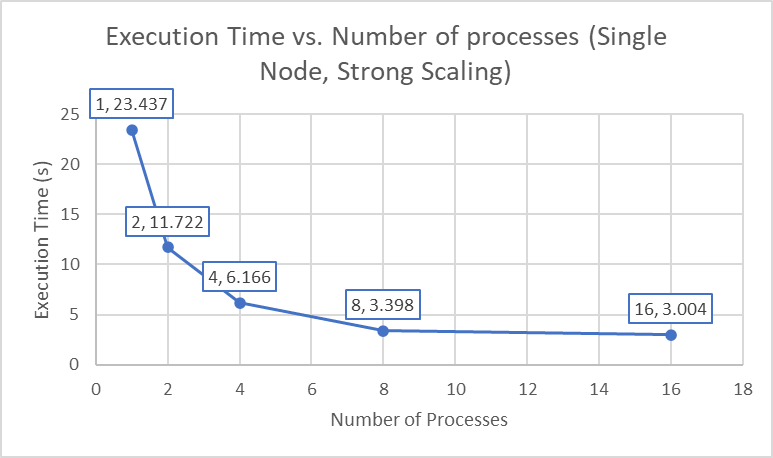
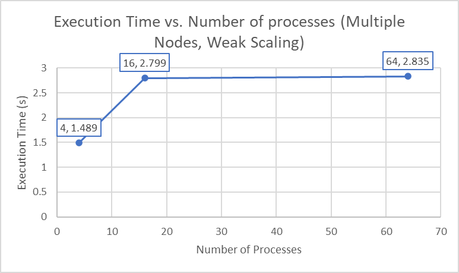
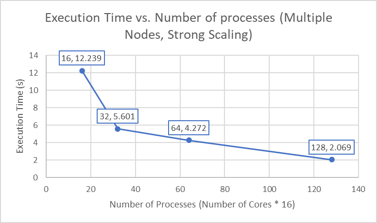

#### Question 1



We see that as `Number of Processes` increase, the `Execution Time` decreases. The rate that `Execution Time` decreases becomes smaller as `Number of Processes` increases. But as the number of processes increases, the time spent on communicating between processes becomes more expensive, and splitting works among processes becomes less effective. That's why the `Execution` decreases slower and slower as `Number of Processes` increases.

#### Question 2



The `Execution Time` increase as `Number of Processes` increases. But rate that `Execution Time` increases becomes smaller as `Number of Processes` increases. (This might due to the fact that in 4 process, each process only need to exchange data with 2 neighbors (since they are all in corners), but in higher number of processes, each process needs to talk with approximately 4 neighbors. Increasing number of neighbors increases the time for the data to exchange)

#### Question 3



We see that as `Number of Processes` increase, the `Execution Time` decreases. The rate that `Execution Time` decreases becomes smaller as `Number of Processes` increases. (Note the `Execution Time` of `16` processes in multiple nodes is significant slower for multiple nodes than the `Execution Time` of `16` processes in single node, this is due to the overhead of `MPI`). The reason why this happens is roughly the reason that mentioned in the $(1)$.

#### Question 4

At least when using my code, using blocking send and blocking receive might cause dead lock. Considering the case that `rank 1` want to send data to its neighbor `rank 2`, and `rank 2` want to send data to `rank 1` since they are neighbors. If `rank 1` calls `MPI_Send` and block itself, then `rank 2` calls `MPI_Send` and block itself too! In this case, no one could responds to the other so the code will never stop. So, the blocking calls is not effective, as it may cause dead lock.

#### Code

```c
void send_recv_ghosts(int tag, int w, int h, float tile[w + 2][h + 2], float** send_buffers, float** recv_buffers) {
  // define send/recv[0] as top, [1] as bottom, [2] as left, [3] as right

  // requests, 4 for send, 4 for recv
  // [0] top send, [1] bottom send, [2] left send, [3] right send
  // [4] top recv, [5] bottom recv, [6] left recv, [7] right recv
  MPI_Request reqs[8];

  int has_top = kGridY > 0;
  int has_bottom = kGridY < (kGridRows - 1);
  int has_left = kGridX > 0;
  int has_right = kGridX < (kGridCols - 1);

  // send / recv top
  if (has_top == 1) {
    copy_rowbuf_out(w, h, tile, 1, send_buffers[0]);
    MPI_Isend(send_buffers[0], w, MPI_FLOAT, kRank - kGridCols, tag, MPI_COMM_WORLD, &reqs[0]);
    MPI_Irecv(recv_buffers[0], w, MPI_FLOAT, kRank - kGridCols, tag, MPI_COMM_WORLD, &reqs[4]);
  }

  // send / recv bottom
  if (has_bottom == 1) {
    copy_rowbuf_out(w, h, tile, h, send_buffers[1]);
    MPI_Isend(send_buffers[1], w, MPI_FLOAT, kRank + kGridCols, tag, MPI_COMM_WORLD, &reqs[1]);
    MPI_Irecv(recv_buffers[1], w, MPI_FLOAT, kRank + kGridCols, tag, MPI_COMM_WORLD, &reqs[5]);
  }

  // send / recv left
  if (has_left == 1) {
    copy_colbuf_out(w, h, tile, 1, send_buffers[2]);
    MPI_Isend(send_buffers[2], h, MPI_FLOAT, kRank - 1, tag, MPI_COMM_WORLD, &reqs[2]);
    MPI_Irecv(recv_buffers[2], h, MPI_FLOAT, kRank - 1, tag, MPI_COMM_WORLD, &reqs[6]);
  }

  // send / recv right
  if (has_right == 1) {
    copy_colbuf_out(w, h, tile, w, send_buffers[3]);
    MPI_Isend(send_buffers[3], h, MPI_FLOAT, kRank + 1, tag, MPI_COMM_WORLD, &reqs[3]);
    MPI_Irecv(recv_buffers[3], h, MPI_FLOAT, kRank + 1, tag, MPI_COMM_WORLD, &reqs[7]);
  }

  // wait for all requests to complete
  if (has_top == 1) {
    MPI_Wait(&reqs[0], MPI_STATUS_IGNORE);
    MPI_Wait(&reqs[4], MPI_STATUS_IGNORE);
  }

  if (has_bottom == 1) {
    MPI_Wait(&reqs[1], MPI_STATUS_IGNORE);
    MPI_Wait(&reqs[5], MPI_STATUS_IGNORE);
  }

  if (has_left == 1) {
    MPI_Wait(&reqs[2], MPI_STATUS_IGNORE);
    MPI_Wait(&reqs[6], MPI_STATUS_IGNORE);
  }

  if (has_right == 1) {
    MPI_Wait(&reqs[3], MPI_STATUS_IGNORE);
    MPI_Wait(&reqs[7], MPI_STATUS_IGNORE);
  }

  // copy recv_buffers into tile
  if (has_top == 1) {
    copy_rowbuf_in(w, h, tile, 0, recv_buffers[0]);
  }

  if (has_bottom == 1) {
    copy_rowbuf_in(w, h, tile, h + 1, recv_buffers[1]);
  }

  if (has_left == 1) {
    copy_colbuf_in(w, h, tile, 0, recv_buffers[2]);
  }

  if (has_right == 1) {
    copy_colbuf_in(w, h, tile, w + 1, recv_buffers[3]);
  }

}
```

