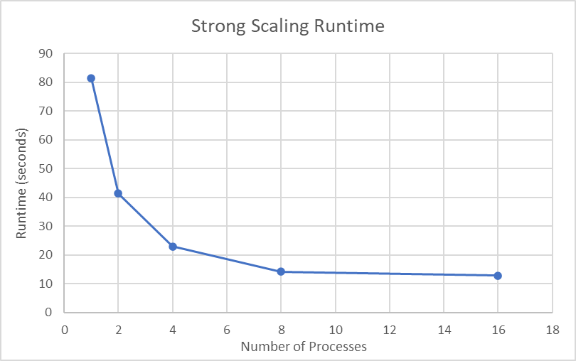
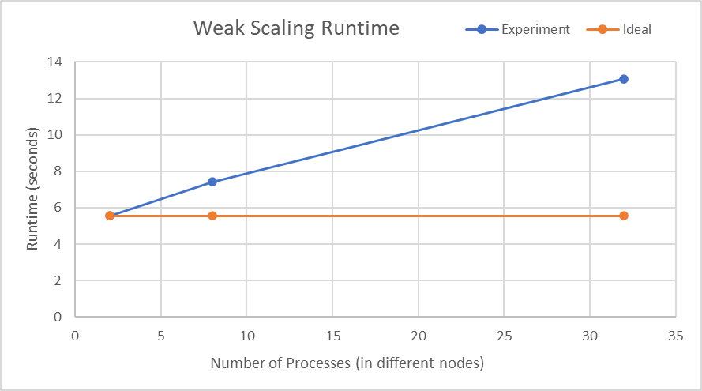
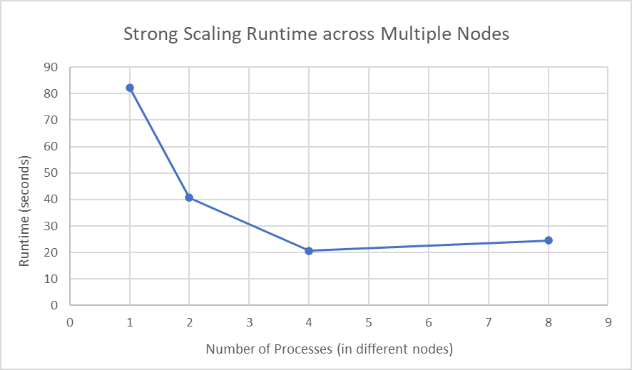

#### Short Questions

##### Question 1



We see that the total runtime is decreasing as the number of processes increased. But the decreasing rate decreases gradually. We see when we increase from 1 to 2 processes, the runtime approximately reduced in half. But when we increase from 8 to 16 processes, the runtime barely decreases. This is probably due to the increasing overhead and decreasing benefits of splitting work (margin effects).

##### Question 2



We see that the runtime roughly increases with the number of processes linearly. The ideal plot for the weak scaling should be horizontal line, that is, the scaling weakly shouldn't affect the runtime. We see that the experiment curve diverge from the ideal curve as number of processes increases. The reason is that there are more overhead added to the total computation as the number of process increasing. This overhead largely comes from splitting the work and recombining the result.

##### Question 3



We see that initially, in following the same trend seen in *Question 1*, the runtime decreases as number of processes goes up. However, we see when we try to increase the number of processes from 4 to 8, the runtime even increases a bit, this could potentially due to the reason that the overhead added when splitting and recombining work (this is significant in this case, because distributing work to CPU in different sockets takes more time than simply passing it to another processes that runs on another CPU in same socket) that is similar in *Question 2* overweighs the benefits gains that have seen in *Question 1*. 

#### Code

```c
void MPIMatrixMultiplication(float* A, float* x, float* b) {
    /**
     * Distributes a matrix over all process and 
     * does matrix vector multiplication before
     * collecting all results onto root
     * 
     * Inputs
     * A: 2D matrix to be distributed, kHeight x kWidth, data initialized only on root
     *      Access element with A[y * kWidth + x]  (x is a coordinate here, not the parameter)
     * x: vector to be multiplied, kWidth x 1, data initialized only on root
     * 
     * Outputs
     * b: result vector, kHeight x 1, only needs to be filled on root
     * 
     * Global Variables:
     * kNumPes: Total number of processes
     * kRank: rank of current process
     * kHeight: height of the matrix A
     * kWidth: width of the matrix A
     * 
     * Note: You can use malloc to allocate memory for local copies of the distributed matrix A and vector b
     * but, make sure to run free() at the end of the function.
     * Note: Remember that the distribution can be uneven. That is matrix dimensions may not be evenly divisible by the number of process.
     * Note: When creating your localA and localB matrices please use 1D memory layout as MPI functions require send and recv buffers 
     * to be contiguous in memory. 2D arrays declared as localA[][] are not contiguous.
     */

    // TODO:: Step 1: Communicate A and x to all ranks

    // we first calculate the size of each localA and localB
    int* localA_size = (int*) malloc(sizeof(int) * kNumPes);
    int* localB_size = (int*) malloc(sizeof(int) * kNumPes);
    int* localA_displs = (int*) malloc(sizeof(int) * kNumPes);
    int* localB_displs = (int*) malloc(sizeof(int) * kNumPes);

    localA_displs[0] = 0;
    localB_displs[0] = 0;

    for (int i = 0; i < kNumPes; i ++) {
        localA_size[i] = (kHeight / kNumPes) * kWidth;
        localB_size[i] = (kHeight / kNumPes);
    }

    // the last process will have the remaining rows
    localA_size[kNumPes - 1] += (kHeight % kNumPes) * kWidth;
    localB_size[kNumPes - 1] += (kHeight % kNumPes);

    for (int i = 1; i < kNumPes; i ++) {
        localA_displs[i] = localA_displs[i - 1] + localA_size[i - 1];
        localB_displs[i] = localB_displs[i - 1] + localB_size[i - 1];
    }

    // localA has size local_size[kRank]
    float* localA = (float*) malloc(sizeof(int) * localA_size[kRank]);
    // localB is the part of b that this process will compute, which has size local_size[kRank] / kWidth
    float* localB = (float*) malloc(sizeof(int) * localB_size[kRank]);

    // Scatterv to distribute A to all processes
    MPI_Scatterv(A, localA_size, localA_displs, MPI_FLOAT, localA, localA_size[kRank], MPI_FLOAT, 0, MPI_COMM_WORLD);
    // Bcast the x vector to all processes
    MPI_Bcast(x, kWidth, MPI_FLOAT, 0, MPI_COMM_WORLD);


    // Do not modify this function call
    timer_start();

    // TODO:: Step 2: Computation of localB matrix

    for (int i = 0; i < localB_size[kRank]; i++) {
        localB[i] = 0;
        for (int j = 0; j < kWidth; j++) {
            localB[i] += localA[i * kWidth + j] * x[j];
        }
    }

    // Do not modify this function call
    timer_end();
	
    // TODO:: Step 3: All process communicates its localB computation to rank 0

    // Gather the localB to b on root
    MPI_Gatherv(localB, localB_size[kRank], MPI_FLOAT, b, localB_size, localB_displs, MPI_FLOAT, 0, MPI_COMM_WORLD);

    free(localA_size);
    free(localB_size);
    free(localA_displs);
    free(localB_displs);
    free(localA);
    free(localB);
}
```

Maybe it's better to see it in GitLab as it has better highlights.