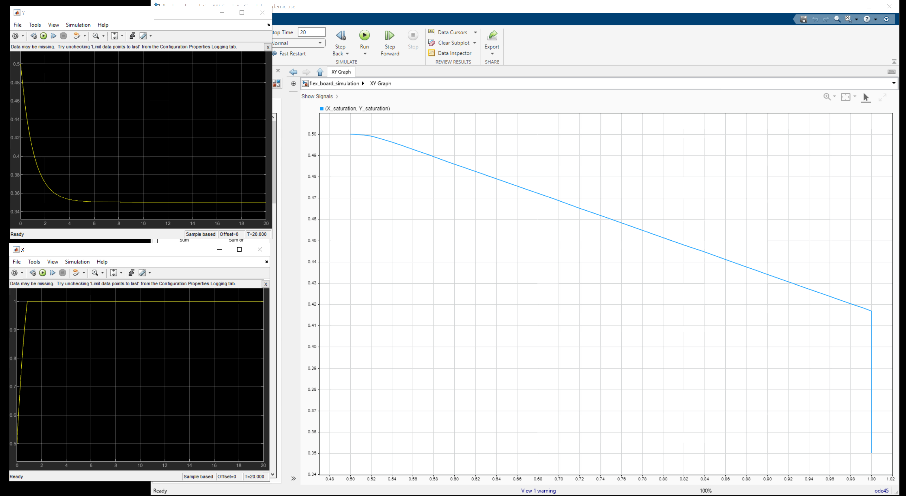

#### Problem 1

##### (a)

The original signal (default paramter) 

###### (i)

Max amplitude of error : No change

Time to balance: Increased

Frequency of oscillation: No change

###### (ii)

Max amplitude of error: No change

Time to balance: Decrease, very fast

Frequency of oscillation: Almost no oscillation.

###### (iii)

Max amplitude of error: Increased (to max possible error +/- 1)

Time to balance: Cannot balance

Frequency of oscillation: Initially quick, gradually slower.

###### (iv)

Amplitude of error: for y it's 0.5 (initially), for x it goes to 1 (max possible error)

Time to balance: Cannot balance, as neither goes to 0 (they do reach a fixed error, though)

Frequency of oscillation: No osciallation. 

###### (iv)

Magnitude of error: for y around 0.5, for x around 0.6.

Frequency of oscillation: Doesn't change.

Time to balance: Cannot balance.

###### (iv)

Make $K_p$ negative. Amplitude of error is 1 (highest), Cannot balance, and No oscillation

Make $K_d$ negative: Amplitude of error is 1 (highest), Cannot balance, and Oscillation period gradually to increase (but it seems to be the same of the original one at the start of the signal).

Make $K_i$ negative. Amplitude of error is 1 (highest), Cannot balance, and Some oscillation at beginning(the freqency for few initial oscillation seems to have similar frequency as original signal)

##### (b)

The control diagram of the PID FLEX board system

The X graph, Y graph, X-Y graph. For X graph and Y graph, horizontal axis is $t/s$ (each grid is 2s) time, and vertical is the signal value. For X-Y graph, horizontal axis is X value, vertical axis is Y value.

(Except x coordinate has a turn at the beginning (cannot find a way to tune it off), it quickly goes to 0 afterwards without any oscillation).
$$
K_p = 1 \quad K_d = 0 \quad K_i = 0.8
$$

##### (c)

One possible value is that
$$
K_p = 100 \quad K_d = 20
$$

as we could see, before $t = 2$ both coordinates already start to monotonically approach to 0, and the signal has the value extremely close to 0 when $t = 2$,  which means they are stable.

##### (d)

The PID controller will apply control action (e.g., a  motor, valve). There are physical limits to how fast or how much it can move. High gain values might require movement / force that exceed these physical capabilities for the controller, so it might not be realistically achievable.

##### (e)

Because the model we used is an idealized model, it only considered the effect of the gravity, but ignored the effect of fricition. Since integral gain is used to overcome such friction, it is not needed as there no friction in our model.

#### Problem 2

##### (a)

(iii). For (i), since you  sample at or above Nyquistic rate, the $y$ signal won't get mixed with $x$ and make it unable to filter. For (ii), since you used an analog low-pass filter, then you could exclude $y$, and only sample $x$ at lower frequency (at or above the Nyquistic rate needed for $x$)

##### (b)

###### (i)

$f_{\text{Nyquistic}} = 60$Hz, as the max frequency for x and y signal is 30Hz.

###### (ii)

$f \ge 3 \cdot 30 = 90$Hz. (More than three times the maximum frequency in the signal as we needed to account for potential noises, error, jitters, etc.). One value could be $120$Hz.  

##### (c)

signal x (left), signal y (right)

signal z

filter signal, order 5, cutoff frequency 15Hz.

###### (i)

Increase the cut-off frequency -> signal amplitude increase

Decreasing the cut-off frequency -> noise amplitude decrease

###### (ii)

Increasing the order of the filter -> signal amplitude increase

Decreasing the order of the filter -> phase delay decrease

###### (iii)

It will have a higher signal amplitude (closer to 1), so that recovered signal will look closer to the original one. However, it will also increase the phase delay between the recovered signal and the original signal, this is undesirable if we want to low-delay signal (like if you are playing games where you need to listen to certain sound). This high-order filter is best suited if we don't care too much about the delay, but want high fidelity.

