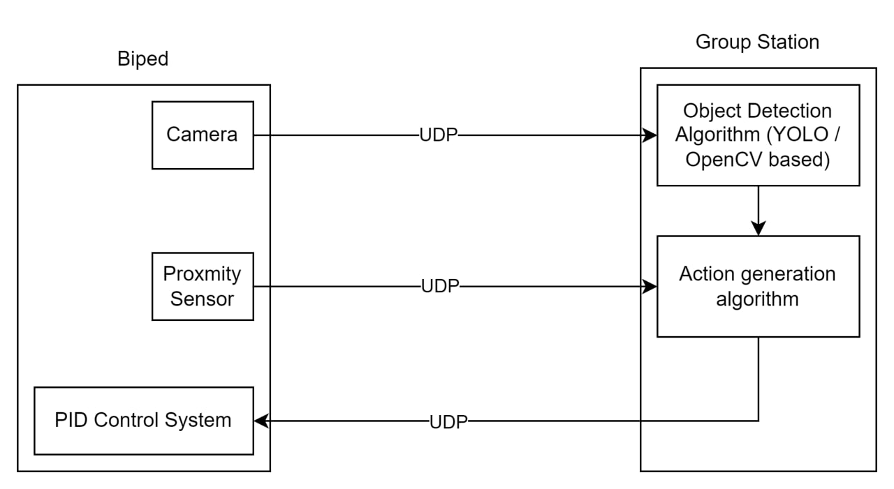

#### Proposal for Enhancing Biped Navigation Capabilities through Object Detection

##### Introduction

The evolution of embedded systems within robotics has paved the way for significant advancements in autonomous navigation and interaction with the environment. Our existing Biped platform, controlled by an ESP32 chip and equipped with a suite of sensors, represents a foundational step towards achieving intricate navigation and object interaction capabilities. This proposal outlines an initiative to extend the Biped's functionalities by integrating object detection algorithms, thereby enabling it to identify and approach specific objects autonomously. 

##### Design

The proposed design leverages the Biped's existing camera and proximity sensor to introduce advanced object recognition and navigation capabilities. The core of this enhancement involves the following components:

1. **Object Detection Algorithm:** Utilizing an object detection algorithm, such as YOLO (You Only Look Once) accessible from GitHub or traditional algorithms available in OpenCV, we plan to process the video feed from the Biped's camera in real-time. This processing will occur in Python, identifying specific objects based on predefined characteristics, e.g., a red square.
2. **Sensor Integration:** The proximity sensor will serve an auxiliary role, providing critical distance measurements to prevent the Biped from colliding with the detected object. This integration ensures safe navigation, allowing the Biped to maintain an optimal distance from the target object.
3. **Action Decision System:** Based on the object's location and distance data, a set of appropriate actions will be determined and sent back to the Biped. This system will calculate the necessary adjustments in movement to approach the object safely, leveraging the Biped's PID controller for balanced and precise motion.
4. **Communication Protocol:** All sensor data, object detection outcomes, and movement instructions will be communicated between the ground station and the Biped via a reliable UDP protocol, ensuring timely and synchronized operations.

##### Expected Outcome

The project's completion is expected to significantly advance the Biped's capabilities, enabling it to autonomously detect and approach designated objects with precision. Leveraging the integration of object detection algorithms and sensor inputs, the Biped will autonomously navigate towards a specified target, such as a red square, while maintaining a safe distance to avoid collisions.

**Timeline:**

- **Week 1 (April 8-14):** Set up development environment, finalize algorithm selection (YOLO or OpenCV), and begin integration with the Biped's camera feed.
- **Week 2 (April 15-21):** Implement and test the object detection algorithm using static images and then real-time camera feed.
- **Week 3 (April 22-28):** Integrate proximity sensor data for distance management and finalize action decision logic for object approach.
- **Week 4 (April 29 - May 5):** Complete system integration, conduct comprehensive testing, and refine algorithms based on test results.

##### Links

https://github.com/ultralytics/yolov5

https://how2electronics.com/color-detection-tracking-with-esp32-cam-opencv/

https://docs.ultralytics.com/guides/raspberry-pi/

https://docs.opencv.org/3.4.12/