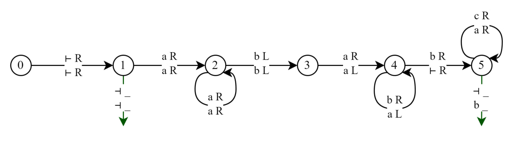

### 3   NFA Design

Define a NFA $M = (Q, \Sigma, \Delta, S, F)$ where

* $Q = [0, k]$, i.e. number from $0$ to $k$, inclusive. It’s obvious that $|Q| = k+1$.
* $\Sigma = \set{ 0, 1 }$, as required by the problem.
* $\Delta(q, a)$ that
  * $\Delta(k, 0) = \set{k}$
  * $\Delta(k, 1) = \set{k, k - 1}$
  * $\Delta(q, 0) = \Delta(q, 1) = \set{q - 1}$ for $0 < q < k$.
  * $\Delta(0, 0) = \Delta(0, 1) = \varnothing$
* $S = \set{ k }$
* $F = \set{ 0 }$

For state $q$ in $Q$, it denotes the $q$th positions from the end intuitively (though the state $k$ technically mean $\ge k$ position from the end). 

We start from the state $k$, and we accept any character in the character set. Each time when we scans a $1$ in state $k$, there is a possibility that this $1$ is $k$ position from the end. So, we make the NFA guess whether it’s actually $k$ position from the end, and goes to the state $k - 1$. 

For next chain of states from $k - 1$ to $0$, we just transition from $q$ to $q - 1$ whenever we scan any character, essentially consuming next $k - 1$ characters after the $1$ we see. If we don’t have enough characters to reach state $0$, then that means the $1$ is not $k$ position from the end. In this case, we see we land into an intermediate state that is not accept state, so the guess is invalidated. 

Finally, when we reach the state $0$, if no more characters remain in the input string, that means the $1$ we found previously is indeed $k$ positions from the end. We see in this case we land in our accept state $0$. If there are remaining characters, that means the $1$ is not $k$ positions from the end. In this case we will transition into a $\varnothing$, which makes the guess invalidated. We see in all cases the NFA works as intended by guessing the string.

From another perspective, we see that the NFA first could consume arbitrarily long $(0 + 1)^*$ characters, and then consume a $1$ followed by $(0 + 1)^k$ characters due to the transition state from $k - 1$ to $0$. This means the NFA is equivalently to the regular expression $(0+1)^*1(0+1)^k$, which is obvious that $L((0+1)^* 1 (0+1)^k) = L_k$. Therefore, this perspective also shows that NFA works as intended.

### 4   Two Headed DFA

Define a 2HDFA $M = (Q, \Sigma, \vdash, \dashv, \delta, s, t, r)$ where

* $Q = \set{0, 1, 2, 3, 4, 5, t, r}$,

* $\Sigma = \set{a, b, c}$

* $\delta(q, x, y)$ that 

  * $\delta(0, \vdash, \vdash) = (1, \R, \R)$
  * $\delta(1, \dashv, \dashv) = (t, \_, \_)$
  * $\delta(1, a, a) = (2, \R, \R)$
  * $\delta(2, a, a) = (2, \R, \R)$
  * $\delta(2, b, b) = (3, \L, \L)$
  * $\delta(3, a, a) = (4, \R, \L)$
  * $\delta(4, b, a) = (4, \R, \L)$
  * $\delta(4, b, \vdash) = (5, \R, \R)$
  * $\delta(5, c, a) = (5, \R, \R)$
  * $\delta(5, \dashv, b) = (t, \_, \_)$
  * $\delta(q, x, y) = (r, \_, \_)$ in all other cases.

  (the $\_$ notation means it could be either $\R$ or $\L$, which won’t affect the behavior of the 2HDFA)

* $s = 0$

We start from the state $0$ where both heads points to the $\vdash$ and we have the only option to make both heads right and go to state $1$. Since $\epsilon$ is a valid string, so if we see $\dashv$ immediately, we accept the string. Now, we have to make $\#a = \#b$. We want to move to the position of last $a$ in the string, then we could make one head to go back, and one head to go forward. Then if $\#a = \#b$, the former head should reach $\vdash$ when the latter head reach the last $b$. This checking is done by state $2$, $3$, and $4$. Then start from here, we move both head right, then the former head should move to the first $a$ of the string, and the latter head should move to the first $c$ of the string, and we move both head forward. If $\#a = \#c$, then we should see that we the former head reach the first $b$ of the string, the latter head should reach $\dashv$. If we reached here, that means $\#a = \#c$. This checking is done by state $5$. Also, since from the description, we only allow $b$ to appear after $a$ has appeared, and $c$ to appear once $b$ has appeared, and we don’t allow $a$ and $b$ to appear again after their section has completed, we should have the string of form $a^*b^*c^*$. This means that our string has to be of form $a^nb^nc^n$ and  therefore we accept it. Or other transition not mentioned, must means that string somehow doesn’t conform to the desired form, therefore we reject them.

