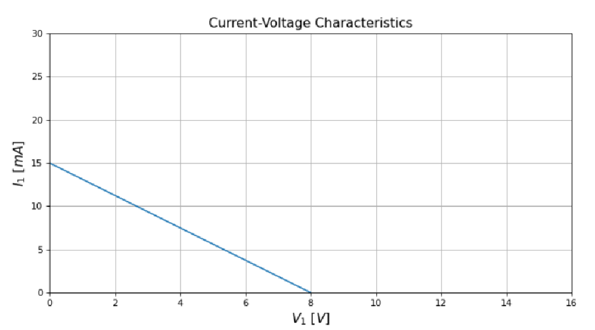
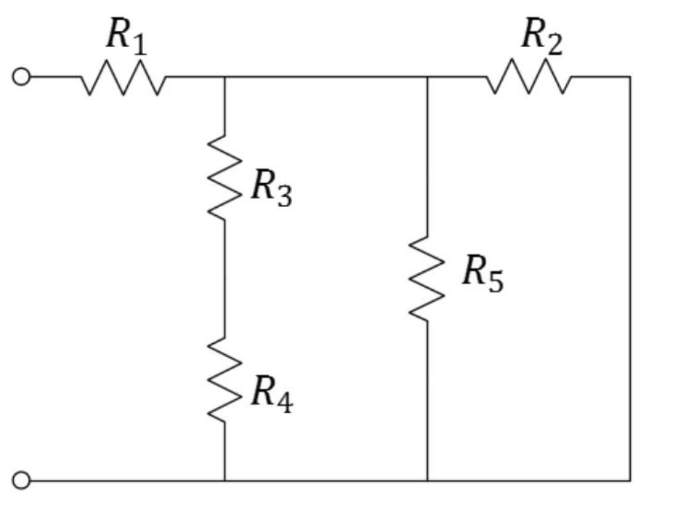
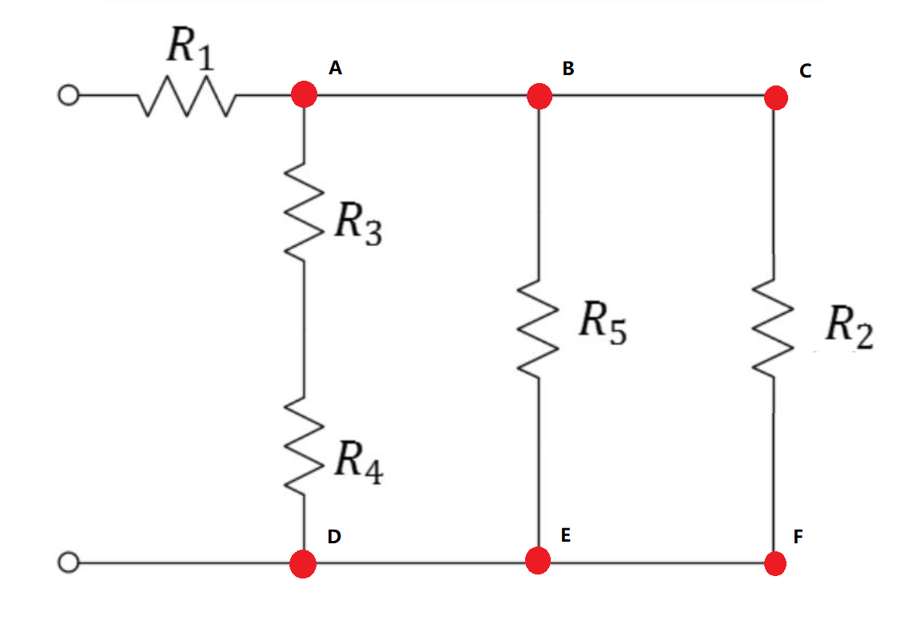

$$
\def\V{\text{V}}
\def\A{\text{A}}
\def\mA{\text{mA}}
\phantom {derivatives}
\newcommand\d{\text{d}}
\def\ffrac(#1/#2){\frac{#1}{#2}}
\def\hfrac #1(#2/#3){\ffrac (#1#2/#1#3)}
\def\deri#1/#2;{\hfrac \d(#1/#2)}
\def\dderi#1/#2;{\nderi #1/#2^2; }
\def\nderi#1/#2^#3;{\ffrac (\d^#3 #1/\d #2^#3)}
\def\derin #1;{\deri /#1;}
\def\pderi#1/#2;{\hfrac \part(#1/#2) }
\def\ppderi#1/#2;{\npderi #1/#2^2;}
\def\npderi#1/#2^#3;{\ffrac (\part^#3 #1/\part #2^#3)}
\def\pderin1/#1;{\ffrac (\part / \part #1)}
\def\fac #1/#2;{\frac{#1}{#2}}

\phantom {fraction}
\def\inv#1{\ffrac (1/#1)}
\newcommand\invsqrt[1]{\frac{1}{\sqrt{#1}}}
\newcommand\half{\frac{1}{2}}
\newcommand\tri{\frac{1}{3}}
\newcommand\quar{\frac{1}{4}}
\phantom {vectors}
\newcommand\vfunc[2]{}

\phantom {common vectors}
\def\vfn #1(#2){\vec #1(\vec #2)}
\def\v #1{\vec #1}
\newcommand\vf{\v f}
\newcommand\vx{\v x}
\newcommand\vy{\v y}
\newcommand\vz{\v z}
\newcommand\vr{\v r}
\newcommand\vv{\v v}
\newcommand\va{\v a}
\newcommand\vtheta{\v \theta}
\newcommand\vphi{\v \phi}
\newcommand\vs{\v s}

\phantom {randomstaff}
\def\tsub#1;{_{\text {#1}}}
\def\sub#1;{_{#1}}
\def\(#1);{\left(#1\right)}
\def\intl#1;{\int_{#1}}
\def\intlh#1;#2;{\int_{#1}^{#2}}
\def\sup#1;{^{#1}}
\def\tsup#1;{^{\text{#1}}}
\def\align[[#1]]{\begin{align*}#1\end{align*}}
\def\note#1!{\fbox{$#1$}}
\def\.#1|;{\left.#1\right|}
\def\ssqrt/#1/;{\sqrt{#1}}
\def\noteeq#1!#2!{\begin{equation} \label{eq:#2} \fbox{$#1$}\end{equation}}
\def\raf#1;{\ref{#1}}
\def\eqraf#1;{\eqref{#1}}
\def\dfac#1/#2;{\dfrac{#1}{#2}}
\def\sqt#1/;{\sqrt{#1}}
\def\sgrt#1/>{\sqrt{#1}}
\def\txt#1;{\text{#1}}
\def\const{\text{const}}
\def\eq#1!#2!{\begin{equation} \label{eq:#2} #1 \end{equation}}
\def\kg{\txt kg;}
\def\s{\txt s;}
\def\m{\txt m;}
\def\stwo{\txt s;^2}
\def\iv#1;{\inv{#1}}
\def\sumninfin{\sum\sub n=1;\sup\infin;}
\def\sumninfinz{\sum\sub n = 0;\sup\infin;}
\def\intinfin{\int\sub-\infin;\sup\infin;}
\def\cases[[#1]]{\begin{cases}#1\end{cases}}
$$

#### Problem 1

>The intercepts of the given plot are $(\text{0V}, \text{15mA})$ and $\text{(8V, 0mA)}$.
>
>Find the slope. Complete the following expression for the line in slope-intercept format, then find the value of $I_1$ when $V_1 = 74\text{V}$

Assume the line has the equation $I_1 = mV_1 + b$. the $m$ is the slope and the $V$ is the intercept. Plug the point $(0\V, 15\mA)$ and $(8\V, 0\mA)$ into the equation. We get
$$
\begin{align}
b &= 15\mA \\
8\V \cdot m + b &= 0\mA

\end{align}
$$
solving equation, we get
$$
\note b= 15mA \qquad m = -\fac 15/8; \fac\mA/\V; = -1.875 \ \mA / \V! \\
$$

and thus
$$
I_1(V_1 = 74) = m \cdot 74 V + b = -1.875 \mA/\V \cdot 74 \V + 15\mA  = \note -123.75\mA!
$$

#### Problem 2

We rearrange the circuit, shown below:

##### (a)

Neither. From the circuit, $V_{AD} = V_{CF} = V_{R_3}+ V_{R_4} = V_{R_2}$. The $V_{R_2} \neq V_{R_3}$, so the $R_3$ and $R_2$ are not parallel. From the graph, the $R_3$ and $R_2$ does not have same current flowing through them (the are not connected in a wire with no branches)

##### (b)

Parallel, because from the circuit we could see that $V_{BE} = V_{CF} = V_{R_5} = V_{R_2}$
