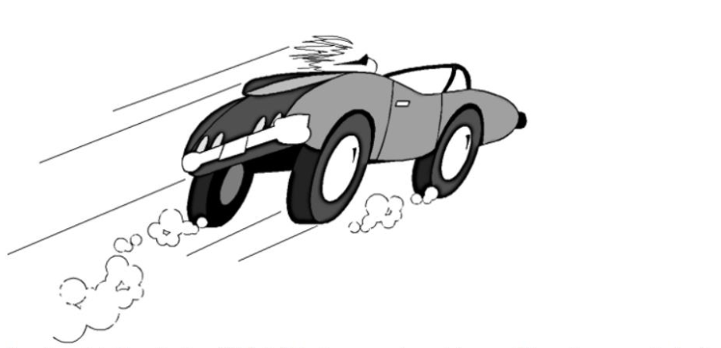
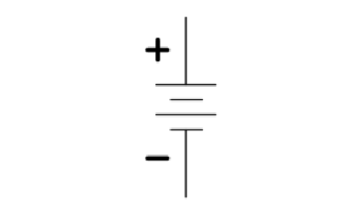

#### Problem 1

>Consider a hybrid car that has $400 \text{kJ}$ of kinetic energy at certain speed. The car's regenerative braking is $37\%$ efficient ($\eta = 0.37$) at converting kinetic energy ($E_k = \half mv^2$) to energy stored in a battery. When the car comes to a complete stop, what is the energy, $\Delta E$, added to the car's battery?

$37\%$ of the kinetic energy are stored back into the battery, according to the problem. Therefore,
$$
\Delta E = 0.37 \cdot 400\text{kJ} = \note 148\text{kJ}!
$$
(The significant digits = 3)

#### Problem 2

> If a battery is labeled at $1.5 \V$ and $400 \mA \txt h;$, how much energy does it store?

The energy is
$$
E = 1.5\V \cdot 400 \mA \text{h} = 1.5\V \cdot 400 \cdot 0.001\A \cdot 3600\s = \note 2.16 \cdot 10^3 \text{J}!
$$

(The significant digits = 3)

