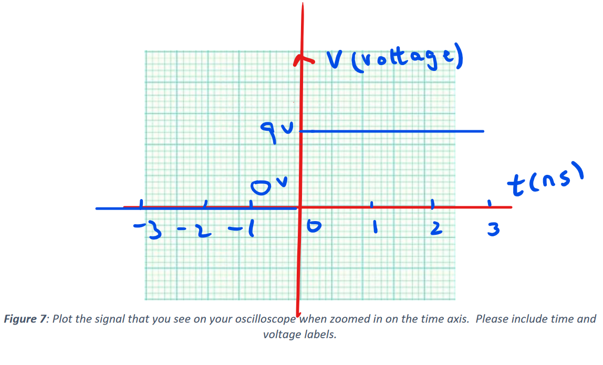

#### Question 1

>Hand-sketch the plot you obtained on the oscilloscope as requested in Figure 7.

#### Question 2

>In your own words, what does the trigger of an oscilloscope do?

The oscilloscope will start recording the input when it detects a voltage that is higher than the trigger voltage at the first time. This could help us pinpoint the time when certain signal / changes happen.

