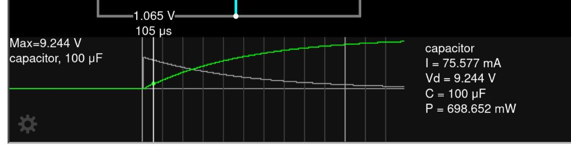
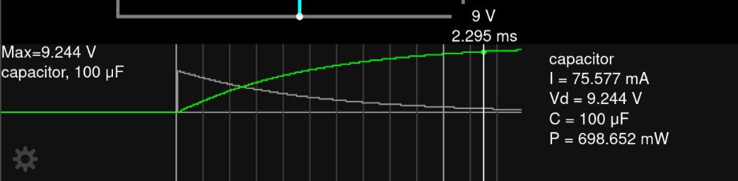
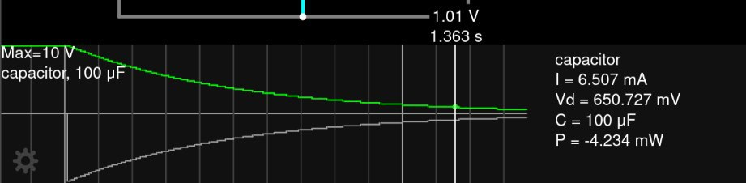
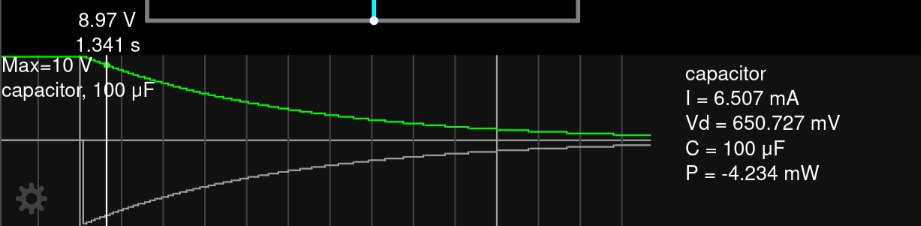
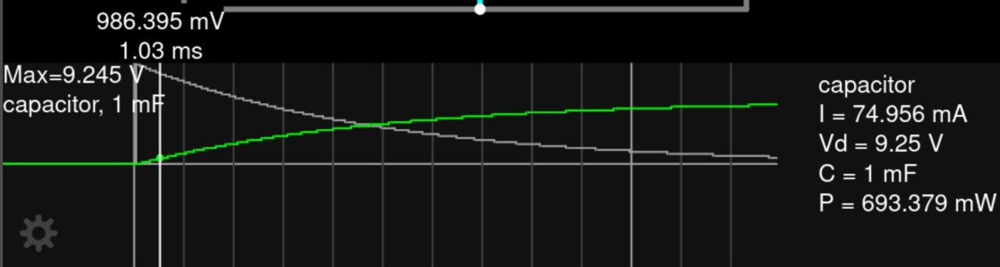
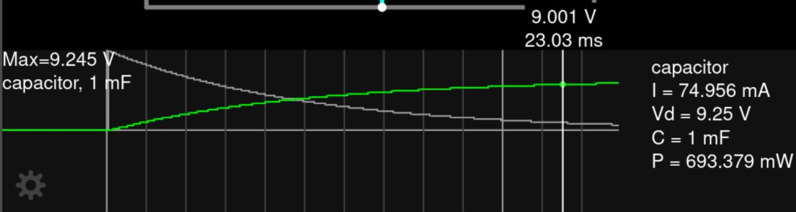
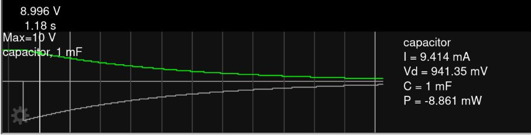
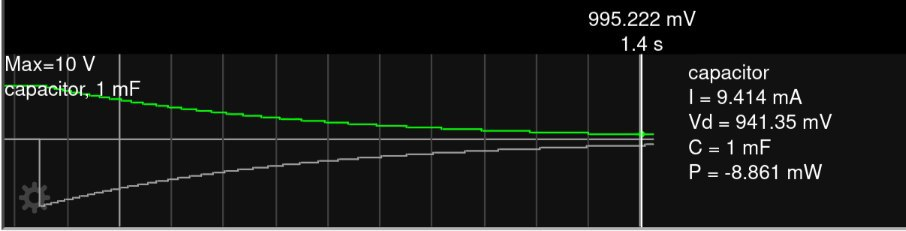

#### Problem 1

We need to use $R = 10\ohm$. Therefore
$$
t\tsub rise; = 2.2RC = 2.2 \cdot 10\ohm  \cdot 100\mu \txt F; = 2200 \mu \s = 2.2\m \s
$$

#### Problem 2

We need to use $R = 100\ohm$. Therefore
$$
t\tsub fall; = 2.2R C = 2.2\cdot 100\ohm \cdot 100 \mu \txt F; = 22000 \mu \s = 22 \m\s
$$

#### Problem 3

There are the screenshots of the `10%` mark and the `90%` mark of the charging process

Therefore
$$
t\tsub rise, falstad; = 2.295\m\s  - 0.105\m\s = 2.19\m\s
$$
which matches the theoretical results.

#### Problem 4

There are the screenshots of the `10%` mark and the `90%` mark of the discharing process

Therefore
$$
t\tsub fall, falstad; = 1.363\s - 1.341\s = 0.022\s = 22\m\s
$$
which matches the theoretical results.

#### Problem 5

Just do the calculation again, but with $C = 1000\mu \txt F;$ this time, and we get
$$
t\tsub rise; = 2.2RC = 2.2 \cdot 10\ohm  \cdot 1000\mu \txt F; = 22000 \mu \s = 22\m \s \\
t\tsub fall; = 2.2RC = 2.2 \cdot 100\ohm  \cdot 1000\mu \txt F; = 220000 \mu \s = 220\m \s
$$

#### Problem 6

There are the screenshots of the `10%` mark and the `90%` mark of the charging process

There are the screenshots of the `10%` mark and the `90%` mark of the discharing process

We could thus get
$$
t\tsub rise, falstad; = 23.03\m\s  - 1.03\m\s = 22.00\m\s \\
t\tsub fall, falstad; = 1.4\s  - 1.18\s = 0.22\s = 220 \m\s
$$
which matches with our theoretical result.
$$

$$
