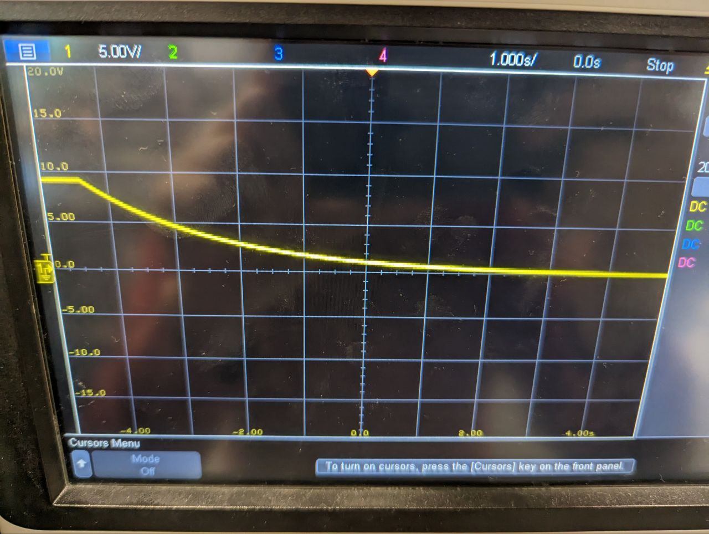

#### Problem 1

The $C$ is just the $C$ shown in the cirucit. The $R$ is not the resistor shown in the circuit. Since $t\tsub rise; = 2.2RC$. The $R$ here only includes the resistance of some plain wire, and possibly some resistance in the button and other components. $R$ is really small and thus the $t\tsub rise;$ will be really small. Therefore the capacitor would charge very quickly.

#### Problem 2

Ideally, only the $R$ (shown in the circuit) should have resistance. Therefore,
$$
t\tsub fall; = 2.2RC = 2.2 \cdot 1000\mu \txt F; \cdot 1\txt k;\ohm = 2200\m\txt s; = 2.2\s 
$$

#### Question 3

It's approximately $7.4\s$, far larger than $t\tsub fall, theoretical;$. This because the acutal circuit have a larger $R$ contributed from the LED and other components (button, wires...)

#### Question 4

Yes. It's now approximate $15.2\s$, approimately 2 times than the $7.4\s$. According to the formula of $t\tsub fall; $, we could see that the capcitance should increase approximately 2 times too.

#### Problem 5

This is the picture taken for the plotted graph. (The vertical axis is voltage, the horizontal axis is second).

