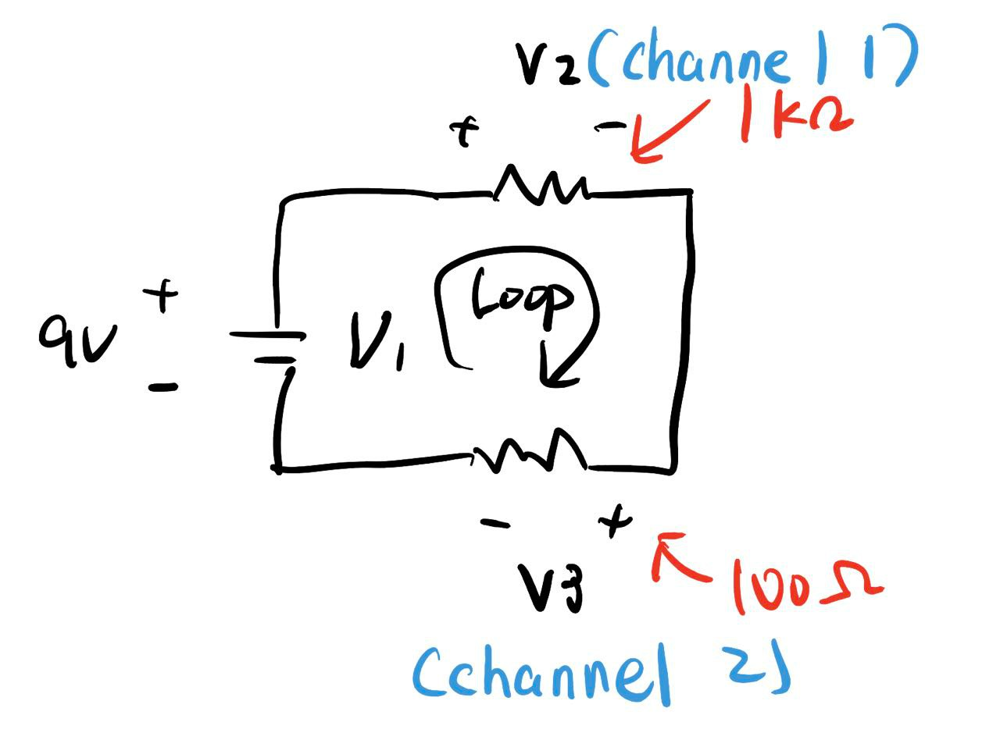

#### 1

The reading is changing from 9.271 Volt to 9.287 Volts. So the reading is 9.27 (with the last digit 7 being the "uncertain" digit)

#### 2

The ten consecutive reading (mean) are just

9.261 9.261 9.261 9.261 9.261 9.261 9.261 9.261 9.261 9.261

(The voltage are pretty stable so they are all the same)

#### 3

We should just report 9.261 (The last digit 1 is the "unsure/uncertain" digit)

#### 4

Channel 1: 4.493 V

Channel 2: 0.457 V

#### 5

Their sum $4.493 + 0.457 = 4.95\V$. Roughly equal to $5\V$. 

From Kirchhoff law, consider the loop drawn in the graph, we should indeed have $-V_1 + V_2 + V_3 = 0$, which means the sum of voltage reading should equal to the voltage supplied.

#### 6

We see that $R_1 = 4.493\V / 1000\ohm = 4.493 \cdot 10^{-3}\A$ and $R_2 = 0.457\V/100\ohm = 4.57 \cdot 10^{-3}\A$. They are roughly the same. The difference might be caused by the fact that the voltmeter is also connected to the circuit, and some current goes into the voltmeter instead of the resistor (that is, the $R_1$ and $R_2$ is not ideally in "series").