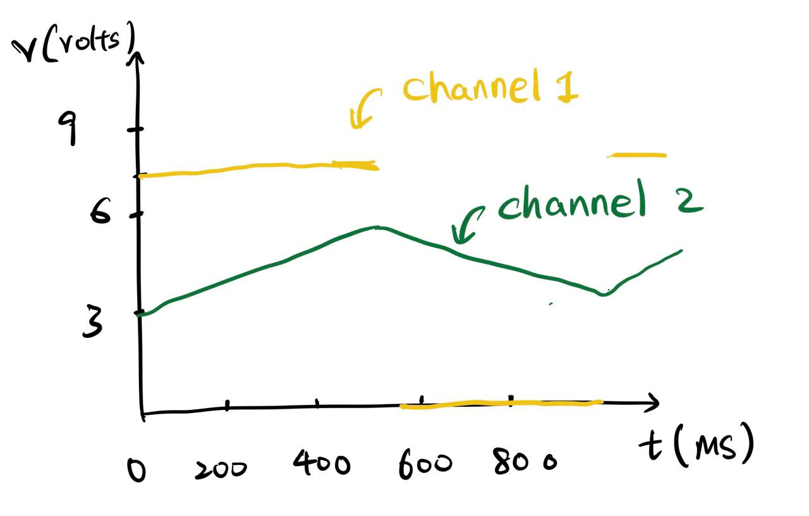
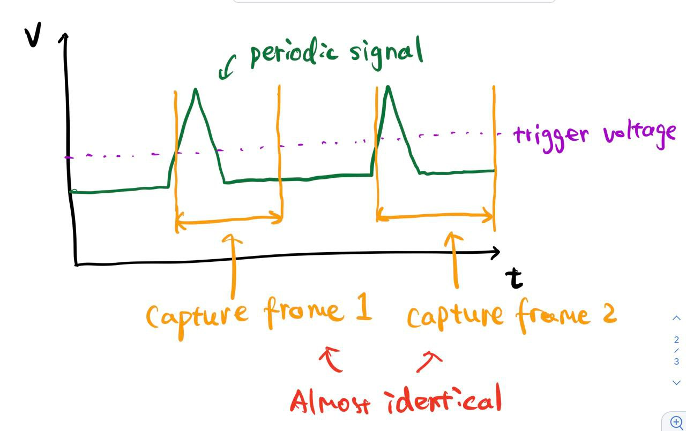

#### Question 1

Left: the graph sketched. Right: the picture of oscilloscope. 

#### Question 2

When a periodic signal is received by oscilloscope, if the trigger voltage is set, the oscilloscope will be triggered at almost the same **phase** of signal every time. This makes the frames captured look same every time, and therefore when the oscilloscope update the graph, it almost looks like unchanged. 

