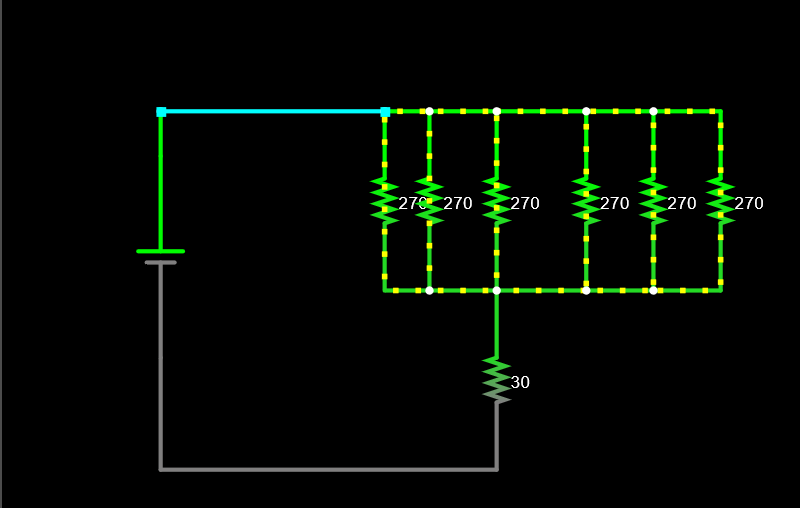

##### Question 1

$R_{\text{opt}} = 45\ohm$

##### Question 2

$R \ge 260.5\ohm$ or $R\le 3.45\ohm$

##### Question 3

In this case, the combined effective resistance for these four resistor is still $45\ohm$, so the engine will still get $120\text{mA}$ current supply. However, since these four resistor now in parallel, each of them will only receive $120/4 =30\text{mA}$ current now. The current is reduced to $1/4$ of the original, while each resistors' resistance is increased by $4$, this resulted in the power on each resistor reduced to $1/4$ of the original ($648\text{mW} / 4 = 162\text{mW}$), which is in the limit of $250\text{mW}$.

##### Question 4 & 5

6 resistor of $45\cdot 6 = 270\ohm$ each in parallel also works.

