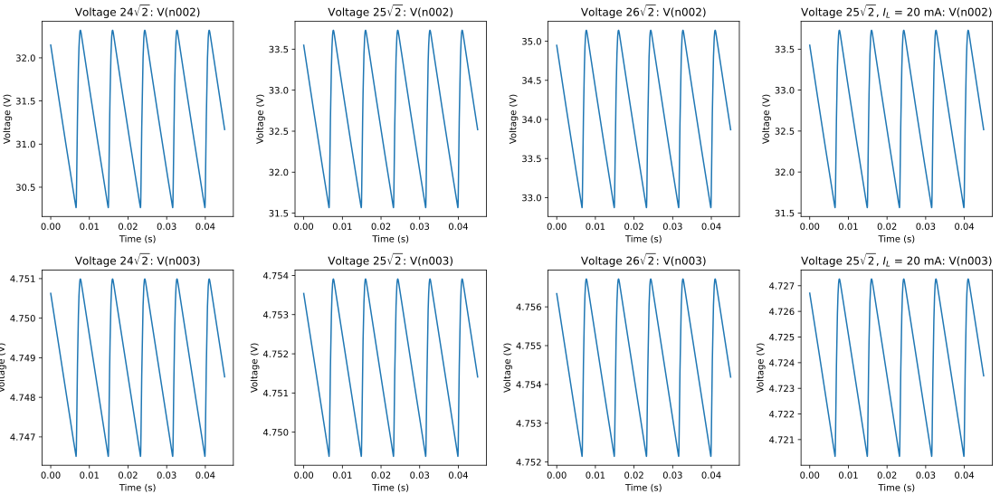

$$
{\def\I{\text{I}}}
{\def\V{\text{V}}}
{\def\mV{\text{mV}}}
{\def\R{\text{R}}}
{\def\L{\text{L}}}
{\def\A{\text{A}}}
{\def\for{\text{for}}}
{\def\if{\text{if}}}
{\def\note#1!{\fbox{$#1$}}}
{\def\tsub#1;{{_{\text{#1}}}}}
{\def\k{\text{k}}}
{\def\P{\text{P}}}
{\def\mW{\text{mW}}}
{\def\mA{\text{mA}}}
{\def\d{\text{d}}}
{\def\Hz{\text{Hz}}}
$$
# ECE 343 Lab #3: Power Supply and Voltage Regulator

## 4   Design Walk-through

### 4.1   AC power source and rectifier

For this design we will use the sine wave source for LTSpice simulations. The actual circuit will be tested using a transformer connected to AC mains. The input sine wave to the power supply is rectified using as shown below. There are two possible rectifier: (1) Half-wave rectifier (Fig. 2 (a)) and (2) Full-wave bridge rectifier (Fig. 2 (b))

* Give a sketch of voltage across resistor $\bold{R_1}$ and $\bold{R_2}$. Assume $\bold{V_in(t) = 25\sqrt 2\sin (2\boldsymbol\pi 60t) V}$. Clearly indicate the peak value of voltage in each case.

  >Suppose the diode has a forward voltage of $\V\tsub F;$. The datasheet gives the following data:
  >
  >
  >
  >So we see that the forward voltage is around $0.8 - 1.1\V$, but it could be smaller. In the LTSpice, a simulation with $\R_1 = \R_2 = 1000\ohm$ gives $\V\tsub F; \approx 755 \mV$. Then the peak value of voltage is
  >$$
  >\begin{align}
  >\max (\V\tsub R1;) &= |\V\tsub in;| - \V\tsub F; \approx \note 34.60 \V! \\
  >\max (\V\tsub R2;) &= |\V\tsub in;| - 2\cdot \V\tsub F; \approx \note 33.845\V!
  >\end{align}
  >$$
  >
  >
  >

* What are the advantages/disadvantages of each circuit

  >For the half-wave rectifier, as the name implies, you only get half of the entire waveform, which is will have a bigger ripple voltage compared to full-wave rectifier, but the peak voltage will be much closer to the peak voltage of the original waveform than a full-wave rectifier does. For whole-wave rectifier, you will get full input waveform, but your waveform will has less peak voltage when compared to half-wave rectifier, and each sine pulse in the waveform are separated by a small time gap.

* The average voltage value, $\langle \bold V \rangle$, of voltage $\bold{V(t)}$ is given by,
  $$
  \langle \bold V \rangle = \bold{{ 1\over T}\int_0^T V(t \boldsymbol) \, dt }
  $$
  Compute the average value of input voltage $\bold{V_in(t \boldsymbol)}$, half wave rectified output $\bold{V_{R1}(t \boldsymbol)}$, and full wave rectified output $\bold {V_{R2} (t \boldsymbol)}$. You may assume the rectification is ideal and there is no voltage drop across the diodes.
  
  > By symmetry, so
  > $$
  > \bold{V_in (t \boldsymbol) = 0\V}
  > $$
  > and doing the integral, we get
  > $$
  > \bold {V_{R1}(t \boldsymbol)} = \bold{ {1 \over T} \int_0^T A \sin({2 \boldsymbol\pi \over T}t) \, dt} = \bold{-\frac{A}{T}\frac{T}{2\boldsymbol \pi } \left.\cos({2 \boldsymbol\pi \over T}t)\right|^{T/2}_0} = \bold{\frac{A}{\boldsymbol\pi}} \approx \bold {11.254 V}
  > $$
  >
  > $$
  > \bold {V_{R2}(t \boldsymbol)} = \bold{ {1 \over T} \int_0^T A \sin({2 \boldsymbol\pi \over T}t) \, dt} = \bold{-2\cdot \frac{A}{T}\frac{T}{2\boldsymbol \pi } \left.\cos({2 \boldsymbol\pi \over T}t)\right|^{T/2}_0} = \bold{\frac{2A}{\boldsymbol\pi}} \approx \bold{22.508V}
  > $$

### 4.2   Regulator

The regulator is simply a resistor and zenor-diode (Fig. 3), whose function is to hold the output voltage, $\V_0$, constant against variations in the load current and against variations in the AC line voltage. It also serves to reduce the ripple voltage that appears across the filter capacitor and would otherwise appear at the power supply output $\V_0$ as well.

### 4.3   Regulator Design

The regulator design mainly involves picking an appropriate **operating point** for the zener diode. The basic configuration of regulator is show in Fig. 3. Following considerations must be kept in mind:

1. Too much current will cause the diode to overheat.
2. Too little current will cause diode to sit in flat region of the I-V curve and lose regulation.
3. The resistor $\bold {R_s}$ limits the maximum current that can flow through the zener diode. This condition occurs when the load current $\bold{I_L = 0}$

Answering the following question will help you design the regulator circuit:

* Sketch the **I** $-$ **V** characteristic of a reversed biased zener diode.

  >

* Based on your sketch, give a short explanation of how reversed biased zener diode can function as a regulator. Also mention which part of the **I** $-$ $\bold V$ curve should the diode be operated to operate as a regulator.

  > The zenor diode should operate in breakdown region ($\V < \V\tsub Z;$). It could regulate variations in the AC line voltage $\V\tsub m;$, as $\V\tsub m;$ changes or has fluctuations, its current will vary greatly, but according to the graph, the $\V$ will sit close to $\V\tsub Z;$, so the output voltage is regulated. When the load current changes, its current voltage will vary greatly, but again according to the graph, the $\V$ will sit close to $\V\tsub Z;$. 

* The zener voltage $\bold {V_Z}$ is fixed by the DC supply output voltage. What is the value of $\bold {V_Z}$ for this design.

  >It should be $\note \bold{V_Z} = 4.7\V!$, as we want the DC supply voltage to be $4.7\V$

* The part number of zener diode used in this lab is **D1N750**. Refer to the device data sheet and note down the max power rating of the diode. Use **75**% of the maximum power to compute the maximum current that the diode can tolerate (This condition occurs when load current $\bold{I_L = 0}$)

  >From the datasheet, we see that **maximum power dissipation** is $500\mW$. To use 75% of the maximum power, the maximum current have to be $\I\tsub max; = (500\mW \cdot  75\%) / 4.7\V = \note 79.79\mA!$.

* What is the value of $\bold {R_S}$ required to ensure that current through the diode does not exceed the maximum allowed value. Assume $\bold {V_m = 25\sqrt 2 V}$. 

  >The zenor diode will have its maximum current when $\I\tsub L; = 0\A$. So in this case
  >$$
  >\bold {I_Z} = \I = (\V\tsub m; - \V\tsub Z;) \bigm/ \R\tsub s; \le \I\tsub max;
  >$$
  >using ideal diode assumption. So
  >$$
  >\bold{R_s} \ge {\V\tsub m; - \V\tsub Z; \over \I\tsub max;}\approx \note 384.21\ohm!
  >$$

* The current $\bold{I_Z}$ though will vary based on the load current ($\bold{I_L}$) that is drawn from the regulator. What is the minimum value of current $\bold {I_Z}$?

  >Suppose we use the $\I\tsub max;$ calculated when $\I_\L = 0\A$. We see that maximum $\bold {I_L}$ is $20\mA$, so the minimum $\bold{I_Z} = 79.79\mA - 20\mA = 59.79\mA$.

* At this point you must verify that the zener diode operates in the correct region of operation. Perform a DC sweep simulation of the circuit shown in Fig. 4. You can sweep voltage $\bold{V_in}$ from **4.4 $-$ 4.8V**. Plot $\bold{I_Z \ vs \ V_in}$ and verify that the minimum current through the zener diode is above the knee of the $\bold{I_Z \ vs \ V_in}$ curve.

  >
  >
  >We see that once $\bold {I_Z}$ is bigger than $59.79\mA$, it’s indeed well “above the knee” of the $\bold{I_Z \ vs \ V_in}$ curve.

### 4.4   Filter

The filter block is used to reduce the ripple in the rectifier output. The filter section is **only a single capacitor** connected from the output of the rectifier circuit to ground. (Fig. 6.). The following points illustrate the role of the capacitor:

* The capacitor provides current to the load between peaks of rectified output.

* Between peaks of rectified voltage, the filter capacitor is discharging at a rate that depends upon the amount of current delivered to the regulator.

* The **ripple voltage**, $\V\tsub ripple, C;$, **across the capacitor (C)** can related to the value of the capacitance as follows,
  $$
  \bold{V_{ripple, C}} = \bold{I_L \over fC}
  $$
  where, $\bold {I_L}$ is the DC component of the load current and **f** is the frequency of the filter output.

* In order to use the expression to compute C, the output ripple voltage must be converted to the ripple across capacitor.

#### 4.4.1   Picking the Capacitor

Using the maximum allowable **output ripple voltage** (from the specifications), we can work backwards to the maximum allowable ripple voltage at the filter. This is done by replacing the diode by its incremental model as shown below:

* Use the device data-sheet to obtain the incremental resistance of the diode

  >$$
  >\note \R\tsub z, max; = 19\ohm!
  >$$
  > The actual $\R \tsub z;$ seems to be much smaller than the worst case situation, usually around $2\ohm$ (from LTSpice simulation).

* Use the maximum allowable **output ripple voltage** to obtain the maximum allowable ripple across the capacitor.

  >We therefore know that $\V\tsub ripple, out; \le 2\% \cdot 4.7\V  =  0.094\V$, and it’s obvious that
  >$$
  >\V\tsub ripple, out; = {\R\tsub z;\over \R\tsub z; + \R\tsub s;}\cdot \V\tsub ripple, C; = \frac{19\ohm}{384.21\ohm + 19\ohm} \cdot \V\tsub ripple, C; \le 0.094\V \\
  >$$
  >and therefore
  >$$
  >\V\tsub ripple, C; \le 0.094\V \cdot {384.21\ohm + 19\ohm \over 19\ohm} \approx \note 1.995\V !
  >$$

* Compute the capacitor value. Also mention the voltage rating of the capacitor . **Hint:** This is obtained from the maximum voltage difference across the capacitor.

  >Using the formula, we know that for a half wave rectifier, the frequency $\text f$ is roughly the same as the input frequency $60\Hz$, for a full wave rectifier, the frequency $\text f$ is roughly the twice of the input frequency $120\Hz$. So,
  >$$
  >\C\tsub half; \ge {\I\tsub L,max; \over \text{f}\cdot \V \tsub ripple, C;} = \frac{79.79\mA}{60\Hz \cdot 1.995\V} = \note 666.6 \mu \text{F}! \\
  >\C\tsub full; \ge {\I\tsub L,max; \over \text{f}\cdot \V \tsub ripple, C;} = \frac{79.79\mA}{120\Hz \cdot 1.995\V} = \note 333.3 \mu \text{F}!
  >$$

### 4.5   Complete Design

Sketch the complete power supply circuit (based on bridge rectifier) you have designed. Include all the components and their values. For now you can replace the transformer circuit with sinusoidal input of appropriate value.

>

## 5   Simulations

* We will now verify the designed power supply using LTSpice. You are to construct the power supply and run simulations that will test the performance of the power supply over a variety of realistic situations like variable loading and dirty power.

  | $\bold{V_in}$ (V) | $\bold{I_L}$ (mA) | Ripple across C (V) | Output voltage ripple (mV) | Output DC voltage (V) |
  | :---------------: | :---------------: | :-----------------: | :------------------------: | :-------------------: |
  |    $24\sqrt 2$    |        $0$        |        1.084        |           2.330            |         4.750         |
  |    $26\sqrt 2$    |        $0$        |        1.197        |           2.355            |         4.756         |
  |    $25\sqrt 2$    |       $20$        |        1.141        |           3.356            |         4.725         |
  |    $25\sqrt 2$    |        $0$        |        1.140        |           2.380            |         4.752         |

  >Note, it seems the output voltage ripple is much smaller than we expected, that is because we uses $\R\tsub z, max;$ to calculate the $\V\tsub ripple, out;$, the actual $\R\tsub z;$ are usually around $2\ohm$ rather than $19\ohm$. Also, the actual $\I\tsub L, max;$ seems to be a bit smaller according to LTSpice, it around $51\mV$, the $\text f$ is also bigger, than expected, since for each cycle, not all the time are spent discharging (the capacitor will also be in charging state for some time), this together cause lower-than-expected ripple voltage across C. Also, the formula we use assume the capacitor discharges linearly, but actually the process will slow down result in lower ripple voltage.

* Also save the output plots for each case.

  >

## 7   Design of a complete power supply

#### 7.1.1   Increasing the supply voltage

The first step is to increase the output voltage of the power supply to approximately $\bold {10V}$. Consider the circuit shown below:

* Compute gain of the circuit $\bold{A_V} = \bold{V_out \bigm/ V_in}$  and fix the ratio $\bold{R_1 \bigm / R_2 }$ to obtain $\bold {A_V \approx 2}$.

  >From ideal Op-Amp assumption, we have
  >$$
  >\bold{A_V} = \bold{V_out \over V_in} = \left(1+\bold{R_1 \over R_2}\right) \approx 2
  >$$
  >Therefore,
  >$$
  >\bold{R_1 \over R_2} \approx 1
  >$$

* Compute the maximum power dissipated in the resistor $\bold{R_1}$ and $\bold{R_2}$. While performing bench test of the designed circuit, the resistors you pick must be rated for this power. **Hint:** Determine the condition under which max power dissipation occurs.

  >If the $\I\tsub out;$ is $0$, then the resistors will have maximum dissipated power. In this case, the power for them is
  >$$
  >\P\tsub max, 1; = \P\tsub max, 2; = {\V^2_{\text{out}} \over 4\cdot \bold{R_1} } = {\V^2_{\text{out}} \over 4\cdot\bold{R_2} }
  >$$

* The Op-Amp circuit shown in Fig. 9 will be used to increase the output voltage of the DC power supply you designed. **The rail voltages for the Op-Amp can be taken from the terminals of filter capacitor**. You must ensure that this satisfies the maximum allowed rail voltages for LM 741 IC (ref: Datasheet). Note down the maximum allowed rails voltages from the device datasheet and then justify if voltage across the plates of capacitor satisfies this requirement.

  | $\bold{V_{amp, max}}$ (V) | $\bold{V_{c, max}}$ (V) |
  | :-----------------------: | :---------------------: |
  |   $\pm 22\V \sim 44\V$    |        $35.36\V$        |

  >This should work, as the maximum voltage difference $\bold{V_{c, max}}$ is smaller than the Op-Amp maximum.

* Sketch the new circuit that includes Op-Amp in negative feedback configuration to increase the power supply output. **Note:** The rail voltage $\bold{V}$

| $\bold{V_in}$ (V) | $\bold{I_L}$ (mA) | Ripple across C (V) | Output voltage ripple (mV) | Output DC voltage (V) |
| :---------------: | :---------------: | :-----------------: | :------------------------: | :-------------------: |
|    $24\sqrt 2$    |        $0$        |        1.540        |           7.269            |         9.541         |
|    $26\sqrt 2$    |        $0$        |        1.700        |           7.478            |         9.553         |
|    $25\sqrt 2$    |        $0$        |        1.620        |           7.373            |         9.547         |
|    $25\sqrt 2$    |        $5$        |        1.620        |           7.374            |         9.548         |
|    $25\sqrt 2$    |       $20$        |        1.620        |           7.474            |         9.548         |
|    $25\sqrt 2$    |       $80$        |        1.620        |          4.470e-5          |         0.184         |

* Seems like that at 80mA, the circuit fails to maintain its voltage. The datasheet said that LM741 have a maximum short circuit output current of 25mA, so it’s not able to sustain 80mA output.
* 
* 45.58mW (R2), 45.58mW (R1), 2.061W (RS)

### 7.2   Increasing output current rating

#### 7.2.1   Design and Calculation

In this section you will make further modifications to your circuit to meet the output current specifications of the power supply. Consider the BJT shown below:

* Give a brief explanation of how the BJT can be used to provided DC current gain

  >The output current $\I\tsub E; = (1+\beta)\,\I\tsub B;$, and $\beta$ is a big constant, so we see that DC current get amplified.

* Consider now the circuit shown in Fig. 11 below. Compute the maximum power dissipated by the BJT in the circuit shown in Fig. 11. Compare with the specifications in device data sheet.

  | $\P\tsub max, datasheet;$ (W) | $\P\tsub max, calculated;$ (W) |
  | :---------------------------: | :----------------------------: |
  |         $115\text W$          |        $2.0768\text W$         |

  >As the BJT power could be approximated as $\I\tsub E; \cdot \V\tsub CE;$ where $\V\tsub max, CE; = 35.36\V - 9.4\V = 25.96\V$, and $\I\tsub max,  E; = 80\mA$. The calculated power is way smaller than the maximum power rating in datasheet, so we should be fine in this case.

#### 7.2.2   LTSpice Simulation

* Simulate your circuit using LTSpice. Complete the following table to verify its operation.

  | $\bold{V_in}$ (V) | $\bold{I_L}$ (mA) | Ripple across C (V) | Output voltage ripple (mV) | Output DC voltage (V) |
  | :---------------: | :---------------: | :-----------------: | :------------------------: | :-------------------: |
  |    $24\sqrt 2$    |        $0$        |        1.729        |           8.183            |         9.541         |
  |    $26\sqrt 2$    |        $0$        |        1.888        |           8.329            |         9.553         |
  |    $25\sqrt 2$    |        $0$        |        1.808        |           8.253            |         9.547         |
  |    $25\sqrt 2$    |        $5$        |        1.906        |           8.712            |         9.547         |
  |    $25\sqrt 2$    |       $20$        |        2.198        |           10.084           |         9.547         |
  |    $25\sqrt 2$    |       $80$        |        3.326        |           15.509           |         9.544         |

* Note down the power dissipated by the transistor ($\bold {P_T}$) and power delivered to the load ($\bold {P_L}$) under maximum load conditions and $\bold{V_in = 25\sqrt 2 V}$

  >$$
  >\P\tsub T; = 1.989\text W  \quad \P\tsub L; = 764\mW
  >$$
  >

4.8475

47.7mV

44.630V

1.89V
