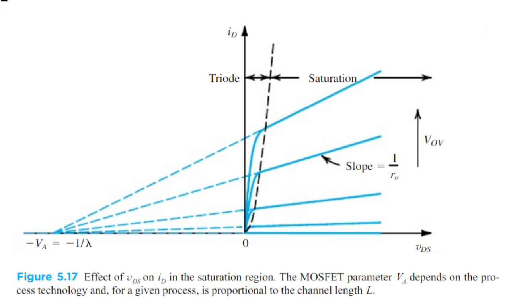

# ECE 343 Lab #4: MOSFET: Large Signal Model

## 1   Introduction

In this lab, we will be going over DC characterization of our first “three-terminal” device: the MOSFET. The learning objectives for this lab are:

* Investigate the **I** $-$ **V** curves of a MOSFET: $\bold {I_D}$ vs $\bold{V_GS}$ and $\bold{I_D}$ vs $\bold{V_DS}$
* Impact of body effect on $\bold I - \bold V$ curves
* Obtain the values of transistor parameters: $\bold {V_T}$, $\bold {R_on}$, $\bold{k_n}$, $\lambda$
* Comparison between theory, simulation, and measurement.

## 2   Simulations

In this section we will perform LTspice simulations to obtain the $\bold{I_D} - \bold{V_GS}$ and $\bold{I_D} - \bold{V_DS}$ characteristics of a MOSFET. We will also verify the impact of body bias ($\bold{V_SB} \neq 0$) on threshold voltage $\bold{V_T}$. The simulation results will be used to obtain key MOSFET parameters.

### 2.1 $\bold{I_D}$ vs $\bold{V_GS}$ Characteristic

The setup for obtaining $\bold{I_D}$ vs $\bold {V_{GS}}$ is shown in Figure. <a name="red" href="#figure_1">1</a>. We have a single NMOS4 device with a series resistor in order to limit the drain current $\bold{I_D}$. For simulation purposes we will use a voltage source $\bold{V_SB}$, as shown in Figure. <a name="red" href="#figure_1">1</a>, to vary the body bias voltage.

1. Draw the circuit shown in Figure. <a name="red" href="#figure_1">1</a>. Add an NMOS4 device, and use $\V\tsub DD; = 5\V$ and $\R\tsub D; = 100\ohm$.

   >

2. Define your own NMOS model (in this case called `custom`) by adding a spice directive with the text:

   `.model custom nmos (vt0=0.7 gamma=0.6 phi=0.8)`

3. Right click the NMOS4 and change the model name (`custom`).

4. Perform a **DC sweep** simulation by changing the gate voltage $\bold{V_G}$ from $0-5\V$ with increments of $1\mV$. Also perform a parametric sweep of the source-body voltage to plot all three curves on the same graph. (This could also be done with the command `.step param Vsb 0 0.5 0.25` where `Vsb` is the value of the voltage source. Refer to the tutorial for more details.)

5. Plot and save screenshots of $\bold{I_D}$ vs $\bold{V_GS}$ and $\bold{V_D}$ vs $\bold{V_GS}$. (Note: The x-axis is $\bold{V_GS}$, which is not necessarily equal to $\bold{V_G}$)

   >

6. Plot and save a screenshot of $\bold{sqrt}(\bold{I_D})$ vs $\bold{V_GS}$. (Note: Right click the name of the window and type $\bold{sqrt}()$ around the name of your measurement).

7. Complete the information in Table <a name="red" href="#table_1">1</a>. (Note: You can remove markers onto different curves by using the up or down arrow key. You can also right click the markers to view which parametric value the curve corresponds to).

   | Source-Body Voltage $\bold{V_SB}(\bold V)$ | Threshold Voltage $\bold{V_T}(\bold V)$ |
   | :----------------------------------------: | :-------------------------------------: |
   |                    $0$                     |                $700\mV$                 |
   |                   $0.25$                   |                $780\mV$                 |
   |                   $0.50$                   |                $850\mV$                 |

8. Give a short explanation of the $\bold{V_D}$ vs $\bold{V_GS}$ plot and threshold voltage results that you obtain.

### 2.2   $\bold{I_D}$ vs $\bold{V_DS}$ Characteristic

In this section we will investigate the $\bold{I_D}$ vs $\bold{V_DS}$ characteristic of the MOSFET. We will use the setup shown in Figure. <a name="red" href="#figure_2">2</a> for this purpose.

**Components Values:** MOSFET = NMOS4, $\R\tsub D; = 510\ohm$.

1. Perform a **DC sweep** simulation by changing $\bold{V_DD}$ from $0-5\V$ with $1\mV$ increments. Do a parametric sweep for the values of $\bold{V_GS}$ shown in Table <a name="red" href="#table_2">2</a> so that both curves are shown on the same plot.

2. Plot and take a screenshot of $\bold{I_D}$ vs $\bold{V_DS}$.

3. Complete the information in Table <a name="red" href="#table_2">2</a>.

   | $\bold{V_GS}(\bold{V})$ | $\bold{R_on}(\boldsymbol\Omega)$ (Linear) | $\bold{R_on}(\boldsymbol\Omega)$ (Saturation) | $\lambda$ | $\bold{k_n}$ |
   | :---------------------: | ----------------------------------------- | --------------------------------------------- | --------- | ------------ |
   |        $4.00\V$         |                                           | $\infin$                                      | $0$       |              |
   |        $4.25\V$         |                                           | $\infin$                                      | $0$       |              |

   **HINTS**:

   * $\lambda$ : Channel-length modulation parameter.

   * $\bold{k_n} = \bold{k_n'} \frac{\bold W}{\bold L}$ : transistor transconductance parameter.

   * $\bold{R_on}$ (saturation) and $\lambda$ in this ideal MOSFET case is very simple since the current in saturation is constant. No need to do any complicated calculations!

   * To calculate $\bold{k_n}$, please assume that $\bold{V_T = 1V}$. In addition to $\bold{V_T}$, you will need to use some other values from your simulation, but the equation you can use to solve for $\bold{k_n}$ should be one that you are very familiar with.

     

4. Comment on the value of the output resistance $\bold{R_on}$ in the different regions of operation. What other factors can $\bold{R_on}$ depend on?

   >$\bold{R_on}$ goes to infinite in the saturation region, while gradually increase in the linear region. (So, not *really* linear in this sense). From ECE 342 lecture notes, we also now that
   >$$
   >\R\tsub on; \approx \frac{1}{\mu_n C_{ox} (\text{W} \big/ \,\text{L}) (\V\tsub GS; - \V\tsub T;)} \quad \if \ (\V\tsub GS; - \V\tsub T; \gg \V\tsub DS;)
   >$$
   >so it could also depends on the technology, or its dimensions, or the $\V\tsub GS;$

### 2.3   Amplifier

In this section we will investigate the impact of width-length $\bold{W\big/\ L}$ ratio of a common source amplifier (Figure. <a name="red" href="#figure_4">4</a>) on its small signal gain and bandwidth.

**Component Values:** MOSFET : NMOS(BSS123), $\V\tsub in; = 0.001 \sin(100\pi t)$, $\V\tsub dd; = 5\V$, $\R_1 = 1500\ohm$

1. Perform a **DC sweep** simulation to approximate the threshold voltage of the MOSFET. Save a screenshot. What is the threshold voltage?

   >Cutoff voltage $\bold{V_T}$ is around $1.25\V$, and saturation voltage is around $1.63\V$.

2. What is the role of $\V\tsub GS;$ and $\V\tsub in;$ in Figure <a name="red" href="#figure_4">4</a>.

   >$\bold{V_GS}$ provides DC bias, $\bold{V_in}$ is the small signal.

3. Find the small signal gain of this amplifier in terms of transconductance and load resistance.

   >

4. Perform a **Transient** simulation (stop time $150\text{ ms}$, maximum stop $0.1\text{ ms}$) to find the AC gain of the amplifier. (You have to choose a proper $\bold{V_GS}$ to bias the MOSFET in saturation region. For example $\bold{V_GS} = 1.562\V$. Also, note that frequency of the sine wave is actually $50 \Hz$.)

5. Add the command `options plotwinsize=0` to your schematic and run the simulation again. Select the result window and go to `View -> FFT` of $\bold{V_out}$. Note down the frequency and magnitude (in dB) of the first three peaks. What do the peaks in this plot represent?

   >

6. Change the AC magnitude of the input to $50\ \mV$ and find the FFT of $\bold{V_out}$. Note down the frequency and magnitude (in dB) of the first three peaks. How will you interpret two sets of data with different input amplitude?

   >

7. Perform an **AC sweep** simulation to find the DC gain and bandwidth of the amplifier. Take a screenshot of the result. 

8. In order to have larger small signal gain, we can increase either transconductance of the MOSFET or load resistance in the setup. In this section, we will increase the **transconductance** and explore its impact on gain and bandwidth. Write down the formula of $\bold{I_D}$ and $\bold{g_m}$ (in terms of $\bold{I_D}$ and $\bold{V_ov}$). What values should you change to increase transconductance while keep operating points of the circuit fixed?

9. Since the width-length ratio of the model we used in LTspice is fixed, we can put more NMOS in parallel to increase the width-length ration. Repeat listed procedure above to complete information in Table <a name="red" href="#table_3">3</a>.

   | $\bold{V_GS}(\bold {V})$ | $\bold{W/\ L}$ | $\bold{I_D}$ | $\bold{g_m}$ | $\bold{A_v} \ (\textbf{gain})$ | **Bandwidth** |
   | :----------------------: | :------------: | ------------ | ------------ | ------------------------------ | ------------- |
   |         $1.562$          |  $\text{1X}$   |              |              |                                |               |
   |         $1.518$          |  $\text{2X}$   |              |              |                                |               |
   |         $1.494$          |  $\text{3X}$   |              |              |                                |               |

## 3   Measurement Data

**List of Components Required:**

* MOSFET : CD4007UB
* Resistors: $1\k\ohm$, $510\ohm$
* Potentiometer: $5 \k\ohm$

In this section we will build circuit from section <a name="red" href="#2">2</a> on a breadboard and, repeat the measurements done earlier. We will use the CD4007UB IC shown in Figure. <a name="red" href="#figure_5">5</a> below to perform these experiments. The CD4007UB IC pins are numbered with reference to the dot on the IC in a counter-clockwise fashion as shown in Figure. <a name="red" href="#figure_5">5</a>. The figure also shows the internal structure of the IC and what each pin connection is used for.

### 3.1   $\bold{I_D}$ vs $\bold{V_GS}$ Characteristic

**Component Values:** MOSFET : CD4007UB, $\V\tsub DD; = 5\V$, $\R\tsub D; = 1\k\ohm$

1. Assemble the circuit shown Figure. <a name="red" href="#figure_6">6</a> above. Use the NMOS device in CD4007UB with gate terminal at `PIN(3)` drain at `PIN(5)`, source at `PIN(4)` and body terminal at `PIN(7)`. Initially you can ground both `PIN(7)` and `PIN(4)`. Use Channel A as your input $\bold{V_G}$.

2. Use the $5\V$ output pin of ADALM2000 board for $\bold{V_DD}$.

3. Use **ALICE** to generate a sawtooth waveform of amplitude $\bold{V_pp} = 4.0\V$ and frequency of $100\Hz$ on channel A. Connect Channel A to `PIN(3)` as shown in Figure. <a name="red" href="#figure_6">6</a>.

4. Ensure that `PIN(4)` and `PIN(7)` are grounded so that $\bold{V_SB} = 0\V$.

5. Use Channel B to measure the voltage at `PIN(5)`

6. Take a screenshot of the output and export the data as a `.csv` file.

7. Use MATLAB to compute $\bold{I_D}$. Plot $\bold{I_D}$ vs $\bold{V_GS}$ and $\bold{sqrt}(\bold{I_D})$ vs $\bold{V_GS}$ and find the threshold voltage $\bold{V_T}$. (Hint: Use “scatter” to plot the graphs in MATLAB).

8. Use the $5\k\ohm$ potentiometer to generate a constant $\bold{V_SB}$ at `PIN(4)` as shown in Figure. <a name="red" href="#figure_6">6</a>. (Hint: You can generate this by using the trimpot and the $2.5\V$ from the ADALM1000). **Alternatively**, you con generate $\bold{V_SB}$ by connecting the **Analog Output 2(`W2`)** to the source node and set **DC** voltage of your choice in the signal generator. Repeat the steps $5-7$ for $\bold{V_SB = 0.25V}$ and $\bold{V_SB = 0.5V}$. Complete the information in Table <a name="red" href="#table_4">4</a>.

   | Source-Body Voltage $\bold{V_SB}(\bold V)$ | Threshold Voltage $\bold{V_T}(\bold V)$ |
   | :----------------------------------------: | :-------------------------------------: |
   |                    $0$                     |                                         |
   |                   $0.25$                   |                                         |
   |                   $0.50$                   |                                         |

9. Finally, plot all three curves of $\bold{I_D}$ vs $\bold {V_GS}$ together on one graph, and all three curves $\bold{sqrt}(\bold{I_D})$ vs $\bold{V_GS}$ on another. (Hint: Use the “hold on” command.)

10. Keep the circuit of $\bold{V_SB = 0V}$ for demo in lab.

### 3.2   $\bold{I_D}$ vs $\bold{V_GS}$ Characteristic

**Component Values:** $\R\tsub D; = 510\ohm$.

1. Assemble the circuit shown Figure. <a name="red" href="#figure_7">7</a> above. Use the NMOS device in CD4007UB with gate terminal at `PIN(6)`, drain at `PIN(8)`, source `PIN(7)`.

2. Use the $5\V$ output pin of ADALM2000 board and a $5\k\ohm$ potentiometer to fix the gate voltage $\bold{V_GS = 4.0V}$. Again, the $\bold {V_GS}$ can be generated by **Analog Output 2(`W2`)** with arbitrary DC voltage from signal generator.

3. Use **ALICE** to generate a sawtooth waveform of amplitude $\bold{V_pp = 5V}$ with $\bold{freq = 100Hz}$ on channel A.

4. Use Channel B to measure the voltage at `PIN(8)`.

5. Take a screenshot of the output and export the data to a `.csv` file.

6. Use MATLAB to compute $\bold{I_D}$ and plot $\bold{I_D}$ vs $\bold{V_DS}$.

7. Repeat the steps for $\bold{V_GS = 4.25V}$. Make sure to show both curves on the same plot.

8. Compute the information in Table <a name="red" href="#table_5">5</a>.

9. Keep the circuit with $\bold{V_GS = 4.25V}$ for demo in lab.

   | $\bold{V_GS}(\bold{V})$ | $\bold{R_on}(\boldsymbol\Omega)$ (Linear) | $\bold{R_on}(\boldsymbol\Omega)$ (Saturation) | $\lambda$ | $\bold{k_n}$ |
   | :---------------------: | ----------------------------------------- | --------------------------------------------- | --------- | ------------ |
   |        $4.00\V$         |                                           |                                               |           |              |
   |        $4.25\V$         |                                           |                                               |           |              |

