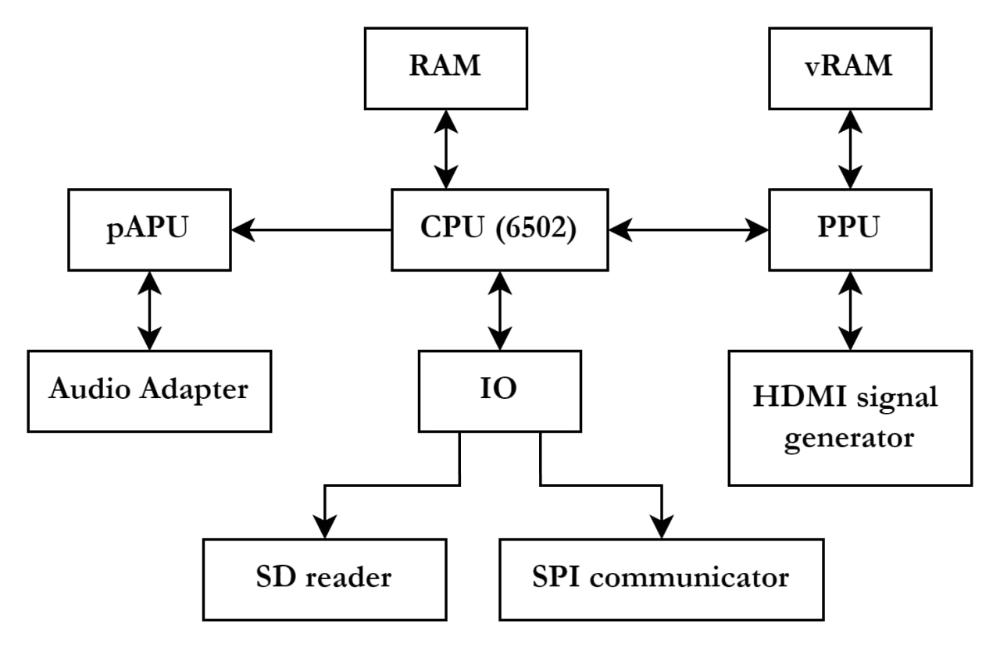

#### Idea and Overview

I propose to implement NES (Nintendo Entertainment System) on the FPGA as a SoC. The SoC will use a System Verilog 6502 CPU based on (https://github.com/Arlet/verilog-6502). Additionally, I will use System Verilog to implement PPU (Pixel Processing Unit), pAPU (pseudo Audio Process Unit), MMC (Multi-Memory Controller), RAM, and ROMs that is specified in NES documentation. My implementation will also include a custom SD card reader, SPI communicator, and HDMI signal generator for interfacing with game disk, USB keyboard, and HDMI display, respectively. My goal is to demonstrate my NES using USB keyboard and HDMI monitor, running popular NES game like Super Mario, The Legend of Zelda, etc.

#### Block Diagram

The vRAM is for the video memory, the IO is for coordinating differential peripheral that connected directly to CPU. Four peripheral are Audio, HDMI, SPI (to USB), SD (to game data).

#### List of Features

##### Baseline

* Receiving input from keyboard (A, B, Select, Start, Up, Down, Left, Right mapped to keyboard keys)
* Reading game disk file from SD card.
* Executing game using 6502 CPU.
* Outputting game graphics using PPU and HDMI signal generator.
* Outputting game audio using pAPU to the audio jacks.

##### Optional

* Support custom keyboard mapping
* Support actual control pad

#### Expected Difficulty

Extremely Hard (10/10). I need to implement CPU, PPU, pAPU, MMC, and the logic between them. I also need to implement customize peripheral for display, audio output, USB input, SD input. Everything need to be built from ground up, and there are no easy AXI4 bus and corresponding GPIO / Quad SPI module for me to use. I could some implementation of each module, and adapt them to my project. However, it's still extremely hard considering the module I need to implement and the logic between them.

Adding the optional feature will make it more difficult, as I need to add few more module to interfacing with peripheral.

#### Proposed Timeline

* First week, adapt 6502 CPU online, implement PPU
* Second week, instantiate RAM, ROM partially, implement minimal MMC to work. Implement basic HDMI signal generator that connected PPU
  * The FPGA now should be able to output basic shape and graphics for mid-point demo (I will write assembly in CPU to generate the graphic)
* Third week, finish MMC and HDMI output. Flash the RAM with the game image first, test if game could be run correctly (though there is no input so only the menu could be seen typically)
* Final week, implement USB input and SD reader, the NES should be fully implemented now.

