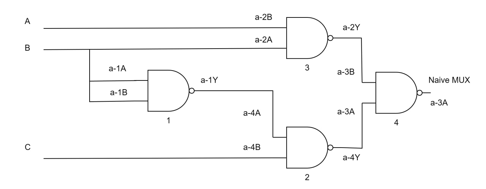
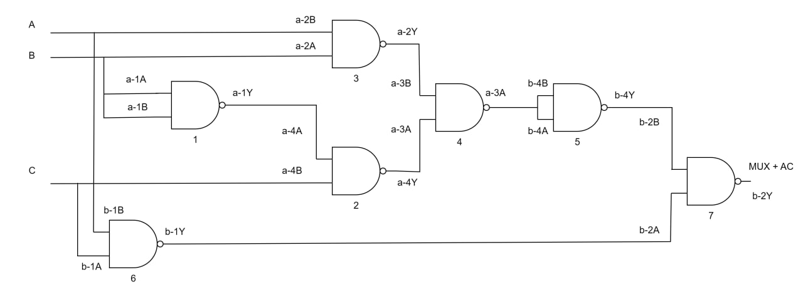
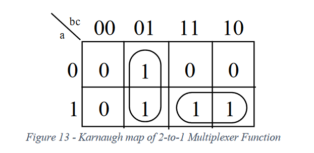
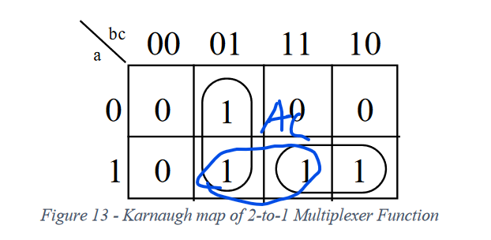
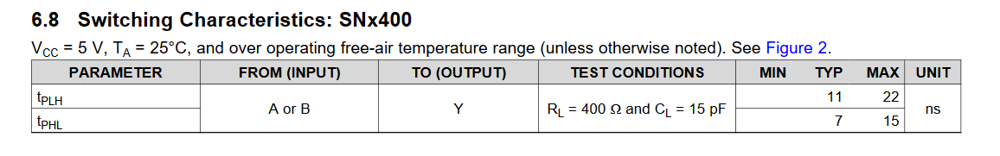
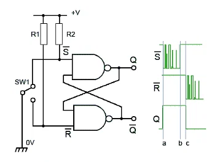
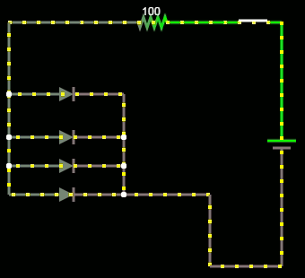

### Lab 1

#### Introduction

This lab report investigate the **static hazard** that happens in common logic circuit, and derive a way to fix it.

#### Circuit Description

The circuit "Naïve MUX" and "MUX + AC" are used to illustrate the static hazard and the ways to prevent it. Both circuit intended to built a 2-to-1 MUX where the B pin is the select pin, and A and C pin is the data pin. Set `B = LOW` will make the output equal to the"Naïve MUX", while set `B = HIGH` will make the output equal to the **Input C**. The difference between to circuit is that the "Naïve MUX" has the static hazard problem, which even when both **Input A** and **Input C** is `HIGH`, switch B from `HIGH` to `LOW` causes the output temporarily goes to `0` and then back to `1`. The "MUX + AC" doesn't suffer from this problem. 

#### Layout sheets

Note that input A is green, input B is yellow, input C is cyan. The grey wires are intermediate wires. (The blue capacitor is decoupling capacitor, this is adapted from Professor's circuit design)

#### Circuit Diagram

Note the label `a-1A` indicates the `TTL-pin` wiring showed in the layout sheet. (Might be beneficial for 1-1 comparison between these two representation). The NAND gate is labelled (by numbers) for later references.

The schematic for Naïve MUX. (The logic expression: Z = AB + B'C)

The schematic for MUX + AC. (The logic expression: Z = AB + B'C + AC).

#### Pre-Lab

>(Pre-Lab Part A): Not all groups may observe static hazards (why?) If you do not observe a static hazard, chain an odd number of inverters together in place of the single inverter from Figure 17 or add a small
>capacitor to the output of the inverter until you observe a glitch. Why does the hazard appear when you do this?

Read the Lab Q2's answer before reading this answer.

The reason some groups may not observe static hazards is because it's the delay of the $(1)$ NAND that created the time window for the static hazards. So, if you luckily (or unluckily in this case) get a $(1)$ NAND chip with almost 0ns delay (the manual indicates such possibility), or maybe get the $(2)$ NAND that have a really small delay so the bottom path reach the $(4)$ NAND around similar time with top path, then such time window will be really small, and you probably won't see the static hazards. When you chain multiple inverters together, it's unlikely that they will still have a `0ns` delay in total. The wires connecting them will also contribute to the delay, so you are likely to get a large enough delay at $(1)$ NAND to make time window appear and thus the static hazards to happen.

#### Lab

##### Truth Tables

The truth table for part A circuit:

| A    | B    | C    | Naïve Mux |
| ---- | ---- | ---- | --------- |
| 0    | 0    | 0    | 0         |
| 0    | 0    | 1    | 1         |
| 0    | 1    | 0    | 0         |
| 0    | 1    | 1    | 0         |
| 1    | 0    | 0    | 0         |
| 1    | 0    | 1    | 1         |
| 1    | 1    | 0    | 1         |
| 1    | 1    | 1    | 1         |

The truth table for part B circuit:

| A    | B    | C    | Mux + AC |
| ---- | ---- | ---- | -------- |
| 0    | 0    | 0    | 0        |
| 0    | 0    | 1    | 1        |
| 0    | 1    | 0    | 0        |
| 0    | 1    | 1    | 0        |
| 1    | 0    | 0    | 0        |
| 1    | 0    | 1    | 1        |
| 1    | 1    | 0    | 1        |
| 1    | 1    | 1    | 1        |

##### Oscillator Timings

###### Timing for Naïve MUX

The yellow signal is the input B, the purple signal is the **Naïve MUX**

###### Timing for MUX + AC

The yellow signal is the input B, the purple signal is the **MUX + AC**

##### Questions

###### (a)

>(LAB Part 4): Does it respond like the circuit of part A? 

There is nothing different between two truth tables (that's what we want, we want to solve the static hazard problem, but not change the logic / behavior of the circuit)

###### (b)

>Describe and save the output and explain any differences between it and the results obtained in
>part 2.

We see that for the **Naïve MUX** signal output, when the **input B** switched from **HIGH** to **LOW**, it goes to **LOW** for approximately $1\mu s$, and then it experience some noises and back to **HIGH** again (approximately $2\mu s$ after the **input B** switched)

We see that for the **MUX + AC** signal output, when the **input B** switched from **HIGH** to **LOW**, it **doesn't** go to **LOW**. It also experience some amount of noises (but less noisy when compared to **Naïve MUX**), the noise stops after approximately $2\mu s$ after the **input B** switched.

The reason why **Naïve MUX** will experience this glitch (the static hazard) is that the $(1)$ NAND gate in the circuit has a delay. This delay have created a time window where the $(3)$ NAND reads `A = HIGH, B = LOW`, and outputs `HIGH` , but the $(1)$ NAND still outputs `LOW` (the previous result) so that $(2)$ NAND reads `HIGH, LOW` and outputs `HIGH`. Finally, the $(4)$ reads `HIGH, HIGH` and outputs `LOW`. Once the $(1)$ NAND passes its delay, and updates its value, the result back to `HIGH` indicated on the truth table.

The reason why **MUX + AC** doesn't suffer this problem is that: consider the $(6)$ NAND on the bottom. Since **A** and **C** doesn't change here. So it's always outputting `LOW`. (No delay problem as it value doesn't even change in this case) For $(7)$ NAND, if one input is `LOW`, then no matter what other input is, it will always output `HIGH`. So, in this case, the output (**MUX + AC**) doesn't rely on $(1)$ NAND updating its value later, so we see **MUX + AC** doesn't go to **LOW** temporarily. 

(This is done by connecting to K-map together, adding AC)

###### (c)

>for the circuit of part A of the pre-lab, at which edge (rising/falling) of the input B are we more likely to observe a glitch at the output?

The switching from high to low have a 7ns typical delay and 15ns maximum delay. The switching from low to high have a 11ns typical delay and 22ns maximum delay. The glitch is caused by the time window created by $(1)$ NAND. So, if the rising edge is probably going to have more delay, and thus a high chance, statistically speaking, to create a time window and cause glitch at the output.

#### Post-Lab

##### (1)

>Given that the guaranteed minimum propagation delay of a 7400 is 0ns and that its guaranteed maximum delay time is 20ns, complete the timing diagram below for the circuit of part A. (See GG.17 if you are not sure how to proceed.

The gray box is the cross-hashed area used in the GG. The gray area's width is $20ns$. 

##### (2)

>Explain how and why the debouncer circuit given in General Guide (Figure 22) works. Specifically, what makes it behave like a switch and how the ill effect of mechanical contact bounces is eliminated?

A good reference is https://edurev.in/t/99686/Switch-De-Bouncing-S-R-Flip-Flops. This circuit is a SR Flip-Flop. 

and this graph illustrates what has happened.

We will switch from one side to another, say from $R$ to $S$, the $R$ will then receive `HIGH` value from the source, and the switch will likely bounce at $S$ pin, making it switching from `HIGH` to `LOW`. Good thing is, once the NAND receive long enough `LOW` signal input from $S$ pin, it will make the `Q' = 1`, and later bouncing between `HIGH` to `LOW` won't have any effect because a `R = HIGH, S = HIGH` won't make any change to the output. (Unless it bounces so big that it connects back to $R$, in that case it's more a mechanical problem that you really need to fix your switch instead). So, all the bouncing are "hided" by the flip-flop, and you will only get a one signal change (either from `HIGH` to `LOW` or from `LOW` to `HIGH`) in the output pin. 

#### From General Guide

##### (a)

>(From GG 7): What is the advantage of a larger noise immunity? Why is the last inverter observed rather than simply the first? Given a graph of output voltage (VOUT) vs. input voltage (VIN) for an inverter, how would you calculate the noise immunity for the inverter? See the following figure.

As we have seen in the figure, if we have a large noise immunity, we could still output the correct value even if the input value is far of from the center of the nominal "1" / "0" range. 

As we have seen from the illustration in the GG. Taking noise immunity for logic "1" as an example. We first need to know the value for the center of the nominal "1" range (which usually could be found in the manual). Since the example used here is an inverter. The normal output we should get is "0" in this case. So, we want to find out how low the $V_{in}$ could reach before the $V_{out}$ leave the nominal range of "0". Calculate the difference (a positive number) between this specific $V_{in}$ and the a value for the center of the nominal "1" range. That is the noise immunity for logic "1". Same reasoning could be applied for "0" to get the noise immunity for logic "0".

##### (b)

>Irrespective of which polarity you choose for your LEDs, it is important that each LED has its own resistor. If we have two or more LEDs to monitor several signals, why is it bad practice to share resistors?

A good reference is https://electronics.stackexchange.com/questions/22291/why-exactly-cant-a-single-resistor-be-used-for-many-parallel-leds. 

Connecting multiple LEDs to one single resistor will cap the overall current flow at certain value (as basic $I = V/R$ indicates) through all the LEDs, In ideal situation, this won't cause too much a problem, as the LEDs will evenly divide the current so each of them only looks a dimmer than usual. However, since there are difference between LEDs (slight manufacturer difference), some LED will have lower forward voltage, and therefore will carry more current than other. This could potentially make other LED stop to light up when they actually should light up to indicates the signal in the circuit. Also, this could potentially cause too much current to flow through one single LED and break it.

#### Conclusions

We have seen that the static hazard problem appeared in the circuit, and causing some temporary invalid output from the circuit (Naïve MUX), we also see a way of solve problem (connecting the K-map together, used for MUX + AC) circuit. For future work, we could try to analyze different common circuit and analyze, and potentially fix, the static hazard problem in them.  