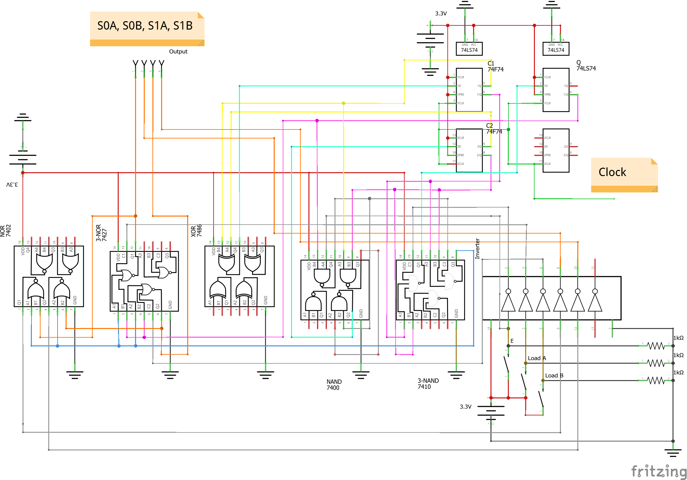
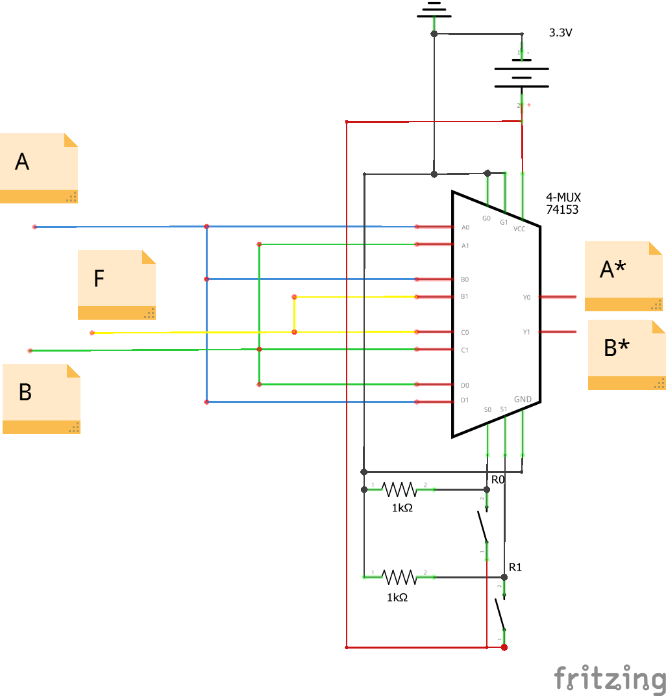
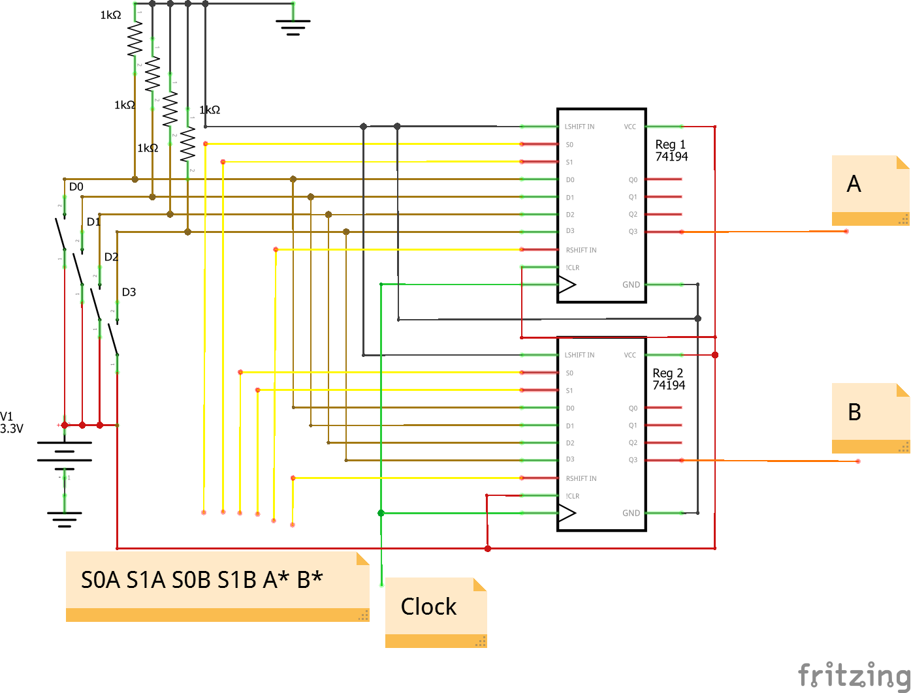
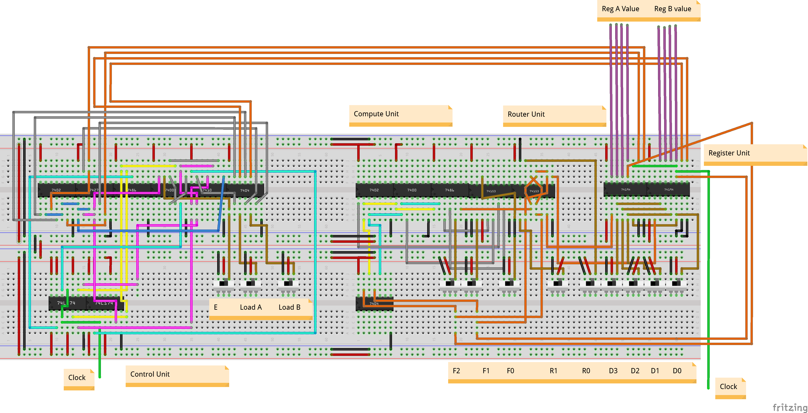
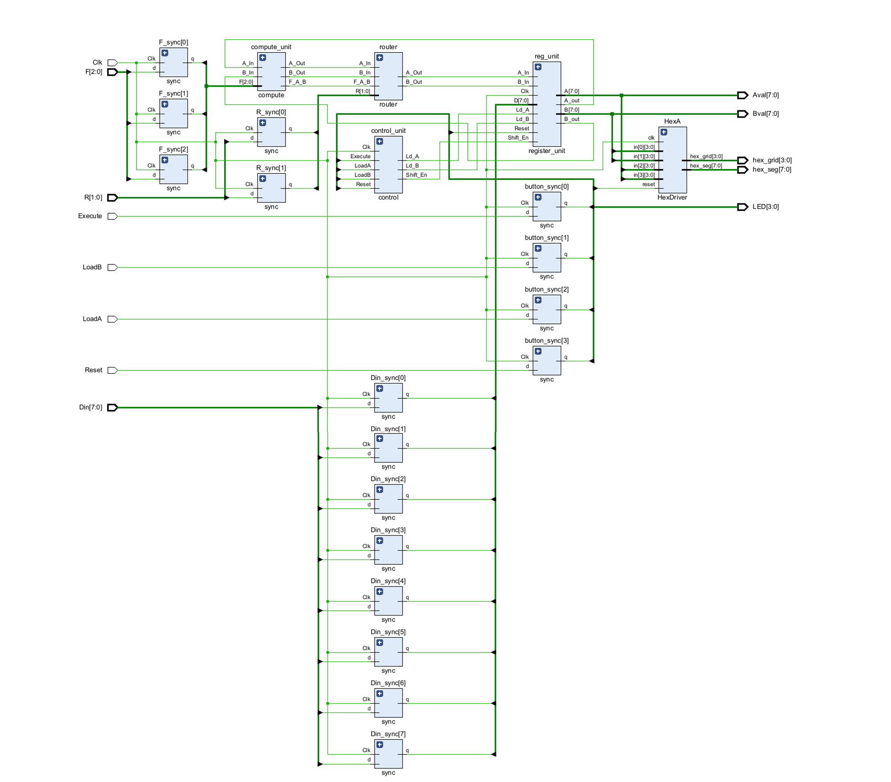
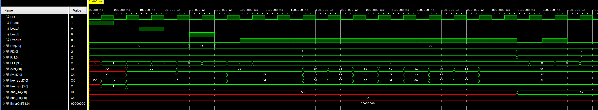
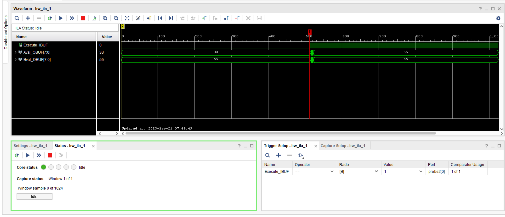

#### Disclaimer

The document is written where each quoted question has answer below it. This is intended to help quicker and easier grading. It has been best-effort, but there is no guarantee, that the answer will only appear under that specific question. Please grade each question on all the content appeared in the report.


>Summarize what high-level function your circuit performs. What operations can the processor do? How many bits can it operate on? etc. The introduction should be approximately 3 - 5 sentences.

### Introduction

The processor could perform 8 types of 4-bit bitwise operation. Two 4-bit shift registers is used to store the operands and results. The ALU in the processor is 1-bit so a control unit is used to perform the bitwise operation sequentially in 4 cycles. The processor also has a router unit that could direct the result to the register in 4 ways.


### Operation of the logic processor

For the input, there are

* **F[2:0]**: 3-switch switch group for **operation type** (8 types)
* **R[1:0]**: 2-switch switch group for **routing type** (4 types)
* **E**: 1-switch for **execution switch**
* **D[3:0]**: 4-switch switch group for the **4-bit data** to be loaded into registers.
* **Load A, Load B**: 2-switch switch group for to select whether the data in **D[3:0]** should be loaded into corresponding registers.

#### Load

>Describe the sequence of switches the user must flip to load data into the A and B registers.

The load is implemented as synchronous. Do

* Turn on **Load A**, then switch **D[3:0]** to the desired value for **A** register. Wait for one cycle for the data to be loaded.
* Then turn off **Load A**, turn on **Load B**, then switch **D[3:0]** to the desired value for **B** register. Wait for one cycle for the data to be loaded
* Notice, you could only load at initial state (not when computation is happening)

#### Compute

 >Describe the sequence of switches the user must flip to initiate a computation and routing operation.

* Using the table below, switch **F[2:0]** and **R[1:0]** to the desired operation and routing you want.

$$
\begin{array}{|c|c|c|}
\hline 
\begin{array}{}
\text{Function} \\
\text{Selection Inputs}
\end{array}
&
\begin{array}{}
\text{Computation} \\
\text{Unit Output}
\end{array}
\\
\hline
\begin{array}{ccc}
\text F_2 && \text F_1 && \text F_0
\end{array}
&
\begin{array}{c}
\text{$f$(A, B)}
\end{array}
\\
\hline
\begin{array}{ccc}
0 \ && \ 0 \ && \  0 \\
0 \ && \ 0 \ && \  1 \\
0 \ && \ 1 \ && \  0 \\
0 \ && \ 1 \ && \  1 \\
1 \ && \ 0 \ && \  0 \\
1 \ && \ 0 \ && \  1 \\
1 \ && \ 1 \ && \  0 \\
1 \ && \ 1 \ && \  1 \\
\end{array}
&
\begin{array}{}
\A \text{ AND } \B \\
\A \text{ OR } \B \\
\A \text{ XOR } \B \\
1111 \\
\A \text{ NAND } \B \\
\A \text{ NOR } \B \\
\A \text{ XNOR } \B \\
0000 \\
\end{array}
\\
\hline
\end{array} \\
\qquad \quad
\begin{array}{|c|c|c|}
\hline 
\begin{array}{}
\text{Function} \\
\text{Selection}
\end{array}
&
\begin{array}{}
\text{Router} \\
\text{Output}
\end{array}
\\
\hline
\begin{array}{cc}
R_2 && R_1
\end{array}
&
\begin{array}{c}
\A^* && \B^*
\end{array}
\\
\hline
\begin{array}{ccc}
0 \ && \ 0 \\
0 \ && \ 1 \\
1 \ && \ 0 \\
1 \ && \ 1 \\
\end{array}
&
\hline
\begin{array}{ccc}
\A \ && \ \B \\
\A \ && \ \text F \\
\text F \ && \ \B \\
\B \ && \ \A \\
\end{array}
\\
\hline
\end{array} \\
$$

* Turn on the **E** for at least one clock cycle, you could leave it on or turn it off afterwards. Leaving **E** on the on state will not let the processor do multiple instructions, you need to turn it off first and then turn it on. 

### Block Diagram & State Machine Diagram

#### Block Diagram

>Include a high-level block diagram. It is acceptable to use the one in the lab manual, provided it is modified as necessary to reflect what you implemented.


>Written description: describe in words each block in the high-level diagram (a short paragraph for at least the register unit, computation unit, routing unit, and control unit).

The **Register Unit** used **two shift-registers** to store the operand and result, for my implementation, I used `CD74HC194` shift-register. 

* Input: This register require two control pin to control its load, shift, and hold. The **S0A**, **S1A** is for **Register A**, and **S0B**, **S1B** is for **Register B**. The **D[3:0]** will be loaded to corresponding register accordingly.
* Output: I use shift-right for the shift-register. The **A**, **B**, is the rightmost bit in the register, which is provided to **Computation Unit** and **Routing Unit**.

The **Computation Unit** will do 1-bit bitwise operation specified by its input **F[2:0]**, the output **f(A, B)** will go to routing unit.

The **Routing Unit** will return **A\* ** and **B\*** according to its input **R[1:0]**, the output will go back to the left-most bit into the **Register Unit**.

The **Control Unit** used a **Mealy Machine** inside, it will read its input, and control the register behavior based on its output. It will

* Start the execution once detect **Execution** input. The computation will then be done in 4 cycles. The **Execution** input is ignored during this time.
* Once it finishes the computation, it will return to its initial state **only if** the **Execution** input is lowered. You could not start a new computation unless it is in its initial state.
* **Only** at initial state, you could use **Load A / B** together with **D[3:0]** to load data into register unit. 

#### State Machine Diagram

> Explicitly state if you used a Mealy or Moore machine (or some hybrid)

**Mealy Machine**


The trigger condition and new state is listed below. We store **Q**, **C$_\bold 1$**, **C$_\bold 2$** using flipflop. Note:

>Give each state / arc a meaningful name.

* $\text{E}$ stands for the **Execution** that goes to **Control Unit**. 

>Specify the binary flip-flop values associated with each state.

* $\text{Q}$ stands for the current state of **Mealy Machine**, where 0 $=$ **Init(ial)**, and 1 $=$ **Comp(utation)**. 
* C$_1$, C$_2$ means Counter-1, Counter-2. 
* L$_i$, S$_{0i}$, S$_{1i}$, when $i$ = A, means Load A, S$_{0A}$, S$_{1A}$, when $i = B$, means Load B, S$_{0B}$, S$_{1B}$

>Label each arc.

* I$_{0 - 4}$ means the *intermediate (computing) state*.
* W means *waiting for input*. R means *return to initial state*. H means *holding current state*. 
* The state with $+$ means its next state value. (i.e., the will replace the previous state at next clock edge)
* The S indicates whether we should shift our registers. 

>If you are using a Mealy Machine, label the values of all meaningful outputs associated with each arc.

* The second column group is the state machine input, the third column group is its output.

>The combination of inputs which trigger the arc.

* The **Arcs** column on the left table means which arc we go through under the particular combination of input. The invalid input combination / arcs are labelled $\cross$. 
* The **Arcs** column on the right table indicates which arcs could possibly have this specific input combination. (Together with **Mode** column it is good for making sure our logic table is correct)
* Since I am using `CD74HC194` shift-register, as mentioned, each register requires two pins to control. We need to calculate the two control pin from S, Q, L$_i$ (Load A / Load B):

$$
\begin{array}{|c|cccc|cccc|}
\def\d{\text{d}}
\hline
\text{Arcs} &
\text{E} & \text{Q} & \text{C$_1$} & \text{C$_2$} &
\text{S} & \text{Q$^+$} & \text{C$_1^+$} & \text{C$_2^+$} 
\\ \hline
\text{W}     & 0 & 0 & 0 & 0 & 0 & 0 & 0 & 0     \\ \hline
\cross       & 0 & 0 & 0 & 1 & \d & \d & \d & \d \\ \hline
\cross       & 0 & 0 & 1 & 0 & \d & \d & \d & \d \\ \hline
\cross       & 0 & 0 & 1 & 1 & \d & \d & \d & \d \\ \hline
\text{R}     & 0 & 1 & 0 & 0 & 0 & 0 & 0 & 0     \\ \hline
\text{I$_1$} & 0 & 1 & 0 & 1 & 1 & 1 & 1 & 0     \\ \hline
\text{I$_2$} & 0 & 1 & 1 & 0 & 1 & 1 & 1 & 1     \\ \hline
\text{I$_3$} & 0 & 1 & 1 & 1 & 1 & 1 & 0 & 0     \\ \hline
\text{I$_0$} & 1 & 0 & 0 & 0 & 1 & 1 & 0 & 1     \\ \hline
\cross       & 1 & 0 & 0 & 1 & \d & \d & \d & \d \\ \hline
\cross       & 1 & 0 & 1 & 0 & \d & \d & \d & \d \\ \hline
\cross       & 1 & 0 & 1 & 1 & \d & \d & \d & \d \\ \hline
\text{H}     & 1 & 1 & 0 & 0 & 0 & 1 & 0 & 0     \\ \hline
\text{I$_1$} & 1 & 1 & 0 & 1 & 1 & 1 & 1 & 0     \\ \hline
\text{I$_2$} & 1 & 1 & 1 & 0 & 1 & 1 & 1 & 1     \\ \hline
\text{I$_3$} & 1 & 1 & 1 & 1 & 1 & 1 & 0 & 0     \\ \hline
\end{array} \\
\qquad \quad 
\begin{array}{|c|ccc|cc|c|}
\hline 
\text{Arcs} & 
\text{S} & \text{Q} & \text{L}_i & 
\text{S}_{1i} & \text{S}_{0i} & 
\text{Mode}
\\ \hline
\text W & 0 & 0 & 0 & 0 & 0 & \text{Hold} \\ \hline 
\text W & 0 & 0 & 1 & 1 & 1 & \text{Load} \\ \hline
\text {R, H} & 0 & 1 & 0 & 0 & 0 & \text{Hold} \\ \hline
\text {R, H} & 0 & 1 & 1 & 0 & 0 & \text{Hold} \\ \hline
\text I_0 & 1 & 0 & 0 & 0 & 1 & \text{Shift}\\ \hline
\text I_0 & 1 & 0 & 1 & 0 & 1 & \text{Shift}\\ \hline
\text I_{1-3} & 1 & 1 & 0 & 0 & 1 & \text{Shift}\\ \hline
\text I_{1-3} & 1 & 1 & 1 & 0 & 1 & \text{Shift}\\ \hline
\end{array}
$$

### Circuit Schematic Diagram

>If the schematic becomes too large, components such as the control unit can be represented as black boxes on the top-level schematic, and a detailed schematic of that component can be included below.

For the top-level schematic, refer to the black diagram. It provides input-output interfacing for the main components.

#### Control Unit

>Written procedure of the design steps taken.

Our control unit contains 3 flip-flop (Q, C$_1$, C$_2$). (For $\Ci$ and $\Cii$, I choose to use flip-flop instead of 4-bit counter provided)  and we need to implement the truth table stated above. We use K-map to determine the formula for S, Q$^+$, C$_1^+$, C$_2^+$, S$_{1i}$, S$_{0i}$. 

>Written description of the design considerations taken (did you consider multiple implementations of the same circuit and the tradeoffs of each?)

There are actually **4-bit** counter to use. However, I choose to store the data on my own in the flip-flop, because the counter require some control pins, and you need to reset it when it counts to 3. This seems more complicated than just keeping $\Ci$ and $\Cii$ and update them manually.

>K-maps. Transformations required to ‘map’ the logic expressions to the discrete logic chips in your kit 

For $\text S$, $\Qp$


We see that $\text{S} = \text E\oQ + \text C_1 + \text C_2$, $\text Q^+ = \text E + \text C_1 + \text C_2$.

For C$_1^+$, C$_2^+$


We see that $\text C_1^+ = \text C_1 \oplus \text C_2$, $\text C_1^+ = \text E \oQ + \text C_1 \oCii$

For $\Sii$, $\Si$


We see that $\Sii = \oS\Q\Li$, $\Si = \S + \Sii$
$$
\def\E{\text{E}}
\def\Q{\text{Q}}
\def\Qp{\text{Q}^{+}}
\def\S{\text{S}}
\def\Cip{\Ci^+}
\def\Ciip{\Cii^+}
\def\Ci{\text{C}_1}
\def\Cii{\text{C}_2}
\def\C{\text{C}}
\def\NOR{\text{NOR}}
\def\NAND{\text{NAND}}
\def\XOR{\text{XOR}}
\def\NOT{\text{NOT}}
\def\oE{\overline\E}
\def\oQ{\overline\Q}
\def\oCi{\overline\Ci}
\def\oCii{\overline\Cii}
\def\Sii{\S_{1i}}
\def\Si{\S_{0i}}
\def\iNAND{\text{3-}\NAND}
\def\L{\text{L}}
\def\Li{\L_{i}}
\def\oS{\overline\S}
\def\oL{\overline\L}
\def\oLi{\overline\Li}
\def\iNOR{\text{3-}\NOR}
$$
Now we get the logic write in **OR**, **AND**, **NOT**, **XOR**, we do need to change them to use **NOR**, **NAND**, **NOT**, **XOR**, **3-NAND** since we only have these gates. The $\oQ$, $\oCi$, $\oCii$ is already provided by the flip-flop 
$$
\begin{align}
\oE &= \NOT(\E) \\
\overline{\E\oQ} &= \NAND(\E, \oQ) \\
\overline{\Ci\oCii} &= \NAND(\Ci, \oCii) \\
\S &= \E\oQ + \Ci + \Cii = \overline {(\overline{(\E \oQ)} \cdot \oCi \cdot \oCii)} = \iNAND(\overline{\E\oQ}, \oCi, \oCii) \\
\Qp &= \E + \Ci + \Cii = \overline {(\oE \cdot \oCi \cdot \oCii)} = \iNAND(\oE,\oCi,\oCii) \\
\Cip &= \Ci \oplus \Cii = \XOR(\Ci, \Cii) \\
\Ciip &= \E\oQ + \Ci\oCii = \overline{(\overline {\E\oQ} \cdot \overline{\Ci\oCii} )} = \NAND(\overline{\E\oQ}, \overline{\Ci\oCii})\\
\Sii &= \oS\Q\Li = \overline{(\S + \oQ + \oLi)} = \iNOR(\S, \oQ ,\NOT(\Li)) \\
\Si &= \S + \Sii = \overline{\overline{(\S + \Sii)}} =  \NOT(\NOR(\S, \Sii))
\end{align} \\
$$

Notice the $\Sii$ and $\Si$ need to be repeated twice for both A and B.

We need

* 5 **NOT** `CD74AC04E`
* 2 **NOR** `CD74AC02E`
* 2 **3-NOR** `SN74HC27N`
* 1 **XOR** `SN74HC86N`
* 2 **3-NAND** `SN74HC10`
* 3 **NAND** `CD74AC00E`

Implement the logic, we get the schematic

>Detailed Circuit Schematic



Each wire has color

* Source is in <span style="color:red">Red</span>, Ground is in <span style="color:black">Black</span>. Clock is in <span style="color:lightgreen">Green</span>
* Data from flip-flop is in <span style="color:yellow">Yellow</span>, Inverted Data is in <span style="color:magenta">Pink</span>.
* The next state is in <span style="color:cyan">Cyan</span>.
* Input is in <span style="color:brown">Brown</span>. Output is in <span style="color:orange">Orange</span>. Intermediate wire is in <span style="color:gray ">Gray</span>.

For the sake of simplicity, each unconnected pin is left untouched. In real case, they should be connected either ground or source. Also, each chip should have decoupling capacitors.

#### Computation Unit

>Written description of the design considerations taken (did you consider multiple implementations of the same circuit and the tradeoffs of each?)

One easy shortcut we immediately observed is that the last four operation is just the inversion of the first four operation, which means we only need implement the first four operation, and then invert them when $\text F_{2}$ is $1$. The conditional inversion could be done using an XOR gate.

$$
\def\A{\text{A}}
\def\B{\text{B}}
\def\oA{\overline \A}
\def\oB{\overline \B}
$$

>Written procedure of the design steps taken. K-maps. Transformations required to ‘map’ the logic expressions to the discrete logic chips in your kit 

We see that
$$
\begin{align}
\oA &= \NOT(\A)\\
\oB &= \NOT(\B)\\
\A\B &= \overline{(\oA + \oB)} = \NOR(\oA, \oB) \\
\A+\B &= \overline{(\oA\cdot \oB)} = \NAND(\oA, \oB) \\
\A \oplus \B &= \XOR(\A, \B) \\
\text{I} &= \text{4-MUX}(\text F_1 \text F_0, \A\B, \A+\B, \A\oplus\B, 1) \\
f(\A, \B) &= \XOR(\text F_2, \text I)
\end{align}
$$
So, we need

* 2 **NOT** gate `CD74AC04E`
* 1 **NOR** gate `CD74AC02E`
* 1 **NAND** gate `CD74AC00E`
* 2 **XOR** gate `SN74HC86N`
* 1 **4-MUX** component `SN74HC153N`

Implement the logic, we get the schematic

>Detailed Circuit Schematic


Each wire has color

* Source is in <span style="color:red">Red</span>, Ground is in <span style="color:black">Black</span>. Clock is in <span style="color:lightgreen">Green</span>
* Data A is in <span style="color:yellow">Yellow</span>,  Data B is in <span style="color:cyan">Cyan</span>.
* Input is in <span style="color:brown">Brown</span>. Output is in <span style="color:orange">Orange</span>. Intermediate wire is in <span style="color:gray ">Gray</span>.

For the sake of simplicity, each unconnected pin is left untouched. In real case, they should be connected either ground or source. Also, each chip should have decoupling capacitors.

#### Router Unit

We see that the routing unit could be implemented by only 2 **4-MUX** component `SN74HC153N`:
$$
\A^* = \text {4-MUX}(\text R_1 \text R_0 , \A, \A, \text F, \B) \\
\B^* = \text {4-MUX}(\text R_1 \text R_0 , \B, \text F, \B, \A) \\
$$
Implement the logic, we get the schematic

>Detailed Circuit Schematic



Each wire has color

* Source is in <span style="color:red">Red</span>, Ground is in <span style="color:black">Black</span>. 
* Data A is in <span style="color:blue">Blue</span>, Data B is in <span style="color:lightgreen">Green</span>, Data F is in <span style="color:yellow">Yellow</span>.

For the sake of simplicity, each unconnected pin is left untouched. In real case, they should be connected either ground or source. Also, each chip should have decoupling capacitors.

#### Register Unit

>Written description of the design considerations taken (did you consider multiple implementations of the same circuit and the tradeoffs of each?)

There are two register available to choose, one is that `CD74HC195`, one is `CD74HC194`. Since I implemented synchronous load, `CD74HC195` will require 3 control pins to control, where `CD74HC194` only requires two. One advantage of  `CD74HC195` is that it provides the invert of the **A** and **B**, which could save two **NOT** gates in the computation unit. However, since it require an extra pin to control, it will complicate our control unit, which is already extremely complex. Therefore, I choose the `CD74HC194`.

>Detailed Circuit Schematic



Each wire has color

* Source is in <span style="color:red">Red</span>, Ground is in <span style="color:black">Black</span>. Clock is in <span style="color:lightgreen">Green</span>
* Data from other parts is in <span style="color:yellow">Yellow</span>, 
* Input is in <span style="color:brown">Brown</span>. Output is in <span style="color:orange">Orange</span>. Intermediate wire is in <span style="color:gray ">Gray</span>.

For the sake of simplicity, each unconnected pin is left untouched. In real case, they should be connected either ground or source. Also, each chip should have decoupling capacitors.

### Breadboard View

>* You should have no air-wires, all your wires should be visible – though they may be a little bit cluttered as the design is complex.
>* You may use the ‘breadboard label’ or ‘note’ to label the inputs, it is not necessary put all the switches into the breadboard view (you may if you want).
>* Similarly, you may use breadboard label to label the outputs (for the LEDs), you do not need to put in the physical LED strip (you may if you want).
>* If you wish to avoid having too many crossing wires, you may use ‘breadboard label’ to make virtual connections.
>* Use multiple breadboards as necessary, your breadboard view should be complete, in the sense that someone should be able to build a working version of the circuit with only your breadboard view.



For the sake of simplicity, each unconnected pin is left untouched. In real case, they should be connected either ground or source. Also, each chip should have decoupling capacitors.

The chip number is (it's not very clear from the picture)

```
7402, 7427, 7486, 7400, 7430, 7404 ...... 7402, 7400, 7486, 74153, 74153 ... 74194, 74194
74LS74, 74LS74 ...... 7404
```

The wire coloring followed the schematics' coloring. The notes indicates where is each unit, and what value each switch controls. The **Reg A Value** and **Reg B Value** on the top indicates the Register Value out for the LED (not shown in breadboard)


### 8-bit Logic Processor on FPGA

#### Module Summary

> Summary of all .SV modules and the changes you made to extend the processor to 8-bits. Specifically, you need to describe even modules which were provided, but you did not create.

##### compute.sv

```
Inputs:
	[2:0] F,
	A_In, B_In,
Outputs:
	A_out, B_out, F_A_B
```

Description: This is a 1-bit bitwise ALU. The `F` is used to select specific operation (see table aforementioned). `A_In` and `B_In` is the input operand. `A_out` and `B_out` is just `A_in` and `B_in` unchanged. `F_A_B` is the specified operation result based on `A_in`, `B_in`.

Purpose: It's the computation unit in the 8-bit logic processor

##### Control.sv

```
Inputs:
	Clk, Reset, LoadA, LoadB, Execute
Outputs:
	Shift_En, Ld_A, Ld_B
```

Description: This is 8-bit control unit extended from the previously mentioned 4-bit control unit. It's behavior is similar to the 4-bit counterpart (see previous description) , except it will take 8 cycles for the computation now.

Purpose: It's the control unit in the 8-bit logic processor

##### HexDriver.sv

```
Inputs:
	clk, reset,
	[3:0] in[4],
Outputs:
	[7:0] hex_seg,
	[3:0] hex_grid
```

Description: Given 4 x **4-bit** data `[3:0] in[4]`, it will generate correct `hex_seg` and `hex_grid` which will be used to display data on the FPGA board.

Purpose: Display the 8-bit logic processor's register on the FPGA's Segment LED display.

##### Processor.sv

```
Inputs:
	Clk, Reset, LoadA, LoadB, Execute,
	[7:0] bin,
	[2:0] F,
	[1:0] R,
Outputs:
	[3:0] LED,
	[7:0] Aval, Val,
	[7:0] hex_seg,
	[3:0] hex_grid
```

Description: This is the module where all the smaller unit are grouped together. It will read inputs from FPGA's push button, and dispatch data to each unit accordingly, and put the result in the FPGA's hex display.

Purpose: Grouped all units, this forms the complete 8-bit processor' register ready for input from FPGA, and display's result in the Hex Display.

##### Reg_4.sv

```
Inputs:
	Clk, Reset, Shift_In, Load, Shift_En,
	[3:0] D
Outputs:
	Shift_Out,
	[3:0] Data_Out
```

Description: This is a original 4-bit shift register. It takes the new shift-in data, and shift it when `Shift_En` is 1. It could also load `[3:0] D` when `Load` is on.

Purpose: It does not get used in 8-bit logic processor, but it left there originally as an example.

##### Reg_8.sv

```
Inputs:
	Clk, Reset, Shift_In, Load, Shift_En,
	[7:0] D
Outputs:
	Shift_Out,
	[7:0] Data_Out
```

Description: This is a 8-bit shift register. Its behavior is identical to the 4-bit one except it store 8-bit data now.

Purpose: It used by `Register_unit.sv`, which is the Register Unit for the 8-bit logic processor

##### Register_unit.sv

```
Inputs:
	Clk, Reset, A_In, B_In, Ld_A, Ld_B, Shift_En
	[7:0] D,
Outputs:
	A_out, B_out,
	[7:0] A, B
```

Description: There are two 8-bit registers in the register unit. It's behavior is identical to the 4-bit register unit previously mentioned, except now its register stores 8-bit value.

Purpose: The Register Unit for the 8-bit logic processor, used to store operand and result data.

##### Router.sv

```
Inputs:
	[1:0] R
	A_In, B_In, F_A_B,
Outputs:
	A_Out, B_Out
```

Description: The router is still the same as 4-bit version. Its output `A_Out` and `B_Out` is decided by the `[1:0] R`, the specific routing each R value corresponds to is listed previously in a table.

Purpose: The Routing Unit for 8-bit logic processor, used to route data into different register in Register Unit.

##### Synchronizers.sv

There are multiple smaller module in there.

* sync: `Inputs: Clk, d, Outputs: q`. It will sync the output `q` with `d` at positive edge of `Clk`
* sync_r0: `Inputs: Clk, Reset, d, Outputs: q`. If `Reset = 1`, then it will always set `q = 0`, otherwise it will sync the output `q` with `d` at positive edge of  `Clk`.
* sync_r1: `Inputs: Clk, Reset, d, Outputs: q`. If `Reset = 1`, then it will always set `q = 1`, otherwise it will sync the output `q` with `d` at positive edge of  `Clk`. 

#### RTL block diagram

> please only include the top-level design if using the RTL viewer.



#### Simulation Annotation

>Include a simulation of the processor that has notes (annotations) that give information such as what operation is being performed, where the result was stored, etc.



We could see that initially the `Reset` set all the Register to 0, making `AVal[7:0]` and `BVal[7:0]` all `00`. Then a `Load A`  makes `AVal = 33`, and a `Load B` makes `BVal = 55`. Then the `Execution` is enabled to let the process to run `F = 2` (**XOR**) between A and B, and `R = 2` to make the B unchanged while the result get stored to A. After 8 value changes (8 cycles), the value `66` get stored in A while B retains its value 55. 

We may notice that after `Reset/LoadA/LoadB` get enabled, there will be a 1 cycle delay when the processor actually do the command. This because these input are `sync`ed, so updating themselves require 1 cycle. 

#### Debug Core Trace

##### Setup

>Include procedure used to generate Vivado Debug Core trace, as well as the result of such trace executing an example operation. E.g.: “Step 1, Set the
>trigger on signal <signal here>…”

* Open Synthesis > Open Synthesized Design > Schematic
* On the Netlist, click the wires that you want to set debug on. Right click it, select "Assign to Debug Port".
* A window will pop up, you should change probe type according to your needs. For our case, we probed A_OBUF, B_OBUF, Execute_IBUF. We set probe type for first two to Data, and last Data & Trigger. This is because we want the Debug Core to capture the instant when we enable the Execute, so we could see the data change before and after.
* Re-run the Synthesis, you should be able to see a debug probe on the synthesized design now/
* Program your FPGA board, a waveform window should show up.
* There is a window called Trigger Setup. Change Execute_IBUF trigger operator to `==`, and trigger value to `1`.
* Load your register with data, click start button, the capture status should now be at 50%.
* Click the Execute button on your FPGA board, you should now see the waveform on the waveform window. The debug core captures the data in Register A and B before and after the execution is enabled.

##### Example

>Include the output of the debug core trace performing an operation on the 8-bit logic processor (this doesn’t need to be the same operation as the one your TA asked to demonstrate, but it needs to be non-trivial).



A(before) = 0x33, B(before) = 0x55. P = 0x2 (XOR), R = 0x2 (Result to A, B unchanged).

A(after) = 0x66, B(after) = 0x55

### Bugs and Fixes

Note: there are also other bugs discussed and talked within whole report.

One annoying bug I have faced is that the some logic will sometimes work, while sometimes not. I figure this out that when we the switch must need to have either a pullup resistor or a pulldown resistor to make sure the input value is always 0 or 1. Also when you connecting the wire to LED, you need to add a resistor before the LED, so that it won't lower the data value to a point that makes the logic state read wrong value.

### Conclusion

#### Summarize

> Summarize the lab in a few sentences.

In this lab, we implemented a 4-bit bitwise processor with modular designs. We learnt the use of K-map and logic expression transformation when implementing the Computation Unit and Control Unit. We later on extends our 4-bit design to 8-bit processor in Vivado. We learnt the basic syntax of System Verilog, and the basic programming, setup , debug, etc., in the Vivado. 

#### Post-Lab Questions

#### (a)

> Document changes to your design and correct your Pre-Lab write-up, explaining any difficulties you had in debugging your circuit. Outline how the modular approach proposed in the pre-lab helps you isolate design and wiring faults, be specific and give examples from your actual lab experience.

The shift-register provided to us need to use 2 pins to control is loading/holding/shifting. In the lab handouts, we are only given the S output, transforming form S to these two pins takes some debugging, since I draw the K-map wrong few times. With modular approach, what I did is that I build each unit one by one, and they test their operation one by one. This helped me to detect the K-map problem easier since I already unit tested other unit, and they are working. I could pinpoint the problem in the circuit quicker using the modular approach design.

#### (b)

> Describe the simplest (two-input one-output) circuit that can optionally invert a signal (i.e., one input determines if the output is equal to the other input or equal to the other input inverted). Explain why this is useful for the construction of this lab.

Suppose the two input is **Data** and **Swap**. Then the simplest is the
$$
\text{Output} = \XOR(\text{Data}, \text{Swap})
$$
As previously when we implements the **Computation Unit**, we could use this trick to get the bottom four operations by just doing a single $\XOR$ gate. (Almost for free). This reduces the number of gates needs to be used on **Computation Unit** significantly. 

#### (c)

>Explain how a modular design such as that presented above improves testability and cuts down development time.

Modular Design usually separate our concern by dividing a bigger problem / task into smaller one. This could make us focus on one specific task for each unit, and without too much overall general concerns, the development speed could be faster. Also, since we could do unit-test on each circuit, their states and behaviors are less complicated than combining the whole circuit all together. We could then write a more detailed unit test that check individual unit's exact output behavior. (This is not achievable if you test whole circuit together, if you throw in one test case, and there is an error, you don't know is that routing module routes the output wrong, or is the computation unit does something wrong. The unit test simply provide more information for each test you do). Therefore, we are more probable to write unit test that are covers larger situations, and therefore validate the circuits' behaviors more reliably, and narrow down any bug easier. (Increase of testability) This could save our debug (development) time.

#### (d)

>Discuss the design process of your state machine, what are the tradeoffs of a Mealy machine vs a Moore machine?

Mealy machine usually has less state than Moore machine, which means we could use less flip-flops. However, the state diagram of the Mealy machine will usually look more complicated and harder to grasp. The Mealy machine could have multiple arcs on single state, and it usually involves managing an external state. This usually, if not careful, leads to more errors and bugs when implementing it. The next state calculation for Moore machine usually simple, while the Mealy machine takes usually more gates to do the next state calculation.

#### (e)

>What are the differences between vSim and Vivado Debug Cores? Although both systems generate waveforms, what situations might vSim be preferred and where might debug cores be more appropriate?

vSim is a simulation of the circuit we designed. For now, we only used the behavior simulation. This will ignore the delay problems, and only check the circuit's logic. Vivado Debug Cores let us to trace values in the FPGA when we actually run our circuit in FPGA, this is the more realistic situation where some practical problems could pop up.

Vivado Debug Cores generally provide less information and control than the vSim. When we want to test our initial circuit design, we want to find and fix its logical bugs first. In this case, vSim is better since it only considers the circuit's logic, so we could pinpoint any logical problem in our circuit, rather to consider any possible delay problems. However, after we did some initial testing, we should then go to Vivado Debug Cores, because it's running our circuit on real FPGA, so any delay problem and other more practical timing issue could be detected there.

