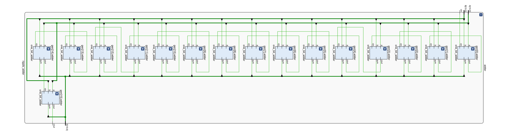
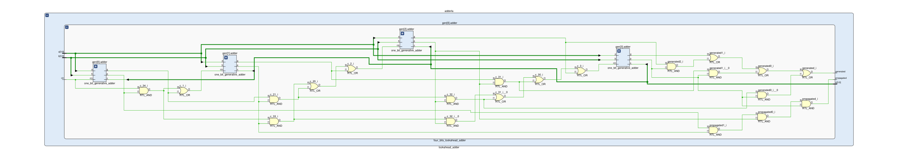
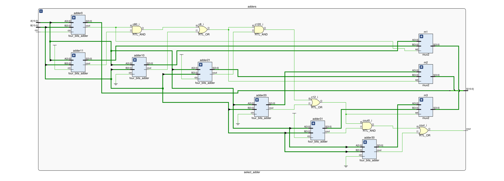
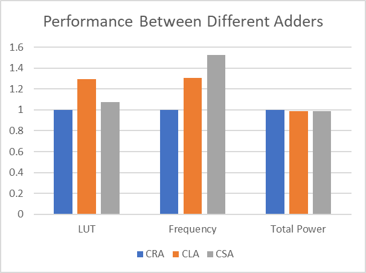
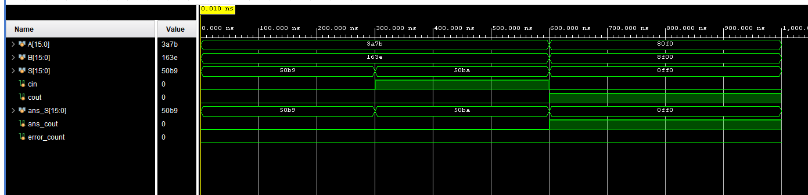

#### Disclaimer

The document is written where each quoted question has answer below it. This is intended to help quicker and easier grading. It has been best-effort, but there is no guarantee, that the answer will only appear under that specific question. Please grade each question on all the content appeared in the report.


### Introduction

>Summarize the high-level function performed by the three adders.

The three adders could all complete **16-bits full addition** (with **c_in** and **c_out**). They have different implementation that has certain tradeoff in their latency and area.


### Adders

Note, all the block diagram could be found in the separate pdf submission.

#### Carry Ripple Adder (CRA)

##### Description

The ripple adder is simplest form of adder. For 16-bit version, it consists of 16 full adders where each other get it's carry-in value from previous adder, and pass its carry-out value to next adder. The design is less prone to error and use smaller areas theoretically, yet each adder's result depends on previous one, so that the latency is relatively longer.

##### Block diagram



#### Carry Lookahead Adder (CLA)

##### Description

The carry lookahead has a hierarchical structure. We split the 16-bit adder into a 4x4 smaller adders. Instead of waiting for each previous adder to calculate the carry value, we could calculate the propagation **P** and generation **G**, and then use this with **c_in** together to get the the carry.

##### Propagation and Generation

We don't want to wait until we get the carry-in value from the previous full adder, as all the operation has to be done **one after another**. To solve this, we introduce the propagation **P** and generation and **G**, they have the formula of $\bold P(\A, \B) = \A \oplus \B$ and $\bold Q(\A, \B) = \A \cdot \B$. We find they carry value has the relation that $\C_{i + 1} = \text G_i + (\text P_i \cdot \C_i) $. Unfold this expression, we get the expression carry out value. (for the 4-bit smaller adder)
$$
{\def\P{ \text{P} }}
{\def\G{\text{G}}}
\begin{align}
\C _0 &= \C _\text{in}\\
\C _1 &= \C _\text{in} \cdot \P_0  + \G_0 \\
\C _2 &= \C _\text{in} \cdot \P_0 \cdot \P_1 + \G_0 \cdot \P_1 + \G_1 \\
\C _3 &= \C _\text{in} \cdot \P_0 \cdot \P_1 \cdot \P_2 + \G_0 \cdot \P_1 \cdot \P_2  + \G_1 \cdot \P_2 + \G_2 \\
\C _4 &= \C _\text{in} \cdot \P_0 \cdot \P_1 \cdot \P_2 \cdot \P_3 + \G_0 \cdot \P_1 \cdot \P_2 \cdot \P_3 + \G_1 \cdot \P_2 \cdot \P_3 + \G_2 \cdot \P_3 + \G_3 \\
\C_\text{out} &= \C _4
\end{align}
$$
In this way, we make each one-bit adder compute their propagation and generation **in parallel**, and then derive the carry-out directly from these value. This should create smaller latency than rippling the carry theoretically. (as more logic could be done in parallel)

##### Creation of hierarchical 4x4 adder

One limitation that we have is that the formula for carry-out will quickly grow out of control as number of bit increases, and that will take astronomical amount of gates to implement. Instead, we rely on hierarchical design. We bundle four 4-bit CLA together into a bigger adder. In each smaller 4-bit CLA, it outputs the grouped propagation and generation $\P_{\G}$ and $\G_{\G}$, note how similar they looks like the terms in $\C_4$
$$
\P_{\G0} = \P_0 \cdot \P_1 \cdot \P_2 \cdot \P_3 \\
\G_{\G0} = \G_0 \cdot \P_1 \cdot \P_2 \cdot \P_3 + \G_1 \cdot \P_2 \cdot \P_3 + \G_2 \cdot \P_3 + \G_3
$$
and in fact we see that
$$
\C _4 = \C _\text{in} \cdot \P_\G  + \G_\G \\
$$
and actually we could follow the same procedure to do (you could unfold the all the $\P_{\G0-3}$ and $\G_{\G0-3}$ and check that they follows $\C_{i + 1} = \text G_i + (\text P_i \cdot \C_i) $)
$$
\begin{align}
\C _0 &= \C _\text{in}\\
\C _4 &= \C _\text{in} \cdot \P_{\G0}  + \G_{\G0} \\
\C _8 &= \C _\text{in} \cdot \P_{\G0} \cdot \P_{\G1} + \G_{\G0} \cdot \P_{\G1} + \G_{\G1} \\
\C _{12} &= \C _\text{in} \cdot \P_{\G0} \cdot \P_{\G1} \cdot \P_{\G2} + \G_{\G0} \cdot \P_{\G1} \cdot \P_{\G2}  + \G_{\G1} \cdot \P_{\G2} + \G_{\G2} \\
\C _{16} &= \C _\text{in} \cdot \P_{\G0} \cdot \P_{\G1} \cdot \P_{\G2} \cdot \P_{\G3} + \G_{\G0} \cdot \P_{\G1} \cdot \P_{\G2} \cdot \P_{\G3} + \G_{\G1} \cdot \P_{\G2} \cdot \P_{\G3} + \G_{\G2} \cdot \P_{\G3} + \G_{\G3} \\
\C_\text{out} &= \C _4
\end{align}
$$


Therefore we could calculate the carry out for our 4x4 adder, and we could also calculate the carry in value ($\C_0, \C_4, \C_8, \C_{12}$) for each of our 4-bit smaller calculator, so they could calculate the sum. So, we just basically put a four 4-bit CLA together in a "bigger" CLA with the same logic stated above, and we will have our 4x4 16-bit CLA.

##### Block Diagram





#### Carry Select Adder (CSA)

##### Description

The select adder are divided into four chucks of 4-bit **CRA**, and each CRA has 2 replicas that precomputes the result when carry-in is 0 and 1. Then once the actual carry-in comes, it could quickly uses a mux to switch to the correct pre-computed result.

##### Speculative computation


Each 4-bit CRA has two replicants, and they compute the result when carry-in is 0 and 1, respectively. (Except the first one, since it's carry in is already known). The result is then send to a 2-1 mux (the and/or gate combo is a 2-1 mux for carry) controlled by the actual carry-in value, so once the actual carry-in comes, it could switch to correct sum and carry out quickly.

##### Block diagram




### Module description

#### Added Files

##### lookahead_adder.sv

```
Inputs:
	[15:0] A, B,
	cin
Outputs:
	[15:0] S,
	cout
```

Description: 16-bit CLA implementation with 4x4 hierarchical design. Take in two operands `A` and `B` with carry in value `cin`, output sum `S` and carry out value `S`.

Purpose: It could be used by `adder_toplevel.sv` as one type of available adder.

##### ripple_adder.sv

```
Inputs:
	[15:0] A, B,
	cin
Outputs:
	[15:0] S,
	cout
```

Description: 16-bit CRA implementation. Take in two operands `A` and `B` with carry in value `cin`, output sum `S` and carry out value `S`.

Purpose: It could be used by `adder_toplevel.sv` as one type of available adder.

##### select_adder.sv (module: select_adder)

```
Inputs:
	[15:0] A, B,
	cin
Outputs:
	[15:0] S,
	cout
```

Description: 16-bit CSA implementation with four 4-bit CRA. Take in two operands `A` and `B` with carry in value `cin`, output sum `S` and carry out value `S`.

Purpose: It could be used by `adder_toplevel.sv` as one type of available adder.

##### select_adder.sv (module: four_bits_adder)

```
Inputs:
    [3:0] A, B,
    cin
Outputs:
    [3:0] S,
    cout
```

Description: a 4-bit CRA that used in the select_adder. Take in two operands `A` and `B` with carry in value `cin`, output sum `S` and carry out value `S`.

Purpose: It's used by module `select_adder` in the same file to do the 4-bit addition.

##### select_adder.sv (module: mux2)

```
Inputs:
    [3:0] A, B,
    sel
Outputs:
    [3:0] S,
```

Description: a 4-bit 2-to-1 multiplexer. Takes in `A` and `B`, output `S = A` when `sel = 0`, and `S = B` otherwise.

Purpose: It's used by module `select_adder` in the same file to do the pre-computed result selection / switch.

##### four_bits_lookahead_adder.sv

```
Inputs:
    [3:0] a, b,
    cin,
Outputs:
	[3:0] s,
	propagated, generated
```

Description: 4-bit CLA with group generation and propagation output. Take in two operands `a` and `b` with carry in value `cin`, output sum `S` and group generation and propagation.

Purpose: It could be used by `lookahead_adder.sv` as the 4-bit smaller CLA.

##### one_bit_adder.sv

```
Inputs:
    a, b,
    cin,
Outputs:
	sum, cout
```

Description: 1-bit full adder.

Purpose: Used by `ripple_adder.sv` for 1-bit addition.

##### one_bit_generative_adder.sv

```
Inputs:
    a, b,
    cin,
Outputs:
	s, g, p
```

Description: 1-bit adder with generation and propagation output instead of carry out output.

Purpose: Used by `four_bits_lookahead_adder.sv` for doing 1-bit addition with generation and propagation output.


#### Provided Files

##### hex.sv

```
Inputs:
	clk, reset,
	[3:0] in[4],
Outputs:
	[7:0] hex_seg,
	[3:0] hex_grid
```

Description: Given 4 x **4-bit** data `[3:0] in[4]`, it will generate correct `hex_seg` and `hex_grid` which will be used to display data on the FPGA board.

Purpose: Display the 8-bit logic processor's register on the FPGA's Segment LED display.

##### control.sv

```
Inputs:
	Clk, Reset, Run
Outputs:
	Run_O
```

Description: simple state machine to convert a pushbutton input to one clock cycle long event, similar to the hold->reset portion of the serial logic processor.

Purpose: Used by `adder_toplevel.sv` to use IO input from FPGA board.

##### adder_toplevel.sv

```
Inputs:
	Clk, Reset_Clear, Run_Accumulate,
	[15:0] SW,
Outputs:
	sign_LED,
	[7:0] hex_segA, hex_segB,
	[3:0] hex_gridA, hex_gridB
```

Description: receive operand from switches by `SW` input. calculate the sum, and display the result on FPGA using output signals.

Purpose: the top level file for hosting the adder, receiving IO input, and display the data.

##### mux2_1_17.sv

```
Inputs:
    [15:0] A_In
    [16:0] B_In
Outputs:
	[16:0] Q_Out
```

Description: a 17-bit 2-to-1 multiplexer. Takes in `A` and `B`, output `S = {1'b0, A}` when `sel = 0`, and `S = B` otherwise.

Purpose: Not used.

##### reg_17.sv

```
Inputs:
	Clk, Reset, Load,
    [16:0] D
Outputs:
	[16:0] Data_Out
```

Description: a 17-bit register. 

Purpose: Used by `adder_toplevel.sv` for holding the sum from adder.


### Analysis

#### Tradeoffs

Among three designs:

* Complexity: CRA is simplest, it follows the same way normal human will do the calculation. CSA is bit harder, since it involves a precompute result and choose the right one using mux. CLA is the hardest, it involves some formula for calculating the bypassing the adder, and calculate the carry directly. It also involves a hierarchical design.
* Area: CRA definitely is the smallest, it only includes the bare minimum for calculation. CSA will take about 2 times of the size (in RTL design, actual size might vary a lot) of a normal CRA since it uses 2 replica to pre-calculate the data. CLA does need to include extra logic gate for the lookahead carry calculation, it will be bigger than CRA, but its comparison with CSA might depends on implementation and needs experimental data.
* Performance: CRA is slowest will need to "rippling" the carry, which create long critical path. CSA cuts the rippling only to 4-bits by using 2 replica, and will be faster than CRA. CLA saves the time by waiting for carry by doing lookahead calculation,. it will be faster than CRA, but the lookahead calculation also have a cost, and its speed with CSA might depends on the implementation and needs experimental data.

#### Performance


$$
{\def\W{\text{W}}}
{\def\ns{\text{ns}}}
\begin{array}{|c|c|c|c|}
\hline

& \text{Carry-Ripple} & \text{Carry-Lookahead} & \text{Carry-Select}

\\ \hline

\bold{LUT} &

92 \ (1.00) & 119 \ (\approx 1.29) & 99 \  (\approx 1.08)

\\ \hline

\text{DSP} &

0 & 0 & 0

\\ \hline

\text{Memory(BRAM)} &

0 & 0 & 0

\\ \hline

\text{Flip-Flop} &

53 & 53 & 53

\\ \hline

\text{WNS/ns} &

3.658& 5.140 & 5.736

\\ \hline

\bold{Frequency(MHz)} &

157.6\ (1.00) & 205.8 \ (\approx 1.30) & 240.2\ (\approx 1.52)

\\ \hline

\text{Static Power/W} & 

0.074 & 0.074& 0.074

\\ \hline 

\text{Dynamic Power/W} & 

0.014& 0.012& 0.013

\\ \hline

\bold{Total} \ \bold{Power/W} &

0.088 \ (1.00) & 0.087 \ (\approx 0.99) & 0.087\ (\approx 0.99)

\\ \hline

\end{array}
$$


>Explain how you computed the frequency from the WNS value in your report.

The frequency is computed by
$$
\text{frequency} = 1/(\text{clock speed} - \text{WNS})
$$
since the "Slack is defined as how much margin is left in the design before the propagation delay of the critical path no longer satisfies the clock period", by doing $\text{clock speed} - \text{WNS}$ will be the least of time each cycle could be (i.e. the delay on longest critical path). Take the reciprocal of that we get the frequency.

>Observe the data plot and provide explanation to the data, i.e., does each resource breakdown comparison from the plot make sense? Are they complying with the theoretical design expectations, e.g., the maximum operating frequency of the carry-lookahead adder is higher than the carry-ripple adder? Which design consumes more power than the other as you expected, why?

For LUT, the experimental design fits our overall analysis that CRA should be smallest (uses least LUT), and then CLA and CSA, what is unexpected is that CSA only uses few more LUT than CRA, and that CLA even uses for LUT than CSA. The implementation in Vivado might have some optimizations, and the lookahead logic expression might take more LUT than I expected it to be.

For frequency, the experimental design fits our overall analysis that CRA should be slowest, and then CLA and CSA. It turns out CSA has a higher clock frequency than CLA, maybe "cutting the rippling time roughly by 4" is a more effective way than "wait calculating lookahead carry expression rather than rippling for the carry" in 16-bit adder.

For total power. It seems that they really doesn't have too much a difference. Once reason might be that the who part we wrote actually only consumes a small fraction of total power (shown like 10% in the report), so the difference couldn't really be seen.


#### Simulation Trace



I did three test cases on the adder.

* `A = 0x3A7B`, `B = 0x163E`, `cin = 0x0`, that is $14971 + 5694$, which should equal to $20665$ (`0x50B9`) with no carry out
* `A = 0x3A7B`, `B = 0x163E`, `cin = 0x1`, that is $14971 + 5694 + 1$, which should equal to $20666$ (`0x50BA`) with no carry out.
* `A = 0x80F0`, `B = 0x8F00`, `cin = 0x0`, that is $14971 + 5694 + 1$, which should equal to $69616$ (`0x0FF0`, overflow) with carry out 1.

The `S` is the output sum, the `cout` is the output carry out. The `ans_` prefix means what the correct result should be. The `error_count` increases if the simulated result doesn't agree with the expected result (it's 0, so all test passed!)

These three should cover basic usage of the adder. (overflow, with/without adder, arbitrary numbers)


#### Critical Path Analysis

>For example, did the critical path for the Vivado carry-ripple adder consist of the carry chain through each full adder module? Why or why not? Include the screenshots of the critical path for each adder alongside your theoretical analysis and annotations. Hint: some of the critical paths may look a little strange, but keep in mind the FPGA does not use discrete gates (AND/OR) to implement combinational logic.

##### CRA


It includes part of the carry chain, from `In[0] -> Out[13]`. However it doesn't include the whole carry chain. One possible explanation is that, if we look at the device screenshot, we see some of the path is longer, and some of them is shorter. (They have different delay). Maybe for the 13th bit adder, the LUT responsible for its sum all put really far from each other, and that make it even longer than the theoretical full carry chain. (The theoretical analysis, though, generally assume the equal delay on each wire. That's the difference).


##### CLA


The longest part is from `In[0] -> Out[6]`. Theoretically speaking, the longest path should be the one from `In[0] -> Out[15]`, as we need to calculate the $\C_{12}$ which has most complex formula in the bigger CLA, and then the $\C_{15}$ could be calculated in the 4th 4-bit smaller CLA, which has most complex formula in that smaller CLA, after all of this, the smaller adder in the smaller CLA could calculating the `Out[15]`. The reason, again, might be similar, the actual path connecting each LUT have different length and therefore delays (unless you add some constraints, otherwise the Vivado will do whatever layout / position manipulation it wants to do, some path in the end might be really long), and therefore this might eventually be the longest one.


##### CSA


The longest part is `In[4] -> Out[8]`. Theoretically speaking, the longest path should be `In[0]/Cin -> Cout/Out[15:12]` (either combination). Even though the result are precomputed, switch to the correct result at each smaller 4-bit adder still need some time, and this will add up at the last 4-bit adder, making the path from the beginning input to the last adder the longest path. However, again, similar issue as stated early

>"The reason, again, might be similar, the actual path connecting each LUT have different length and therefore delays (unless you add some constraints, otherwise the Vivado will do whatever layout / position manipulation it wants to do, some path in the end might be really long), and therefore this might eventually be the longest one."


#### Optimization on CSA

This is not optimal. Think about what is the longest path in the CSA. As discussed previously, the longest path should be something like  `In[0]/Cin -> Cout/Out[15:12]`. (either combination might be). One way of making this shorter is by reducing the first three adder's width (number of bits it takes). Since the smaller CRA used in the CSA has delay linearly proportional to its width, decrease its width could make their result computed faster, the tradeoff is that we need to make the last adder's width longer (it's going to add up to 16 bits after all), which could make last CSA' result has bigger delay. In the end, it is the longest of (1) the carry from previous three CSA. (2) the last CSA's result that determines the largest latency, and this is the tradeoff we need to think of. To figure out how should we divide these CRA's width (and how many parts should we divide our CRA into, actually), we need the delay for CRA at different width, the delay for the mux. We could use these information to calculate the longest delay path theoretically under different width division. We should also run Vivado with different width division, and calculate the maximum frequency to see which kind of width division is optimal.


### Conclusion

This lab is interesting.

