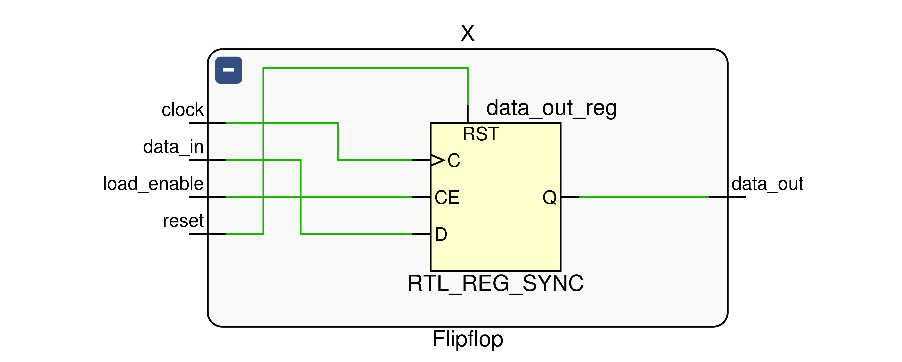

Yuqing Zhai -- Lab Report 4 -- 10/2/2023

#### Disclaimer

The document is written where each quoted question has answer below it. This is intended to help quicker and easier grading. It is *best-effort*, but there is no guarantee, that the answer will only appear under that specific question. Please grade each question on all the content appeared in the report.


### Introduction

The multiplier built in this lab could do 8-bit signed multiplication, and store the result in 16-bit register. This multiplier uses shift-and-add method to do multiplication, with partial support of continuous multiplication.

### Prelab Questions


$$
\begin{array}{|l|c|c|c|c|l|}
\hline
\text{Function} & \text{X} & \text{A} & \text{B} & \text{M} & \text{Comments for the next step}
\\ \hline
\begin{array}{l}

\text{Clear A, Load B, } \\
\text{Reset}
\end{array} & 0 & 0000 0000 & \textit{00000111} & 1 & 
\begin{array}{l}
\text{Since M = 1, multiplicand (available from} \\
\text{switches S) will be added to A.}
\end{array}
\\ \hline
\text{ADD} & 1 & 11000101 & \textit{00000111} & 1 & \text{Shift XAB by one bit after ADD complete.}
\\ \hline
\text{SHIFT} & 1 & 11100010 & 1 \textit{0000011} & 1 & \text{Add S to A since M = 1.}
\\ \hline
\text{ADD} & 1 & 10100111 & 1 \textit{0000011} & 1 & \text{Shift XAB by one bit after ADD complete.}
\\ \hline
\text{SHIFT} & 1 & 11010011 & 11\textit{000001} & 1 & \text{Add S to A since M = 1.}
\\ \hline
\text{ADD} & 1 & 10011000 & 11\textit{000001} & 1 & \text{Shift XAB by one bit after ADD complete.}
\\ \hline
\text{SHIFT} & 1 & 11001100 & 111\textit{00000} & 0 & \text{Do not add S to A since M = 0. Shift XAB.}
\\ \hline 
\text{SHIFT} & 1 & 11100110 & 0111\textit{0000} & 0 & \text{Do not add S to A since M = 0. Shift XAB.}
\\ \hline
\text{SHIFT} & 1 & 11110011 & 00111\textit{000} & 0 & \text{Do not add S to A since M = 0. Shift XAB.}
\\ \hline
\text{SHIFT} & 1 & 11111001 & 100111\textit{00} & 0 & \text{Do not add S to A since M = 0. Shift XAB.}
\\ \hline
\text{SHIFT} & 1 & 11111100 & 1100111\textit{0} & 0 & \text{Do not sub S to A since M = 0. Shift XAB.}
\\ \hline
\text{SHIFT} & 1 & 11111110 & 01100111 & 1 & \text{8$\smash{^\text{th}}$ shift done. Stop. 16-bit Product in AB.}
\\ \hline
\end{array}
$$

### Summary of operation

Initially, either the `Reset_Load_Clear` or `Run` is pressed. This trigger the circuit to set register **X** and **A** to all 0. The data in the switches `S[7:0]` will be loaded into the register **B**. Then, according to the last bit of the register **B**, multiplier will

* **ADD** and **SHIFT** when last bit is 1. (It's **SUB** and **SHIFT** if this is the 8$^\text{th}$ last bit of the **B**)
* **SHIFT** when last bit is 0.

In **ADD/SUB** operation, the register **A** and switches **S** are signed extended to 9-bits and are added/subtracted together, then the result is stored in **XA**. In **SHIFT** operation, the register **XAB** are shifted right arithmetically.

The final result (16-bit) is stored at register **AB** in the end.

### Block Diagram (Top Level)

Note, all the block diagram is available as pdf file in the submission (they are at higher resolution)


### Written Description

#### Added Files

##### Adder.sv

``` 
Parameter:
	WIDTH = 9
Inputs:
	sub,
	[WIDTH - 1: 0] a, b
Outputs:
	[WIDTH - 1: 0] sum
```

Description: Given `a` and `b` to `WIDTH`-bit number, return their sum when `sub = 0`, return their difference when `sub = 1`, the output is written to `sum` (Admittedly, the name is a bit confusing)

Purpose: Used for the 9-bit **ADD/SUB** operation discussed previously.


##### Flipflop.sv

```
Inputs:
	clock, reset, load_enable, data_in
Outputs:
	data_out
```

Description: Single bit flip-flop used with `reset` and `enable` support.

Purpose: Used to store register **X** value.

##### Register.sv

```
Parameters:
	WIDTH = 8
Inputs:
	clock, reset, load_enable, shift_enable, shift_in
	[WIDTH - 1 : 0] data_in
Outputs:
	shift_out,
	[WIDTH - 1 : 0] data_out
```

Description: `WIDTH`-bit shift-register with `reset` and parallel load (activate using `load_enable`) and parallel read support.

Purpose: Used to store register **A** and **B** value.

##### Controller.sv

```
Inputs:
	clock, reset_and_load, run,
	multiplier0, multiplier1
Outputs:
	load_enable_A, load_enable_B, load_enable_X,
	reset_A, reset_B, reset_X,
	shift_enable_A, shift_enable_B,
	adder_sub
```

Description: the controller to control the loading (`load_enable_*`) and reset (`reset_*`) of register **A**, **B**, **X**, and the shifting (`shift_enable_*`) of the register **A** and **B**. It also controls whether **ADD** or **SUB** (`adder_sub`) should be performed on the adder. It controls these based on inputs `reset_and_load`, `run`, and the first and zeroth bit of register **B** value (`multiplier0`, `multiplier1`)

Purpose: Used to control the entire circuit's behavior based on inputs and internal states, so that multiplication could perform successfully.

##### Processor.sv

``` 
Inputs:
	Clk, reset_and_load, run,
	[7:0] switches
Outputs:
 	[7:0] hex_seg, Aval, Bval,
	[3:0] hex_grid,
```

Description: the top-level module for the circuit. It connects all the registers, controller, and adder. It also use hex driver to display the `Aval` and `Bval` on the FPGA segment display.

Purpose: the top level file for hosting the multiplier, receiving IO input, and display the data.

It's schematic is already included as the block diagram (top level) in previous sections.

#### Provided Files

##### HexDriver.sv

```
Inputs:
	clk, reset,
	[3:0] in[4],
Outputs:
	[7:0] hex_seg,
	[3:0] hex_grid
```

Description: Given 4 x **4-bit** data `[3:0] in[4]`, it will generate correct `hex_seg` and `hex_grid` which will be used to display data on the FPGA board.

Purpose: Display the 8-bit logic processor's register on the FPGA's Segment LED display.

### State Diagram


Note, for simplicity, some arrow are draw in color to represent the transition condition. (Their meaning are indicated on the top right). The `multiplier0` and `multiplier1` means the zero bit and first bit of the **B** register. First bit is used rather than zero bit because when deciding the next state, the **B** register has not finished shifting (newer values has not been updated in the register). This has been explained under the Q/A section in the Lab 4 module in Canvas.

### Simulation Waveforms

The waveform has following signals:

* `Clk` means the clock, it has period of `10ns`.
* `reset_and_load` and `run` are described in the manual already
* `switches` are the switch input. (multiplicand)
* `Aval`, `Bval`, and `Xval` are the values stored in the corresponding register **A**, **B**, and **X**.
* the `ans_A`, `ans_B`, `ans_X` are the correct value that `Aval`, `Bval`, `Xval` should have.
* `error_count` increases when the expected value and the actual value doesn't match
* `hex_seg` and `hex_grid` are for LED output, they could be ignored in this case.

The waveform below test four cases (the order matches the 4 simulation screenshot below):

* $7 \cdot (-59)$, where `B = -59`, `switches = 7`. 
* $7 \cdot (59)$, where `B = 59`, `switches = 7`
* $(-7) \cdot (-59)$, where `B = 59`, `switches = -7`
* $(-7) \cdot (59)$, where `B = 59`, `switches = -7`

The result will be stored in `Aval:Bval` (from high to low)

For the sake of economy, I will only explain the first case, other three cases follows the similar procedure.

We first set `reset_and_load = 1`, therefore at posedge of second cycle, the `Bval` get the value of `-59`, and the `Aval` and `Xval` get reset to 0. We switch the switches to `7` at the end of fourth cycle. At the end of the fifth cycle, we set `run = 1`, therefore at the posedge of the sixth cycle, the multiplication will start to happen. Since this is the exactly the same example used in the manual, `Aval`, `Bval`, and `Xval` undergoes same state changes (13 different state in total, this matches the manual exactly if you want to give it a check). In the end, the result is `0xfe63` (`Aval:Bval`) with `Xval = 1`, which matches our expected result (and also the result show in the manual), so the `error_count` is `0`. 


### Post-Lab Questions

#### (1)

>Fill in the table shown in 5.6 with your design’s statistics.

$$
\begin{array}{|l|c|}
\hline
\text{LUT} & 75
\\ \hline
\text{DSP} & 0
\\ \hline
\text{Memory (BRAM)} & 0
\\ \hline
\text{Flip-Flop} & 54
\\ \hline
\text{Latches*} & 0
\\ \hline
\text{Frequency (MHz)} & 215.24
\\ \hline
\text{Static Power (W)} & 0.120 
\\ \hline
\text{Dynamic Power (W)} & 0.048
\\ \hline
\text{Total Power (W)} & 0.072
\\ \hline
\end{array}
$$

#### (2)

>Come up with a few ideas on how you might optimize your design to decrease the total gate count and/or to increase maximum frequency by changing your code for the design.

One intuitive idea might be using the adder we implemented in Lab 3, this could decrease the critical path in adder, and could potentially increase the maximum frequency. Another idea is that we could calculate the top four and bottom four bits result in parallel, and then added them together in the end, these could potentially cut the cycle need in half. (These could also remove some states that we needed in the state machine, decreasing the gate count needed). Another idea is that we could replace our Moore machine with a Mealy machine, so the total number of states could be reduced. The RTL result currently uses a big mux to calculate the next state, if we use less states, the logic used for implementing these mux could be reduced, and resulting in lower gate count.

After some research, there are also other design like [Wallace Tree](https://en.wikipedia.org/wiki/Wallace_tree) or [Dadda Multiplier](https://en.wikipedia.org/wiki/Dadda_multiplier). Our naive shift-and-add adder requires about $2 \cdot 8 = 16$ cycles in worst case scenario. With some some sophisticated reduction, these multiplier calculate some partial results in parallel and this could shorten the cycle needed at the expense of extra gate counts. 

#### (3)

>What is the purpose of the X register? When does the X register get set/cleared?

The purpose of the X register is to hold the 9-bit adder result from adding extended register **A** and **S** (otherwise we will lose information!), so in the next cycle it's result could be shifted to the top bit of the **A**. The **X** register get set when there is an **ADD/SUB** operation, and get cleared when the `Reset_Load_Clear` or `Run` is pressed.

#### (4)

>What would happen if you used the carry out of an 8-bit adder instead of output of a 9-bit adder for X?

Consider adding $1000 0000$ ($-128$) and $0000 0000$ ($0$) together, we see that using 9-bit adder output
$$
\begin{array}{cc}
  &\textit{1 }1000 0000 \\
+ &\textit{0 }0000 0000 \\
\hline
  &\textit{1 }1000 0000
\end{array}
$$
The result is expected as a 9-bit representation of $-128$.

and if we use carry out of an 8-bit adder
$$
\begin{array}{cc}
  &\phantom{1}\ 1000 0000 \\
+ &\phantom{0}\ 0000 0000 \\
\hline
  &\textit{0 }1000 0000
\end{array}
$$
which is 9-bit representation of $128$, so this method messed up the sign, and it's wrong. 

#### (5)

>What are the limitations of continuous multiplications? Under what circumstances will the implemented algorithm fail?

Actually the webpage in Canvas already gives a pretty clear explanation:

>Consecutive multiplications work, like -1 * -1 * -1 * ... . **Reset_Load_Clear will not be pressed between two presses of Run.** (1 points) 
>
>- Note - this is only expected to work if the product from the  previous multiplication operation can be truncated to fit into 8-bits  without changing the value (e.g. the product is within the range  [-128,127])
>- -1 (16'b1111111111111111) is truncated to (8'b11111111), which is  still interpreted as -1, so this is expected to work for consecutive  multiplications.
>- 256 (16'b0000000100000000) is truncated to be 8'b00000000, which is  not interpreted as 256, so this is not expected to work for consecutive  multiplications.

So we see that the continuous multiplication only support the number within $[-128, 127]$ and if it's bigger / smaller than that, the number will get clipped and the algorithm will therefore fail.

#### (6)

>What are the advantages (and disadvantages?) of the implemented multiplication algorithm over the pencil-and-paper method discussed in the introduction?

If we do pencil-and-paper method, what we will do is that we check the multiplicand digit one by one, and if it's one, we then shift it left corresponding amount of bits, and then sign extend it and add it to the final 16-bit result with a 16-bit adder. The 16-bit adder and the shifting will require a significantly more gates and will cause longer critical path (therefore delays) than our shift-and-add multiplier. The paper-and-pencil method will require more LUTs and will have  lower frequency. 

### Conclusion

#### Bug Fixes

Initially I encounter the problem that the state machine erroneously takes the last bit of **B** register to determine its next state before the **B** has finished shifting. One naive way is to just wait one cycle, but a better way to use the first bit of the **B** register instead of the last bit. There are some caveats but all of that is resolved.

#### Feedback

The reason why I encounter that bug is because I think the example (that big table) in the manual is a bit misleading. Although we know that all the operation is based on the previous state's value, this way of demonstrating the operation could easily trick us into that bug. It should mention, or at least hint, us that we should either wait or use the first bit of the register **B**. (It said this in its Q/A section, but I think this should be included directly in the manual instead).

