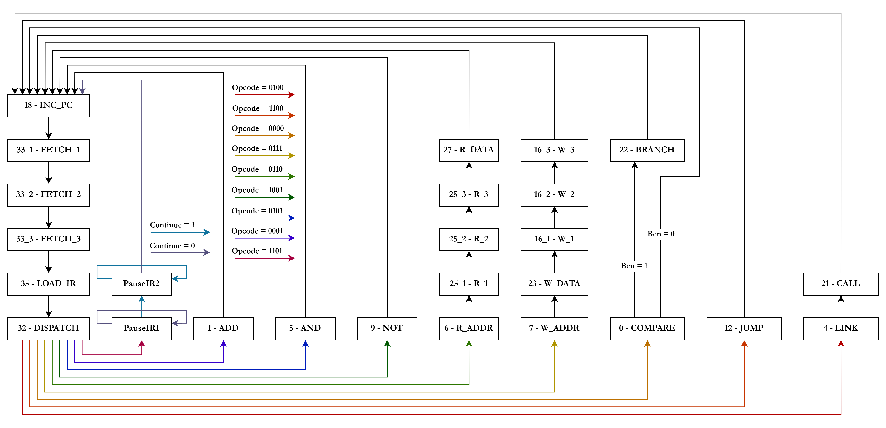
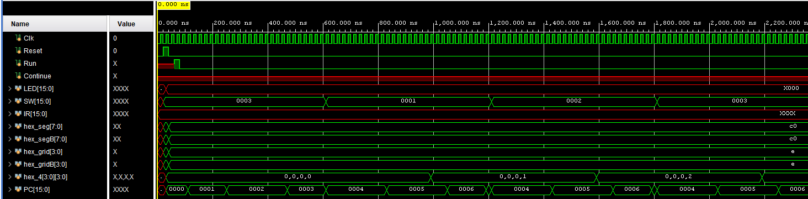
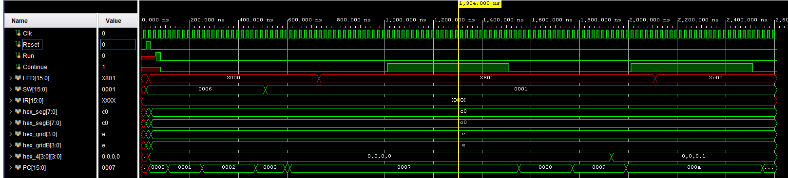
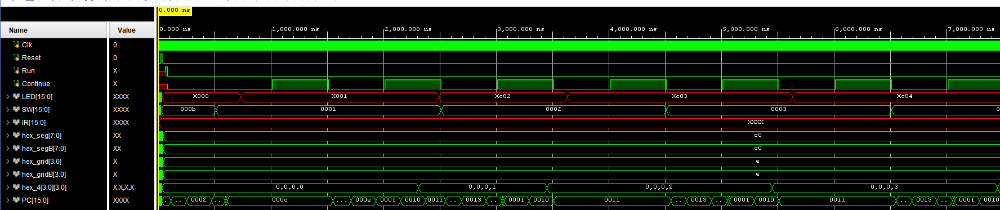
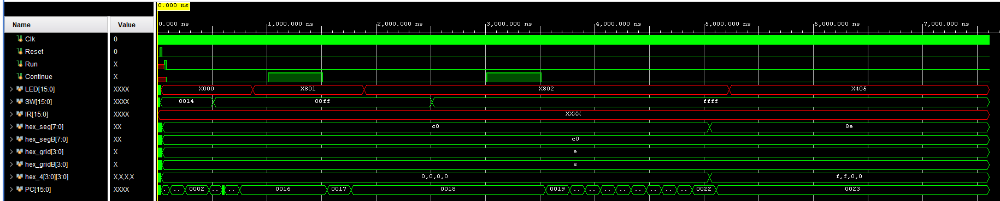
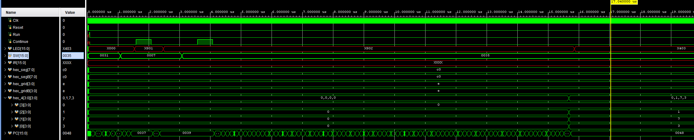
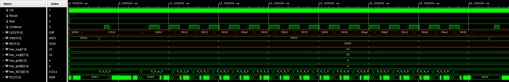
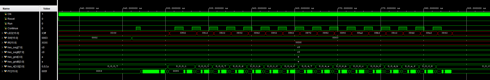
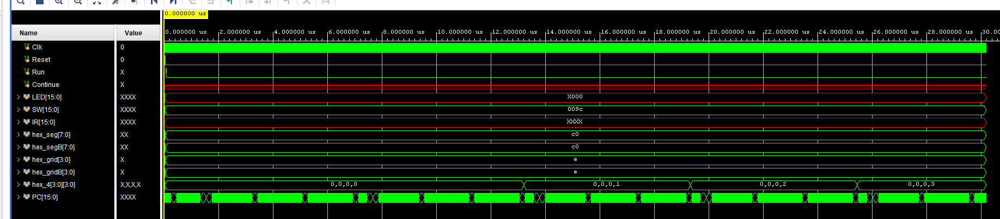

Yuqing Zhai -- Lab Report 5 -- 10/16/2023

#### Disclaimer

The document is written where each quoted question has answer below it. This is intended to help quicker and easier grading. It has been *best-effort*, but there is no guarantee, that the answer will only appear under that specific question. Please grade each question on all the content appeared in the report.
$$
{\newcommand\devicetable[9]{
\begin{array}{|l|c|}
\hline
\text{LUT} & #1
\\ \hline
\text{DSP} & #2
\\ \hline
\text{Memory (BRAM)} & #3
\\ \hline
\text{Flip-Flop} & #4
\\ \hline
\text{Latches*} & #5
\\ \hline
\text{Frequency (MHz)} & #6
\\ \hline
\text{Static Power (W)} & #7
\\ \hline
\text{Dynamic Power (W)} & #8
\\ \hline
\text{Total Power (W)} & #9
\\ \hline
\end{array}
}}
$$

### Introduction

The SLC-3 processor implement the subset of the LC-3 assembly language. (9 instructions). It uses a memory-mapped IO to communicate with switches input and LED.


### Summary of operation

It could perform 3 kinds of arithmetic operation (ADD, AND, NOT), load / store from the memory (LDR, STR), 3 different jump instructions (BR, JMP, JSR), and pause instruction (PSR) The instruction execution follows a common Fetch-Decode-Execute cycle, which was controlled by its internal control unit. 

It used a block ram that is available on FPGA, which has a constant read / write delay, so its control unit has been set up with appropriate wait state to properly read from the ram. 

It uses a sub memory system to implement memory-mapped IO, which could map the 0xFFFF, when reading, to be the data from switch input, and when writing, to be the data that display on the LED. Instruction Execution


### Instruction Execution

This part should be read in accompany with the state diagram for the control unit in later sections.

When SLC-3 decides to execute a new instruction, it will follow the common **Fetch-Decode-Execute** cycle.

####  Fetch

It will first send the instruction address (MAR) to the memory subsystem, and then increment its own PC (State 18). Then it will use 3 cycles to get the instruction data (State 33). Then it will load the instruction data (MDR) to its instruction register (IR). (State 35).

#### Decode

It will then decide which instruction it should execute based on the opcode (State 32), it will transition to appropriate state for that operation. The opcode is listed in the lab manual.

#### Execute

For the arithmetic operation, it will give ALUK signal to control ALU's function, and then the result is stored in the appropriate registers by enable regfile write. The ALU supports ADD / AND / NOT operation, as well as a "identity" operation (return the first operand). For each operation, you could choose to operate on two register value, or one register with an immediate value. This selection is done by SR2MUX.

For load / store operation, it follows a similar operation as the fetch stage does. For loading, prepare the data, wait for the memory subsystem, and write the loaded data to regfile. For writing, prepare the write data and address, and wait for the memory subsystem for writing.

For jump operations, they all modify the PC accordingly based on their description (done with the ADDR1MUX, ADDR2MUX and PCMUX). JSR will save the original register. BR will jump conditionally base on BEN value. JMP is an unconditional jump.

For pause operation, the processor will halt in a loop and doing nothing until the continue is pressed, and then released. In that case it will go back to read next instruction.

#### Note

This is only an overview of how processor execute its instruction, read the lab manual and see the attached state machine sheet to see how processor controls the state to achieve desired operation precisely.


#### Block Diagram

<span style = "color:red;">You should see the attached pdf / png file instead. (Use something like Adobe Acrobat PDF reader instead of browser, since browser has maximum scaling restriction)</span> There are multiple registers and mux as required on the data path, so the RTL block diagram is unable to accommodate these in a embedded picture.


> The block diagram for slv3.sv. It includes registers for `PC, IR, BEN, N/Z/P, MDR, MAR`, also the mux `PCMUX, ADDR1MUX, ADDR2MUX, DRMUX, SR1MUX, SR2MUX, MDRMUX`. Also the regfile, and ALU, and memory subsystem, and control unit. The bus is implemented as a Bus mux here.


### Instruction Sequence Decoder Unit

This part should be read in accompany with the state diagram for the control unit in later sections.

The ISDU controls

1. The loading of few registers (enable pin): `PC`, `IR`, `MDR`, `MAR`, `BEN`, `N/Z/P`, and register file
2. The mux (select pin): `PCMUX`, `SR1MUX`, `SR2MUX`, `DRMUX`, `ADDR1MUX`, `ADDR2MUX`, `MDRMUX`, `BUSMUX`. The bus mux is special from others as it uses one-hot encoding. The control unit makes sure that only one select pin could be high at one time. 
3. The memory read / write enable.
4. The ALU operations (`ALUK`)

What ISDU should do exactly in every case is quite complicated, only few rough examples will given here. 

* Arithmetic operation: 
  * Enable `GateALU` to let ALU write its output on bus 
  * Enable `LD_REG` to let regfile store the calculated data from bus 
  * Enable `LD_CC` to let `N/Z/P` flags to be stored.
  * Set `ALUK` for appropriate operation that ALU should perform
  * Set `SR2MUX = 1` for `ADDI / ANDI` operation
* Memory read operation:
  * First cycle: Enable `Mem_OE` for memory data reading.
  * Second cycle: do nothing
  * Third cycle: Enable `LD_MDR` to load data from memory to `MDR` register.

**More details should be found in the attached state diagram sheet.**


#### State Diagram



>The state diagram for the ISDU. Note the 3 cycle memory operations mentioned earlier. A line with no annotation / color means "always transition".

The reason why we wait 3 cycles every time for the memory read and write is that passing write/read enable takes 1 cycle, and the memory needs 2 cycles to do the operation. (This "2 cycles" is a source for an annoying bug, see conclusion for discussion about this)


### Written Description

#### Modified / Added Files

##### ALU.sv

```
Inputs:
	[15:0] A, B,
	[1:0] ALUK,
Outputs:
	[15:0] S
```

**Description**: Given a two 16-bit data `A`, `B`. Perform arithmetic operation on them specified by `ALUK`, `0` is `ADD`, `1` is `AND`, `2` is `NOT`, `3` is `A`. Output the result in `S`.

**Purpose**: Used in the `slc3.sv` to perform arithmetic operation.


##### Mux2.sv

```
less
Parameter:
	WIDTH = 16 (default width for the data inputs)

Inputs:
	[WIDTH-1:0] A, B
	S

Outputs:
	[WIDTH-1:0] Y
```

**Description**: A 2-to-1 multiplexer. Given two data inputs `A` and `B` of width `WIDTH`, and a select signal `S`, it outputs `A` if `S` is 0 and `B` if `S` is 1.

**Purpose**: Used for selecting one of two data inputs based on the select signal.


##### Mux3.sv

```
csharp
Parameter:
	WIDTH = 16 (default width for the data inputs)

Inputs:
	[WIDTH-1:0] A, B, C
	[1:0] S

Outputs:
	[WIDTH-1:0] Y
```

**Description**: A 3-to-1 multiplexer. Given three data inputs `A`, `B`, and `C` of width `WIDTH`, and a 2-bit select signal `S`, it selects one of the inputs based on the value of `S`. If `S` is outside the range `2'b00` to `2'b10`, the output `Y` will be indeterminate ('x').

**Purpose**: Used for selecting one of three data inputs based on the select signal.


##### Mux4.sv

```
csharp
Parameter:
	WIDTH = 16 (default width for the data inputs)

Inputs:
	[WIDTH-1:0] A, B, C, D
	[1:0] S

Outputs:
	[WIDTH-1:0] Y
```

**Description**: A 4-to-1 multiplexer. Given four data inputs `A`, `B`, `C`, and `D` of width `WIDTH`, and a 2-bit select signal `S`, it selects one of the inputs based on the value of `S`.

**Purpose**: Used for selecting one of four data inputs based on the select signal.


##### Mux4_Onehot.sv

```
csharp
Parameter:
	WIDTH = 16 (default width for the data inputs)

Inputs:
	[WIDTH-1:0] A, B, C, D
	[3:0] S

Outputs:
	[WIDTH-1:0] Y
```

**Description**: A 4-to-1 multiplexer with a one-hot encoding select signal. Given four data inputs `A`, `B`, `C`, and `D` of width `WIDTH`, and a 4-bit one-hot encoded select signal `S`, it selects one of the inputs based on the value of `S`. If `S` is not a one-hot encoded value, the output `Y` will be indeterminate ('x').

**Purpose**: Used for selecting one of four data inputs based on a one-hot encoded select signal.


##### Regfile.sv

```
csharp
Inputs:
	Clk
	Reset
	LD_REG
	[2:0] SR1, SR2, DR
	[15:0] DATA_IN

Outputs:
	[15:0] SR1_OUT, SR2_OUT
```

**Description**: This module represents a register file with 8 registers of width 16 bits each. The `LD_REG` signal, when high, enables the loading of data into the designated register pointed by the `DR` address input. The data to be loaded is provided through `DATA_IN`. The outputs, `SR1_OUT` and `SR2_OUT`, provide the data contents of the registers specified by the `SR1` and `SR2` address inputs, respectively. On a rising edge of the `Clk`, if the `Reset` signal is high, all registers will be initialized to `16'h0000`.

**Purpose**: Used to store and retrieve data values from a set of 8 registers. It provides flexibility in accessing data using different source addresses, and can load data into a designated register when required.


##### Register.sv

```
less
Parameter:
	WIDTH = 16 (default width for the data inputs and outputs)

Inputs:
	Clk
	Reset
	En
	[WIDTH-1:0] D

Outputs:
	[WIDTH-1:0] Q
```

**Description**: The `Register` module represents a generic register with a width specified by the `WIDTH` parameter. On a rising edge of the `Clk`, if the `Reset` signal is high, the output `Q` is reset to 0. If the `En` (Enable) signal is high, the data from input `D` is loaded into the register and subsequently appears on the output `Q`. If the `En` signal is low, the register retains its previous value.

**Purpose**: Used to store data values of a specified width. The stored data can be updated when the enable signal is asserted, providing controlled data storage capability.


##### ISDU.sv

**Inputs:**

- `Clk`: Clock signal.
- `Reset`: Reset signal.
- `Run`: Run control signal.
- `Continue`: Continue control signal after a pause.
- `Opcode[3:0]`: 4-bit opcode to determine the instruction.
- `IR_5`, `IR_11`: Specific bits from the Instruction Register.
- `BEN`: Branch Enable Signal.

**Outputs:**

- `LD_MAR`, `LD_MDR`, `LD_IR`, `LD_BEN`: Load signals for respective registers.
- `LD_CC`, `LD_REG`, `LD_PC`, `LD_LED`: Load signals for condition codes, general-purpose register, program counter, and LED (for PAUSE instruction).
- `GatePC`, `GateMDR`, `GateALU`, `GateMARMUX`: Gate signals for data paths.
- `PCMUX[1:0]`, `ADDR2MUX[1:0]`, `ALUK[1:0]`: MUX selectors.
- `DRMUX`, `SR1MUX`, `SR2MUX`, `ADDR1MUX`: Additional MUX selectors.
- `Mem_OE`: Memory Output Enable signal.
- `Mem_WE`: Memory Write Enable signal.

**Description:** The `ISDU` (presumably Instruction Decode and Sequencing Unit) module is responsible for controlling the flow of operations in the system based on the current instruction and state. It transitions through multiple states for various instructions and sets the appropriate control signals.

**Purpose:** It decodes the opcode of the instruction and sets the necessary control signals to execute the instruction, making sure the data flows through the right paths in the system. It also manages sequencing for multi-cycle instructions.


##### slc3.sv

**Inputs:**

- `[15:0] SW`: System switches for various functionalities.
- `Clk`: Clock signal.
- `Reset`: System reset signal.
- `Run`: Execution control signal.
- `Continue`: Signal to continue execution.
- `[15:0] Data_from_SRAM`: Data fetched from SRAM.

**Outputs:**

- `[15:0] LED`: Output LED indicator data.
- `OE`: Output enable for memory operations.
- `WE`: Write enable for memory operations.
- `[7:0] hex_seg`: Segment data for Hex Display A.
- `[3:0] hex_grid`: Grid data for Hex Display A.
- `[7:0] hex_segB`: Segment data for Hex Display B.
- `[3:0] hex_gridB`: Grid data for Hex Display B.
- `[15:0] ADDR`: Address data for memory operations.
- `[15:0] Data_to_SRAM`: Data to be written to SRAM.
- `[3:0] hex_4 [3:0]`: Hexadecimal 4-bit data for 4 segments.
- `[15:0] PC`: Program counter output.


**Description:** The `slc3` module represents the core logic of the SLC-3 microarchitecture. It integrates multiple functional blocks such as ALU, registers, multiplexers, and memory subsystems to process instructions and control the overall machine state. The module interacts with SRAM and other I/O systems to fetch, decode, and execute instructions.

- The hex displays (`HexA` and `HexB`) are used to show the current instruction or data.
- The memory subsystem (`Mem2IO`) interfaces between the core logic and memory, taking care of memory read/write operations.
- The ALU (`ALU`) performs arithmetic and logical operations based on inputs.
- The `Regfile` represents the general-purpose registers of the architecture, and other modules like `MDR_reg`, `IR_reg`, etc., are specific registers like Memory Data Register, Instruction Register, and so on.
- The state machine (`ISDU`) dictates the operation of the SLC-3, based on inputs, current state, and the opcode of the fetched instruction.

**Purpose:** The `slc3` module acts as the central unit of the SLC-3 microarchitecture, coordinating between various components, executing instructions, and managing data flow.


#### Provided Files

##### HexDriver.sv

```
Inputs:
	clk, reset,
	[3:0] in[4],
Outputs:
	[7:0] hex_seg,
	[3:0] hex_grid
```

Description: Given 4 x **4-bit** data `[3:0] in[4]`, it will generate correct `hex_seg` and `hex_grid` which will be used to display data on the FPGA board.

Purpose: Display the 8-bit logic processor's register on the FPGA's Segment LED display.


##### SLC3_2.sv

**Description**:

The SLC3_2 module is a package that provides a collection of constants and functions to facilitate the implementation of various operations in a Simple Little Computer (SLC3). The functions are designed to generate the corresponding instruction based on the given inputs.

**Constants**:

- Opcodes for various operations (e.g., ADD, AND, NOT, BR, etc.)
- Register aliases (R0, R1, ... R7)
- Branch condition aliases (p, z, n, etc.)
- Miscellaneous constants like `NO_OP`, `outHEX`, and `inSW`.

**Functions**:

1. `opCLR(DR)`: Clears the DR.
2. `opAND(DR, SR1, SR2)`: Logical AND operation.
3. `opANDi(DR, SR1, imm5)`: Logical AND operation with immediate value.
4. `opADD(DR, SR1, SR2)`: Addition operation.
5. `opADDi(DR, SR1, imm5)`: Addition with immediate value.
6. `opINC(DR)`: Increment the value in DR.
7. `opDEC(DR)`: Decrement the value in DR.
8. `opNOT(DR, SR)`: Logical NOT operation.
9. `opBR(condition, PCoffset9)`: Branch operation.
10. `opJMP(BaseR)`: Jump operation.
11. `opRET()`: Return from subroutine.
12. `opJSR(PCoffset11)`: Jump to subroutine.
13. `opLDR(DR, BaseR, offset6)`: Load from memory.
14. `opSTR(SR, BaseR, offset6)`: Store to memory.
15. `opPSE(ledVect12)`: Enter pause state and set LEDs.


##### test_memory.sv

```vbnet
Inputs:
    Reset      : Resets the memory to its initial state.
    Clk        : Clock input to control memory read/write operations.
    [15:0] data: Data to be written to memory when writing is enabled.
    [9:0] address: Specifies the address location in memory for read or write operation.
    ena        : Enables read/write operation.
    wren       : Write enable. If high, it indicates a write operation; if low, a read operation.
    
Outputs:
    [15:0] readout: Data read from the specified memory location.

Parameters:
    size         : Defines the size of the memory (default is 256 words).
    init_external: Indicates whether to parse memory_contents.sv (if 0) or use a parsed .dat file.
```

**Description**: 

This module simulates an on-chip memory, similar to what's present on the Urbana board. It is intended solely for simulation purposes and is not synthesizable for hardware implementation. The module allows for both reading and writing data into memory cells. The memory can either be initialized from the memory_contents.sv file or from a pre-parsed .dat file. 

When reset is activated, the memory is reinitialized from the memory_contents.mif file. When reading (`ena` is high and `wren` is low), the data from the specified address is made available on the `readout` output. When writing (`ena` and `wren` are high), data from the `data` input is written to the specified memory address.

**Purpose**:

Used to simulate on-chip memory behavior.


##### Synchronizers.sv

There are multiple smaller module in there.

* sync: `Inputs: Clk, d, Outputs: q`. It will sync the output `q` with `d` at positive edge of `Clk`
* sync_r0: `Inputs: Clk, Reset, d, Outputs: q`. If `Reset = 1`, then it will always set `q = 0`, otherwise it will sync the output `q` with `d` at positive edge of  `Clk`.
* sync_r1: `Inputs: Clk, Reset, d, Outputs: q`. If `Reset = 1`, then it will always set `q = 1`, otherwise it will sync the output `q` with `d` at positive edge of  `Clk`. 


##### slc3_sramtop.sv

```
verilog
Inputs:
	[15:0] SW,
	Clk, Reset, Run, Continue

Outputs:
	[15:0] LED,
	[7:0] hex_seg,
	[3:0] hex_grid,
	[7:0] hex_segB,
	[3:0] hex_gridB
```

Description: The `slc3_sramtop` module serves as the top-level module for the SLC-3 system, particularly optimized for synthesis with physical RAM. The module focuses on synchronizing input and output signals, specifically for handling push buttons that cross the clock domain and managing the data flow to and from the on-chip SRAM. The module achieves this through various combinational logic, an instantiation of the `slc3` module for the main operations, and interactions with the physical on-chip memory.

The logic components and blocks handle:

- Synchronizing input push buttons (`Run`, `Continue`) to manage transitions across the clock domain.
- Generation of active high signals for the Reset, Continue, and Run functionalities.
- Selection mechanisms to choose data flow paths for reading/writing operations to the SRAM.
- Instantiation of the main `slc3` unit to carry out SLC-3 operations, and the `instaRam` module for SRAM-related functionalities.
- Interaction with a physical on-chip memory block, referred to as `ram0`, which is assumed to be generated using tools like Vivado's block memory generator IP.

Purpose: The `slc3_sramtop` module is designed to interface with external components like push buttons and LED displays, and to coordinate the data flow between the SLC-3 core and the on-chip SRAM. This makes it vital for the overall functioning of the SLC-3 system when physical RAM is incorporated.


##### slc3_testtop.sv

```
verilog
Inputs:
	[15:0] SW,
	Clk, Reset, Run, Continue

Outputs:
	[15:0] LED,
	[7:0] hex_seg,
	[3:0] hex_grid,
	[7:0] hex_segB,
	[3:0] hex_gridB,
	[3:0] hex_4 [3:0],
	[15:0] PC
```

Description: The `slc3_testtop` module serves as the top-level module for the SLC-3 design for both simulation and synthesis using `test_memory`. It handles the inputs from switches and push buttons, then synchronizes and processes these inputs using internal components. The outputs include values to be displayed on LEDs, hex displays, and the program counter (PC) value.

The module is responsible for synchronizing button inputs to ensure safe crossing of clock domains. It also manages data read/write operations with the `test_memory` module, taking care of addressing, output enable, and write enable signals.

Purpose: This module integrates various sub-modules and components of the SLC-3 design, providing a unified interface for external connections, especially for testing and demonstration purposes. It also ensures the safe and synchronized operation of the SLC-3 system components, particularly with the `test_memory` module.


##### Mem2IO.sv

```
yaml
Inputs:
    Clk, Reset: Clock and Reset signals.
    [15:0] ADDR: Address.
    OE, WE: Output Enable and Write Enable respectively.
    [15:0] Switches: Switch inputs.
    [15:0] Data_from_CPU, Data_from_SRAM: Data inputs from CPU and SRAM.

Outputs:
    [15:0] Data_to_CPU, Data_to_SRAM: Data outputs to CPU and SRAM.
    [3:0] HEX0, HEX1, HEX2, HEX3: Hex display outputs.
```

**Description:**

- The module acts as an intermediary between memory and I/O devices.
- When the address is `xFFFF`, data is loaded from switches. Otherwise, data is loaded from SRAM. The resulting data is directed towards the CPU.
- Data from the CPU is always passed to the SRAM without any modification.
- When both the Output Enable (`OE`) and Write Enable (`WE`) signals are active and the address is `xFFFF`, data from the CPU is written to an internal register `hex_data` which is meant for display purposes.
- The `hex_data` is split across four hex display outputs (`HEX0`, `HEX1`, `HEX2`, `HEX3`).

**Purpose:**

- Used to connect memory to I/O devices.
- This module provides the capability to directly read the status of the switches or the data from the SRAM, and to display data on a hex display.


##### Instantiateram.sv

**Inputs:**

- `Reset`: Resets the module.
- `Clk`: Clock signal to synchronize the operations.

**Outputs:**

- `[15:0] ADDR`: 16-bit Address for the on-chip memory.
- `wren`: Write enable signal to specify when to write data into the memory.
- `[15:0] data`: 16-bit data output that changes based on the address.

**Description:**

The `Instantiateram` module simulates an on-chip memory. When the module is reset, it initiates a memory writing state. During this state, the memory addresses are populated in sequence, and the data at each address is determined based on a series of hardcoded operations such as `opCLR`, `opLDR`, `opSTR`, etc. The module iterates through memory addresses using an accumulator.

There are various test scenarios in this memory setup:

- Basic I/O test 1
- Basic I/O test 2
- Basic I/O test 3 (Self-modifying code)
- XOR test

Once all memory addresses have been written to (up to the address 16'hff), the module transitions to a `done` state, after which it goes to an `idle` state. During this `idle` state, no memory writes occur.

**Purpose:**

It preloads a set of operations into memory to be executed by the `SLC3` processor. This setup ensures that when the `SLC3` processor is run, it can fetch instructions from memory and execute the defined tests.


### Simulation

The pins:

* `Clk` : Clock pin, notice the simulation runs at `20ns / cycle`, so it will be slightly different.
* `Reset`: Reset the processor state
* `Run`: Start the processor
* `Continue`: Resume the processor from pause state
* `LED[15:0]`: the LED output
* `SW[15:0]`: the Switch input, this is the **program input**.
* `IR[15:0]`: please ignore, the debug data no longer used
* `hex_seg, hex_segB, hex_grid, hex_gridB`: the transformed signal data displayed on the segment hex display, could be ignored
* `hex_4[3:0][3:0]`: the raw output data to be displayed on the hex display, this is the **program output** for the test cases.
* `PC[15:0]`: program counter for debug use


The start of the program is signaled by a Reset and then followed by a Run. The first valid `SW` value is the address of the test program. (This might be hard to see in some simulation)


#### IO Test 1 (Reflect Switch Inputs)



We see that after the initial set up, the `SW` is set to `0001`, `0002`, `0003` accordingly, and after few cycles of `SW` change, the `hex_4` is changed to `0, 0, 0, 1`, `0, 0, 0, 2` to reflect the `SW` value. This is the intended result.


#### IO Test 2 (Reflect Switch Inputs with Pauses)



We see that everything is similar to IO Test 1, except the `PC` will stuck at `7` (which actually means the `PC = 6` instruction is being executed, and that is the pause instruction). The program goes to next instruction until the continue is pressed and released, and then after that the output `hex_4` finally changes to `0, 0, 0, 1` (the input switch value). This is the intended result.


#### Self-Modify Test



We see that the `hex_4` will just reflect the `SW` value after continue is pressed and released. This is similar to IO Test 2, the only difference is that the `LED` value goes from `XC01`, `XC02`, `XC03`, `XC04`...... this is the intended result.


#### XOR Test



Two input is `00ff` and `ffff` (around two `continue` press). The expected result is `ff00`, which in the end, we get `f, f, 0, 0` from the `hex_4`. This is the intended result.


#### Multiplier Test



Two input is `0007 (decimal 7)` and `0035 (decimal 53)` (around two `continue` press). The expected result is `0173 (decimal 371)`, which in the end, we get `0, 1, 7, 3` from the `hex_4`. This is the intended result.


#### Sort Test



The data before sort is listed sequentially in `hex_4`, this matches the table in the lab manual.



After the sort, the data is listed sequentially in `hex_4`, this matches the table in the lab manual. (`0001, 0003, 0007......`)

So, this is the intended result


#### Auto Increment Test



We see that without any input, the `hex_4` auto incremented `0, 0, 0, 0 -> 0, 0, 0, 1 -> 0, 0, 0, 2 -> 0, 0, 0, 3` and so on. This is the expected result.


### Post Lab

#### Statistics

$$
\devicetable {462}{0}{0.50}{274}{0}{105.69}{0.071}{0.016}{0.087}
$$

#### Questions

>What is MEM2IO used for, i.e. what is its main function?

The MEM2IO is the memory subsystem for our processor. Its main function is to map the memory address `0xFFFF` to Switches (when reading) and LEDs (when writing) by intercept all the processor memory access (like a proxy). This implements the memory-mapped IO so that our processor could communicate to these "device" in an easy way.

>What is the difference between BR and JMP instructions?

JMP is an unconditional jump. BR, in contrast, will check the jump condition (in LC-3 it's checking either one of the N/Z/P flags that we **requested** (specified in instruction code) is true) and jump only if it's true. (that's why it's called BRanch).

>What is the purpose of the R signal in Patt and Patel? How do we compensate for the lack
>of the signal in our design? What implications does this have for synchronization?

The `R` signal in the LC-3 microarchitecture, as described by Patt and Patel, is the "Memory Ready" signal. This signal is used to  indicate when the memory system has completed a read or write operation. In real-world systems, accessing memory can be asynchronous and might  take longer than other operations, so a signal is often needed to  synchronize the rest of the system to the memory's operation completion.

If the `R` signal (or a similar memory ready signal) is  absent in a design, the system must find other ways to ensure that it  does not proceed with subsequent operations until memory has finished  its current operation.

In this lab, we do this simply by waiting few cycles for the memory read / write to complete, this method is called **fixed time delay**. 

This method might not be ideal. Since if we wait fixed time delay, we always needs to wait the maximum (worst) reading / writing time, this could decrease the overall performance. We could potentially lower the cycles needed (say from 2 to 1 in our case) for the memory operation. 

Also, if later on we want to change our memory, then we have to change the state machine accordingly, so this design doesn't have good compatibility. Furthermore, if the block ram gets disturbed in the device which require it takes extra time to read and write, this could crash our entire processor logic and leads to failure, having a memory controller for the memory which sends `R` signal is far more reliable in this case.


### Conclusion

One bug encounter is probably related to actually a <span style = "color:red;font-weight:bold">an INCONSISTENT behavior between the given TEST RAM BEHAVIOR AND ACTUAL RAM BEHAVIOR!</span>. In the test top, the ram read / write only needs 2 cycles, but in the sram top, the read / write needs 3 cycles. This takes me three hours until in the end I run the simulation directly using the sramtop. I found out that the sramtop simulated behavior requires 3 cycles instead of 2 cycles. After I add extra cycles in my state machine, everything then works. I think the manual for the IP module and the testtop file <span style = "color:red;font-weight:bold">must need to be changed</span>.

