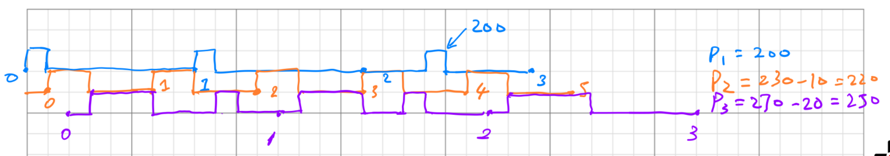
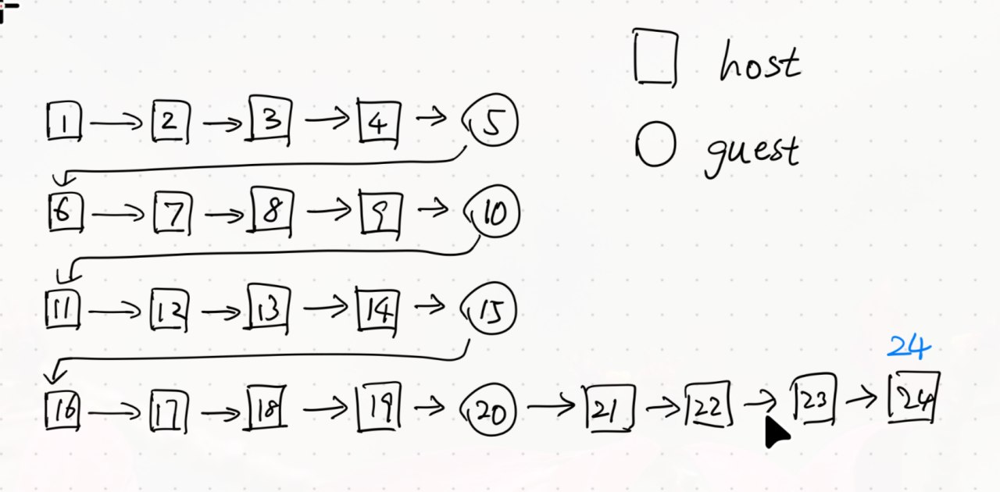
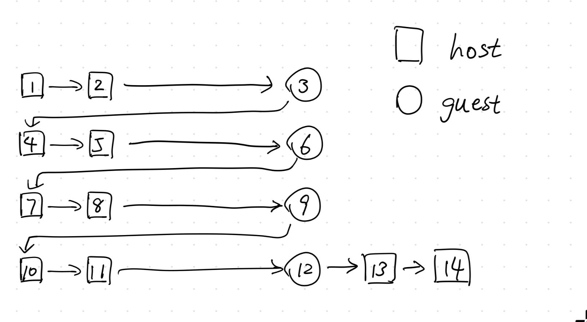

# CS 423 Midterm (Fall 2024)

**Tips:**

- **You are expected to do the exam** **independently****.** No discussion is allowed – **don’t cheat**. If you are harassed by someone for forceful discussion, please let the instructors know and they will handle it.
- **You are NOT supposed to use ChatGPT.** Certainly, we can’t track you. Note that ChatGPT could be wrong in certain patterns and we will check it. 
- **Please type your answers instead of handwriting them.** Note that your presentation does matter. If we can’t understand your writing, then we won’t give points. We won’t guess anything beyond what you write. 
- Give **short, concise answers** rather than long, vague ones (we grade by correctness, not by length). 
- **Some problems need writing code, executing it on your own machine (which you use for writing MPs), and reporting the results.** It’s a feature, not a bug. 
- If you find that you have to make assumptions to solve problems, write them down (e.g., “I assume this is an `x86` architecture” or “I assume a Linux kernel version `>2.6.3`”). Most problems are kept at a high level and do not need specific assumptions. 
- **No late submission is allowed. **

| **Sections (40 points)**      | **Points** |
| :---------------------------- | ---------- |
| MP-1 Continued (10 points)    |            |
| MP-1 Continued (10 points)    |            |
| CPU Scheduling (10 points)    |            |
| Memory Management (10 points) |            |

<center style="font-size: 1.25em">
    <strong>Name: <u>&nbsp;&nbsp;Yuqing Zhai&nbsp;&nbsp;</u></strong>
    <span style="margin: 0 1.5em;"></span>
    <strong>NetID: <u>&nbsp;&nbsp;yuqing9&nbsp;&nbsp;</u></strong>
</center>


<div name="page-break"></div>

## 1. MP-2 Continued (10 points)

In MP2 we implemented a rate monotonic scheduler (RMS). RMS uses a static scheduling algorithm because priority (1/`period`) is assigned to each task once and for all. There exists another scheduling algorithm that can achieve higher CPU utilization called Deadline Driven scheduling (DDS) algorithm, which assigns priority to tasks in a dynamic fashion.

Using DDS, A task will be assigned the highest priority if the deadline of its current request is the nearest, and will be assigned the lowest priority if the deadline of its current request is the furthest. At any instant, the task with the highest priority and yet unfulfilled request will be executed.

Your task for this problem is to implement a DDS with MP2’s framework.

### (1)

Which part of the MP2 framework needs to be changed to implement DDS? Just describe which part. Don’t describe how to change and don’t write code, which is the task for next question. (2pt)

>We need to change algorithm that decides the highest priority task. To do so we need to save the `deadline` of each registered process and update them, so we could use them to in our algorithm.

### (2)

Finish the dispatch thread implementation for DDS. Starting code is provided, please fill the TODO part in `dispatch_fn()`. You need to write code in C style. (5pt)

Here the **`head`** is a link list of **`mp2_task_struct`** that stores all the tasks that have registered with the scheduler. You can introduce other local or global variables if you want.

You can assume the tasks registered have all passed admission control (though the admission criteria for DDS is different from RMS) and you don’t need to consider the case where a task misses its deadline.

All the other parts (registration, yield, de-registration, timer handler, etc.) are the same as what you implemented in MP2, and **the periodic application behaves in the same way as that in MP2**.

```c
enum proc_state { READY, RUNNING, SLEEPING };

static DEFINE_SPINLOCK(mp2_spinlock);
static LIST_HEAD(mp2_task_list);
struct mp2_task_struct {
    struct list_head node;
    pid_t pid;
    unsigned long period;    // in ms
    unsigned long comp_time; // in ms
    unsigned long deadline;  // in jiffies
    enum proc_state state;
    struct timer_list wakeup_timer;
    struct task_struct* linux_task;
}

struct mp2_task_struct *mp2_current_task;

// helper function: find task with earlist deadline
struct mp2_task_struct *_mp2_find_highest_ready_task(void) {
  struct mp2_task_struct *task_struct, *earlist_task = NULL;
  unsigned long earliest_deadline = ULONG_MAX;

  list_for_each_entry(task_struct, &mp2_task_list, list) {
    if (task_struct->state != READY) {
      continue;
    }

    if (task_struct->info.deadline < earliest_deadline) {
      earlist_task = task_struct;
      earliest_deadline = task_struct->info.deadline;
    }
  }

  return earlist_task;
}

void dispatch_fn() {
    unsigned long flags;
    
    set_current_state(TASK_INTERRUPTIBLE);
    schedule();
    
    while (!kthread_should_stop()) {
        // enter criticl section
       	spin_lock_irqsave(&mp2_spinlock, flags);
        highest_ready_task = _mp2_find_highest_ready_task();

        // if no ready task, no scheduling needed
        if (highest_ready_task == NULL) {
            // current task finished, set to NULL
            if (
                (mp2_current_task) != NULL &&
                (mp2_current_task)->state == SLEEPING
            ) {
                mp2_current_task = NULL;
            }

            goto WAIT;
        }

        // do not preempt yourself, otherwise
        // you will waste time
        if (mp2_current_task != NULL) {
            if (mp2_current_task->info.pid == highest_ready_task->info.pid) {
                goto WAIT;
            }
        }

        // if ready task are not higher than current
        // task, do not preempt
        if (mp2_current_task != NULL && mp2_current_task->state == RUNNING) {
            if (!(highest_ready_task->info.deadline < mp2_current_task->info.deadline)) {
                goto WAIT;
            }
        }

        // otherwise try preempt current task, and
        // switch to highest ready task
        _mp2_preempt(mp2_current_task);
        _mp2_context_switch(highest_ready_task);

WAIT:
        // exit critical section
        spin_unlock_irqrestore(&mp2_spinlock, flags);
        set_current_state(TASK_INTERRUPTIBLE);
        schedule();
    }
}
```

Few things to notice. I would assume that the list structure is protected by a spinlock called `mp2_spinlock`, and instead of using `HEAD`, I am using a global variable called `mp2_task_list` as head, and I have a variable `mp2_current_task` to track the current task. I have created a helper function called `_mp2_find_highest_ready_task`, which finds the ready task with highest priority. **The only changes is in line 28 and 72**: where it is previous compared between `period` but now between `deadline`. Other lines are the same as my `mp2` implementation.

### (3)




## 2. MP-3 Continued (10 points)

While your TA Siyuan is working on MP3, he finds that the overall page fault stats can not tell the performance of a specific application. He wants to allocate an individual buffer per process to track every application’s page fault rate. He wants the work program to do everything as it is doing right now, but call `mmap ` syscall before deregistration to get the profiled page fault and utilization statistics. 

In his setup, he wants the buffer be allocated at registration time, and deallocated at deregistration time. The size of buffer is kept at `128 * 4KB`. The profiling rate stays at `20 HZ`. Each time the profiling `workqueue` is triggered, it will write four unsigned long values into the buffer of each registered process 1) current jiffies, 2) # of minor page faults since last buffer update time, 3) # of major page faults since last buffer update time, 4) CPU utilization  (`s_time + u_time`) since buffer update time.

Since Siyuan is too busy with his paper submissions, would you mind helping him implement this feature?

### (1)

Let’s start coding! Siyuan left the barebone design of his MP3 code. If you need additional changes feel free to add them. For simplification, you don’t need to show workqueue setup and cleanup. You may assume that there’s only one workqueue per module (same as what we did for MP3). You can also assume that module init and exit functions are handled properly. (6 points)

>```c
>#define LINUX
>#define DEBUG 1
>
>#include <linux/module.h>
>#include <linux/kernel.h>
>#include <linux/kthread.h>
>#include <linux/proc_fs.h>
>#include <linux/list.h>
>#include <linux/slab.h>
>#include <linux/spinlock.h>
>#include <linux/timer.h>
>#include <linux/jiffies.h>
>#include <linux/workqueue.h>
>#include <linux/mutex.h>
>#include <linux/vmalloc.h>
>#include <linux/fs.h>
>#include <linux/cdev.h>
>#include <linux/mm.h>
>#include <asm/uaccess.h>
>#include "mp3_given.h"
>
>MODULE_LICENSE("GPL");
>MODULE_AUTHOR("Yuqing Zhai <yuqing9@illinois.edu>");
>MODULE_DESCRIPTION("CS-423 MP3 Page Fault Profiler");
>
>#define TRANSFER_BUFFER_SIZE 256
>#define EXTRA_BUFFER_SIZE 64
>#define READ_BUFFER_SIZE (TRANSFER_BUFFER_SIZE + EXTRA_BUFFER_SIZE)
>#define WRITE_BUFFER_SIZE 256
>#define MAX_PID ((1 << 22) - 1)
>
>DEFINE_MUTEX(mp3_mutex);
>static LIST_HEAD(mp3_task_list);
>size_t mp3_list_size = 0;
>struct kmem_cache *mp3_task_struct_cache;
>struct mp3_task_struct {
>   struct task_struct *task;
>   pid_t pid;
>   unsigned long min_flt;
>   unsigned long maj_flt;
>   unsigned long time;
>   unsigned long* mapped_pages;
>   unsigned long mapped_pages_offset;
>
>   struct list_head list;
>};
>
>#define NUM_PAGES 128
>#define SAMPLE_SIZE 12000
>
>static void mp3_work_function(struct work_struct *work);
>DECLARE_DELAYED_WORK(mp3_work, mp3_work_function);
>static struct workqueue_struct *mp3_workqueue;
>
>#define CHRDEV_MAJOR 423
>
>// get the cpu use of a process, track number of task in list
>static void _mp3_add_task(struct mp3_task_struct *new_task) {
>   list_add(&new_task->list, &mp3_task_list);
>   mp3_list_size++;
>}
>
>// delete a task from the list, track number of task in list
>static void _mp3_delete_task(struct mp3_task_struct *task) {
>   list_del(&task->list);
>   mp3_list_size--;
>}
>
>// get the current_time, min_flt, maj_flt, cpu_time of a process
>// write these data into the task struct in the list
>// write the values to the memory mapped sample buffer
>static ssize_t _mp3_update_work(void) {
>   unsigned long sum_min_flt, sum_maj_flt, sum_time;
>   unsigned long min_flt, maj_flt, utime, stime;
>   struct mp3_task_struct *curr, *temp;
>
>   sum_time = 0;
>   sum_min_flt = 0;
>   sum_maj_flt = 0;
>
>   list_for_each_entry_safe(curr, temp, &mp3_task_list, list) {
>      if (get_cpu_use(curr->pid, &min_flt, &maj_flt, &utime, &stime) < 0) {
>         pr_err("_mp3_update_work: failed to get cpu use, pid: %d\n", curr->pid);
>         pr_err("_mp3_update_work: removing pid: %d\n", curr->pid);
>         pr_err("_mp3_update_work: you measurement data may be incorrect\n");
>
>         _mp3_delete_task(curr);
>         kmem_cache_free(mp3_task_struct_cache, curr);
>         return -EINVAL;
>      }
>
>      curr->time = utime + stime;
>      curr->min_flt = min_flt;
>      curr->maj_flt = maj_flt;
>
>      sum_time += utime + stime;
>      sum_min_flt += min_flt;
>      sum_maj_flt += maj_flt;
>
>      *(curr->mapped_pages + (curr->mapped_pages_offset++ % SAMPLE_SIZE)) = jiffies;
>      *(curr->mapped_pages + (curr->mapped_pages_offset++ % SAMPLE_SIZE)) = sum_min_flt;
>      *(curr->mapped_pages + (curr->mapped_pages_offset++ % SAMPLE_SIZE)) = sum_maj_flt;
>      *(curr->mapped_pages + (curr->mapped_pages_offset++ % SAMPLE_SIZE)) = sum_time;
>   }
>
>   return 0;
>}
>
>// work function to update the info of each registered process
>static void mp3_work_function(struct work_struct *work) {
>   mutex_lock(&mp3_mutex);
>
>   _mp3_update_work();
>
>   mutex_unlock(&mp3_mutex);
>   queue_delayed_work(mp3_workqueue, &mp3_work, msecs_to_jiffies(50));
>}
>
>// register a new process, add it to the list
>// start the work if it's the first process
>static ssize_t mp3_register(pid_t pid) {
>   struct mp3_task_struct *new_task, *curr;
>
>   unsigned long min_flt, maj_flt, utime, stime;
>   int i;
>
>   if (get_cpu_use(pid, &min_flt, &maj_flt, &utime, &stime) < 0) {
>      pr_debug("mp3_register: failed to get cpu use, pid: %d\n", pid);
>      return -EINVAL;
>   }
>
>   list_for_each_entry(curr, &mp3_task_list, list) {
>      if (curr->pid == pid) {
>         pr_debug("mp3_register: pid %d already registered\n", pid);
>         return -EINVAL;
>      }
>   }
>
>   new_task = kmem_cache_alloc(mp3_task_struct_cache, GFP_KERNEL);
>
>   new_task->pid = pid;
>   new_task->time = utime + stime;
>   new_task->min_flt = min_flt;
>   new_task->maj_flt = maj_flt;
>   new_task->mapped_pages_offset = 0;
>
>   new_task->mapped_pages = (unsigned long *) vmalloc(NUM_PAGES * PAGE_SIZE);
>   if (new_task->mapped_pages == NULL) {
>      pr_err("mp3_init: failed to allocate mapped pages\n");
>      pr_err("mp3_init: removing /proc/mp3\n");
>
>      return -ENOMEM;
>   }
>
>   // reserve the pages
>   for (i = 0; i < NUM_PAGES * PAGE_SIZE; i += PAGE_SIZE) {
>      SetPageReserved(vmalloc_to_page((void *) ((unsigned long) new_task->mapped_pages + i)));
>   }
>
>   memset(new_task->mapped_pages, -1L, NUM_PAGES * PAGE_SIZE);
>
>   INIT_LIST_HEAD(&new_task->list);
>
>   mutex_lock(&mp3_mutex);
>
>   _mp3_add_task(new_task);
>   // start the work upon the first process
>   if (mp3_list_size == 1) {
>      queue_delayed_work(mp3_workqueue, &mp3_work, msecs_to_jiffies(50));
>   }
>
>   mutex_unlock(&mp3_mutex);
>
>   return 0;
>}
>
>// unregister a process, remove it from the list
>// stop the work if it's the last process
>static ssize_t mp3_unregister(pid_t pid) {
>   struct mp3_task_struct *curr, *temp;
>   int i;
>
>   mutex_lock(&mp3_mutex);
>
>   list_for_each_entry_safe(curr, temp, &mp3_task_list, list) {
>      if (curr->pid == pid) {
>         for (i = 0; i < NUM_PAGES * PAGE_SIZE; i += PAGE_SIZE) {
>            ClearPageReserved(vmalloc_to_page((void *) ((unsigned long) curr->mapped_pages + i)));
>         }
>         vfree(curr->mapped_pages);
>         _mp3_delete_task(curr);
>         kmem_cache_free(mp3_task_struct_cache, curr);
>      }
>   }
>
>   if (mp3_list_size == 0) {
>      if (!cancel_delayed_work_sync(&mp3_work)) {
>         pr_debug("mp3_unregister: failed to cancel work\n");
>         return -EINVAL;
>      }
>   }
>
>   mutex_unlock(&mp3_mutex);
>
>   return 0;
>}
>
>// parse the command from the user buffer
>// command should be either 'R' or 'U'
>// pid should be a valid pid
>static ssize_t _mp3_parse_command(char *buffer, size_t length, char *command, pid_t *pid) {
>  // could be one of three forms
>  // R <pid> length: 2 + 32
>  // U <pid> length: 2 + 32
>  // a 256 byte buffer should be enough
>
>   int result;
>
>   if (length < 2) {
>      pr_debug("_mp3_parse_command: missing command\n");
>   }
>
>   *command = buffer[0];
>   buffer += 2;
>
>   if (*command != 'R' && *command != 'U') {
>      pr_debug("_mp3_parse_command: invalid command\n");
>      return -EINVAL;
>   }
>
>   pr_debug("_mp3_parse_command: command: %c\n", *command);
>
>   // parsing <pid>
>   result = kstrtoint(buffer, 10, pid);
>   if (result < 0) {
>      pr_debug("_mp3_parse_command: failed to parse pid\n");
>      return -EINVAL;
>   }
>   if (*pid < 0 || *pid > MAX_PID) {
>      pr_debug("_mp3_parse_command: invalid pid\n");
>      return -EINVAL;
>   }
>
>   return 0;
>}
>
>// proc_write function to register a new process
>static ssize_t mp3_on_write(struct file *file, const char __user *user_buffer, size_t count, loff_t *ppos) {
>   char kernel_buffer[WRITE_BUFFER_SIZE];
>
>   char command;
>   pid_t user_pid;
>   ssize_t parse_result;
>   ssize_t command_result;
>
>	if (count >= WRITE_BUFFER_SIZE) {
>      pr_debug("mp3_on_write: user input too long\n");
>		return -EINVAL;
>	}
>
>	if (copy_from_user(kernel_buffer, user_buffer, count)) {
>      pr_debug("mp3_on_write: copy_from_user failed\n");
>		return -EFAULT;
>	}
>
>	kernel_buffer[count] = '\0';
>
>   parse_result = _mp3_parse_command(kernel_buffer, count, &command, &user_pid);
>   if (parse_result < 0) {
>      pr_debug("mp3_on_write: failed to parse command\n");
>      return parse_result;
>   }
>
>   pr_debug("mp3_on_write: command: %c, pid: %d\n", command, user_pid);
>
>   if (command == 'R')
>      command_result = mp3_register(user_pid);
>   if (command == 'U')
>      command_result = mp3_unregister(user_pid);
>
>   if (command_result < 0) {
>      pr_debug("mp3_on_write: command %c failed\n", command);
>      return command_result;
>   }
>
>	return count;
>}
>
>// get the status of each registered process, and write to the user buffer
>static ssize_t _mp3_get_status(char __user * user_buffer, size_t count, loff_t offset)
>{
>	char kernel_buffer[READ_BUFFER_SIZE]; // EXTRA_BUFFER_SIZE > length of a single entry
>	int kernel_buffer_offset = 0;         // current offset in the kernel buffer
>	int entry_bytes = 0;                  // bytes written for each entry
>
>	int proc_file_offset = 0;             // current offset in the proc file
>	int offset_size = 0;                  // size of kernel buffer ahead of the user offset
>	int transfer_size = 0;                // transferred buffer size
>	int kernel_copy_offset = 0;           // offset in the kernel buffer to copy from
>
>	int bytes_written = 0;                // total bytes written to the user buffer
>
>	struct mp3_task_struct *entry;
>
>	list_for_each_entry(entry, &mp3_task_list, list) {
>		// it's safe to assume return value of snprintf is
>		// the actual bytes written, as the buffer is large enough
>		// as we have buffer area of EXTRA_BUFFER_SIZE
>		entry_bytes = snprintf(
>			kernel_buffer + kernel_buffer_offset,
>			READ_BUFFER_SIZE - kernel_buffer_offset,
>			"%d\n", 
>			entry->pid
>		);
>
>		if (entry_bytes < 0) {
>			pr_debug("_mp3_get_status: snprintf failed\n");
>			return bytes_written ? bytes_written : -ENOMEM;
>		}
>
>		kernel_buffer_offset += entry_bytes;
>
>		// if the buffer is not full and there are more entries
>		if (
>			kernel_buffer_offset < TRANSFER_BUFFER_SIZE &&
>			!list_is_last(&entry->list, &mp3_task_list)
>		) {
>			continue;
>		}
>
>		offset_size = (proc_file_offset + kernel_buffer_offset) - offset;
>
>		if (offset_size <= 0) {
>			// the buffer is behind the user offset
>			proc_file_offset += kernel_buffer_offset;
>			kernel_buffer_offset = 0;
>			continue;
>		}
>
>		// to account for case where offset <= proc_file_offset
>		offset_size = min(offset_size, kernel_buffer_offset);
>		kernel_copy_offset = max(offset - proc_file_offset, 0);
>
>		// truncate in case remaining user buffer is not enough
>		transfer_size = min(offset_size, (int) (count - bytes_written));
>
>		if (copy_to_user(
>			user_buffer + bytes_written,
>			kernel_buffer + kernel_copy_offset,
>			transfer_size
>		)) {
>			pr_debug("_mp3_get_status: copy_to_user failed");
>			return bytes_written ? bytes_written : -EFAULT;
>		}
>
>		bytes_written += transfer_size;
>
>		if (bytes_written >= count) {
>			return count;
>		}
>
>		proc_file_offset += kernel_buffer_offset;
>		kernel_buffer_offset = 0;
>	}
>
>	return bytes_written;
>}
>
>// proc read function to get the status of each registered process
>static ssize_t mp3_on_read(struct file *file, char __user *user_buffer, size_t count, loff_t *ppos)
>{
>	ssize_t written = 0;
>
>	pr_debug("mp3_on_read\n");
>	pr_debug("mp3_on_read: count = %lu, ppos = %lld\n", count, *ppos);
>
>	// return EOF if user doesn't want to read anything
>	// or if the offset is negative
>	if (count <= 0 || *ppos < 0) {
>		return 0;
>	}
>
>	mutex_lock(&mp3_mutex);
>
>	written = _mp3_get_status(user_buffer, count, *ppos);
>
>	if (written < 0) {
>		mutex_unlock(&mp3_mutex);
>		return written;
>	}
>
>	mutex_unlock(&mp3_mutex);
>
>	pr_debug("mp3_on_read: written = %ld\n", written);
>
>	*ppos += written;
>	return written;
>}
>
>// proc file operations
>static struct proc_ops fops = {
>	.proc_read = mp3_on_read,
>	.proc_write = mp3_on_write,
>};
>
>// character device operations open (no-op)
>static int mp3_chrdev_open(struct inode *inode, struct file *file) {
>   pr_debug("mp3_chrdev_open\n");
>   return 0;
>}
>
>// character device operations release (no-op)
>static int mp3_chrdev_release(struct inode *inode, struct file *file) {
>   pr_debug("mp3_chrdev_release\n");
>   return 0;
>}
>
>// character device operations mmap
>// map each page in the mapped_pages to the contiguous place in user vma
>static int mp3_chrdev_mmap(struct file *file, struct vm_area_struct *vma) {
>   unsigned long len = vma->vm_end - vma->vm_start;
>   unsigned long offset, pfn;
>   struct mp3_task_struct *curr;
>   unsigned long *mapped_pages;
>
>   // get pid from vma->vm_mm->owner
>   mutex_lock(&mp3_mutex);
>
>   list_for_each_entry(curr, &mp3_task_list, list) {
>      if (curr->pid == vma->vm_mm->owner->pid) {
>         mapped_pages = curr->mapped_pages;
>         break;
>      }
>   }
>
>   mutex_unlock(&mp3_mutex);
>
>   for (offset = 0; offset < len; offset += PAGE_SIZE) {
>      pfn = vmalloc_to_pfn((void *) ((unsigned long) mapped_pages + offset));
>      if (remap_pfn_range(vma, vma->vm_start + offset, pfn, PAGE_SIZE, vma->vm_page_prot) < 0) {
>         pr_debug("mp3_chrdev_mmap: failed to remap pfn\n");
>         return -ENOMEM;
>      }
>   }
>
>   return 0;
>}
>
>// character device operations
>static struct file_operations mp3_chrdev_fops = {
>   .open = mp3_chrdev_open,
>   .release = mp3_chrdev_release,
>   .mmap = mp3_chrdev_mmap,
>};
>
>// module initialization
>static int __init mp3_init(void)
>{
>	struct proc_dir_entry *mp3_dir;
>
>	pr_warn("mp3_init\n");
>   pr_warn("mp3_init: jiffies in a second: %d\n", HZ);
>	mp3_dir = proc_mkdir("mp3", NULL);
>
>	if (mp3_dir == NULL) {
>		pr_err("mp3_init: failed to create /proc/mp3\n");
>		return -ENOMEM;
>	}
>
>	if (proc_create("status", 0666, mp3_dir, &fops) == NULL) {
>		pr_err("mp3_init: failed to create /proc/mp3/status\n");
>		pr_err("mp3_init: removing /proc/mp3\n");
>
>      goto FAILED_CLEANUP_MP3_DIR;
>		return -ENOMEM;
>	}
>
>   mp3_workqueue = alloc_workqueue("mp3_workqueue", WQ_UNBOUND, 0);
>
>   if (mp3_workqueue == NULL) {
>      pr_err("mp3_init: failed to create workqueue\n");
>      pr_err("mp3_init: removing /proc/mp3\n");
>
>      goto FAILED_CLEANUP_MP3_DIR;
>      return -ENOMEM;
>   }
>
>   // register character device
>   if (register_chrdev(CHRDEV_MAJOR, "mp3_chrdev", &mp3_chrdev_fops) < 0) {
>      pr_err("mp3_init: failed to register chrdev\n");
>      pr_err("mp3_init: removing /proc/mp3\n");
>
>      goto FAILED_CLEANUP_MP3_VMALLOC;
>      return -ENOMEM;
>   }
>
>   // create task struct cache
>   mp3_task_struct_cache = KMEM_CACHE(mp3_task_struct, SLAB_HWCACHE_ALIGN);
>   if (mp3_task_struct_cache == NULL) {
>      pr_err("mp3_init: failed to create task struct cache\n");
>      pr_err("mp3_init: removing /proc/mp3\n");
>
>      goto FAILED_CLEANUP_MP3_CHDDEV;
>      return -ENOMEM;
>   }
>
>   return 0;
>
>FAILED_CLEANUP_MP3_CHDDEV:
>   pr_err("mp3_init: unregistering chrdev\n");
>   unregister_chrdev(CHRDEV_MAJOR, "mp3_chrdev");
>
>FAILED_CLEANUP_MP3_VMALLOC:
>   pr_err("mp3_init: destroying workqueue\n");
>   if (mp3_workqueue != NULL) {
>      flush_workqueue(mp3_workqueue);
>      destroy_workqueue(mp3_workqueue);
>   }
>
>FAILED_CLEANUP_MP3_DIR:
>   // if this fails, we couldn't really do anything about it
>   pr_err("mp3_init: removing /proc/mp3\n");
>   if (remove_proc_subtree("mp3", NULL)) {
>      pr_err("mp3_init: failed to remove /proc/mp3\n");
>      pr_err("mp3_init: you may need to manually remove /proc/mp3\n");
>   }
>
>	return -ENOMEM;
>}
>
>// free the task list
>static void _mp3_free_task_list(void) {
>   struct mp3_task_struct *curr, *temp;
>
>   list_for_each_entry_safe(curr, temp, &mp3_task_list, list) {
>      _mp3_delete_task(curr);
>      kmem_cache_free(mp3_task_struct_cache, curr);
>   }
>}
>
>// module exit
>static void __exit mp3_exit(void)
>{
>
>	if (remove_proc_subtree("mp3", NULL)) {
>		pr_err("mp3_exit: failed to remove /proc/mp3\n");
>		pr_err("mp3_exit: you may need to manually remove /proc/mp3\n");
>	}
>
>   // cancel the work
>   cancel_delayed_work_sync(&mp3_work);
>
>   if (mp3_workqueue != NULL) {
>      flush_workqueue(mp3_workqueue);
>      destroy_workqueue(mp3_workqueue);
>   } else {
>		// workqueue should always exist, otherwise the
>		// module will fail in the init function in the first place
>		pr_err("mp3_exit: workqueue not initialized\n");
>		pr_err("mp3_exit: there are bugs in the code\n");
>   }
>
>   mutex_lock(&mp3_mutex);
>   _mp3_free_task_list();
>   mutex_unlock(&mp3_mutex);
>
>   unregister_chrdev(CHRDEV_MAJOR, "mp3_chrdev");
>   kmem_cache_destroy(mp3_task_struct_cache);
>
>	pr_warn("mp3_exit\n");
>}
>
>module_init(mp3_init);
>module_exit(mp3_exit);
>
>```
>
>Since I modified my code based on my `mp3`, so I just put the modified version here, it is a bit long and cumbersome so sorry for that. For the `work` program. You essentially copy the code logic from `monitor.c` and put it in `work`:
>
>```c
>#define _DEFAULT_SOURCE
>
>#include <fcntl.h>
>#include <stdio.h>
>#include <stdlib.h>
>#include <sys/mman.h>
>#include <sys/syscall.h>
>#include <unistd.h>
>
>#define N_ITERATION 20
>#define NPAGES (128)   // The size of profiler buffer (Unit: memory page)
>#define BUFD_MAX 48000 // The max number of profiled samples stored in the profiler buffer
>
>char *buffer[1024];
>
>int msize;
>
>static int buf_fd = -1;
>static int buf_len;
>
>// This function opens a character device (which is pointed by a file named as fname) and performs the mmap() operation. If the operations are successful, the base address of memory mapped buffer is returned. Otherwise, a NULL pointer is returned.
>static void *buf_init(char *fname)
>{
>  unsigned int *kadr;
>
>  if(buf_fd == -1){
>    buf_len = NPAGES * getpagesize();
>    if ((buf_fd=open(fname, O_RDWR|O_SYNC))<0){
>        printf("file open error. %s\n", fname);
>        return NULL;
>    }
>  }
>  kadr = mmap(0, buf_len, PROT_READ|PROT_WRITE, MAP_SHARED, buf_fd, 0);
>  if (kadr == MAP_FAILED){
>      printf("buf file open error.\n");
>      return NULL;
>  }
>
>  return kadr;
>}
>
>// This function closes the opened character device file.
>static void buf_exit()
>{
>  if(buf_fd != -1){
>    close(buf_fd);
>    buf_fd = -1;
>  }
>}
>
>// This function emualtes a random memory access
>static void rand_access()
>{
>  int target;
>  int blk;
>
>  target = rand() % (msize * 1024*1024);
>  if(target<0)
>    target *= -1;
>  blk = target / 1024/1024;
>  buffer[blk][target-blk*1024*1024] = '*';
>}
>
>// This function emualtes a memory access that has a temporal locality
>static int local_access(int addr)
>{
>  if(rand() < 0){
>    return addr + 1;
>  }
>  else{
>    return addr + rand() % 300;
>  }
>}
>
>int main(int argc, char* argv[])
>{
>  char cmd[120];
>  pid_t mypid;
>  int i, j, k;
>  int locality;
>  int naccess;
>  int ret;
>
>  if(argc<4){
>    printf("usage: work <memsize in MB> <locality: R for Random or T for Temporal> <# of memory accesses per iteration>");
>    return -1;
>  }
>
>  msize = atoi(argv[1]);
>  if(msize>1024 || msize<1){
>    printf("memsize shall be between 1 and 1024\n");
>    return -1;
>  }
>
>  locality = (argv[2][0]=='R')?0:1;
>
>  naccess = atoi(argv[3]);
>  if(naccess<1){
>    printf("naccess shall be >=1\n");
>    return -1;
>  }
>
>  printf("A work prcess starts (configuration: %d %d %d)\n", msize, locality, naccess); 
>
>  // 1. Register itself to the MP3 kernel module for profiling.
>  mypid = syscall(__NR_gettid);
>  printf("Registration now!");
>  sprintf(cmd, "echo 'R %u'>//proc/mp3/status", mypid);
>  ret = system(cmd);
>  (void)ret;
>
>  // 2. Allocate memory blocks
>  for(i=0; i<msize; i++){
>    buffer[i] = malloc(1024*1024);
>    if(buffer[i] == NULL){
>      for(i--; i>=0; i--)
>        free(buffer[i]);
>      printf("Out of memory error! (failed at %dMB)\n", i);
>      return -1;
>    }
>  }
>
>  // 3. Access allocated memory blocks using the specified access policy
>  int addr = 0;
>  for (k=0;k<N_ITERATION; k++){
>     printf("[%d] %d iteration\n", mypid, k);
>     if(!locality){
>       for(j=0; j<naccess; j++){
>         rand_access();
>       }
>     }
>     else{
>       for(j=0; j<naccess; j++){
>         int locality = rand() % 10;
>         if(locality > -2 && locality < 2){ /* random access */
>           rand_access();
>         }
>         else{ /* local access */
>           addr = local_access(addr);
>	 }
>       }
>     }
>     sleep(1);
>  }
>  
>  // 4. Free memory blocks
>  for(i=0; i<msize; i++){
>    free(buffer[i]);
>  }
>
>  // 4.5 Read and print profiled data
>  unsigned long *buf;
>  int index = 0;
>
>  // Open the char device and mmap()
>
>
>  printf("Mmap now!");
>
>  buf = buf_init("/dev/node");
>  if(!buf)
>    return -1;
>  
>  // Read and print profiled data
>  for(index=0; index<BUFD_MAX; index++)
>    if(buf[index] != -1) break;
>
>  i = 0;
>  while(buf[index] != -1){
>    printf("%lu ", buf[index]);
>    buf[index++] = -1;
>    if(index >= BUFD_MAX)
>      index = 0;
>
>    printf("%lu ", buf[index]);
>    buf[index++] = -1;
>    if(index >= BUFD_MAX)
>      index = 0;
>
>    printf("%lu ", buf[index]);
>    buf[index++] = -1;
>    if(index >= BUFD_MAX)
>      index = 0;
>
>    printf("%lu\n", buf[index]);
>    buf[index++] = -1;
>    if(index >= BUFD_MAX)
>      index = 0;
>    i++;
>  }
>  printf("read %d profiled data\n", i);
>
>  // Close the char device
>  buf_exit();
>
>  // 5. Unregister itself to stop the profiling
>  sprintf(cmd, "echo 'U %u'>//proc/mp3/status", mypid);
>  ret = system(cmd);
>  (void)ret;
>
>  printf("Deregistration now!");
>
>  return 0;
>}
>
>```

### (b)

Let’s test! Please test with ./work 1024 R 50000 and measure what time difference of registration, deregistration, and mmap between current implementations and the standard MP3 one ? Please tell us how you test, show the results, and briefly discuss why there is or not a difference. (4 points)

>I basically add three print statement before registration, de-registration. In modified version, the time between registration and de-registration is around (4296215644 - 4296195295)/1000 = `20.349s`. The original version is around (4296697856 - 4296677609) / 1000 = `20.247s`. These two are roughly equal, I think the time cost of `mmap` and logging the value is not significant in this case, so we have roughly similar value.


## 3. Kernel Extension Programming (10 points)

### (1)

Our ex-TA Juowen, is excited about the error-injection mechanism we developed in MP4. He believes that this could be used for security policies on system call filtering. System call filtering restricts the set of system calls an application may invoke, based on a security policy. In particular, Juowen wants to implement a system call filtering policy that only allows an application to call keyctl() no more than **10 times**. Such a policy can be used to mitigate [CVE-2016-0728](https://nvd.nist.gov/vuln/detail/cve-2016-0728).

Current system call filtering mechanism on Linux is provided by [Seccomp](https://www.man7.org/conf/ndctechtown2018/limiting-the-kernel-attack-surface-with-seccomp-NDC-TechTown-Kerrisk.pdf) in its filter mode. However, Seccomp currently only supports the classic BPF, which cannot support the stateful policy Juowen wants. Instead, Juowen believes he can attach a kprobe-eBPF program at the entry of [**x64_sys_call**()](https://elixir.bootlin.com/linux/v6.12.3/C/ident/x64_sys_call) and perform an override-return if the process violates the policy.

Your work for this problem is to implement an eBPF (not Rex!) program and a loader program for testing. Below are the requirements:

- Assume kernel version 6.12.3 (latest stable) on x86-64

- Your program should attach to [**x64_sys_call**()](https://elixir.bootlin.com/linux/v6.12.3/C/ident/x64_sys_call) (we have already marked this for you)
- Your program should use a hash map to record the number of keyctl() the current process has called. Multiple processes can have this policy and share the same map—make sure you have separate map entries for each of them. Map APIs can be found [here](https://elixir.bootlin.com/linux/v6.12.1/source/include/uapi/linux/bpf.h#L1848).
- eBPF has a different API for getting the PID, check out [**bpf_get_current_pid_tgid()**](https://elixir.bootlin.com/linux/v6.12.1/source/include/uapi/linux/bpf.h#L2108).
- If a process has exceeded its invocation limits (10), you should override the return value to -EPERM.
- When the process exits, you should clear its associated map entry (either reset it to 0 or remove the entry entirely). You can assume the process always invokes the exit_group() system call when exiting.
- [**x64_sys_call**()](https://elixir.bootlin.com/linux/v6.12.3/C/ident/x64_sys_call) takes two arguments, the pt_regs pointer that contains the system call argument and the system call number. You can use the libbpf provided [**PT_REGS_PARM**](https://elixir.bootlin.com/linux/v6.12.3/source/tools/lib/bpf/bpf_tracing.h#L492) macros to access them. To check the system calls you need to match the system call numbers. You can either use the number provided by sys/syscall.h or linux/unistd.h.
- Your loader should load the program into the kernel using the libbpf APIs. After that, it should fork two child processes. In each child, you need to initialize the map entry for it and then exec into the userapp (you don’t need to implement the userapp and can assume it can be executed via ./userapp). Meanwhile, the parent should wait for the children to finish. Make sure you check the error codes from library/system calls.
- Though our loader program only creates two processes that use this policy, it is only for testing. Your eBPF program needs to correctly handle the case where more than 2 processes use it.
- You can check the tracex5 sample for a [eBPF-kprobe program](https://elixir.bootlin.com/linux/v6.12.3/source/samples/bpf/tracex5.bpf.c) and the [loader](https://elixir.bootlin.com/linux/v6.12.3/source/samples/bpf/tracex5_user.c).

#### 1. eBPF program (5 points)

```c
#define __TARGET_ARCH_x86

#include <linux/bpf.h>
#include <bpf/bpf_core_read.h>
#include <bpf/bpf_helpers.h>
#include <bpf/bpf_tracing.h>
#include <linux/ptrace.h>
#include <linux/sched.h>
#include <linux/unistd.h>
#include <linux/types.h>

#define MAX_CALLS 10
#define EPERM 1

// Define the hash map
struct {
    __uint(type, BPF_MAP_TYPE_HASH);
    __type(key, __u32);     // PID
    __type(value, __u32);   // Counter for keyctl() calls
    __uint(max_entries, 1024); // Limit of processes
} syscall_map SEC(".maps");

SEC("kprobe/x64_sys_call")
int syscall_filter(struct pt_regs *ctx)
{
    __u64 id_pid_tgid = bpf_get_current_pid_tgid();
    __u32 pid = id_pid_tgid >> 32; // Extract PID
    __u32 syscall_nr = PT_REGS_PARM1(ctx); // Get syscall number

    // Check if syscall is keyctl
    if (syscall_nr != __NR_keyctl)
        return 0;

    __u32 *count = bpf_map_lookup_elem(&syscall_map, &pid);
    if (!count) {
        // Initialize if no entry exists
        __u32 initial_count = 1;
        bpf_map_update_elem(&syscall_map, &pid, &initial_count, BPF_ANY);
        return 0;
    }

    if (*count >= MAX_CALLS) {
        // Override return value to -EPERM if limit exceeded
        bpf_override_return(ctx, -EPERM);
        return 0;
    }

    // Increment the count
    __sync_fetch_and_add(count, 1);
    return 0;
}

SEC("kprobe/exit_group")
int syscall_exit_cleanup(struct pt_regs *ctx)
{
    __u64 id_pid_tgid = bpf_get_current_pid_tgid();
    __u32 pid = id_pid_tgid >> 32;

    // Clean up the map entry
    bpf_map_delete_elem(&syscall_map, &pid);
    return 0;
}

char _license[] SEC("license") = "GPL";

```

#### (2) Userspace loader program (3 points)


```c
#include <stdio.h>
#include <stdlib.h>
#include <unistd.h>
#include <sys/wait.h>
#include <stdint.h>     // For uint32_t
#include <bpf/bpf.h>    // For bpf_map_update_elem
#include <bpf/libbpf.h> // For libbpf functions
#include <errno.h>

#define BPF_OBJ_PATH "./syscall_filter.bpf.o"

int main(void)
{
    struct bpf_object *obj;
    struct bpf_program *prog;
    struct bpf_link *link = NULL;
    int map_fd, ret;
    pid_t pid;

    // Load BPF object file
    obj = bpf_object__open_file(BPF_OBJ_PATH, NULL);
    if (libbpf_get_error(obj)) {
        fprintf(stderr, "Failed to open BPF object file: %s\n", strerror(errno));
        return 1;
    }

    // Find the BPF program by section name
    prog = bpf_object__find_program_by_name(obj, "syscall_filter");
    if (!prog) {
        fprintf(stderr, "Failed to find BPF program: %s\n", strerror(errno));
        bpf_object__close(obj);
        return 1;
    }
    
    // Load BPF programs
    ret = bpf_object__load(obj);
    if (ret) {
        fprintf(stderr, "Failed to load BPF object: %s\n", strerror(errno));
        bpf_object__close(obj);
        return 1;
    }

    // Attach the BPF program to the kprobe
    link = bpf_program__attach(prog);
    if (libbpf_get_error(link)) {
        fprintf(stderr, "Failed to attach kprobe: %s\n", strerror(errno));
        bpf_object__close(obj);
        return 1;
    }

    // Get the map file descriptor
    map_fd = bpf_object__find_map_fd_by_name(obj, "syscall_map");
    if (map_fd < 0) {
        fprintf(stderr, "Failed to find map: %s\n", strerror(errno));
        bpf_link__destroy(link);
        bpf_object__close(obj);
        return 1;
    }

    // Fork two child processes
    for (int i = 0; i < 2; i++) {
        pid = fork();
        if (pid < 0) {
            fprintf(stderr, "Failed to fork: %s\n", strerror(errno));
            bpf_link__destroy(link);
            bpf_object__close(obj);
            return 1;
        } else if (pid == 0) {
            // Child process
            uint32_t initial_count = 0;
            uint32_t pid_key = getpid();

            // Initialize the map entry for this process
            ret = bpf_map_update_elem(map_fd, &pid_key, &initial_count, BPF_ANY);
            if (ret) {
                fprintf(stderr, "Failed to update map: %s\n", strerror(errno));
                exit(1);
            }

            // Execute the user application
            execl("./userapp", "./userapp", NULL);
            // If execl returns, there was an error
            fprintf(stderr, "Failed to exec userapp: %s\n", strerror(errno));
            exit(1);
        }
    }

    // Parent process waits for children to finish
    for (int i = 0; i < 2; i++) {
        wait(NULL);
    }

    // Clean up
    bpf_link__destroy(link);
    bpf_object__close(obj);

    return 0;
}

```


### (3)

`eBPF` prohibits attaching a program that calls `bpf_override_return()` anywhere other than function entries. Could you think of one scenario where violating this rule can cause problems? (1 point)

>This function effectively set the program counter to a override function which will return the corresponding error code. The function in `eBPF` program might have resource allocated with them, and such resource must be properly freed before we jump to this override function. If we jump it from anywhere other than function entries (say, in the middle of the function), the resource associated with original function might not get properly cleaned up before we jump to override function, leading to data leaks.

### (4)

Juowen also wants to check pointer arguments of system calls. This is useful for system calls like `open()`, which takes a string `(char *)`. The eBPF subsystem already provides helper functions that implement exactly the `copy_from_user` functionality. However, this should not be used for security checks, even if the copy is always successful. Could you think of why? (1 point)

>There is a quote from the https://www.linuxfoundation.org/hubfs/eBPF/ControlPlane%20%E2%80%94%20eBPF%20Security%20Threat%20Model.pdf, where it says that
>
>> Exploiting TOCTOU (Time of Check / Time of Use) issues with tools which attach to entry points of syscalls.
>> This may allow an attacker to modify memory contents before the kernel
>> copies arguments from userspace. In this case, what is ‘checked’ by the
>> security tool may not be what is ‘used’.
>
>Therefore, even if you verified the memory with `eBPF` program, if the user space memory is modified after your `eBPF` checks but before the kernel system call actually uses it, your security check are bypassed and therefore useless. So you should not use it for security checks.


## 4. Virtualization (10 points)

We have discussed memory management in the OS running on bare metal. Now, let’s discuss memory management in virtualized environments such as modern cloud environments (e.g., an EC2 virtual machine running on AWS’s hypervisor). Modern hardware architectures are equipped with memory virtualization features so the MMU can walk over the guest and host page tables upon TLB misses. 

### (1)

We learned in the class that on the `x86-64` architecture, upon a TLB miss, a nested translation takes a two-dimensional page table walk. How many memory accesses does it take in the worst case? Please illustrate the process and mark clearly which are in the guest and what are in the host. (2 point)

>
>
>

### (2)

To reduce the cost of the nested translation, our ex-TA Jiyuan proposes to use Huge Pages because Huge Pages can not only improve TLB coverage but also reduce page table walks. So, he comes up with the mechanism in the hypervisor which ensures that guest page tables are *always* allocated as 1GB huge pages in the host. So, with this approach, how many memory accesses does a nested translation take in the worst case? Please illustrate the process as in (1) (2 points)

>

### (3)

Let’s implement Jiyuan’s approach on Linux. Can you describe what code needs to be changed and in which way – essentially how to make sure guest page tables are allocated in huge pages at the host? (2 points)

>You first need to make sure huge pages are enabled on host Linux. Then you need to modify the behavior of the memory allocation strategy (the `KVM` code in this case `arch/x86/kvm/mmu.c`) where you need to change the standard memory allocation like `alloc_page()` or similar to something like `alloc_hugepages()` to make sure that huge pages are allocated instead of regular pages.

### (4)

Can you describe one scenario in which this approach does not work well, besides the potential internal fragmentation? (1 point)

>
Because such `1GB` memory needs to be physically continuous in host, it might be hard or impossible for host to find such chunk of memory if memory in host is under pressure. Also, if we have multiple guest system running where each of them use far less than `1GB` memory. Then, it will be very memory inefficient to allocate `1GB` straight up for each kernel.
> 

### (5)

Now, with the new system, how does the Page Fault Handler work? Please describe the page fault handling process triggered by the user application in the guest. Please make clear what happens in the guest and in the host. (2 points)

>In the guest system, when it tries to access a guest virtual address and triggers a page fault, the guest system will allocate a normal page (in guess physical address space) and change the guest page table accordingly. When guest system tries to access a guest physical address, and such guest physical address isn’t mapped to host physical address in KVM, the KVM allocate a **huge page** (this is the only difference from old approach), and change the host page table accordingly.

### (6)

What are Jiyuan’s approach’s implications on the page fault handling, compared to vanilla Linux? (1 point)

>There will be potentially less page fault in host system, because allocating `1GB` pages could improve TLB coverage, so that page fault will not happen in the first place. But handling host page fault might takes more time, because host kernel needs to find a `1GB` consecutive spaces in the host physical memory, and it might take more time for kernel to find it if memory is under pressure, because host kernel might need to do some manipulation on physical memory to accomendate such consecutive spaces.


## 5. File and Storage Systems (10 points)

A. We learned about file-system journaling. Let D, M, JM, JC denote data blocks, metadata blocks, journaled metadata, and journal commit blocks, respectively. Answer which of the following are correct protocols that ensure file-system metadata consistency. → denotes ordering constraint (via a barrier) and || indicates these IOs can happen concurrently. (4 points)

1. `D||JM → JC → M`
2. `D → cksum(JM||JC) → M`

 >All of them. All of them ensure that JM and JC is securely written to the disk before manual files.


### (B)

We learned about log-structured file systems and also in-place update file systems like `ext-*` and VSFS. This question concerns the performance of different workloads in these file systems. Answer the following questions (4 points; 1 point each)

i) What is a workload that would perform significantly better in LFS than in in-place file systems?

>Write-heavy sequential workloads, such as appending large log files or streaming data to disk.

ii) Which workloads are expected to perform the same in these file systems?

>Read-heavy workloads with mostly sequential access patterns

iii) Is there a workload that would perform well in an in-place update file system but not in LFS?

>Random read-heavy workloads with frequent access to small files or specific data blocks.

iv) How would LFS perform initially when the file system is relatively free vs. when the file system is aged?
>**Performance initially:** When the file system is free, LFS performs exceptionally well for writes because it can append data sequentially without performing garbage collection.
>
>**Performance when aged:** As the file system ages, LFS performance may degrade due to the need for garbage collection. Over time, free space becomes fragmented, and cleaning segments (identifying and rewriting live data) introduces additional overhead, which can slow down write operations.


### (C)

We learned about the layout (on-disk data structures) of file systems. For example, we looked at `VSFS` which has a simple but a very practical format.

Sketch the sequence of writes and reads to different data structures (bitmaps, inodes, data blocks, etc) for creating a file inside an existing directory `/foo/final` ? Please be sure to consider all possible cases and initial state of the file system. (2 points)

> | data bitmap | inode bitmap | root inode | foo inode | final inode | root data | foo data |
> | :---------: | :----------: | :--------: | :-------: | :---------: | :-------: | :------: |
> |             |              |    read    |           |             |           |          |
> |             |              |            |           |             |   read    |          |
> |             |              |            |   read    |             |           |          |
> |             |              |            |           |             |           |   read   |
> |             |     read     |            |           |             |           |          |
> |             |    write     |            |           |             |           |          |
> |             |              |            |           |             |           |  write   |
> |             |              |            |           |    read     |           |          |
> |             |              |            |           |    write    |           |          |
> |             |              |            |   write   |             |           |          |
