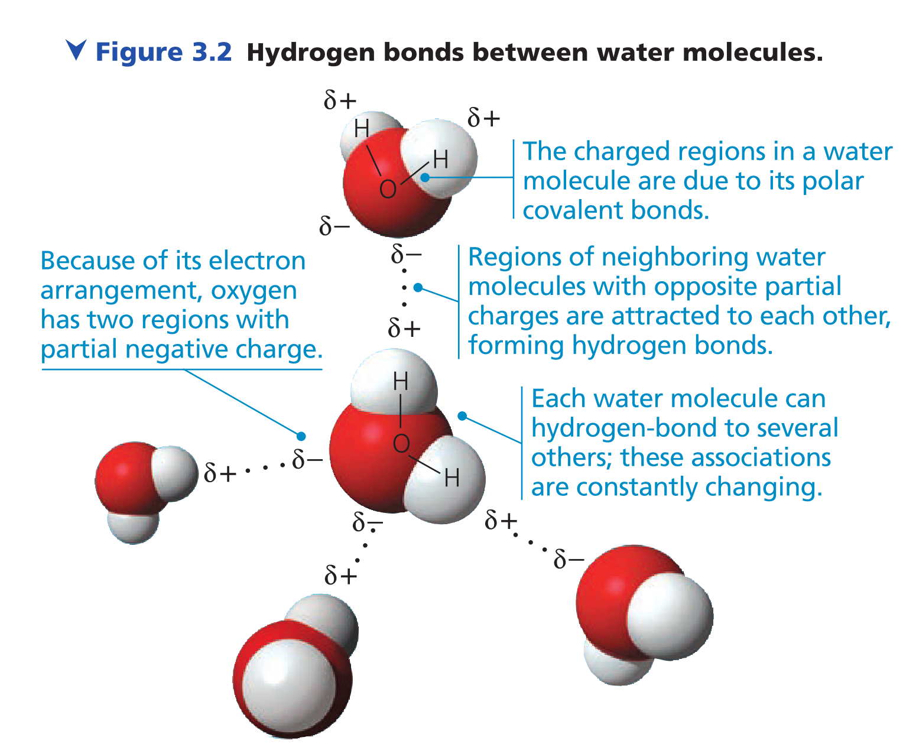
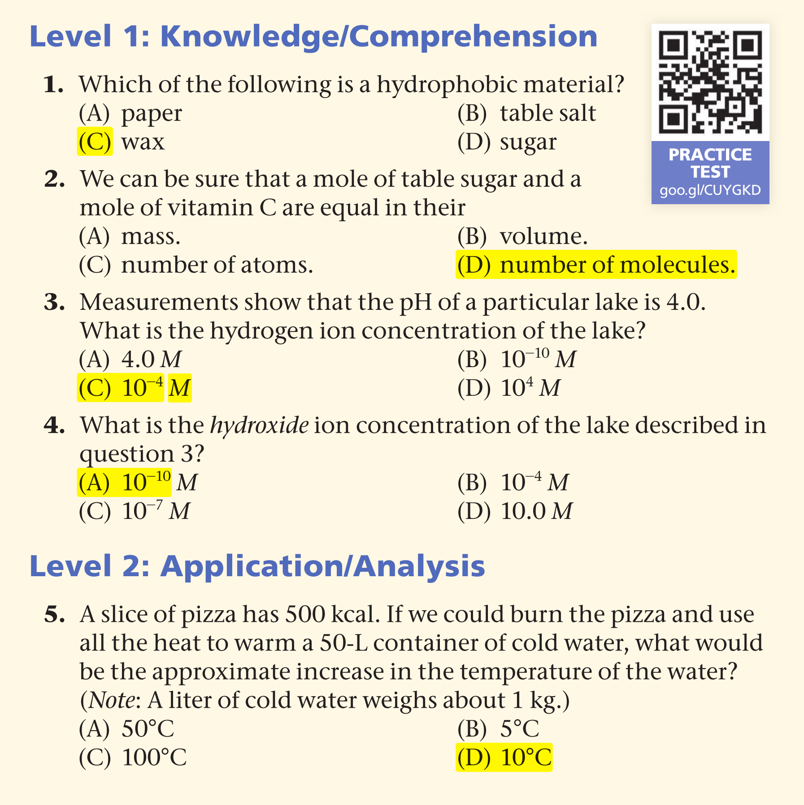
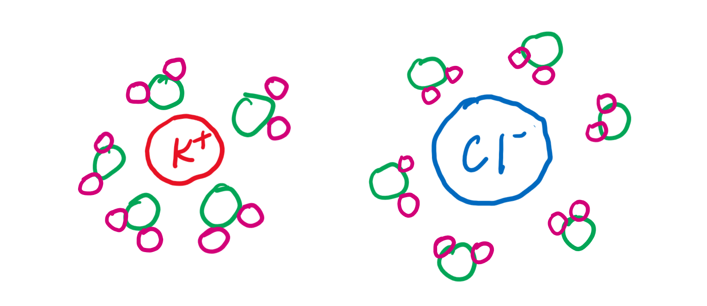

# Exercise

## Concept Check 3.1

1. What is electronegativity, and how does it affect interactions between water molecules.

   <u>Electronegativity is an atom's ability to attract electrons. High electronegativity means that it's more likely attract electrons to its side when forming bonds. In the water, oxygen's relatively high electronegativity attract the electron to its side, make the water a polar molecule</u>

2. Look at the Figure 3.2 and explain why the central water molecule can hydrogen bond to four (rather than three or five) other water molecules.

   

   <u>Because the water undergoes **sp3** hybridization, which will form 4 electron regions, 2 unshared electron pairs, 2 electrons shared with 2 hydrogens. In the end, there is two electron pairs that could form 2 hydrogen bonds, two hydrogen atoms that could form 2 hydrogen bond. So, the central water molecules connect to its neighbors via 4 hydrogen bonds in total.</u>

3. Why is it unlikely that two neighboring water molecules would be arranged like this?

   

   <u>Because the both hydrogen atom of each water molecule is slightly positively charged, which makes them repel each other. So, it's unlikely that two neighboring water molecules would be arranged like this.</u> 

4. What would be the effect on the properties of the water molecule if the oxygen and hydrogen had equal electronegativity.

   <u>First of all, there will no longer have dipole-dipole forces and hydrogen bonds, which significantly weakening the intramolecular forces between the water molecules, which will in turn decreases the melting point and the boiling point of the water, making it impossible to stay in its liquid form at room temperature. Secondly, since "like dissolves like", making water between nonpolar means it could now dissolves into oils (sound weird)</u>

## Concept 3.2

1. Describe how properties of water contribute to the upward movement of water in a tree.

   <u>The cohesion and adhesion, which provides the power to go upward, and the resist the gravity</u>

2. Explain the saying “It’s not the heat; it’s the humidity.”

   <u>The high humidity prevent the sweat from evaporating, thus prevent the evaporative cooling, which makes people feel hot</u>.

3. How can the freezing of water crack boulders?

   <u>Because ice has less density, when water freeze, its volume increases, and crack the boulders.</u>

4. A water strider (an insect that can walk on water) has legs that are coated with a hydrophobic substance. What might be the benefit? What would happen if the substance were hydrophilic?

   <u>It increases the repelling force from the water, so that the it could help water strider resist gravity on water. If it's hydrophilic, the legs will attract water, and water strider might possibly be suck to death.</u>

5. The concentration of the appetite regulating hormone ghrelin is about $\ce{1.3 * 10^{-10} M}$​​ in the blood of a fasting person. How many molecules of ghrelin are in 1 L of blood?
   $$
   \ce{1.3 * 10^{-10} * 6.02 * 10^{23} = 7.8*10^{13}}
   $$
   <u>There are $\ce{7.8 * 10^13}$​ of ghrelin in 1L of blood.</u>

## Concept 3.3

1. Compared with a basic solution at pH 9, the same volume of an acidic solution at pH 4 has <u>100000</u> times as many hydrogen ions ($\ce{H+}$).

2. HCl is a strong acid that dissociates in water. What is the pH of 0.01 M HCl?
   $$
   \ce{pH = -lg(0.01M) = 2.0}
   $$
   
3. Acetic acid can be a buffer, similar to carbonic acid. Write the dissociation reaction, identifying the acid, base, $\ce{H+}$ acceptor, and $\ce{H+}$ donor.
   $$
   \ce{CH3COOH(aq) <=> CH3COO-(aq) + H+(aq)}
   $$

   $$
   \begin{align}
   	\ce{Acid : CH3COOH} \\
   	\ce{Base : CH3COO-} \\
   	\ce{H+ acceptor: CH3COO-} \\
   	\ce{H+ donor: CH3COOH}
   \end{align}
   $$

4. Given a liter of pure water and a liter solution of acetic acid, what would happen to the pH, in general, if you added 0.01 mol of a strong acid to each? Use the reaction from question 3 to explain the result.

   the $\ce{CH3COOH}$​ will act as a buffer, resist the pH from changing too much.

## Unit Check

6. Draw the hydration shells that form around a potassium ion and a chloride ion when potassium chloride ($\ce{KCl}$) dissolves in water. Label the positive, negative, and partial charges on the atoms.

7. In agricultural areas, farmers pay close attention to the weather forecast. Right before a predicted overnight freeze, farmers spray water on crops to protect the plants. Use the properties of water to explain how this method works. Be sure to mention why hydrogen bonds are responsible for this phenomenon.

   <u>Because when the water freezes, it releases energy to protect the plants itself from freezing. In this process, the number of hydrogen bonds increase and become permanent, and thus release energy.</u>

8. What do climate change and ocean acidification have in common?

   <u>The both impose pressures on the animals in ocean. Ocean acidification cause the formation of shell and corals harder, climate change cause the global temperature raising and the melting of the ice in the poles, which causes many animals lose their habitats. They both put pressure on the ecosystems and the species within them.</u>

9. This chapter explains how the emergent properties of water contribute to the suitability of the environment for life. Until fairly recently, scientists assumed that other physical requirements for life included a moderate range of temperature, pH, atmospheric pressure, and salinity, as well as low levels of toxic chemicals. That view has changed with the discovery of organisms known as extremophiles, which have been found flourishing in hot, acidic sulfur springs, around hydrothermal vents deep in the ocean, and in soils with high levels of toxic metals. Why would astrobiologists be interested in studying extremophiles? What does the existence of life in such extreme environments say about the possibility of life on other planets?

   <u>There might be a higher chance that we could find other life form in other planets. Because the actual condition for the life to appear may not be as limited as we have thought. Astrobiologists research about extremophiles in order to gain a new insight of the possibility of the life on other planet, which could potentially identify possible habitable planet which is previously considered not.</u>

10. Design a controlled experiment to test the hypothesis that water acidification caused by acidic rain would inhibit the growth of Elodea, a freshwater plant (see Figure 2.17).

    <u>Independent Variables: pH or the concentration of $\ce{CO2}$​​​​. Dependent Variables: the growth speed (measured in cm/day). Test the growth speed of Elodea under different condition (different pH or $\ce{CO2}$​​) for 6 times, for each time, repeat 3 times. Taking the average, and then draw the regression line based on the data. If the regression show a negative relationship, that means the water acidification could inhibit the growth of Elodea.</u>

    
