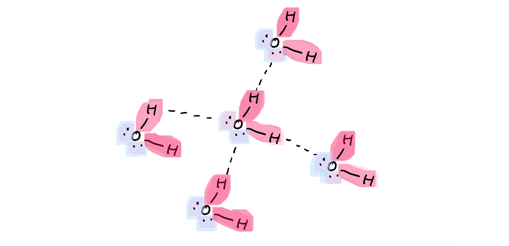
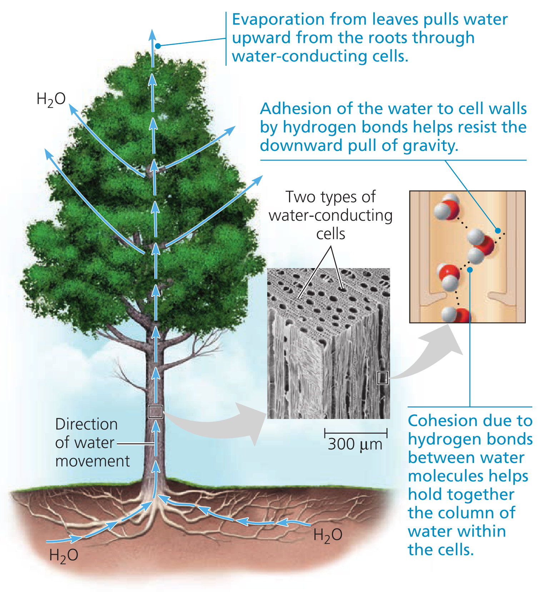
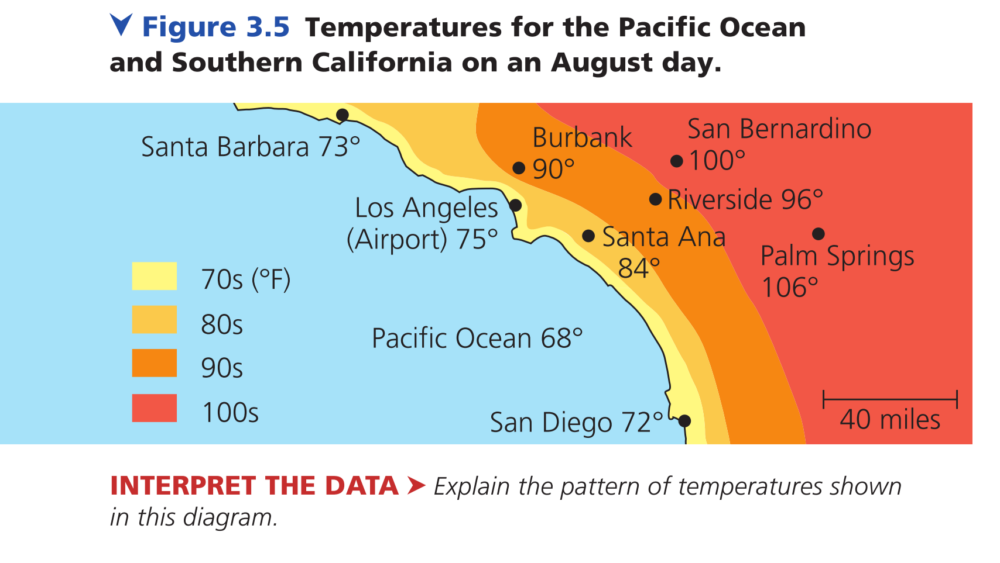
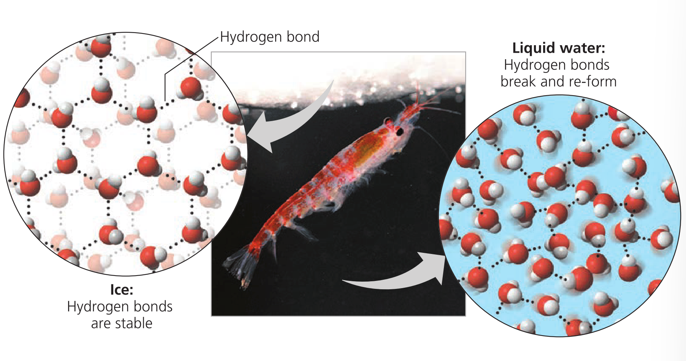
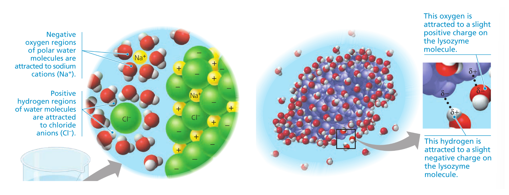
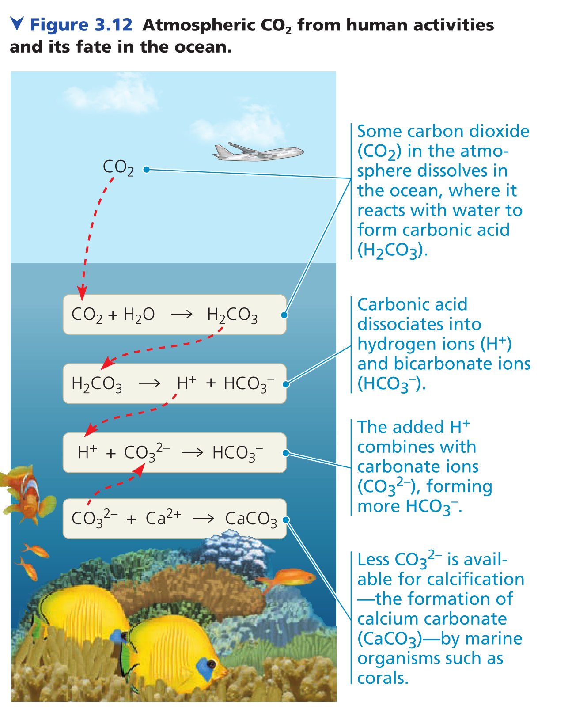

# 	Water and Life

## Water's Hydrogen Bonding

Water has **polar covalent bonds** formed by the different electronegativity of hydrogen and oxygen. With the **asymmetrical structure of the polar covalent bonds**, the water becomes a **polar molecule**. 

Because the hydrogen on the water is connected to oxygen, and the oxygen itself has two pairs of unshared electrons. This makes **hydrogen bonds**, a strong type of **intermolecular** force to form. Since water has 4 **electron domains**. The water molecules connect to its neighbors in a tetrahedra way shown as below.

The red area indicated the relatively positive area, the blue area indicated the relatively negative area. 

## Four emergent properties of water

### Cohesion of water molecules

The hydrogen bonds hold the water together, a phenomenon called **cohesion**. The hydrogen bonds could connect the nearby substance (in a microscopic distance) with water, a phenomenon called **adhesion**. 

>Example: As the water evaporate from the leaf, the hydrogen bonds tug the molecules farther down (Cohesion), providing the force to move the nutrients from the root to the entire tree. In the water-conducting cells of the tree, the water clings to the cell wall (Adhesion) , resisting to be pulled down by gravity.
>
>

The cohesion causes the **surface tension**. In the surface of the water, the water molecules in the front only connect to the water molecules behind, but not the air above, **making it difficult to break or stretch**.

### Moderation of Temperature by water

#### Concepts

**Kinetic Energy**: the energy of motion.

**Thermal Energy** (Substance Amount Dependent) : the kinetic energy associated with the random movement of atoms or molecules.

**Temperature**: the average random movement speed of atoms or molecules.

**Heat**: the transfer from one body of matter to another.

**Calorie (Cal)**: The amount of heat to it takes to raise the temperature of 1g of water by 1$^\circ{C}$​

**Specific Heat**: the amount of heat that must be absorbed or lose for 1g of that substance to change its temperature by 1$^\circ{C}$​. (Unit: $\ce{cal/g* ^\circ{}C}$​​). 
$$
\ce{Q = cm\Delta{T}}
$$

$$
\begin{align}
\ce{Q &= Heat released / absorbed} \\
\ce{c &= specific heat} \\
\ce{m &= mass of the substance} \\
\ce{\Delta{T} &= the change in temperature}
\end{align}
$$

#### Water's High Specific Heat

**Water's specific heat is high compared to other substance.** This is because in order to increase the speed of molecules, hydrogen bonds must be break first. **It needs much more energy to break hydrogen bonds for it's a strong intermolecular force.**

>This makes water able to regulate the temperature on earth to a relative small range that permit life, especially in coastal areas.
>
>

#### Evaporative Cooling

**Heat of vaporization**: the quantity of heat a liquid must absorb of r 1g of it to be converted from the liquid to the gaseous state.

**The water has high heat of vaporization.** (The same reason as the water's high specific heat), which contributes the effect of **evaporative cooling**. (the phenomenon which the surface of the liquid that remains behind cools down as liquid evaporates).

>Evaporate cooling moderates the Earth's climate by transferring the heat from tropical area to arctic area through evaporation and rains.
>
>Evaporative cooling of water contributes to the stability of temperature in lakes and ponds and also provides a mechanism that prevents terrestrial organisms from overheating.

### Floating of Ice on Liquid Water

**The Liquid Water has greater density that Solid Water.** This is because the ice forms rigid structures connected by hydrogen bonds, which increase the space between water molecules. 

**From high temperature to 4$^\circ{C}$, the space between decreases** largely because the movement speed of the water decrease so they are close together. **From 4$^\circ{C}$ to 0$^\circ{C}$​, the space between increases** mainly due to the increase of the hydrogen bonds and the formation of more rigid structure resulting from the decrease of the water's movement speed.

>Since the ice is floating on the water, it could prevent lake and ocean from completely frozen, providing a shelter for the life in winter. (If ice is thicker than water, then during summer, only the upper few inches of the ocean would thaw, and the scope of the habitat will be largely limited.)

### Water: The Solvent of Life

#### Concepts

**Solution**: A liquid that is a completely homogeneous mixture of two or more substances.

**Solvent**: the dissolving agent of a solution.

**Solute**: the substance that is dissolved.

**Aqueous Solution**: the one in which the solute is dissolved in water, water is solvent.

**Molecular Mass**: the sum of the masses of all the atoms in a molecule.

**Mole**: represents an exact number of objects: $\ce{6.02 * 10^{23}}$​

**Molarity**: the number of moles of solute per liter of solution.

#### Dissolve Process

The water molecules will come closer to the solute, **the oxygen atom will be attracted to more positively charged part, the hydrogen will be attracted to more negatively charged part.** If the solute is the ionic compound, both the cations and anions will be dissolved. (As long as they are unevenly charged).

**The sphere of water molecules around each dissolved ion is called a hydration shell.**

#### Hydrophilic and Hydrophobic Substances

Any substance that has an affinity for water is said to be **hydrophilic**. In some cases, **substance can by hydrophilic without actually dissolving.**  (Like cottons)

**Substances that are nonionic and nonpolar** (or otherwise cannot form hydrogen bonds) **are said to be hydrophobic**. (The cell membranes)

## Acidic and basic conditions

See Chemistry Chapter.

### Acidification: A threat to Our Oceans

The raise of $\ce{CO2}$ cause ocean acidifications.  It could drain the $\ce{CO3^{2-}}$ that is essential for calcification of many marine organisms (the corals, the shells of organisms requires calcification).

