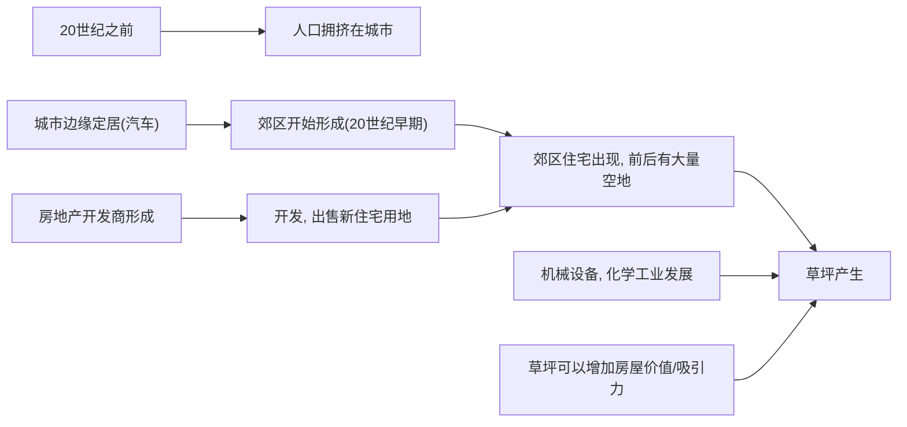

# 草坪

草坪是一种文化/环境现象。也是一种社会-环境问题。

## 草坪草种历史

草坪的特性：横向生长，被修剪/吃掉一部分也可以继续生长。

### 草坪草种是人类经济史的一部分

草坪最早被用来喂养牛羊（哥伦布交换，而到了美洲）

二十世纪中期，因为城市定居的变化还有房地产策划、营销、销售方式转变，产生了草坪这种人为产物。

### 化学制品革命

化学制品帮助了打造环境景观（单一栽培，没有杂草，青翠欲滴的草坪）。但是化学制品造成了环境/健康风险。

致癌，神经系统损伤，剧毒。

水体富营养化，对于生物有害，造成生态系统冲击。

### 草坪爆发式增长

最大的经济作物。化学制品和肥料的危害（环境/健康）。草坪本身用水量极大。

## 风险和化学制品决策

### 风险分析

人们并不是不知情使用化学制品的坏处。

但是草坪可以使他们的房地产价值增加10000美元，这比环境危害的后果来的更诱人。所以人们考虑了风险，做出了继续使用的决策。

### 社会建构

人们可以通过打理草坪获得：社区的自豪感，社会地位，责任感，”好公民“。

## 政治经济学

草坪草种所消耗的化学制品是产业的一大利益来源。

随着行业内卷（原料价格的增加，需求的减少，严格的政策管理，消费者的担忧，竞争的增加），产业需要制造需求。

使用”拉式营销”，拓宽国际市场，人为的增加需求。

## 可能的解决办法

有机草坪添加物代替化学制品。

培养个人多样化风景/原始风景的喜爱，减少单一栽培，草坪修整，食用生物肥。减少对于化肥和化学制品的依赖。

因为草坪是社会建构，所以可以通过调动/改变集体的思想意识，来改变对于“社区荣誉感”，“好公民”的定义和理解，进而使得每个人的行为发生改变。（如上面两句话所述）

