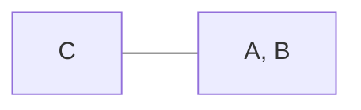

# 29

a, b, c

# 31

For one molecule:

Equally likely.

For two molecules:

One molecules on each side 50%.

For three molecules:

2 molecules on one side, and 1 molecule on other side, with probabilty 87.5%.

# 33

6 arrangements.

* Both XX on E = 0. **1/9**
* Both XX on E = 1. **1/9**
* Both XX on E = 2. **1/9**
* One X on E = 0, One X on E = 1. **2/9**
* One X on E = 1, One X on E = 2. **2/9**
* One X on E = 1, One X on E = 2. **2/9**

# 35

a, b, d, f

# 37

a. **negative**, for the boiling, it requires energy from surrounding.

b. **positive**, for desublimiation, it releases energy to the surrounding.

# 39

$$
\def\thereq#1#2#3#4{\ce{\Delta{G} = \Delta{H} - T\Delta{S} = #1 - #2 * #3 = #4}}
\def\therseq#1#2#3#4{\ce{\Delta{G}^{\circ} = \Delta{H}^{\circ} - T\Delta{S}^{\circ} = #1 - #2 * #3 = #4}}
$$

## a - no

$$
\thereq{25 kJ}{300K}{5.0J/K}{23500J}
$$

## b - yes

$$
\thereq{25 kJ}{300K}{100J/K}{-5000 J}
$$

## c - yes

$$
\thereq{-10 kJ}{298K}{5.0 J/K}{-11490J}
$$

## d - yes

$$
\thereq{-10 kJ}{200 K}{-40 J/K}{-2000 J}
$$

# 41

$$
\thereq{27.5 kJ / mol}{(35 + 273) K}{\Delta{S}}{0}
$$

$$
\ce{\Delta{S} = 89.3 J /mol * K}
$$

# 43

$$
\thereq{5.65 kJ/mol}{200K}{28.9 J/K * mol}{-130 J/mol}
$$

It will.
$$
\thereq{5.65 kJ}{T}{28.9 J/K * mol}{0}
$$

$$
\ce{T = 196 K}
$$

 # 45

1. negative
2. negative
3. negative
4. positive

# 47

1. $\ce{C_{graphite}(s)}$
2. $\ce{C2H5OH(g)}$
3. $\ce{CO2(g)}$

# 49

## a

Negative
$$
\def\DSs#1{\ce{\Delta{S}^{\circ}_{#1}}}
\def\DSsp{\DSs{}}
\def\DGs#1{\ce{\Delta{G}^{\circ}_{#1}}}
\def\DGsp{\DGs{}}
\def\DHs#1{\ce{\Delta{H}^{\circ}_{#1}}}
\def\DHsp{\DHs{}}
$$

$$
\ce{\DSsp = 3 * 32 + 189 * 2 - 248 - 206 * 2 = -186 J/K*mol}
$$

## b

Positive
$$
\DSsp = \ce{248 * 2 + 205 - 2 * 257 = 187 J/K*mol}
$$

## c

Negative
$$
\DSsp = \ce{27 * 2 + 189 * 3 - 131 * 3 - 90 = 138 J/K*mol}
$$

# 51

Hard to predict since there is no change in the number of molecules.
$$
\DSs{CF_4} = \ce{(-358 + 4 * 203 + 201 - 131 ) / 2 = 262 J/K*mol}
$$

# 53

It’s spontaneous at high temperature.

$\ce{\Delta{H} > 0, \Delta{S} > 0}$

Since $\ce{\Delta{S} > 0}$, rhombic one has smaller positional probability.

# 55

Both negative.

At low temperature.

# 57

## a

$$
\DSsp = \ce{189 * 2 + 214 - 205 * 2 - 186 = -4 J/K*mol}
$$

$$
\DGsp = \ce{-394 - 229 * 2 + 0 * 2 + 51 = -801 kJ/mol}
$$

$$
\DHsp = \ce{-242 * 2 - 393.5 + 0 + 75 = - 803 kJ/mol}
$$

# 61

$$
\therseq{40.6 kJ/mol}{(100 + 273)K}{\Delta{S}^{\circ}}{0 J/mol}
$$

$$
\ce{\Delta{S}^{\circ} = 109 J/K*mol}
$$

$$
\therseq{40.6 kJ /mol}{(90 + 273)K}{109J/K*mol}{1088 J/mol}
$$

$$
\therseq{40.6 kJ /mol}{(110 + 273)K}{109J/K*mol}{-1088 J/mol}
$$

