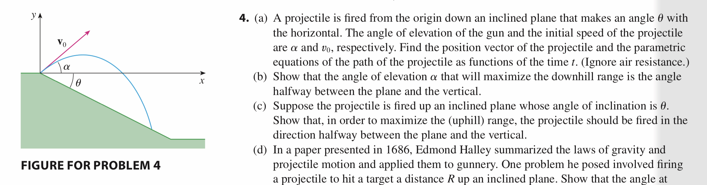

# Honor Assignment 2

## 1

$$
\newcommand\ihat{\hat{i}}
\newcommand\jhat{\hat{j}}
\newcommand\khat{\hat{k}}
\newcommand\v{\overrightarrow{v}}
\newcommand\y{\overrightarrow{y}}
$$

### a

$$
\a  = -g\jhat
$$

$$
\begin{align}
&\v(0) = \cos{\alpha}v_0\ihat + \sin{\alpha}v_0\jhat \\
&\v(t) = \int^{t}_{0}\a dt + \v(0) = \cos{\alpha}v_0\ihat + (\sin{\alpha}v_0 - gt)\jhat \\
&\fbox{$\r(t) = \int^{t}_{0}\v dt + \r(0) = \cos{\alpha}v_0t\ihat + (\sin{\alpha}v_0t - \frac{1}{2}gt^2)\jhat$} 
\end{align}
$$

$$
\text{When the projectile hits the ground:}
$$

$$
\tan{\theta} = \frac{\y(t)}{\x(t)} = \frac{\sin{\alpha}v_0t - \frac{1}{2}gt^2}{\cos{\alpha}v_0t} \\
\tan{\theta} = \frac{\frac{1}{2}gt^2}{\cos{\alpha}v_0t} - \frac{\sin{\alpha}v_0t}{\cos{\alpha}v_0t}\\
\tan{\theta} + \tan{\alpha} = \frac{g}{2\cos{\alpha}v_0}t\\
t = \frac{2v_0}{g} (\tan{\theta}\cos{\alpha} + \sin{\alpha})
$$

$$
\text{the $\r(t)$ is defined $\fbox{$0 \le t \le \frac{2v_0}{g} (\tan{\theta}\cos{\alpha} + \sin{\alpha})$}$}
$$

### b

$$
\text{let $R(\alpha) = \sec{\theta}\x(t)$, which is the downhill range.}
$$

$$
\begin{align}
R(\alpha) &= \sec{\theta}\x(t) \\
		  &= \sec{\theta}\cos{\alpha}v_0t \\
		  &= \sec{\theta}\cos{\alpha}v_0\frac{2v_0}{g} (\tan{\theta}\cos{\alpha} + \sin{\alpha}) \\
		  &= \frac{2v_0^2}{g}(\cos^2(\alpha)\frac{\sin{\theta}}{\cos^2{\theta}} + \frac{1}{2}\frac{\sin{2\alpha}}{\cos{\theta}})
\end{align}
$$

$$
\begin{align}
R'(\alpha) &= \frac{2v_0^2}{g}(-2\cos\alpha\sin\alpha\frac{\sin{\theta}}{\cos^2{\theta}} + \frac{\cos{2\alpha}}{\cos{\theta}}) \\
		   &= \frac{2v_0^2}{g}(-\sin2\alpha\frac{\sin{\theta}}{\cos^2{\theta}} + \frac{\cos{2\alpha}}{\cos{\theta}}) \\
\end{align}
$$

$$
\text{Set $R'(\alpha) = 0$, which is the $\alpha$ that will get maximum $R(\alpha)$}
$$

$$
\begin{align}
\sin2\alpha\frac{\sin{\theta}}{\cos^2{\theta}} &= \frac{\cos{2\alpha}}{\cos{\theta}} \\
\tan{\theta} &= \cot{2\alpha} \\
\tan{\theta} &= \tan{(\frac{\pi}{2} - 2\alpha)} \\
\theta &= \frac{\pi}{2} - 2\alpha \\
\alpha &= \frac{1}{2}(\frac{\pi}{2} - \theta)
\end{align}
$$

$$
\text{Thus, $\fbox{$\alpha = \frac{1}{2}(\frac{\pi}{2} - \theta)$}$, which is the halfway between the} \\
\text{plane and the vertical, maximizes the downhill range $R(\alpha)$.}
$$

## 2

$$
\newcommand\dird[2]{D_{#1}#2}
\newcommand\uonef{\dird{\uone}{f}}
\newcommand\utwof{\dird{\utwo}{f}}
\newcommand\uone{\overrightarrow{u_1}}
\newcommand\utwo{\overrightarrow{u_2}}
\newcommand\twomatrix[4]{\left[\matrix{#1 & #2 \\#3 & #4 \\}\right]}
\newcommand\twovector[2]{\left[\matrix{#1\\#2\\}\right]}
$$

$$
\uonef = \uone \cdot \grad{f} = a_1f_x + b_1f_y = d_1 \\
\utwof = \utwo \cdot \grad{f} = a_2f_x + b_2f_y = d_2 \\

\twomatrix{a_1}{b_1}{a_2}{b_2} \twovector{f_x}{f_y} = \twovector{d_1}{d_2}
$$

$$
\begin{align}
 &\text{Since the $\uone$ and $\utwo$ is not parallel} \\
 &\text{that means $(a_1 + b_1) \neq \lambda(a_2 + b_2), \lambda \in \R$} \\
 &\text{i.e. the matrix has its inverse.} \\
 &\text{solving the system of equation, we get:}
\end{align}
$$

$$
\twovector{f_x}{f_y} = \frac{1}{a_1b_2-a_2b_1}\twomatrix{b_2}{-b_1}{-a_2}{a_1}\twovector{d_1}{d_2}
$$

$$
f_x = \frac{d_1b_2 - d_2b_1}{a_1b_2 - a_2b_1} \\
f_y = \frac{a_1d_2 - a_2d_1}{a_1b_2 - a_2b_1}
$$

## 3

$$
\newcommand\a{\overrightarrow{a}}
\newcommand\b{\overrightarrow{b}}
\newcommand\c{\overrightarrow{c}}
\newcommand\r{\overrightarrow{r}}
\newcommand\n{\overrightarrow{n}}
\newcommand\x{\overrightarrow{x}}
$$

$$
\r = \a + t\b + t^2\c \\
$$

$$
\text{the moodle page correct this question, and the updated assumption is:} \\
\text{$\c$ is non-zero and not parallel to $\b$, which is also non-zero}.
$$

$$
\begin{align}
&\text{then there is a plane spanned by $\b$ and $\c$} \\
&\text{and the normal vector for the plane is $\b \times \c$} \\
&\text{the plane fits for the curve is $\fbox{$(\x - \a) \cdot (\b \times \c) = 0$}$}. \\
&\text{Since if we plug in the equation $\r = \a + t\b + t^2\c$, then} \\
&\text{$(\a + t\b + t^2\c - \a) \cdot (\b \times \c) = t(\b \cdot (\b \times \c)) + t^2(\c \cdot (\b \times \c)) = 0$} \\
&\text{which means the curve satisfied the equation for the plane.} \\
&\text{and it's in the plane.}
\end{align}
$$

$$
\text{So, the curve is always lies in a single plane. and the vector } \\
\text{equation of the plane is $\fbox{$(\x - \a) \cdot (\b \times \c) = 0$}$}
$$

## 4

$$
\newcommand\vecf[3]{\overrightarrow{#1}{#2}(#3)}
\newcommand\T{\vecf{T}{}{t}}
\newcommand\N{\vecf{N}{}{t}}
\newcommand\B{\vecf{B}{}{t}}
\newcommand\D{\vecf{D}{}{t}}
\newcommand\Td{\vecf{T}{'}{t}}
\newcommand\Nd{\vecf{N}{'}{t}}
\newcommand\Bd{\vecf{B}{'}{t}}
\newcommand\alp{\alpha(t)}
\newcommand\bet{\beta(t)}
\newcommand\bpart{\frac{\alp}{|\T|^2}\B}
\newcommand\tpart{\frac{\bet}{|\T|^2}\T}
$$

$$
\T \times \N = \B \\
(\T \times \N) \times \T = \B \times \T \\
(\T \cdot \T)\N - (\T \cdot \N)\T = \B \times \T \\ 
\fbox{$|\T|^2\N = \B \times \T$}
$$

$$
\T \times \N = \B \\
(\T \times \N) \times \N = \B \times \N \\
(\T \cdot \N)\T - (\N \cdot \N)\T = \B \times \N \\ 
\fbox{$-|\N|^2\T = \B \times \N$}
$$

$$
\D \times \T = \Td = \alp\N \\
\B \times \T = |\T|^2\N \\
\fbox{$\frac{\alp}{|\T|^2}\B \times \T = \alp\N$}
$$

$$
\D \times \B = \Bd = \bet\N \\
\T \times \B = -|\T|^2\N \\
\fbox{$-\frac{\bet}{|\T|^2}\T \times \B = \bet\N$}
$$

$$
\text{Suppose $\D = \frac{\alp}{|\T|^2}\B - \frac{\bet}{|\T|^2}\T$}
$$

$$
\D \times \T = \bpart \times \T - \tpart \times \T = \alp\N =\Td
$$

$$
\D \times \B = \bpart \times \B - \tpart \times \B = \bet\N = \Bd
$$

$$
\begin{align}
\Nd = &\frac{1}{|\T|^2}(\Bd \times \T + \Td \times \B) \\
	= &\frac{1}{|\T|^2}(\bet\N \times \T + \alp\N \times \B) \\
	= &\frac{1}{|\T|^2}(-\bet\B + \alp|\N|^2\T)
\end{align}
$$

$$
\begin{align}
\D \times \N =& \bpart \times \N - \tpart \times \N \\
			 =& \frac{1}{|\T|^2}(\alp|\N|^2\T - \bet\B) \\
			 =& \Nd
\end{align}
$$

$$
\text{$\fbox{$\D = \frac{\alp}{|\T|^2}\B - \frac{\bet}{|\T|^2}\T$}$ satifies the above properties. }
$$

