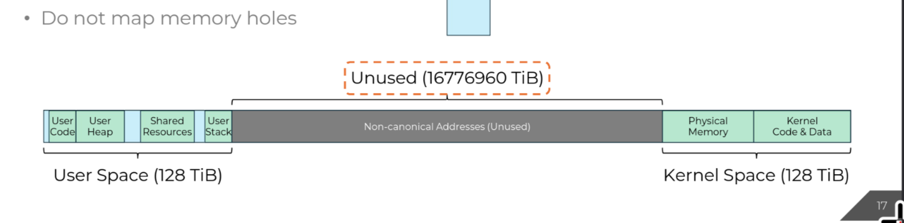
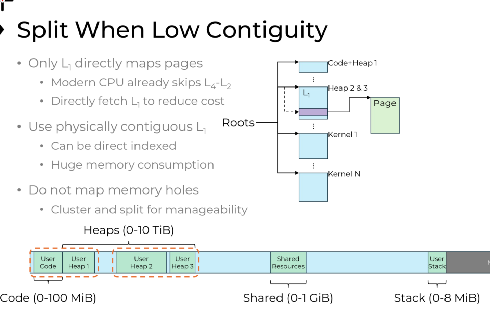

# CS 423 Midterm (Fall 2024)

**Tips:**

- **You are expected to do the exam** **independently****.** No discussion is allowed – **don’t cheat**. If you are harassed by someone for forceful discussion, please let the instructors know and they will handle it.
- **You are NOT supposed to use ChatGPT.** Certainly, we can’t track you. Note that ChatGPT could be wrong in certain patterns and we will check it. 
- **Please type your answers instead of handwriting them.** Note that your presentation does matter. If we can’t understand your writing, then we won’t give points. We won’t guess anything beyond what you write. 
- Give **short, concise answers** rather than long, vague ones (we grade by correctness, not by length). 
- **Some problems need writing code, executing it on your own machine (which you use for writing MPs), and reporting the results.** It’s a feature, not a bug. 
- If you find that you have to make assumptions to solve problems, write them down (e.g., “I assume this is an `x86` architecture” or “I assume a Linux kernel version `>2.6.3`”). Most problems are kept at a high level and do not need specific assumptions. 
- **No late submission is allowed. **

| **Sections (40 points)**      | **Points** |
| :---------------------------- | ---------- |
| MP-1 Continued (10 points)    |            |
| MP-1 Continued (10 points)    |            |
| CPU Scheduling (10 points)    |            |
| Memory Management (10 points) |            |

<center style="font-size: 1.25em">
    <strong>Name: <u>&nbsp;&nbsp;Yuqing Zhai&nbsp;&nbsp;</u></strong>
    <span style="margin: 0 1.5em;"></span>
    <strong>NetID: <u>&nbsp;&nbsp;yuqing9&nbsp;&nbsp;</u></strong>
</center>

<div name="page-break"></div>

## 1   MP-1 Continued (10 Points)

Our TA Jinghao wants to explore an alternative implementation of the kernel-user interface of the MP1 module, instead of using the `procfs read/write` interface. After some research, he found that the ioctl hook, which is also provided by the `proc_ops` in the kernel, can be used to implement this interface. Jinghao would like your help to implement this feature.

Before continuing, please first read the [ioctl man page](https://man7.org/linux/man-pages/man2/ioctl.2.html) to get familiar with its specification. The ioctl hook provided by the `proc_ops` can be found [here](https://elixir.bootlin.com/linux/v5.15.169/source/include/linux/proc_fs.h#L39) (you don’t have to worry about the `proc_compat_ioctl` hook). At the high level, ioctl allows the user to perform a command (the 2nd parameter) with an optional argument to the command (the 3rd parameter).

Your work for this problem is to implement an ioctl hook for your `procfs` file (`/proc/mp1/status`) and a corresponding userspace program. The userspace can use the ioctl interface to register a process, or retrieve the CPU time of a *specific* process (note this is different from MP1). This interface will completely replace the read/write interface you have implemented for MP1. 

### (1)

With this new design, describe (no need to write actual code) what should be changed when setting up the `procfs` entry for your MP1 module. (2 points)

>From the `/include/linux/proc_fs.h:39`, we just need to modify our `proc_ops` to be 
>
>```c
>struct proc_ops fops = {
>	.proc_ioctl = mp1_ioctl,
>};
>```
>we could remove the `.proc_read / .proc_write` as we now using `ioctl`.

### (2)

**In-kernel ioctl hook**. The command of our `ioctl` is defined by the following enum,

```c
enum mp1_cmd {
  MP1_REGISTER = 1313U,
  MP1_QUERY = 1314U,
};
```

The argument used by our command is defined as the following `struct`:

```c
struct mp1_arg {
  int pid;
  unsigned long cpu_time;
};
```

You `ioctl` hook should implement the following logic:

- If `op == MP1_REGISTER`, then your code should register the process identified by the `pid` field in `mp1_arg`.
- If `op == MP1_QUERY`, then your `ioctl` hook should retrieve the CPU time for the process identified by the `pid` field in `mp1_arg`, and send it back to userspace via the `cpu_time` field.

Other notes:

1. You need to handle user space pointers.
2. Make sure to correctly handle errors from other functions your code calls, as well as errors from non-compliant user input (e.g., invalid command). If there is a failure, you should return an error code and perform needed cleanups. You can assume that the helpers we provided to you already return the appropriate error codes that you can use as return values. Other functions (e.g. `copy_{from,to}_user`) have their return values defined by the kernel and may not return an error code directly, you need to check their return value and return an appropriate error code. On success, your code should return 0.

We have provided the following starter code. Please fill the **`TODO`**. 

**You are expected to write the real C code.** 

```c
/* Registers process identified by pid */
static int register_process(int pid);
/* This the same helper function from MP1 */
static int get_cpu_use(int pid, unsigned long *cpu_use);

static long mp1_ioctl(
    struct file *filp, 
    unsigned int cmd,
    unsigned long arg
) {
  /* comply with C90 standards */
  int get_cpu_use_result;
  unsigned long cpu_use;
  struct mp1_arg karg;
  struct mp1_arg __user *argp = (struct mp1_arg __user *) arg;
 
  /* check if the command type if valid */
  if (cmd != MP1_REGISTER && cmd != MP1_QUERY) {
    return -EINVAL;
  }
    
  if (copy_from_user(&karg, argp, sizeof(struct mp1_arg))) {
    return -EFAULT;
  }
  if (cmd == MP1_REGISTER) {
    /* forward the error code */
    return register_process(karg.pid);
  }
  if (cmd == MP1_QUERY) {
    /* forward the error code */
    if ((get_cpu_use_result = get_cpu_use(karg.pid, &cpu_use))) {
      return get_cpu_use_result;
    }
    
    karg.cpu_time = cpu_use;
    /* copy updated time to user */
    if (copy_to_user(argp, &karg, sizeof(struct mp1_arg))) {
      return -EFAULT;
    }
    return 0;
  }
  
  /* should never reach here */
}
```

### (3)

**MP1 userspace program.** Implement a user space program that registers its *parent*, queries the CPU time of its parent of your new MP1 module, and prints it to `stdout`. Your code should always properly handle possible errors from system calls. (3 points)

```c
#include <stdio.h>
#include <stdlib.h>
#include <fcntl.h>
#include <sys/ioctl.h>
#include <unistd.h>
#include <errno.h>
#include <string.h>

#define MP1_REGISTER 1313U
#define MP1_QUERY 1314U

struct mp1_arg {
  int pid;
  unsigned long cpu_time;
};

int main() {
  int fd;
  struct mp1_arg arg;
  int parent_pid = getppid();

  // Open /proc/mp1/status
  fd = open("/proc/mp1/status", O_RDONLY);
  if (fd < 0) {
    fprintf(stderr,
      "Failed to open /proc/mp1/status: %s\n",
      strerror(errno)
    );
    return EXIT_FAILURE;
  }

  // Register the parent process
  arg.pid = parent_pid;
  if (ioctl(fd, MP1_REGISTER, &arg) < 0) {
    fprintf(stderr,
      "Failed to register parent process (PID %d): %s\n",
      parent_pid, strerror(errno)
    );
    close(fd);
    return EXIT_FAILURE;
  }

  // Query the CPU time for the parent process
  if (ioctl(fd, MP1_QUERY, &arg) < 0) {
    fprintf(stderr,
      "Failed to query CPU time for parent process (PID %d): %s\n",
      parent_pid, strerror(errno)
    );
    close(fd);
    return EXIT_FAILURE;
  }

  // Print the CPU time to stdout
  printf(
      "CPU time for parent process (PID %d): %lu\n", 
      parent_pid, arg.cpu_time
  );

  // Close the file descriptor
  close(fd);
  return EXIT_SUCCESS;
}
```

<div name="page-break"></div>

## 2   Kernel Interface (10 points)

We learned in class about the difference between system calls and procedure calls. Let’s measure the difference between these two.

### (1)

Can you design a method to measure the system call overhead and the procedure call overhead? For example, what’s the unit you use to measure “overhead” and why? Please write the pseudocode. (1 point)

>The unit should be nanoseconds `ns` or `cpu_cycles`, as the overhead is typically tiny and we need get accurate measure of it. For the measurement, we need to choose the system / procedure call that does minimum unrelated computation besides the overhead. (I use a `getpid()` for system call and `noop` for procedural call).
>
>```pseudocode
>N = 10000 # you could also increase it
>define function noop() {}
>
>sys_start = get_time();
>for N times { getpid() }
>sys_end = get_time();
>sys_overhead = (sys_end - sys_start) / N
>
>proce_start = get_time();
>for N times { noop(); }
>proce_end = get_time();
>proce_overhead = (proce_end - proce_start) / N;
>
>print(sys_overhead, proce_overhead);
>```
>
>`get_time` return time in `ns`. 

### (2)

Can you discuss the fidelity of your measurement results? All measurements have overhead and please clarify (1 point)

>There are few source of inaccuracy: (1) `get_time()` has inherent execution time, which could add a non-deterministic delay, the resolution of the hardware timer also limit the accuracy. (2) the loop control structure introduces a non-zero control overhead (3) the external system load  / kernel state / CPU caches  will affect the speed of the system calls like `getpid()`, making variation in each measurement.

### (3)

Now, write the code and run the code on your machine, and report the procedure call overhead and system call overhead, respectively. You can access the Github repo from https://classroom.github.com/a/pupgdckQ. For this question modify `procedure_call_overhead.c` and `system_call_sh youroverhead.c`, and push your code. Note that you will get 0 points if you don’t push your code. Please paste your Github repo link below as well. Please fill the following table. (3 points)

Github repo link: https://github.com/uiuc-cs423-fall24/midterm-Zhaiyuqing2003

|                | Overhead (`-O2`) |
| -------------- | :--------------- |
| System call    | `144.612530 ns`  |
| Procedure call | `0.893340 ns`    |

Note: running on bare metal Arch Linux machine, kernel version `6.11.3.arch1-1`, CPU `i9-13900k`, results might vary from virtual machine. 

### (4)

If you run the above code 100 times, you will see the variations of the results (the measured results from each run is different). How do you control noises and nondeterminism? (1 point)

>We could of course increase the `N` to make sure the result is more stable. We could also control external system load and make sure there are minimal background processes interfere with the measurement, this should make all the `syscall` have more stable time cost. We could also set to use specific CPU core to run our program instead, this could reduce the noise created by the difference in CPU cores (cores like Intel P/E core could really create a lot of noise). We could also increase the priority of the process to make it less probable to be preempted by other processes. We could also remove outliers in our data, these probably doesn’t represent the whole data.

### (5)

Now. Explain your results. What are the instructions involved in the system call and procedure call respectively? Please tell how do you analyze the instructions.

>Assume `x86 ISA`, since our `noop()` function is extremely simple, we only have `CALL noop`, and in the `noop` we only have `RET`, these is no variable passing like `push xxx X(%rsp)` and `pop xxx X(%rsp)` typically happened with the function call. For the system call, in this case we will have `MOV %rax #GETPID` followed `INT 0x80` (`syscall / sysenter` in modern ISA) and inside the system call, there will be code that gets the `pid` from PCB blocks, and then it will do `MOV %eax %%0` where `%%0` is the register holding the `pid`, and it will then call `iret` (or `sysexit / sysret`). 
>
>We could see their assembly code using `gcc -S` options, and we could debug them step by step using `gdb`, we probably want to turn on `-O0` for easier understanding. We could then use profiling tools like `perf` on system call code to show where most cycle are spent.
>
>The system call is always going to have much higher overhead than `noop()`, as the cost of mode-switching done by CPU and kernel (as changing back and forth between ring 3 and ring 0 usually invalidate a lot of caches, and usually breaks instruction level parallelization) and the additional instruction executed in kernel space are pretty expensive when compare to the procedure call happens only in user-space.

### (6)

Can you also measure the context switch overhead between processes on your machine? Write down the methodology to measure them. Please modify `context_switch_overhead.c` from the repo you get from 3). Note that you will get 0 points if you don’t push your code (coz we won’t be able to verify your results). (2 points)

>You could create two process, and create a pipe between them. Measure the time it takes for first process to send the data to second process and receive the data from the second process after it has received the data. (Essentially doing one ‘ping-pong’). Since every time when there is a send-receive pipe pair, there will be one context switch, doing one ‘ping-pong’ consists of two context-switch. Repeat this N times, then the average context switch time should just be `T(total) / (2 * N)`.

<div name="page-break"></div>

## 3   CPU Scheduling (10 points)

### (1)

Consider the following variation of Multi-Level Feedback Queue with three queues, `Q0`, `Q1`, `Q2`. `Q0` has the highest priority. `Q0`, `Q1`, `Q2`, has a time slice of 10, 20, 40 ms each. We assume that when all processes enter the system, it is placed at the very end of the highest priority queue (If it enters the end at the same time as the existing job, assume a new job comes at the later place). 

If a job uses up its time slice while running, its priority is reduced (i.e., it moves down one queue). If a job blocks for I/O within its time frame, it gives up CPU but will be placed at the end of the queue with the next higher priority (if it exists). The scheduler is non-preemptive.

Consider the following jobs, and their CPU and I/O time. You can treat CPU time as computation that requires processor time and I/O time as time waiting for I/O which doesn’t require CPU. Assume I/O of multiple jobs can happen at the same time. Say a job has CPU time of 10 ms and I/O time of 10 ms. It needs `10ms` of CPU processing time then gives up and waits for I/O for `10ms`. If two jobs’ arrival time is the same, assume `Ji` will be placed in front of  `Jk`, if `i < k`.

| **Job** | **processing time** (all units ms)                           | **arrival time** |
| ------- | ------------------------------------------------------------ | ---------------- |
| `J1`    | CPU 100, I/O 10;<br />CPU 100, I/O 10;<br />CPU 100, I/O 10  | 0                |
| `J2`    | In total 5 <br />CPU 5, I/O 5;<br />CPU 5, I/O 5;<br />CPU 5, I/O 5;<br />CPU 5, I/O 5;<br />CPU 5, I/O 5; | 10               |
| `J3`    | In total 6 <br />CPU 5, I/O 5;<br />CPU 5, I/O 5;<br />CPU 5, I/O 5;<br />CPU 5, I/O 5;<br />CPU 5, I/O 5;<br />CPU 5, I/O 5; | 10               |
| `J4`    | CPU 10, I/O 50;<br />CPU 10, I/O 50;<br />CPU 10, I/O 50     | 20               |

>So
>
>* At `0ms`
>
>  | `Q0` | `J1(100,10,100,10,100,10)` |
>  | ---- | -------------------------- |
>  | `Q1` |                            |
>  | `Q2` |                            |
>
>* At `10ms` (`J3` waits `5ms`). 
>
>  | `Q0` | `J2(CPU 5,5x9), J3(CPU 5,5x11)` |
>  | ---- | ------------------------------- |
>  | `Q1` | `J1(CPU 90,10,100,10,100,10)`   |
>  | `Q2` |                                 |
>
>* At `15ms`
>
>  | `Q0` | `J3(CPU 5,5x11), J2(IO 5,5x8)` |
>  | ---- | ------------------------------ |
>  | `Q1` | `J1(CPU 90,10,100,10,100,10)`  |
>  | `Q2` |                                |
>
>* At `20ms`
>
>  | `Q0` | `J2(CPU 5,5x7), J3(IO 5,5x10), J4(CPU 10,50,10,50,10,50)` |
>  | ---- | --------------------------------------------------------- |
>  | `Q1` | `J1(CPU 90,10,100,10,100,10)`                             |
>  | `Q2` |                                                           |
>
>* At `25ms`
>
>  | `Q0` | `J3(CPU 5,5x9), J4(CPU 10,50,10,50,10,50), J2(IO 5,5x6), ` |
>  | ---- | ---------------------------------------------------------- |
>  | `Q1` | `J1(CPU 90,10,100,10,100,10)`                              |
>  | `Q2` |                                                            |
>
>* At `30ms`
>
>  | `Q0` | `J4(CPU 10,50,10,50,10,50), J2(CPU 5,5x5), J3(IO 5,5x8)` |
>  | ---- | -------------------------------------------------------- |
>  | `Q1` | `J1(CPU 90,10,100,10,100,10)`                            |
>  | `Q2` |                                                          |
>
>* At `40ms` (`J2` waits `10ms`, `J3` waits `5ms`)
>
>  | `Q0` | `J2(CPU 5,5x5), J3(CPU 5,5x7), J4(IO 50,10,50,10,50)` |
>  | ---- | ----------------------------------------------------- |
>  | `Q1` | `J1(CPU 90,10,100,10,100,10)`                         |
>  | `Q2` |                                                       |
>
>* At `45ms` (`J3` waits `5ms`)
>
>  | `Q0` | `J3(CPU 5,5x7), J4(IO 45,10,50,10,50), J2(IO 5,4x5)` |
>  | ---- | ---------------------------------------------------- |
>  | `Q1` | `J1(CPU 90,10,100,10,100,10)`                        |
>  | `Q2` |                                                      |
>
>* At `50ms`
>
>  | `Q0` | `J2(CPU 5,3x5), J3(IO 5,5x6), J4(IO 40,10,50,10,50)` |
>  | ---- | ---------------------------------------------------- |
>  | `Q1` | `J1(CPU 90,10,100,10,100,10)`                        |
>  | `Q2` |                                                      |
>
>* At `55ms`
>
>  | `Q0` | `J3(CPU 5,5x5), J4(IO 35,10,50,10,50), J2(IO 5,2x5)` |
>  | ---- | ---------------------------------------------------- |
>  | `Q1` | `J1(CPU 90,10,100,10,100,10)`                        |
>  | `Q2` |                                                      |
>
>* At `60ms`
>
>  | `Q0` | `J2(CPU 5,1x5), J3(IO 5,4x5), J4(IO 30,10,50,10,50)` |
>  | ---- | ---------------------------------------------------- |
>  | `Q1` | `J1(CPU 90,10,100,10,100,10)`                        |
>  | `Q2` |                                                      |
>
>* At `65ms`
>
>  | `Q0` | `J3(CPU 5,3x5), J4(IO 25,10,50,10,50), J2(IO 5)` |
>  | ---- | ------------------------------------------------ |
>  | `Q1` | `J1(CPU 90,10,100,10,100,10)`                    |
>  | `Q2` |                                                  |
>
>* At `70ms` (`J2 finished`)
>
>  | `Q0` | `J4(IO 20,10,50,10,50), J3(IO 5,2x5)` |
>  | ---- | ------------------------------------- |
>  | `Q1` | `J1(CPU 90,10,100,10,100,10)`         |
>  | `Q2` |                                       |
>
>* At `90ms` (`J3` waits `15ms`)
>
>  | `Q0` | `J4(CPU 10,50,10,50), J3(CPU 5,1x5)` |
>  | ---- | ------------------------------------ |
>  | `Q1` |                                      |
>  | `Q2` | `J1(CPU 70,10,100,10,100,10)`        |
>
>* At `100ms` (`J3` waits `10ms`)
>
>  | `Q0` | `J3(CPU 5,1x5), J4(IO 50,10,50)` |
>  | ---- | -------------------------------- |
>  | `Q1` |                                  |
>  | `Q2` | `J1(CPU 70,10,100,10,100,10)`    |
>
>* At `105ms`
>
>  | `Q0` | `J4(IO 45,10,50), J3(IO 5)`   |
>  | ---- | ----------------------------- |
>  | `Q1` |                               |
>  | `Q2` | `J1(CPU 70,10,100,10,100,10)` |
>
>* At `110ms` (`J3` finished)
>
>  | `Q0` | `J4(IO 40,10,50)`             |
>  | ---- | ----------------------------- |
>  | `Q1` |                               |
>  | `Q2` | `J1(CPU 65,10,100,10,100,10)` |
>
>* At `145ms`
>
>  | `Q0` | `J4(IO 5,10,50)`              |
>  | ---- | ----------------------------- |
>  | `Q1` |                               |
>  | `Q2` | `J1(CPU 30,10,100,10,100,10)` |
>
>* At `175ms`
>
>  | `Q0` | `J4(CPU 10,50)`           |
>  | ---- | ------------------------- |
>  | `Q1` | `J1(IO 10,100,10,100,10)` |
>  | `Q2` |                           |
>
>* At `185ms`
>
>  | `Q0` | `J4(IO 50)`             |
>  | ---- | ----------------------- |
>  | `Q1` | `J1(CPU 100,10,100,10)` |
>  | `Q2` |                         |
>
>* At `205ms`
>
>  | `Q0` | `J4(IO 30)`            |
>  | ---- | ---------------------- |
>  | `Q1` |                        |
>  | `Q2` | `J1(CPU 80,10,100,10)` |
>
>* At `235ms` (`J4` finished)
>
>  | `Q0` |                        |
>  | ---- | ---------------------- |
>  | `Q1` |                        |
>  | `Q2` | `J1(CPU 50,10,100,10)` |
>
>* At `245ms`
>
>  | `Q0` |                        |
>  | ---- | ---------------------- |
>  | `Q1` |                        |
>  | `Q2` | `J1(CPU 40,10,100,10)` |
>
>* At `405ms` (`J1` finished)
>
>So
>
>* `J1 = 405ms - 0ms = 405ms`
>* `J2 = 70ms - 10ms = 60ms`
>* `J3 = 110ms - 10ms = 100ms`
>* `J4 = 235ms - 20ms = 215ms`

### (2)

Consider another scheduling algorithm called a regressive round-robin scheduler. This scheduler assigns each job a time slice and a priority. The initial value of a time slice is 50 milliseconds. And the initial priority for every job is the same. However, every time a job has been allocated the CPU and uses its entire time slice (does not block for I/O), 10 milliseconds is added to its time slice, and its priority level is boosted. (The time slice for a job can be increased to a maximum of 100 milliseconds.) When a job blocks before using its entire time slice, its time slice is reduced by 5 milliseconds (the time slice for a job can be decreased to a minimum of 5 milliseconds), but its priority remains the same.

The scheduler is non-preemptive. When the slice of a job has reached its maximum, its priority won’t be increased. When a job arrives or its priority changes, it’s put at the end of the queue of that priority. If two jobs’ arrival time is the same, assume `Ji` will be placed in front of `Jk`, if `i < k`.

Under this scheduling algorithm, hat’s the turnaround time for each job? (4 points) Show the working process as well.

>So
>
>* At `0ms`
>
>  | `Q0`  | `J1@50(CPU 100,10,100,10,100,10)` |
>  | ----- | --------------------------------- |
>  | `Q-1` |                                   |
>  | `Q-2` |                                   |
>
>* At `50ms`
>
>  | `Q0`  | `J2@50(CPU 5,5x9), J3@50(CPU 5,5x11), J4@50(CPU 10,50,10,50,10,50)` |
>  | ----- | ------------------------------------------------------------ |
>  | `Q-1` | `J1@60(CPU 50,10,100,10,100,10)`                             |
>  | `Q-2` |                                                              |
>
>* At `100ms`
>
>  | `Q0`  | `J2@50(CPU 5,5x9), J3@50(CPU 5, 5x11), J4@50(CPU 10,50,10,50,10,50)` |
>  | ----- | ------------------------------------------------------------ |
>  | `Q-1` | `J1@55(IO 10,100,10,100,10)`                                 |
>  | `Q-2` |                                                              |
>
>* At `105ms`
>
>  | `Q0`  | `J3@50(CPU 5,5x11), J4@50(CPU 10,50,10,50,10,50), J2@45(IO 5,5x8)` |
>  | ----- | ------------------------------------------------------------ |
>  | `Q-1` | `J1@55(IO 5,100,10,100,10)`                                  |
>  | `Q-2` |                                                              |
>
>* At `110ms`
>
>  | `Q0`  | `J4@50(CPU 10,50,10,50,10,50), J2@45(CPU 5,5x7), J3@45(IO 5,5x10)` |
>  | ----- | ------------------------------------------------------------ |
>  | `Q-1` | `J1@55(CPU 100,10,100,10)`                                   |
>  | `Q-2` |                                                              |
>
>* At `165ms`
>
>  | `Q0`  | `J4@50(CPU 10,50,10,50,10,50), J2@45(CPU 5,5x7), J3@45(CPU 5,5x9)` |
>  | ----- | ------------------------------------------------------------ |
>  | `Q-1` |                                                              |
>  | `Q-2` | `J1@65(CPU 45,10,100,10)`                                    |
>
>* At `210ms`
>
>  | `Q0`  | `J4@50(CPU 10,50,10,50,10,50), J2@45(CPU 5,5x7), J3@45(CPU 5,5x9)` |
>  | ----- | ------------------------------------------------------------ |
>  | `Q-1` |                                                              |
>  | `Q-2` | `J1@60(IO 10,100,10)`                                        |
>
>* At `220ms`
>
>  | `Q0`  | `J2@45(CPU 5,5x7), J3@45(CPU 5,5x9), J4@45(IO 50,10,50,10,50)` |
>  | ----- | ------------------------------------------------------------ |
>  | `Q-1` |                                                              |
>  | `Q-2` | `J1@60(CPU 100,10)`                                          |
>
>* At `280ms`
>
>  | `Q0`  | `J2@45(CPU 5,5x7), J3@45(CPU 5,5x9), J4@45(CPU 10,50,10,50)` |
>  | ----- | ------------------------------------------------------------ |
>  | `Q-1` |                                                              |
>  | `Q-2` |                                                              |
>  | `Q-3` | `J1@70(CPU 40,10)`                                           |
>
>* At `320ms`
>
>  | `Q0`  | `J2@45(CPU 5,5x7), J3@45(CPU 5,5x9), J4@45(CPU 10,50,10,50)` |
>  | ----- | ------------------------------------------------------------ |
>  | `Q-1` |                                                              |
>  | `Q-2` |                                                              |
>  | `Q-3` | `J1@70(IO 10)`                                               |
>
>* At `325ms`
>
>  | `Q0`  | `J3@45(CPU 5,5x9), J4@45(CPU 10,50,10,50), J2@40(IO 5,5x6)` |
>  | ----- | ----------------------------------------------------------- |
>  | `Q-1` |                                                             |
>  | `Q-2` |                                                             |
>  | `Q-3` | `J1@70(IO 5)`                                               |
>
>* At `330ms` (`J1` finished)
>
>  | `Q0` | `J4@45(CPU 10,50,10,50), J2@40(CPU 5,5x5), J3@40(IO 5,5x8)` |
>  | ---- | ----------------------------------------------------------- |
>
>* At `340ms`
>
>  | `Q0` | `J2@40(CPU 5,5x5), J3@40(CPU 5,5x7), J4@40(IO 50,10,50)` |
>  | ---- | -------------------------------------------------------- |
>
>* At `345ms`
>
>  | `Q0` | `J3@40(CPU 5,5x7), J4@40(IO 45,10,50), J2@35(IO 5,5x4)` |
>  | ---- | ------------------------------------------------------- |
>
>* At `350ms`
>
>  | `Q0` | `J2@35(CPU 5,5x3), J3@35(IO 5,5x6), J4@40(IO 40,10,50)` |
>  | ---- | ------------------------------------------------------- |
>
>* At `355ms`
>
>  | `Q0` | `J3@35(CPU 5,5x5), J4@40(IO 35,10,50), J2@30(IO 5,5x2)` |
>  | ---- | ------------------------------------------------------- |
>
>* At `360ms`
>
>  | `Q0` | `J2@30(CPU 5,5), J3@30(IO 5,5x4), J4@40(IO 30,10,50)` |
>  | ---- | ----------------------------------------------------- |
>
>* At `365ms`
>
>  | `Q0` | `J3@30(CPU 5,5x3), J4@40(IO 25,10,50), J2@25(IO 5)` |
>  | ---- | --------------------------------------------------- |
>
>* At `370ms` (`J2` finished)
>
>  | `Q0` | `J3@25(IO 5,5x2), J4@40(IO 20,10,50)` |
>  | ---- | ------------------------------------- |
>
>* At `375ms`
>
>  | `Q0` | `J3@25(CPU 5,5), J4@40(IO 15,10,50)` |
>  | ---- | ------------------------------------ |
>
>* At `380ms`
>
>  | `Q0` | `J3@20(IO 5), J4@40(IO 10,10,50)` |
>  | ---- | --------------------------------- |
>
>* At `385ms` (`J3` finished)
>
>  | `Q0` | `J4@40(IO 5,10,50)` |
>  | ---- | ------------------- |
>
>* At `450ms` (`J4` finished)
>
>So
>
>* `J1 = 330ms - 0ms = 330ms`
>* `J2 = 370ms - 10ms = 360ms`
>* `J3 = 385ms - 10ms = 375ms`
>* `J4 = 450ms - 20ms = 430ms`

### (3)

Compare MLFQ algorithm and regressive round-robin algorithm, what type of process (CPU-bound or I/O bound) does each algorithm favor? Give an intuitive explanation. (2 points)

>In short, MLFQ algorithm favors I/O bound processes while RRR algorithm favors CPU-bound processes. In MLFQ, processes that are blocked due to I/O will raise their priority while processes that cannot finish the CPU task in time will get their priority lowered. This obviously makes the I/O bound processes more favorable. In RRR, processes that fully utilized their time slice will raise their priority and length of the time slices while processes that get blocked in their time slice will get same priority and reduced time slices. This obviously makes the CPU-bound processes have higher frequency and run longer, therefore more favorable.

<div name="page-break"></div>

## 4   Memory Management (10 points)

Knowing that virtual address translation is a major performance bottleneck these days, our TA Siyuan came up with an idea – why not increase the size of the page? So, instead of using `4KB` as the default page size. Siyuan proposes to use `16KB` as the default page size.

### (1)

So, given the page size of `16KB`. How many bits are needed for the page offset? (1 point)

>`log2(16 * 1024) = 14bits`

### (2)

Siyuan still wants to keep the page table pages to be the same size as a regular data page: each page-table page is a `16KB` page. Since a page table entry needs 8 bytes. How many entries are there in the page table page? (1 point)

>So we have `16KB / 8B = 2K = 2048 entries`

### (3)

With the above configuration, if we still use the multi-level radix-tree page table as in `x86` and Linux. Assume each page table page must be full and each page table page has the same size of `16KB`. How many levels do we need to index a 64 bit virtual address? (1 point) Can you elaborate how to partition the 64-bit virtual address into different levels? (1 point) How big is the virtual memory space you are supporting? (1 points)

>Each layer provides `log2(2 * 1024) = 11bits` in the virtual address. Therefore, remove the `14 bits` offset, we need `ceil((64 - 14) / 11) = 5 layers` in total.
>
>We could partition the 64-bit virtual address as follows:
>
>| Field         | Bits | Purpose                                                     |
>| ------------- | ---- | ----------------------------------------------------------- |
>| Level 5 Index | 6    | Index into Level 5 page table (unused higher bits are zero) |
>| Level 4 Index | 11   | Index into Level 4 page table                               |
>| Level 3 Index | 11   | Index into Level 3 page table                               |
>| Level 2 Index | 11   | Index into Level 2 page table                               |
>| Level 1 Index | 11   | Index into Level 1 page table                               |
>| Page Offset   | 14   | Offset within the 16 KB page                                |
>| Total         | 64   |                                                             |
>
>From the most significant bits to least significant bits, we go from the level 5 index to page offset, from the top of the table to the bottom of the table.
>
>We actually have `5 * 11 + 14 = 69 addressable bits`, this means we could actually **support up to `2^69 bytes = 512 Exabytes` virtual space**, if we impose the limit of 64-bit virtual address, then we will just use the `2^64 = 16 Exabytes` out of all addressable virtual memory space.

### (4)

Siyuan finds that there are still quite many levels of the page table in this design (partially likely that we are indexing even larger memory now). So he wants to optimize it. He remembers that the guest lecture given by Jiyuan mentioned a direct translation design. Therefore, he created a linear page table that allocates a big linear array and organizes the virtual-to-physical address translation accordingly.  How big will the linear array be in the design to support a 64-bit virtual address space? (1 point) If it is too big, how to reduce it (while still supporting the translation correctly)? (1 point)

>As noted in the slides, it requires `16EiB / 16kB/page * 8B/PTE = 8PB/Addr.Space`. This is obviously way too big. To reduce its size, instead of populating entire linear array, we could split it into multiple smaller linear arrays, and use multiple roots each pointing to these smaller arrays (in the guest lecture special register `TEA` in CPU are used to refer to these roots). This is possible because most of the address is not used in the Linux system (shown below)
>
>
>
>We could then cluster/split the allocated space to reduce the number of roots needed.
>
>
>
>Then, there just needs to be a mechanism in the CPU to use the correct roots to map the virtual address, and the slides mentioned its implementation briefly. It should be obvious that this significantly reduces the linear array size, and we could still go to map the virtual address to correct physical address by finding the correct roots.

### (5)

OK. Now we have a working system that can do the translation. We also want on-demand paging using page faults. Can you describe in a few sentences what is the difference between major page faults and minor page faults, and how they are handled differently? (1 point)

>**Major Page Fault:** this happens when the requested page is not in memory, and must be loaded from the disk (swap file). Handling such page fault requires finding a free frame in physical memory, loading that requested page from disk into this frame, and updating the page table. Since accessing disk is slow, major page fault have significant performance impact.
>
>**Minor Page Fault:** this happens when the requested page is not in the page table but is already in memory (say the user stack grows beyond one page). Handling such page fault requires only updating the page table to map the virtual address to that physical memory frame and it’s much faster.
>
>Major page fault involves disk I/O and are slower, while minor page fault only involve updating memory mappings and is much faster.

### (6)

Siyuan wants to know what is the overhead of page fault handling. Can you tell him how to measure the major and minor page faults (please write the pseudocode)? (2 points)

>If we want to measure the overhead of a single minor/major page fault, we basically need find ways to manually trigger minor and major page faults.
>
>```pseudocode
>define computation_on_stack_memory(addr):
>	for i from 0 to (2 page size - 1):
>		access (addr + i)
>
>define main_minor_fault():
>	stack_alloc array[2 page size];
>	
>	start = get_time()
>	computation_on_stack_memory(array)
>	end = get_time()
>	
>	time = end - start;
>	
>	start = get_time()
>	computation_on_stack_memory(array)
>	end = get_time()
>	
>	second_time = end - start;
>	overhead = time - second_time;
>	print(overhead)
>```
>
>The idea is that generally on the start of the process, there will be one page (typically `4KB`) assigned for user stack, if you try to access the stack address somewhere beyond `4KB` from the base address, it will likely trigger a minor page fault, so the first `computation_on_stack_memory` will include exact one page fault. Then you do it again, but since the page is already loaded, so this time there will be no minor page fault. Since the only notable difference is the existence of page fault, the difference `time - second_time` should tell you roughly the time overhead. You might want to run the program several times to get an average.
>
>```pseudocode
>define computation_on_heap_memory(addr):
>	for i from 0 to (1 page size - 1):
>		access (addr + i)
>
>define main_major_fault ():
>	heap_alloc array[one page size];
>	
>	# make the memory is loaded
>	computation_on_heap_memory(array)
>	
>	start = get_time()
>	computation_on_heap_memory(array)
>	end = get_time()
>	
>	time = end - start;
>	evict_memory_to_disk(array)
>	
>	start = get_time()
>	computation_on_heap_memory(array)
>	end = get_time()
>	
>	second_time = end - start;
>	overhead = second_time - time;
>	print(overhead)
>```
>
>The idea is that first allocate 1 page of heap memory. First try to access it so that the memory is loaded in the page table. Then access it again and measure the time, this is the time when there is no major page fault. Then we need to ask the OS to evict the memory to disk, there are functions like `madvise` that could achieve similar effect (but it’s only an advise to OS, you probably want to memory stress the kernel first, and then check using `perf` to make sure major page fault indeed happens). Then after the page is evicted, when we access the memory again there will be one major page fault. Since the only notable difference is the existence of major page fault, the difference `second_time - time` should tell you roughly the time overhead. You might want to run the program several times to get an average.
>
>Of course, if you just want to know the total overhead of all major/minor page faults in your program, you could just run the program with profiler tools like `perf` and `time`, they will tell you the time spent.  


