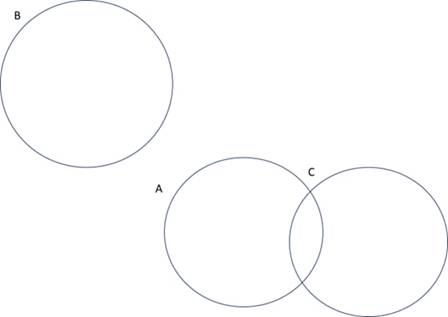
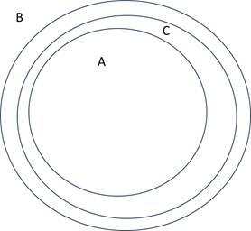
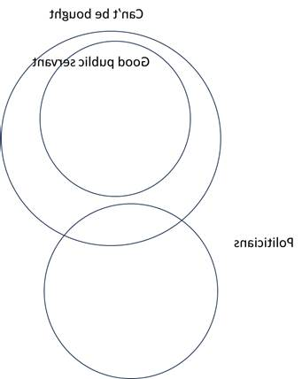

Exercise 2.1

A

1. Clear Counterexample
2. Not a Counterexample. It’s clear. In this example, the premise is false.
3. Not a Counterexample. It’s not clear. How you know your body temperature has nothing to do with whether the argument is valid or not.
4. Not a Counterexample. It’s clear. In the example, the premise is false.
5. Clear example. The premise (1) minor crash (2) car cannot start is still true. Yet conclusion “crash prevent car from starting” is false (the reason is that the battery is low)
6. Clear example. The premise (1) increase funding (2) put money into problem won’t solve it is still true, yet the conclusion “broken school system” is false (its problem gets fixed by other means)
7. Not a Counterexample. It’s clear. In this example, the premise is false.
8. Not a Counterexample. It’s clear. In this example, it makes both premise and conclusion true.
9. Clear Counterexample. The premise “human have gills” is true but conclusion “human can breathe underwater” is false (by providing reasonable justification that “gills” are defective)
10. Not a Counterexample. It’s clear. In this example, the premise is false.
11. Not a Counterexample. It’s clear. In this example, the second premise is false.
12. Clear Counterexample. The premise “Whenever there’s a storm, my barometer gives a low air pressure reading.” Is true, yet the conclusion is false (it gives a possible explanation that the low reading on barometer is caused by low pressure)
13. A counterexample, but not clear. The only possibility is that the premise is true, yet conclusion is false in the case is that the lizard is not an animal (yet this is not explicitly stated in the example)
14. A counterexample, but not clear. Just like 13, the only possibility that the premise is true, yet conclusion is false is that the dog is not an animal (yet this is not explicitly stated in the example)

B

1. The surgeon that operated on John’s brain was not his father, but his mother. So, John was actually surgeon’s son.
2. Mary is Pat’s sister. Pat is male. So, Pat is Mary’s brother.
3. Your client did not know about the murder. There was nothing taken from the house, and there is no evidence linking your client to the murder. Yet, your client isn’t interested in the property in the house, so nothing is taken. Your client is just an intelligent psychopath that love to kill random person, so they didn’t know about the murder, and they leave no forensic evidence. Your client kills the victim, nevertheless.
4. Your region uses a calendar where Saturday is between Monday and Friday. You have to work from Monday to Friday, so you have to work Saturday (today)
5. Keeping government spending the same increases employment. So, there is one government spending policy that do increase employment.
6. Republican presidential candidate did get a larger percentage of the vote than the Democratic presidential candidate in every one of the states. However, the election was cancelled due to a national emergency. So, there is no winner.
7. There are 250 old men, 140 of them are bald. There are 1000 bald man, among them there are 750 young men and 250 old men, all the young bald man has beards, yet all the old bald man doesn’t have beards. So, in total 250 old men, no one have beards.
8. All things with tentacles live under the sea. All things with tentacles are squids. Yet, there is one special squid that doesn’t have tentacles, and lives on the ground. So, not all squids live under the sea.
9. All things with tentacles live under the sea. All things with tentacles are squids.  John died of a car crash as the forensic evidence showed.
10. If it rains tomorrow, I’m not going swimming. I’m not going swimming, because I have some homework to do. Tomorrow is a sunny day. 
11. Harpo or Groucho won the lottery. Harpo won. Groucho also won. The prize is not exclusive, anyone with the right guess of the number wins the prize. Harpo and Groucho both guessed the number correctly.
12. These two statistics have nothing to do with each other. Maybe 100 people wrote your website, and 60 liked the movie. Yet, there are 10000000000000 people who saw the movie, and 999999999 like it, which includes the 60 people that like the movie and wrote your website. 
13. Your cat suddenly genetically mutated to have wings this afternoon. (Doesn’t contradicts with the fact that it doesn’t have wrings this morning)
14. Maybe she is talented and could be playing professional basketball in the next few months (doesn’t contradicts with the fact that she is 4 years old)
15. No flargs like marglin. (This doesn’t contradict with any fact that all flargs are spronkish, and some spronkish things like marglin, the “some spronkish” that like marglin doesn’t include any flargs)

Exercise 2.3

A

1. The U.S. economy is not heavily dependent upon the availability of oil.
2. No farmers mainly raise cattle.
3. Some farmers don’t work hard.
4. Some apples are less than two inches in diameter and ripe.
5. Some farmers are not ultimately dependent on the rain for water.
6. All politicians are affiliated with political parties.
7. Some numbers are not smaller than some other numbers.
8. Rain or snow will keep these couriers from the swift completion of their appointed rounds.
9. Either Obama will contest the next election or Clinton won’t.

B

1. RED & 5
2. RED & 8
3. BLACK & 8
4. 5 & RED
5. RED & 8

C

1. It has the form of (P1) p -> q (P2) p (C) q, where p = “John will be arriving later”, q = “we will make the cake”. So, it is valid.
2. It has the form of (P1) p -> q (P2) p (C) q, where p = “John won’t be arriving later”, q = “there will be no cake”. So, it is valid.
3. It has the form of (P1) p -> q (P2) not q (C) not p, where p = “John won’t be arriving later”, q = “there will be no cake”. So, it is valid.
4. It has the form of (P1) p -> q (P2) not q (C) not p, where p = “John is arriving later”, q = “Jim and Tim will stay”. So, it is valid.
5. It has the form of (P1) p -> q (P2) not q (C) not p, where p = “it’s 10 o’clock”, q = “I have to teach in 5 minutes.”. So, it is valid.
6. It has the form of (P1) p -> q (P2) not q (C) not p, where p = “John is arriving later”, q = “Jim and Tim will stay”. So, it is valid. (“Jim is not going to stay” in this case means that **not** “Jim and Tim will stay”, which is not q in this case)
7. It has the form of (P1) p -> q (P2) p (C) q, where p = “John is bringing the cake or someone else is” and q = “Jim will stay”. So, it is valid.

Exercise 2.4

A

1. Invalid, Affirming the consequent (AC).
2. Invalid, Denying the antecedent (DA).
3. Valid, Modus Tollens (MT)
4. Valid, MT.
5. Invalid, AC.
6. Invalid, DA.
7. Valid, Modus ponens (MP)

B

1. Tommen is now heir to the throne, because Joffrey is tired of being a king, so he just gives the throne to Tommen.
2. You still get reading done because you work really hard.
3. Assume (C) is false, then that means Mara is dating Clyde, and that means I’m a monkey’s uncle, but (P2) said I am not, that’s a contradiction, so that’s the reason why it’s impossible to conceive of the conclusion being false and the premises all true.
4. Assume (C) is false, then we actually care about them. That means we’ll admit more than 10,000 of them into the country. However, we are not admitting any more than that. That’s a contradiction, so that is the reason why it’s impossible to conceive of the conclusion being false and the premises all true.
5. It could also be another type of snake that has hemotoxic venom.
6. She just thinks you are not fun, so she breaks up with you.
7. Assume (C) is false, then that means I won’t get pregnant, which means I have sex with protection according to (P1), but (P2) said that I did have sex without protection. That’s a contradiction, so that is the reason why it’s impossible to conceive of the conclusion being false and the premises all true.

Exercise 2.5

1. By MP, it’s true, where p = “John has a friend at the party”, q = “he won’t feel awkward”.
2. By box 2.6, it’s true, where p = “Clinton is going to win”, q = “Trump is going to win”
3. By MP, it’s true, where p = “Clinton wins the election or Trump wins”, q = “lot of people are going to be unhappy”
4. Suppose the conclusion is false, then that means Jim comes and no one has a good time. (CF2). By (P2), that means both John and Jim went to the party, so everyone should have a good time. That’s a contradiction, so that means the argument must be correct. 
5. By Disjunctive Syllogism (DS), where p = “Clinton loses” and q = “Trump loses”
6. Suppose the snow stops him. Then that means snow keep the mailman from making his delivery, which means the P1 is false. That’s a contradiction, so the argument is valid.
7. They are equivalent sentences.
8. Suppose (C) is false, then that means John is bringing the cake. Also, we have candles (P2), that means we have party according to (P1), but we don’t have party according to (P3), that’s a contradiction, so that means the argument is valid.
9. Using MT (x -> y, not y. Then not x) where x = not q, and y = q.
10. Using MT twice. Since

a.   r -> s, not s. So, not r.

b.   p -> q, not q. So, not p.

That means not r is true, and not p is true, therefore (not r and not p) is both true.

11. Assume p is not true, then (p and q) is false, and that’s a contradiction. So, the argument must be valid.
12. Assume p or q is not true, that means p and q are both not true, and that means p is not true. That’s a contradiction. So, the argument must be valid.
13. Assume p is not exclusive-OR q. Then that means either (p and q both true) or (p and q both false), but we know that p and not-q is true, which means that p is true, and q is false. That’s a contradiction. So, the argument must be valid.
14. Assume p is not inclusive-OR r. Then that means p and r are both false, but then that means (p and r) will be false. That’s a contradiction. So, the argument must be valid.
15. Suppose the conclusion is false. Then that means all p, q, and r is false, but then that means (p inclusive-OR q) is false. That’s a contradiction. So, the argument must be valid.
16. I actually think this argument is invalid. See the truth table

​        The row 3 shows that the p xor q and q xor r is both True, while the p xor q xor r is false. So it’s possible that all premise is true while the conclusion is false. So, the argument is not valid.

Exercise 2.6

B

1. No. Say you already got a medical degree but haven’t become a doctor. In this case the first one is still true but the second one is false.
2. Equivalent. The first one means that “If you become a docker, then you have completed a medical degree” and the second one means that “If you become a docker, you have completed a medical degree”.
3. Equivalent. They’re contrapositive.
4. No. Say Liverpool doesn’t win their next game but wins the league. Then the first one will be false but the second one is not.
5. No. Say you pass the final and the course. Then the second one will be false but not the first one.
6. Equivalent. They are just changing the order.
7. Ambiguous. Second sentences could be understood as the same as the first sentences, in which case they are the same. It could also be understood that not all philosophers are wise, there is example like “one philosopher is wise, and others is not” that makes the first one false but not the second one.
8. Equivalent. They are contrapositive.
9. Ambiguous. It depends on how to interpret the first sentences, if it is

·    It is not the case that everyone gets out alive. Then, for the cases that some people get out alive, the first one will be true will the second one will be false.

·    No one got out alive. Then it’s equivalent.

10. Equivalent. They are contrapositive.
11. No. The first sentence is “If your equipment is not defective, then you won’t fall”. Say your equipment is defective and you do not fall. Then the second sentence is false but not the first one.
12. Equivalent. They are both biconditional. 

 

C

1. RED & 3
2. 8 & RED
3. 3 & BLACK
4. RED & 8

D

1. MP, valid.
2. MT, valid.
3. DA, invalid.
4. AC, invalid.
5. MP, valid.
6. AC, invalid.
7. MP, valid.

Exercise 2.7

A

1. Valid

2. Valid

 

3. Invalid

4. Valid

5. Invalid

6. Valid

Both cases satisfy the premises.

7. Valid

8. Invalid

B

1. Valid
2. Valid
3. Invalid
4. Valid
5. Valid
6. Invalid
7. Valid
8. Valid
9. Invalid
10. Valid

Exercise 2.8

A

1. Invalid. One hippie is not vegan and not vegetarian, while it’s still true that All vegans are vegetarians. Some hippies are vegans.
2. Valid. MP.
3. Valid. MP.
4. ?
5. Valid. Premises indicates that almost all Democrats support progressive taxation & gun control. So, some supporters of progressive taxation also support gun control.
6. Valid. MP.
7. Invalid. A person could reason poorly but studied philosophy. Learning philosophy is a necessary condition, not a sufficient condition.
8. Invalid. The sentence is self-contradictive. If John dislikes himself. He would like himself, but if he likes himself, then won’t like himself. That’s a contradiction.

B

1. Valid. That means all dogs have five legs and some dogs are pets. So, some pets don’t have five legs.
2. Valid. That means all hoboes have no retirement plans, and all millionaires have retirement plans. So, that means all millionaires are not hoboes (otherwise it will have / and not have retirement plans at the same time, which is a contradiction)
3. Valid. That’s the contrapositive.
4. Valid. Some animals are dogs, so they have tails.
5. Valid. That means, all dogs have no feathers. So, some animals are dogs, that don’t have feathers.
6. Invalid.

7. Invalid. 

8. Valid. All dogs have tails means that thing with no tails is not dog. None of my pets have tails, which means none of my pets are dogs.

It seems that the 9-10 are actually one question.

9. Invalid, maybe bad deed also get punished. So, my deed could also be bad deeds.
10. _
11. Invalid. We know that some of your pets are not dogs (from premises), but there is no indication that they are elephants.
12. Valid. We know that things that have four knees are not dogs, and some of your pets have four knees, so they are not dogs.
13. Invalid

14. Valid. We know that things that don’t have sharp teeth are not dogs, and some of your pets do not have sharp teeth, so they are not dogs.
15. Valid. So, some animals are humans, and therefore have big brains.
16. Valid. 

 

17. Valid. We know that some books are thousands of pages long, and therefore take long time to read.
18. Valid.

19. Valid. Suppose no long pieces of writing are not fun to read. Then since novel is a long piece of writing, that means novels are not fun to read, which contradicts (P2). Therefore, the argument is valid.
20. Valid. From (P1), all novels of over 1000 pages are not a fast read. So, all novels of over 1000 pages are not fast read and worth reading (from P2). Some things could be a novel. So, some things that are worth reading are not fast reads.
21. Valid. Some artists, who are talented people, are untrustworthy people. So, some talented people are untrustworthy.
22. Valid. From (P2), some talented people are artists, which are not trustworthy (P1).

