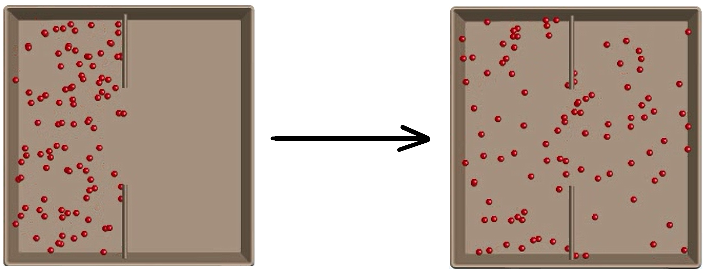
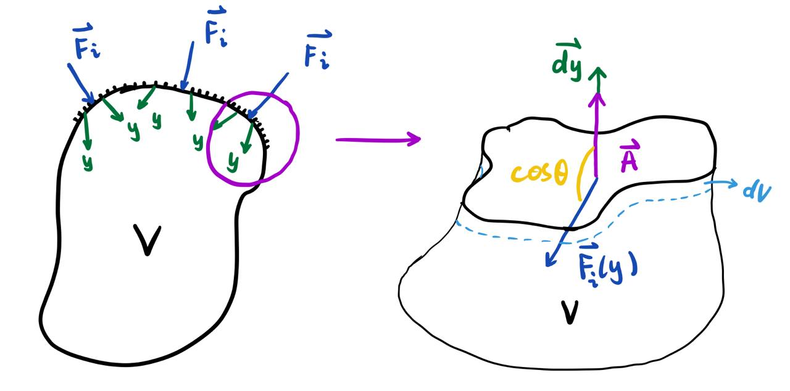
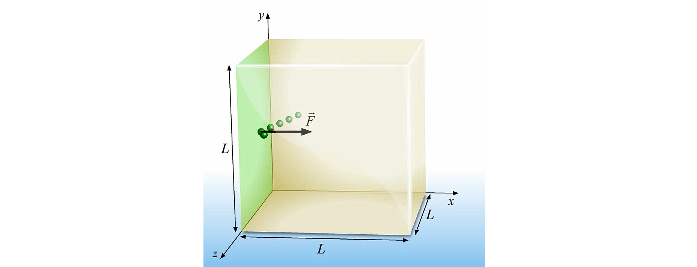

$$
\newcommand\defbox[1]{\fbox{$\hphantom{\,}\vphantom{\sum}#1\hphantom{\,}$}}
\newcommand\defbigbox[1]{\fbox{$\hphantom{\,}\vphantom{\frac{\sum^{}_{}}{\sum^{}_{}}}#1\hphantom{\,}$}}
\newcommand\d{\text{d}}
\newcommand\dd{\delta}
\newcommand\partderires[3]{\left(\partialderivative{#1}{#2}\right)_{#3}}
$$

## Thermal Physics

### Internal Energy

**Internal Energy**: the microscopic energies of the particles, which includes the potential energy of the fields between particles, and the kinetic energy of the irregular motions of particles within objects.

### First Law of Thermodynamics

The energy is categorized as either **internal energy**  or **mechanical energy**. 

From **Energy Conservation**:
$$
\Delta{E_{\text{system}}} = {E_{\text{to sytem}}}
$$
where
$$
\Delta{E_{\text{system}}} = \Delta{U} + \Delta{M} \\
{E}_{\text{to system}} = Q + W
$$

|                          | From Internal Energy $\bold{U}$ | From Mechanical Energy $\bold{M}$ |
| ------------------------ | ------------------------------- | --------------------------------- |
| **To Internal Energy**   | $Q \text{ (heat)}$              | $W \text{ (work)}$                |
| **To Mechanical Energy** | $Q \text{ (heat)}$              | $W \text{ (work)}$                |

Thus, we have:
$$
\defbox{\Delta{M} + \Delta{U} = W + Q}
$$

Taking derivative on both side, we get
$$
\d M + \d U = \dd W + \dd Q
$$

where $M$ and $U$ is a **state function**[^Path Independent], but $W$ and $Q$ is a **path function**, which depend on it path taken. So, the different notation $\d$ and $\dd$ is used to distinguish them.

When the mechanical energy doesn't change, the **first law of thermodynamics** could be re-write as:
$$
\d U = \dd W + \dd Q
$$

### Second Law of Thermodynamics

Use $\mathcal{N_{\text{$S_i$}}}$ denote the number of possible arrangement of the particles for the certain state $\Omega_i$ of the system.

Suppose
$$
\mathcal{N}_{\Omega_0} \leq \mathcal{N}_{\Omega_1}
$$
And probability for certain state is defined as
$$
P(\Omega_i) = \frac{\mathcal{N}_{\Omega_i}}{\sum_{j = 0}^{n}\mathcal{N}_{\Omega_j}}
$$
where the denominator denote the sum of all number of possible arrangement of different state.

So, 
$$
P(\Omega_0) \leq P(\Omega_1)
$$
This means that the state which there are more arrangement of particles are more preferred to exist.

More specifically, the $\mathcal{N}$ could be expressed as
$$
\defbigbox{\mathcal{N} = \prod^{m}_{i = 0}\mathcal{N^{n_i}_{\text{particle}_i}}}
$$
where the $n_i$ denote the number certain particles in the system.

The change of probability of one state with respect to $\mathcal{N_{\text{particle}_i}}$ is,
$$
\partialderivative{P(\Omega)}{\mathcal{N_{\text{particle}_i}}} = \frac{\left(\prod^{m}_{k = 0, k \neq i} \mathcal{N^{n_k}_{\text{particle}_k}}\right) \cdot n_i \mathcal{N}^{n_i - 1}_{\text{particle}_i} }{\sum_{j = 0}^{n}\mathcal{N}_{\Omega_j}}
$$
where the denominator is a constant.

Since in the real world, the $n_i$ is usually extremely large. Taking the limitation of above equation, 
$$
\lim_{\mathcal{N_{\text{particle}_i} \to\ \infin} } = \partialderivative{P(\Omega)}{\mathcal{N_{\text{particle}_i}}} = \infin
$$
That means for two state $S_i$ and $S_j$, even if the different between the $\mathcal{N}$ is small (say $\mathcal{N}_{S_i} > \mathcal{N}_{S_j}$), the difference in $P(S)$ is significant.
$$
\Delta{P(\Omega)} \approx  \partialderivative{P(\Omega)}{\mathcal{N_{\text{particle}_i}}}\cdot\Delta{\mathcal{N}}
$$
given the $n_i$ is extremely large, taking the limitation.
$$
\Delta{P(\Omega)} \approx  \partialderivative{P(\Omega)}{\mathcal{N_{\text{particle}_i}}}\cdot\Delta{\mathcal{N}} \approx \infin
$$
the probability between two state are almost extreme large, and the state with higher $\mathcal{N}$ are always going to exist.

So, the state of the system always tend to increase its $\mathcal{N}$.

So, as a general rule
$$
\defbox{\Delta{\mathcal{N}} \geq 0 \ (\text{macroscopic})}
$$

### Entropy

Since the $\mathcal{N}$ is usually defined as
$$
\mathcal{N} = \prod^{m}_{i = 0}\mathcal{N^{n_i}_{\text{particle}_i}}
$$
taking the logarithm could simply the computation, and thus define **entropy** as
$$
S= k\ln\mathcal{N}
$$
where $k$ is called **Boltzmann constant** that balance the conversion of the unit.

Thus, original $\mathcal{N}$ could be expressed as
$$
\begin{align}
S &= k\ln(\prod^{m}_{i = 0}\mathcal{N^{n_i}_{\text{particle}_i}}) \\
  &= k\sum_{i = 0}^{m}\ln(\mathcal{N^{n_i}_{\text{particle}_i}}) \\
  &= \sum_{i = 0}^{m}n_i\cdot k\ln(\mathcal{N}_{\text{particle}_i}) \\
  &= \sum_{i = 0}^{m}n_iS_{\text{{particle}}_i}
\end{align}
$$
So
$$
\defbigbox{S = \sum_{i = 0}^{m}n_iS_{\text{particle}_{i}}}
$$
which turns multiplication into additions.

**The Second Law of Thermodynamics** could thus be re-expressed.

So, 
$$
\begin{align}
\Delta{\mathcal{N}} &\geq 0 \ \ \ \ \ \ \ \ \ \ \ \ \ \ \ \ \ \ \ \ \ \ \ \ \ \\

\mathcal{N_f} / \mathcal{N_i} &\geq 1 \ \ \ \ \ \ \\

k\ln{\mathcal{N_f}} - k\ln{\mathcal{N_i}} &\geq 0 \ \ \ \ \ \ \\
S_{f} - S_{i} &\geq 0 \ \ \ \ \ \ \\
\Delta{S} &\geq 0 \ \ \ \ \ \ \\
\end{align}
$$
Thus, it's re-expressed as
$$
\fbox{$\Delta{S} \geq 0 \ $ (macroscopic)}
$$

### Fundamental Identity

In any system, there are always **4** macro-state that are always defined

* $U$, the internal energy of the system
* $N$, the number of particles in the system
* $V$, the volume of the system
* $S$, the entropy of the system

**Key assumption**: volume $V$ and number of particle $N$ are independent from each other. ($\Implication$) (This should naturally indicate that $\displaystyle\derivative{N}{V} = 0$, since you could not generate particles by simply changing the volume. This is whole derivative, taking partial derivative to ideal gas law could not deny this fact).

Consider a system with only one type of matter. Its entropy $S$ depends on $U$, $V$, $N$. Suppose $S$ depends and **only** depends on $U$, $V$, and $N$. Thus, the differential of $S$ is
$$
\d S = \partderires{S}{U}{V, N} \d U + \partderires{S}{V}{U, N}\d V + \partderires{S}{N}{U, V}\d N
$$

**Temperature**

The first partial derivative could be defined as temperature $T$
$$
\defbigbox{\frac{1}{T} = \partderires{S}{U}{V, N}}
$$

only when $T$ is same for entire system. The temperature $T$ will be further discussed later.

**Pressure**

According to the **second law of thermodynamics**, $S$ will be minimum in a macroscopic system. So
$$
\derivative{S}{V} = \partderires{S}{U}{V, N} \derivative{U}{V} + \partderires{S}{V}{U, N} + \partderires{S}{N}{U, V} \derivative{N}{V} = 0
$$
According to key assumption, $\displaystyle\derivative{N}{V} = 0$.
$$
\partderires{S}{U}{V, N} \derivative{U}{V} + \partderires{S}{V}{U, N} = 0
$$
According to the definition of temperature,
$$
\partderires{S}{V}{U, N} + \frac{1}{T} \derivative{U}{V} = 0
$$
Rearrange the formula, we get
$$
\derivative{U}{V} = -T\partderires{S}{V}{U, N}
$$
Again, define a new variable $p$ called pressure
$$
\defbigbox{p = T\partderires{S}{V}{U, N}}
$$
only when $p$ is same for entire system. The pressure $p$ will be further discussed later.

**Chemical Potential**

Also, according to the **second law of thermodynamics**, $S$ will be minimum in a macroscopic system. So
$$
\derivative{S}{N} = \partderires{S}{U}{V, N} \derivative{U}{N} + \partderires{S}{V}{U, N} \derivative{V}{N} + \partderires{S}{N}{U, V} = 0
$$
According to key assumption, $\displaystyle\derivative{V}{N} = 0$.
$$
\partderires{S}{U}{V, N} \derivative{U}{N} + \partderires{S}{N}{U, V} = 0
$$
According to the definition of temperature,
$$
\partderires{S}{N}{U, V} + \frac{1}{T} \derivative{U}{N} = 0
$$
Rearrange the formula, we get
$$
\derivative{U}{N} = -T\partderires{S}{N}{U, V}
$$
Again, define a new variable $\mu$ called chemical potential
$$
\defbigbox{\mu = -T\partderires{S}{N}{U, V}}
$$
only when $\mu$ is same for entire system. The chemical potential $\mu$ will be further discussed later.

**Fundamental Relation**

Thus, the previous equation could be written as
$$
\defbigbox{\d S = \frac{1}{T} \d U + \frac{p}{T} \d V - \frac{\mu}{T}\d N}
$$
With constraints that $T$, $p$, $\mu$ are well defined.

>See [Fundamental thermodynamic relation - Wikipedia](https://en.wikipedia.org/wiki/Fundamental_thermodynamic_relation) for generalized fundamental thermodynamic identity.

### Reversibility and Equilibrium

From second law of thermodynamics:

**Reversibility** means that $\Delta{\mathcal{N}} = 0$, in this case there is possibility for a **macroscopic** system to return to the initial state. **Irreversibility** means $\Delta{\mathcal{N}} > 0$.

From entropy:

**Reversibility** means that $\Delta{S} = 0$​. **Irreversibility** means $\Delta{S} > 0$. Reasons are the same as the above.

 

**Equilibrium** means $\max\  \mathcal{N}$ is reached. This indicates that the $\mathcal{N}$ and $S$ no longer changed
$$
\Delta{\mathcal{N}} = \Delta{S} = 0
$$
Or in its differential form
$$
\d \mathcal{N} = \d S = 0
$$
It could also be understand with respect to other variable, that is
$$
\derivative{\mathcal{N}}{x} = \derivative{S}{x} =0
$$
for arbitrary variable $x$.

### Temperature

Temperature has the following properties

* In two system where their $N$ and $V$ is fixed, their temperature $T$ will be the same when entropy $S$ is maximized.
* It's always positive
* Higher the temperature, higher the internal energy.

$$
S= T^{-1}dU
$$

### Pressure

Temperature has the following properties

* In two system where their $U$ and $N$ is fixed, their temperature $p$ will be the same when entropy $S$ is maximized.
* It's always positive

### Chemical Potential

### Free Energy

#### Gibbs Free Energy

$$
G = U + PV - TS
$$

#### Helmholtz Free Energy

$$
F = U - TS
$$

#### Enthalpy

$$
H = U + PV
$$

### Example 1

Consider the following box with $n$ particles:

The initial state (all of them on the left) and the final state (all of them in anywhere) is:
$$
S_i = nk\ln\mathcal{N}_{\text{particle}_i} \\
S_f = nk\ln\mathcal{N}_{\text{particle}_f} \\
$$
The position (the arrangement of particles) is linearly proportional to volume $V$, since for one particle, the total arrangement is the set $A$
$$
A = \{\ (\vec{x_i}, \vec{p_j})\ |\ i \in [1, n],\ j \in [1, m]\ \}
$$
and increase $V$ by factor of $q$ will result in new arrangement set $A'$
$$
A' = \{\ (\vec{x_i}, \vec{p_j})\ |\ i \in [1, qn],\ j \in [1, m]\ \}
$$
and thus $\mathcal{N'} = \abs{A'} = q\abs{A} = q\mathcal{N} = \frac{V'}{V}\mathcal{N}$

Since $V_f = 2V_i$, $N_{\text{particle}_f} = 2N_{\text{particle}_i}$.
$$
\begin{align}
\Delta{S} &= S_f - S_i \\
&= nk\ln(2\cdot \mathcal{N_{\text{particle}_i}}) - nk\ln{\mathcal{N}_{\text{particle}}} \\
&= nk\ln(\mathcal{N_{\text{particle}_i}}) + nk\ln{\mathcal{N}_{\text{particle}}} - nk\ln{\mathcal{N}_{\text{particle}}} \\
&= nk\ln2 \\
\end{align}
$$
So, $\Delta{S} = nk\ln2 > 0$, and the process are preferred after the bar in the center are removed. This is an irreversible process.

### Example 2

Consider the following box with $n$ particle on left, $2n$ on the right:

The total entropy for this box is
$$
S = S_L + S_R = nk(\ln\mathcal{N}_{\text{particle}_L} + 2\ln\mathcal{N}_{\text{particle}_R})
$$
Where $\mathcal{N}_{\text{particle}}$ (the number of position available) is linearly dependent on the volume of the container.
$$
\mathcal{N}_{\text{particle}_L} = hV_L \\
\mathcal{N}_{\text{particle}_R} = hV_R \\
$$
where $V_L + V_R = V_{box}$

So
$$
S = nk(\ln hV_L + 2\ln h(V_{box} - V_L))
$$
When $\max\, S$ reached, $\partialderivative{S}{V_L} = 0$.
$$
\partialderivative{S}{V_L} = nk({1\over{hV_L}} - 2{1\over{h(V_{box} - V_L)}}) = 0
$$
So, $\frac{V_R}{V_L} = \frac{N_R}{N_L} = 2$, and is consistent with the intuition. The right volume is 2 times greater than the left volume.

## Lecture 2

### Quasi-static Process

### Extension of First Law of Thermodynamics

According to **First Law of Thermodynamics**:
$$
\Delta{E_\text{mech}} + \Delta{U} = W_\text{net} + Q
$$
When $\Delta{E_\text{mech}} = 0$.
$$
\Delta{U} = W_\text{net} + Q
$$
Consider there is **force** $\bold{F}$ applied on the "*piston part*" of the container, which is considered to combination of infinitesimal small pistons. The piston will be pushed in, consider the direction of each piston pushed in is $\bold{y}$. Expressed force in that direction so that $\bold{F_i}(\bold{y})$. (The force between piston is ignored since they will cancel each other).

On a small area, the direction of shrinking will be the same as the direction of the normal vector of the surface, that is $\bold{dy} = \lambda\bold{A}(\bold{y})$, where $\lambda \in \R$ , and $\cos\langle\bold{F}_i(\bold{y}), \bold{dy}\rangle = \cos\langle\bold{F}_i(\bold{y}), \bold{A}(\bold{y})\rangle$.

From the graph, there is a relation
$$
\begin{align}
\abs{\bold{F}_{\text{effective}_i}(\bold{y})} &= p_\text{gas}(\bold{y})\abs{\bold{A}_i(\bold{y})} \\
\abs{\bold{F}_i(\bold{y})}\cos\langle\bold{F}_i(\bold{y}), \bold{A}_i(\bold{y})\rangle &= p_\text{gas}(\bold{y})\abs{\bold{A}_i(\bold{y})} 
\end{align}
$$
Notice, according to Newton's third law, the 

The work done by the $\bold{F}_i$ is
$$
\begin{align}
W 	&= \int_{\bold{y_i}}^{\bold{y_f}}-\bold{F}_i(\bold{y})\cdot\bold{dy} \\
	&= \int_{\bold{y_i}}^{\bold{y_f}}-\abs{\bold{F}_i(\bold{y})}\abs{\bold{dy}}\cos \langle \bold{F}_i(\bold{y}), \bold{dy}\rangle \\
	&= \int_{\bold{y_i}}^{\bold{y_f}}-\abs{\bold{F}_i(\bold{y})}\abs{\bold{dy}}\cos \langle \bold{F}_i(\bold{y}), \bold{A}_i(\bold{y})\rangle \\
	&= \int_{\bold{y_i}}^{\bold{y_f}}-p(\bold{y})\abs{\bold{dy}}\abs{\bold{A}_i(\bold{y})} \\
	&= \int_{\bold{y_i}}^{\bold{y_f}}-p(\bold{y})\d V(\bold{y}) \\
	&= \int_{a_i}^{a_f}-\derivative{p(\bold{y}(a))\d V(\bold{y}(a))}{a}\ \d a
\end{align}
$$
Rewrite the **First Law of Thermodynamics**, taking derivative of it with respect to arbitrary variable $a$.
$$
\derivative{U}{a} = \derivative{W}{a} + \derivative{Q}{a} = -\derivative{(p(\bold{y}(a))\d V(\bold{y}(a)))}{a} + \derivative{Q}{a}
$$
So, writing informally, ignore the $a$, we get
$$
\d U = -p(\bold{y})\d V(\bold{y}) + \d Q
$$
which indicates that the relations of change in these functions under certain condition $C$. So, if we know the value of change in these condition (or we don't care), it could be write as
$$
\fbox{$\hphantom{\,}\vphantom{\sum}\d U = -p\d V + \d Q\hphantom{\,}$}
$$

Note, in the process, the number of particles $N$ didn't change. So, 

### Temperature

Temperature should have two properties (consistent with intuition):

1. System reach same temperature when reach equilibrium
2. System reach same temperature when no exchange in heat
3. Higher temperature means more energy (???)

Consider two objects in an isolated environment. 
$$
0 = W_A + W_B + Q_A + Q_B\\
S = S_A + S_B
$$
So
$$
\begin{split}
\derivative{Q_A}{S_A} &= -\derivative{W_A + \d W_B + \d Q_B}{S_A} \\
\derivative{S_A}{Q_A} &= -\derivative{S_A}{Q_B}\\
	&= -\derivative{S - \d S_B}{Q_B} \\
	&= \derivative{S_B}{Q_B}
	
\end{split}
$$
Thus, both $\derivative{Q_A}{S_A}$ or $\derivative{S_A}{Q_A}$ could be possible candidate for temperature. Choose the former because in this case:
$$
Q_A = \int_{S_{A_i}}^{S_{A_j}}T(S_A)\ \d S_A
$$
which indicates higher temperature results in higher energy.

So
$$
\defbigbox{T \equiv \derivative{Q}{S}}
$$

Or in other way
$$
\defbigbox{{1\over T} \equiv \derivative{S}{Q}}
$$
Since
$$
{1\over T} = \derivative{S}{Q} \geq 0
$$
So, the temperature is always a positive number.

Note, when 

### Heat Capacity

Define **Heat Capacity** $C$ as
$$
\defbigbox{C = \derivative{Q}{T}}
$$
When the volume is constant, $C_V$ is
$$
\defbigbox{C_V = \frac{\d U + p\d V}{\d T} = \derivative{U}{T}}
$$
Define **Specific Heat Capacity**:
$$
\defbigbox{c_V = \frac{C_V}{m} = \frac{1}{m}\derivative{U}{T}}
$$
Define **Molar Heat Capacity**
$$
\defbigbox{c_{V\ mol} = \frac{C_V}{n} = \frac{m}{n}\derivative{U}{T}}
$$

### Latent Heat

Define **Latent Heat for Vaporization**
$$
L_v = \frac{\Delta Q_{liquid\ \to gas}}{m}
$$
Define **Latent Heat for Fusion**
$$
L_f = \frac{\Delta{Q_{solid\ \to liquid}}}{m}
$$

## Lecture 3

### Ideal gas

Ideal gas is defined with assumption

1. Atoms free to move throughout entire volume
2. Potential energy of interactions between atoms is negligible (only kinetic energy of particles are considered).

So, the total internal energy $U_{gas}$ is
$$
U_{gas} = \sum_{i = 1}^{N}E_{\text{kinetic}_i}
$$
From the basic definition of entropy
$$
S = kN\ln(\mathcal{N_{\text{particle}}})
$$
where $\mathcal{N_{\text{particle}}}$ is dependent on $V$, $U$. ($\assumption$)
$$
\mathcal{N_{\text{particle}}} = {u \over V_0}V\cdot g(U)
$$
where $V$ is without unit, and $\mathcal{N_{\text{particle}}}$ is proportional to the $V$ as previously stated. So
$$
S = kN\ln({u\over V_0}V\cdot {g(U)} ) = kN\ln V + kN\ln({u\over V_0} \cdot {g(U)})
$$
Since ${u \over V_0}$ is constant. The later part is depend only on $U$ and $N$. Denote is as $f$.

So
$$
S = kN\ln V + f(U, N)
$$

### Ideal Gas Law

Consider a insulated contained system ($Q = 0$) with ideal gas at equilibrium.

So, according to first law of thermodynamics
$$
\d U = -p \d V + \d Q = -p\d V
$$
write entropy as
$$
S (U, V, N) = S(U(p, V, N), V, N)
$$
where the $N$ is not dependent on any state function (consider as an constant). 
$$
\derivative{S}{V} = \partialderivative{S}{V} + \partialderivative{S}{U}\derivative{U}{V} = 0
$$
From the formula of the entropy of ideal gas, 
$$
\partialderivative{S}{V} = kN{1\over V}
$$
Also, by the definition of the temperature.
$$
\left( {\partialderivative{S}{U}} \right)_{V, N} = {1\over T}
$$

and the fact that $\derivative{U}{V} = -\frac{p\d V}{\d V} = -p$. So,
$$
kN{1\over V} - {p \over T} = 0
$$
So, the ideal gas when equilibrium in insulated container.
$$
\defbox{pV = NkT}
$$

### Average Kinetic Energy

Suppose there is $N$ particles in a cube container, where one particle is shown below:

When it hit the wall, an elastic collision happened, and since the $m_{\text{wall}} \gg m_{\text{particle}}$, the change in the speed of the particle is 
$$
\Delta{v} = 2v_x
$$
So, the average force for $F_{avg}$ between two collision is
$$
F_{avg} = {\Delta{P} \over \Delta{t} } = \frac{m\Delta{v}}{2L/v_x} = \frac{mv_x^2}{L}
$$
Thus, the average pressure on the wall for one particle is
$$
p_{\text{particle}} = \frac{F_{avg}}{L^2} = \frac{mv_x^2}{V}
$$
and the total pressure should be
$$
p_x = Np_{\text{particle}} = \frac{mN}{V}{1\over N}\sum_{i = 0}^{N}v_{x, i}^2 = \frac{mN\langle v_x^2 \rangle}{V}
$$
the formula is the same for the $y$ and $z$ direction.

There should be no certain selection of the direction of movement (**assumption**), so
$$
\langle v_x^2 \rangle = \langle v_y^2 \rangle = \langle v_z^2 \rangle = \frac{1}{3}\langle v^2 \rangle
$$
So,
$$
p = p_x = p_y = p_z = \frac{N}{V}m\frac{1}{3}\langle{ v^2 }\rangle = \frac{2N}{3V}\langle {1\over2}mv^2 \rangle = \frac{2N}{3V}\langle E_{\text{translational}} \rangle
$$
Thus
$$
\defbigbox{p = \frac{2N}{3V}\langle E_{\text{translational}} \rangle}
$$
With assumption (1) Ideal gas (2) no preference of certain direction.

Note, any container is applicable ($\ProveNeeded$). Also, the collision between particle has no effect on the calculation, because two particle will exchange their momentum in elastic collision, as if nothing is happened. 

When the system are in equilibrium, then $pV = NkT$

So
$$
{2N\over3V}\langle E \rangle V = NkT
$$
Thus
$$
\defbigbox{\langle E \rangle = \frac{3}{2}kT}
$$
With additional assumption such that system is in equilibrium.

Also
$$
\langle \frac{1}{2}mv^2 \rangle = \frac{3}{2}kT \\
\langle \frac{1}{2}m \cdot 3v_x^2 \rangle = \langle \frac{1}{2}m \cdot 3v_y^2 \rangle = \langle \frac{1}{2}m \cdot 3v_z^2 \rangle = \frac{3}{2}kT \\
$$
So
$$
\defbigbox{\langle E_x \rangle = \langle E_y \rangle = \langle E_z \rangle = \frac{1}{2}kT}
$$

### Molar Heat Capacity

Consider a container that only heat $Q$ is passed in the system.

Assume the internal energy only constitute translational energy.

So, the heat capacity
$$
C_V =\derivative{U}{T} = \derivative{\langle E \rangle}{T} = \frac{3}{2}Nk
$$

So, the molar heat capacity
$$
c_V = \frac{C_V}{n} = \frac{3}{2}N_Ak
$$
But this only works for monoatomic gas, since the internal energy also rotational and oscillational energy.

Suppose instead of volume, the pressure doesn't change
$$
\begin{align}
c_p &= \frac{1}{n}(\derivative{Q}{T}) \\
		&= \frac{1}{n}(\derivative{U + p\d V}{T}) \\
		&= c_V + \frac{1}{n} \cdot p\frac{ \d V}{\d T} \\
\end{align}
$$
Suppose the process is a **quasi-static** process ($\ReferToLaterConcepts$)

So, we could use **ideal gas law**, and 
$$
PV = nRT
$$

## Lecture 8

$$
\sum_{k = 1}^{n}k\cdot\frac{n!}{k!(n - k)!} = \sum_{k = 1}^{n}\frac{n!}{(k - 1)!(n - (k - 1))!}
$$

[^Path Independent]:  That is, the function is conservative. See more on [State function - Wikipedia](https://en.wikipedia.org/wiki/State_function)