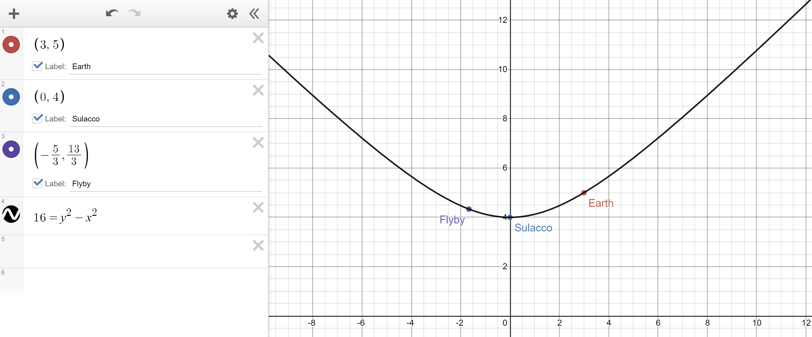
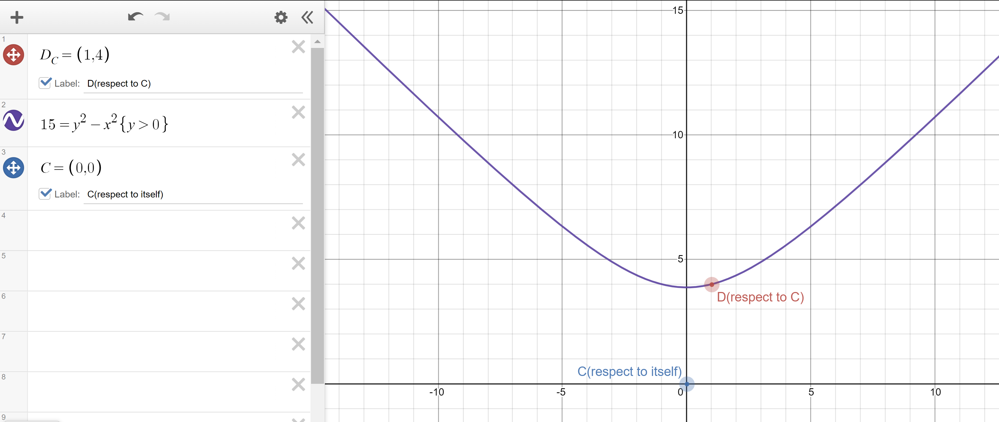

Name: Yuqing Zhai

Section: D4A

### Problem 1

(a) the
$$
I_{B - A} = (c\Delta{t})^2 - (\Delta{x})^2 - (\Delta{y})^2 - (\Delta{z})^2 \\
          = (0.9)^2 - (0.4)^2 - 0^2 - 0^2 = 0.65
$$
Since $I_{B - A} > 0$, that means the two events $A$ and $B$ are separated by a **timelike** interval, and they are potentially casually connected.

(b) since the $I_{B - A}$ will remain constant in all reference frame, we want to find out if there a frame $S'$ that $\Delta{t}' = 0$. So, $I_{B - A}' = - (\Delta{x})^2 - (\Delta{y})^2 - (\Delta{z})^2 = 0.65$. There is no solution to such equation, so there does not exist a reference frame that those two event happened simultaneously (which is intuitively right, because the hyperbola of the timelike event doesn't have value of $t = 0$)

### Problem 2

(a) the
$$
I_{B - A} = (c\Delta{t})^2 - (\Delta{x})^2 - (\Delta{y})^2 - (\Delta{z})^2 \\
          = (0.3)^2 - 0^2 - (0.1)^2 - 0^2 = 0.08
$$
Again, since $I_{B - A} > 0$, that means the two events $A$ and $B$ are separated by a **timelike** interval, and they are potentially casually connected.

(b) since the $I_{B - A}$ will remain constant in all reference frame, we want to find out if there a frame $S'$ that $\Delta{t}' = 0$. So, $I_{B - A}' = - (\Delta{x})^2 - (\Delta{y})^2 - (\Delta{z})^2 = 0.08$. There is no solution to such equation, so there does not exist a reference frame that those two event happened simultaneously (which is intuitively right, because the hyperbola of the timelike event doesn't have value of $t = 0$)

### Problem 3

|                       | Earth | Sulacco | Flyby |
| --------------------- | ----- | ------- | ----- |
| $\Delta{x}$ lightyear | 3     | 0       | -5/3  |
| $\Delta{t}$ year      | 5     | 4       | 13/3  |
| $\sqrt{I}$ lightyear  | 4     | 4       | 4     |

the interval $\sqrt{I}$ is the distance between the origin and Sulacco, which is 4.

### Problem 4

(a) 
$$
I_{AB} = (c\Delta{t})^2 - (\Delta{x})^2 - (\Delta{y})^2 - (\Delta{z})^2 \\
          = (10)^2 - (40)^2 - 0^2 - 0^2 = -1500
$$
(b) Let $\Delta{t'} = 0$, Then $I'_{AB} = -1500$, one solution will be $\Delta{x}' = 10\sqrt{15}$, $\Delta{y}' = 0$, $\Delta{z}' = 0$. Since
$$
\Delta{t'} = \gamma(\Delta{t} - \frac{\beta\Delta{x}}{c}) = 0 \\
\Delta{t} = \frac{\beta\Delta{x}}{c} \\
\frac{c\Delta{t}}{\Delta{x}} = \beta
$$
So, $\beta = \frac{c\Delta{t}}{\Delta{x}} = \frac{10}{40} = 0.25$

(c) Let $\Delta{x}' = 0$, $\Delta{y}' = 0$, $\Delta{z}' = 0$, then $I'_{AB} = (c\Delta{t})^2 = -1500$, there is no solution that satisfied the equation. So, event $A$ and $B$ cannot occur at the same position

>(b) and (c) make sense because the two event are separated by **spacelike** interval now, and the hyperbola of **spacelike** interval have no intersection with $ct$ axis (where position is the same), but do have axis with $x$ axis (where time is the same).

(d) 
$$
I_{AB} = (c\Delta{t})^2 - (\Delta{x})^2 - (\Delta{y})^2 - (\Delta{z})^2 \\
          = (4)^2 - (1)^2 - 0^2 - 0^2 = 15
$$

The hyperbola intersect with $ct$ axis, which means that there is possibility $C$ and $D$ could occur at same position. There is no intersection with $x$ axis, which means that there is no possibility that $C$ and $D$ could occur at same time.

